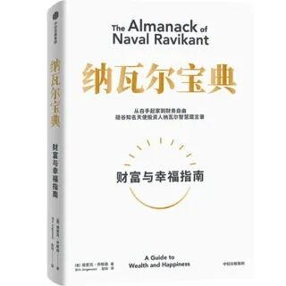

# 因为相信，所以看见

**发布时间**: 2022-05-20 09:16:38

**原文链接**: [http://mp.weixin.qq.com/s?__biz=MzUzNjE3NzQ3Nw==&mid=2247490348&idx=1&sn=ddf9b81d1c70fe78d87c3e2a74493093&chksm=fafb6506cd8cec109d3a7f3a0e9ec75897bea3d7c512e8a2d0e1c88e323a596c93d3a415a1e5#rd](http://mp.weixin.qq.com/s?__biz=MzUzNjE3NzQ3Nw==&mid=2247490348&idx=1&sn=ddf9b81d1c70fe78d87c3e2a74493093&chksm=fafb6506cd8cec109d3a7f3a0e9ec75897bea3d7c512e8a2d0e1c88e323a596c93d3a415a1e5#rd)

---

[周一的文章](https://mp.weixin.qq.com/s?__biz=MzUzNjE3NzQ3Nw==&mid=2247490333&idx=1&sn=1196495cd9a09e2cdaa9d9b7dd350334&chksm=fafb6537cd8cec21175e82f5b57faceac5d0f4655c31ad7612e6c6d7e523d78896eae48ae462&token=1325088630&lang=zh_CN&scene=21#wechat_redirect)，我给大伙分享了一位小伙伴的经历，ta 为了地点自由、不用加班、平衡工作和时间，选择了找到海外远程工作这条路。

后来文章下面，大伙的两波留言让我想了好久。

第一波是来自和小伙伴同为测试工程师的读者们，他们纷纷表示：

>   * 居然是同行！我一直觉得测试很难找到远程办公的工作，看来是我给自己设限了。
> 
>   * 我也是测试，也想远程，这篇文章让我看到了希望。
> 
>   * 同是测试，打开了新视野，找起来找起来～
> 
> 

> 
> ……（还有不少，我就不一一贴了）

第二波留言，则是羡慕这样的生活方式，却后悔自己没有选择计算机方面的专业：

>   * 看了分享，我已经在后悔为什么没有学计算机相关了……
> 
>   * 能够远程的工作还是比较有限制的，特定在一些互联网技术上的工作……
> 
>   * 看起来适合 IT 行业比较多，文科生挺难的……
> 
>   * 我不是从事测试行业，干的是财务职业，那就没希望了。
> 
> 

但看着这两波几乎相反的留言我不禁在脑补。

如果有一个平行世界，我访谈的这位小伙伴不是测试工程师，而恰好是从事营销推广、文字或者财务方面的工作（这几个我身边刚好都有例子，不是随便说的），那情况有没有可能就变成了：

  * 哇，我是文科生，一直觉得很难找到远程工作，现在看到了希望……

  * 唉，好后悔选了测试工程师这个方向，远程工作太难找了……

……

「1 英里 4 分钟」，这是个跑步历史上非常有借鉴意义的时刻。

在 1954 年以前，从来没有人能实现 4 分钟之内跑完 1 英里这个目标。甚至有人断言，这是跑步的极限。

但 1954 年，罗杰·班尼斯特成功在英国跑出了 3 分 59 秒的成绩，震惊世界。

随后，有趣的事儿出现了，**这个以前从没有人实现过的目标，在随后的短短 1 个月又被刷新了，3 分 58 秒。** 在随后的 3 年里，又有 15 名运动员跑进了 4 分钟。

后来人们对这件事儿的评价是

> 就像许多世界纪录经常出现的情况一样，一旦班尼斯特证明人类实际上能够在四分钟内跑完一英里，整个世界都为此感到震惊，这也帮助人们打破了一种集体心理障碍。

注意最后一句话，是「集体心理障碍」，而非「人类体能障碍」。

回头看看前面留言的两波伙伴，也许他们在无意间诠释了这句话的含义——**很多机会，是因为相信，所以看见。**

非计算机专业、学文科就不能远程工作吗？

也许，这些小伙伴距离找到心仪的机会，中间只隔着一个来自他们同专业领域的访谈故事。

墙在心里，不在外面。

……

关于这个话题，还有个挺值得关注的视角，也跟大伙唠唠。

网上有过一个调查，问广大网友最后悔的十件事儿排行，结果的第一名就是关于大学的：

但我觉得，这也许又是另外一种集体心理障碍。

硅谷投资人 Naval Ravikant 的语录集锦流传甚广，我在和菜头和少楠的文章中读过翻译版，后来也找到了英文原版。这个月，这份语录的中文版也出版了——《纳瓦尔宝典》—— 于是，我又读了一遍。

  

  

  

  

里面关于知识和技能有段论述我很有共鸣，也摘录一部分分享给大家：

> 如果社会可以培训你，那么社会也可以培训他人来取代你。大家都能学会的东西是不可能让你致富的。
> 
> 最好的工作与委任或学位无关。最好的工作是终身学习者在自由市场中的创造性表达。
> 
> 互联网极大地拓宽了职业空间。大多数人还没有清晰地认识到这一点。
> 
> （真正的）专长只能被学习，但无法被教授。只有你自己学到的东西，才是属于你独有的能力。
> 
> ——来自 纳瓦尔宝典 - 找到天赋所在，积累专长

回头看看我们现在在做的事儿、在从事的工作，我们绝大部分技能都是来自过去几十年的工作与生活，而非学校里几年的课程。

大学里这些每个人都能培训的“知识”，每个人都可以获取的学历，也许并不能定义我们。

  * 财务自由：[我的财务自由实证之路](https://mp.weixin.qq.com/s?__biz=MzUzNjE3NzQ3Nw==&mid=2247490203&idx=1&sn=5fd642e1543efda4dd50ffbd710c1e99&chksm=fafb64b1cd8ceda7888c0ece222c27873027b2eee3b3df4f4fb50861fa97810cf812087b2307&scene=21&cur_album_id=1319255999014043648#wechat_redirect)

  * 投资笔记：[十年之约，躺赚不难](https://mp.weixin.qq.com/s?__biz=MzUzNjE3NzQ3Nw==&mid=2247490195&idx=1&sn=780a14510603bad6a4c96eafebb65c8f&chksm=fafb64b9cd8cedafa3c339c19b013598d83d0110b3add3a6e85df75c7eb3f4a6487a27383571&scene=21#wechat_redirect)

  * 抵御风险：[5 月保险最推荐](https://mp.weixin.qq.com/s?__biz=MzUzNjE3NzQ3Nw==&mid=2247490340&idx=1&sn=d1ec295caea6a37028c1cdf81b35e9a6&chksm=fafb650ecd8cec1866cf3c77f9d81dd4b6fe8ca8bb4dcce18e512c1c14f139722c79eb87e661&token=1325088630&lang=zh_CN&scene=21#wechat_redirect)

  * 干货汇总：[财务自由路上应该了解的每一个问题](http://mp.weixin.qq.com/s?__biz=MzUzNjE3NzQ3Nw==&mid=2247489926&idx=1&sn=eac357cebcbfd7250828cdda88d9f122&chksm=fafb67accd8ceebaa1e750f129714bb000be9720a990a70c6fba6fc52fd3712014a58d699d6e&scene=21#wechat_redirect "全都安排好了，财务自由路上我们需要了解的每一个问题 原创")