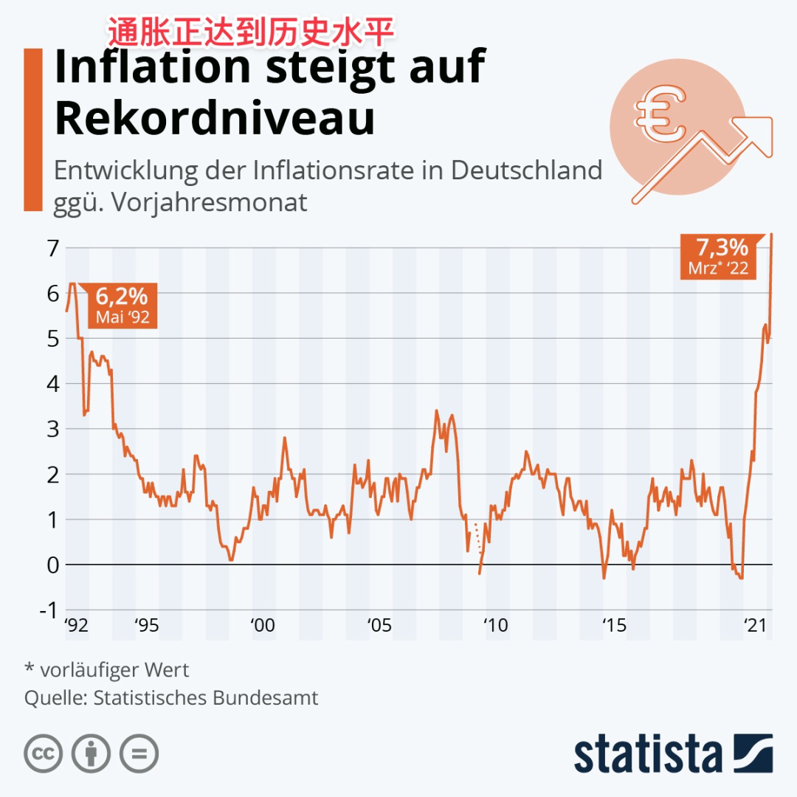
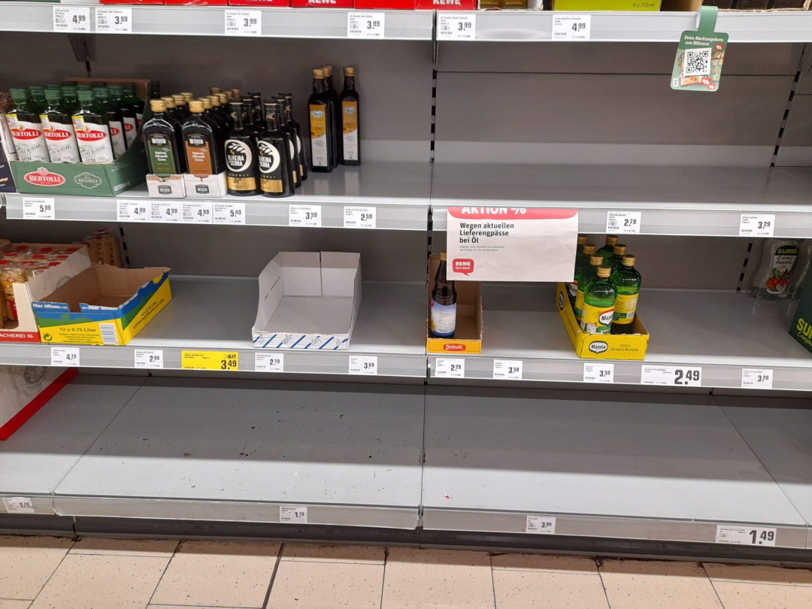
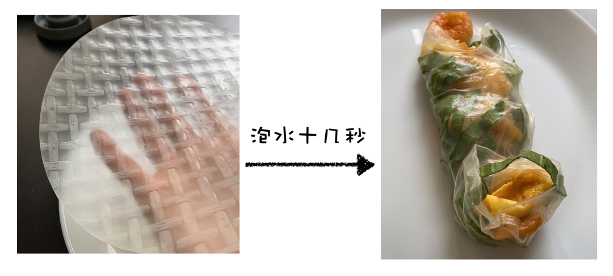

# 赶上 50 年不遇的大通胀……

**发布时间**: 2022-06-01 10:05:39

**原文链接**: [http://mp.weixin.qq.com/s?__biz=MzUzNjE3NzQ3Nw==&mid=2247490412&idx=1&sn=0cfee1382972c3f49c0447e85924412d&chksm=fafb6546cd8cec509d7a7bddfd1bd851f50392621627efba829a923cb4f8c8514268d429b332#rd](http://mp.weixin.qq.com/s?__biz=MzUzNjE3NzQ3Nw==&mid=2247490412&idx=1&sn=0cfee1382972c3f49c0447e85924412d&chksm=fafb6546cd8cec509d7a7bddfd1bd851f50392621627efba829a923cb4f8c8514268d429b332#rd)

---

人生阅历又丰富了一笔。

大伙肯定也从新闻里看到了，欧美正在经历一波大通胀。我生活的德国迎来了 1973 年以来最高的通胀数字，最新的数据已经到 7.9% 了（👇 德国近 30 年通胀数据）

财务自由之路的这些年，我被小伙伴们问过无数次，也设想过无数次，**自由以后遇到通胀怎么办** ？

现在，咱有第一手的肉身体验了 

欧美央行坚持不懈地放水，加上乌俄打战，通胀终于来了。我举几个生活中被关注比较多的例子，给大伙感受一下。

1、以前菜籽油 0.99 欧一瓶，我们最近买的一瓶已经涨到 4 欧了，翻四倍。而且最关键的是，还常常买不到，因为乌克兰是欧洲粮食主产区之一。日常脱销已经快习惯了 👇

2、以前汽油价格都是 1 欧元开头，现在普遍到 2 了。网上开涮，加油站们得考虑换显示牌了，因为现在的只有个位，没有十位 

3、我平时在吃的**每一家** 餐厅，从快餐到正餐，全都涨价了，普遍涨幅在 10～20%，个别到了 30%……  

4、我们明年的取暖费预计会比今年翻一倍。我的新家也还是天然气供暖，就这现在俄罗斯还在吵着断供。

5、最重要的是，**现在物价涨了，但工资单还没动静** 。

……

今天先来给大伙分享我的第一个观察。

亲历通胀教给我一个很重要的数学问题——

问：假如一个人以前每月开销 2000 欧元，现在物价涨了 10%，他的每月开销会变成多少？

我猜大部分小伙伴会说，这还不简单，2000 x 110% = 2200 欧元呗。

但真正身处通胀之中，我可以告诉大伙，不是这样的。**肯定比 2200 少得多，更可能基本不变，甚至还可能变少了** 。

现在电费涨了 50%，天然气、油价翻倍。

但与此同时，一夜之间所有人都开始关注如何省电、省暖气了，我的邮箱时不时就会收到“教你 10 条节能小技巧……”。大家突然发现，原来自己的生活还有这么多值得改善的空间。

> [2020 年的财务自由实证](http://mp.weixin.qq.com/s?__biz=MzUzNjE3NzQ3Nw==&mid=2247487525&idx=1&sn=0961f93f62f9eb09b943443c2919e192&chksm=fafb6e0fcd8ce719164fb8e8f4598fdb4c680d5aa02a808129b0b31c13da678d398206585146&scene=21#wechat_redirect)我还给大伙晒过账单，我们家的水电燃气用量常年只有德国平均家庭的一半，还是在我们一直在家开伙的情况下，可见潜力有多大
> 
> 

现在饭店变贵了，那我们就少出去吃几次呗，多在家做做饭。电变贵了我就多烧烤，好在木炭还没涨价（顺便还攻克了烤肉串的配方，哈哈哈哈  

好像拖鞋有点抢镜 😂……

现在食用油价格翻倍，而且还买不着。我和也太被逼着研究各种无油食谱，然后才发现，居然还有这么多可以不用油搞定的菜，比如炖菜和烤箱。

大米也涨价了，我和也太又扩展了不少面食食谱（面粉的价格只有大米的一半不到，而蛋白质含量是大米的 3 倍）

对了，我们最近又发现了个神器——越南春卷皮——跑个题跟大伙安利一句。这货可神奇了，都不用开火，用凉水泡十几秒钟就可以卷肉、卷菜开整了，贼适合夏天，我们囤了好几盒 👇

……

以前一提起通胀，我们总会很焦虑，财务自由以后通胀来了咋办啊？

现在通胀真来了，物价涨了，工资还没涨。但其实很少有人因为通胀而陷入困境或是破产，因为大家的生活方式也在发生变化。

想象中的通胀和真实的通胀，最大的区别在于「人」。 

以前当我们想象通胀时，我们总会习惯性地假设，如果物价涨了要维持当前的生活要多花多少多少钱……

但真实世界的逻辑却是反过来的，当通胀真实发生在我们身边，我们先想到的其实是如何改变自己的生活方式，而不是坐以待毙、任凭开支上涨。

**不要高估问题的困难程度，却低估了我们适应变化、解决问题的能力，这是我在亲身经历这波通胀后感觉到最大的不同。**

……

这个发现也帮我理清楚了一个投资上的逻辑。

通常我们觉得，上市公司的盈利应该是可以抗通胀的，因为物价上涨时，上市公司的收入也会增加，从而抵消通胀的影响。

但格雷厄姆在《聪明的投资者》中告诉我们，这个逻辑只适合比较温和的通胀。从过往数据来看，当大幅通胀出现时（6% 以上），这个时期上市公司的利润还是会跑输通胀的，股市收益会比较惨淡。

回头看看这轮通胀中我们在做的事儿，不就刚好验证了这个数据——因为发生大幅通胀，人们会主动降低开销（这种从生活经验反过来理解经济数据的感觉还挺妙的呢）

关于投资和通胀这个话题，明天展开聊一聊我的想法和应对思路，这个经历对我思考未来生活和投资方向还挺有启发的。

……

面对这样的意外，我们可以换个角度看问题。

难得遇上这 50 年才有的大通胀，不如抓紧观察学习，这是我给大家写下的第 1 篇想法——

如今亲身经历，我对通胀原本就不多的担心又少了一分。以前一说起通胀，我们的关注点常常只有“我应该买点什么资产能保值？”，手段很单一。

但如今发现，我们其实低估了自己适应变化和解决问题的能力，我们手里的牌要比想得多。

通胀带来的不仅仅是负面影响，也是我们反思和优化生活的一次机会。

> 2014 年伦敦地铁大罢工，人们被迫选择不同的上班路线。但其中 5% 的人在罢工结束后，并没有回到原来的路线上，因为他们发现了更好的上班线路。
> 
> ——《混乱》

明天接着聊～

  * 财务自由：[我的财务自由实证之路](https://mp.weixin.qq.com/s?__biz=MzUzNjE3NzQ3Nw==&mid=2247490203&idx=1&sn=5fd642e1543efda4dd50ffbd710c1e99&chksm=fafb64b1cd8ceda7888c0ece222c27873027b2eee3b3df4f4fb50861fa97810cf812087b2307&scene=21&cur_album_id=1319255999014043648#wechat_redirect)

  * 投资笔记：[十年之约，躺赚不难](https://mp.weixin.qq.com/s?__biz=MzUzNjE3NzQ3Nw==&mid=2247490195&idx=1&sn=780a14510603bad6a4c96eafebb65c8f&chksm=fafb64b9cd8cedafa3c339c19b013598d83d0110b3add3a6e85df75c7eb3f4a6487a27383571&scene=21#wechat_redirect)

  * 抵御风险：[5 月保险最推荐](https://mp.weixin.qq.com/s?__biz=MzUzNjE3NzQ3Nw==&mid=2247490340&idx=1&sn=d1ec295caea6a37028c1cdf81b35e9a6&chksm=fafb650ecd8cec1866cf3c77f9d81dd4b6fe8ca8bb4dcce18e512c1c14f139722c79eb87e661&token=1325088630&lang=zh_CN&scene=21#wechat_redirect)

  * 干货汇总：[财务自由路上应该了解的每一个问题](http://mp.weixin.qq.com/s?__biz=MzUzNjE3NzQ3Nw==&mid=2247489926&idx=1&sn=eac357cebcbfd7250828cdda88d9f122&chksm=fafb67accd8ceebaa1e750f129714bb000be9720a990a70c6fba6fc52fd3712014a58d699d6e&scene=21#wechat_redirect "全都安排好了，财务自由路上我们需要了解的每一个问题 原创")