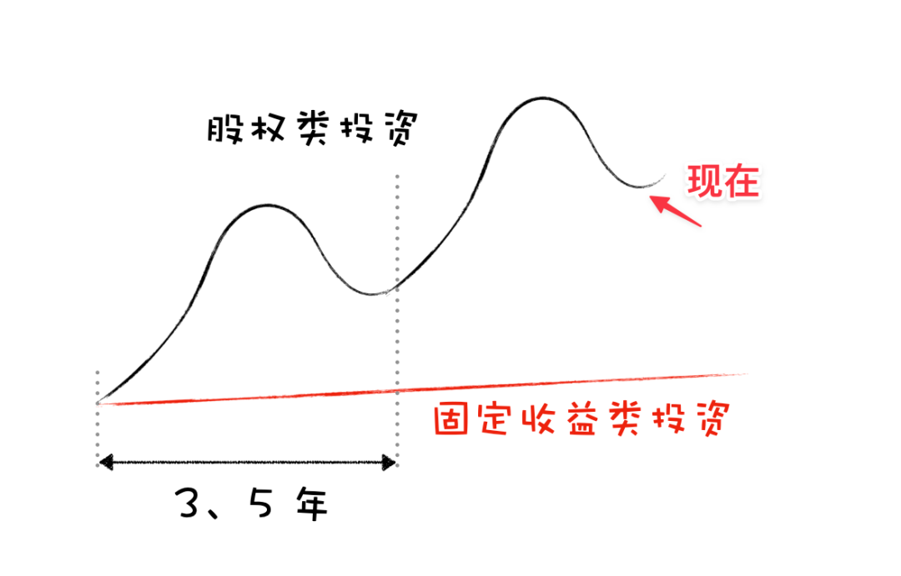

# “我把钱存银行躲过了大跌，是不是相当于赚了一笔？”

**发布时间**: 2022-06-07 10:15:18

**原文链接**: [http://mp.weixin.qq.com/s?__biz=MzUzNjE3NzQ3Nw==&mid=2247490445&idx=1&sn=692342b9e0f3a0e6846d303948b2df2b&chksm=fafb65a7cd8cecb1d30db4b26acdcfc01e98706f3a2f91b707c5e7b9791e329ad37ca3ecab0e#rd](http://mp.weixin.qq.com/s?__biz=MzUzNjE3NzQ3Nw==&mid=2247490445&idx=1&sn=692342b9e0f3a0e6846d303948b2df2b&chksm=fafb65a7cd8cecb1d30db4b26acdcfc01e98706f3a2f91b707c5e7b9791e329ad37ca3ecab0e#rd)

---

最近遇到个很有意思的事儿，值得跟大伙聊聊，关于现在人们对投资的态度。

有小伙伴刚好一笔三年的定期存款到期了，有感于今年股市的惨烈，ta 和我说，你看考虑到市场这波大跌，我这定期存款收益是不是也不错了。

我算了一下，3 年总收益 13% 确实不错，一年差不多 4% 的利息。

但我随后又查了一下说，假如没买定期，而是买了你现在觉得“很惨烈”的基金，收益会是“非常惨烈”的 +64%

小伙伴一脸不信，又问了我一遍，算上今年这波大跌了吗？

我说，算上了，这是跌完之后的结果。中证偏股基金指数 3 年前大约是 1000 点，到 6 月 2 日收盘时、大跌之后已经是 1600 点，然后再把后面这几天的市场涨幅算进来……

“所以定期买得不错，下次咱别买了 ”

小伙伴看到最近大跌庆幸躲开的同时，其实也错过了更早的大涨。只看眼前几个月，和看长期的几年、几十年，结论可能完全不一样。

……

最近这段时间，我又开始收到和 2019 年似曾相识的留言（难道说明现在市场的阶段有点像 2019？）

> 你的财务自由计划怎么只攒本金，其实没啥投资收益呢？
> 
> 这几年年化收益看起来只有 5% 了，预期 10% 年化收益是不是太乐观了？
> 
> 投资还不如银行存款呢……

可能现在很多人眼中，投资是这样的 👇

但在我看来，现在的投资应该是这样的 👇

用短期和长期两个视角，看到的结论不一样。

……

也许会有反对的声音问我，“你这些都是过去的数据了，未来未必会这样，现在底层逻辑变了！”

我不太知道“底层逻辑”指的究竟是什么，但我知道一个常识：

如果一件事儿过去几十、几百年甚至几千年都在重复，那这件事儿在未来十年里，大概率会继续发生。

而如果一件事儿过去从来也没发生过，那它在未来会发生的概率也不会超过 10%。

所以我觉得问题没那么复杂：

我愿意用 90% 的金钱和精力去投资那些过去重复发生的事儿，押注他们会再次发生。

再用余下的 10% 来为那些没发生过的变化做准备，确保不会措手不及。

而不应该是反过来。

  * 财务自由：[我的财务自由实证之路](https://mp.weixin.qq.com/s?__biz=MzUzNjE3NzQ3Nw==&mid=2247490436&idx=1&sn=9d65da987d3e610dc2b9ad5aeb8cbcd9&chksm=fafb65aecd8cecb8fcb78cbe99f0117e075f5c7c7a559cad150711f7055ca3d94db0af1dbd3f&token=1482121189&lang=zh_CN&scene=21#wechat_redirect)

  * 投资笔记：[十年之约，躺赚不难](https://mp.weixin.qq.com/s?__biz=MzUzNjE3NzQ3Nw==&mid=2247490195&idx=1&sn=780a14510603bad6a4c96eafebb65c8f&chksm=fafb64b9cd8cedafa3c339c19b013598d83d0110b3add3a6e85df75c7eb3f4a6487a27383571&scene=21#wechat_redirect)

  * 抵御风险：[5 月保险最推荐](https://mp.weixin.qq.com/s?__biz=MzUzNjE3NzQ3Nw==&mid=2247490340&idx=1&sn=d1ec295caea6a37028c1cdf81b35e9a6&chksm=fafb650ecd8cec1866cf3c77f9d81dd4b6fe8ca8bb4dcce18e512c1c14f139722c79eb87e661&token=1325088630&lang=zh_CN&scene=21#wechat_redirect)

  * 干货汇总：[财务自由路上应该了解的每一个问题](http://mp.weixin.qq.com/s?__biz=MzUzNjE3NzQ3Nw==&mid=2247489926&idx=1&sn=eac357cebcbfd7250828cdda88d9f122&chksm=fafb67accd8ceebaa1e750f129714bb000be9720a990a70c6fba6fc52fd3712014a58d699d6e&scene=21#wechat_redirect "全都安排好了，财务自由路上我们需要了解的每一个问题 原创")

**风险提示** ：本文不构成投资建议，只是我个人投资中的观察和思考。大伙参考为主，投资最终还是要独立决策，毕竟我也可能是错的。

 _今日题图来自 Pixabay @satheeshsankaran_