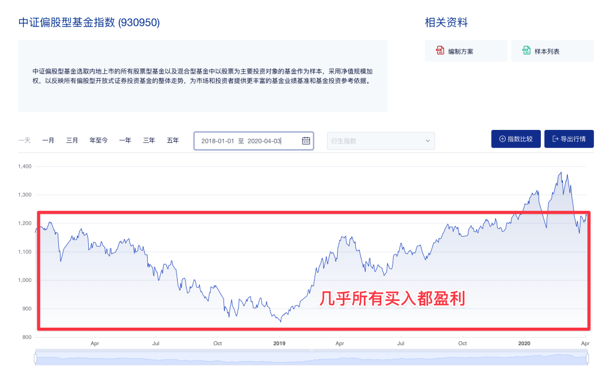

# “为啥我定投 3 年了还是亏的？”

**发布时间**: 2022-06-08 10:00:00

**原文链接**: [http://mp.weixin.qq.com/s?__biz=MzUzNjE3NzQ3Nw==&mid=2247490459&idx=1&sn=be70d4527593cae21694767c3488084e&chksm=fafb65b1cd8ceca78ed63d6f06937a0a49201cc2018d9e34552d0200bbbd52bd31e476c09a40#rd](http://mp.weixin.qq.com/s?__biz=MzUzNjE3NzQ3Nw==&mid=2247490459&idx=1&sn=be70d4527593cae21694767c3488084e&chksm=fafb65b1cd8ceca78ed63d6f06937a0a49201cc2018d9e34552d0200bbbd52bd31e476c09a40#rd)

---

昨天我给大伙分享了一个身边的故事——一位小伙伴因为今年市场行情很差，觉得银行定期存款 3 年过去比投资划算。

事实却是，即便经过很惨烈的下跌，3 年间中证偏股基金指数还是涨了超过 60%。

但文章发出来，立刻有小伙伴表示不服 👇

虽然定投亏钱了不能反过来证明市场不好，这里面也有很多个人选择和运气的因素，但还是有一个细节很值得我们展开聊一聊的。

……

投资这些年，我常常从小伙伴们口中听到这样的感慨：

  * “我上个月开始定投，结果这个月就赚钱了，赶上好时候了 ✌️”

  * “我定投好几个月了，结果现在还亏着，好惨……”

**我们会下意识地觉得，开始投资就赚钱，是好时候，而亏钱是很糟糕的事儿。**

但事实真是这样吗？

我们来仔细研究一下，为啥偏股基金过去 3 年涨了 60%，小伙伴定投三年却亏钱了。

他开始定投是在 3 年前，19 年正是上轮牛市的起点，定投没多久就开始赚钱了 👇（我们还以偏股基金指数作为参考）

开始投资后的一两年里，我们可能都会对这笔投资非常满意，觉得自己赶上了好时候。

但 3 年后的现在呢？让我们来看过去这完整的 3 年里发生了什么 👇

一轮行情过后，等到熊市到来我们才发现，自己有一半以上的仓位都买在了高于当前价格的位置。

所以一轮下来，虽然市场明明是上涨的，但我们却可能发现自己定投了 3 年还是亏钱了（尤其还要考虑到我们可能买了太过热门的基金，或者在高位时过于乐观买了更多）

……

而如果反过来呢？我们非常“不幸”，刚刚开始投资就赶上了市场大跌 👇

开始时我们可能非常郁闷。

但几年后回过头看，大盘还没涨，我们却能获得可观的回报，因为我们所有的持仓都积累在低位上 👇

这里就是给大家划的第一个重点啦 👉 **一笔本金买入，和定投买入，分析投资的思路是不同的，甚至是相反的** ：

  * 一笔本金买入最好的时机是牛市开始之前；

  * 但定投却恰恰相反，定投是喜欢下跌的，开始定投最好的时机就是别人避之不及的熊市。

> 我开始教也太投资是在 2021 年。开始时她老郁闷了，因为越投越亏，以至于好几次她都问我“咱能不能先不投了……”。
> 
> 我说“不行，但我帮你设置成自动定投吧，然后你先暂时别看了。”
> 
> 现在，她的账户还亏着，好几个月都没敢看了。但几年后她一定会觉得，当初的运气真的很好。

### 那这么说，是不是过去 3 年其实不应该定投？

熊市开始定投更好，但这个结论很容易被误解成“应该等到底部才能投资”。

我们不妨再设想一下，**假如我们现在可以后悔，3 年前我不买了** ，我要等到这轮熊市来了再定投，会发生什么？

  * 3 年前就开始定投，大约一半的仓位在很便宜的位置，只是大约一半的仓位在较高的位置。

  * 等到 3 年后才定投，反而所有的仓位都积累在了高位，局面反而更糟了。

一笔好投资，虽然短期有涨跌，但长期趋势却是持续向上的。

  1. 最优的选择是熊市开始定投，便宜买入；

  2. 牛市才开始定投，虽然不是最理想的，但已是次优的选择；

  3. 最差的选择是，嫌弃现在“不是最好的时机”，坚持要等下一轮“跌一跌再说”……

从这个数据大伙是不是也更好理解这句话——最好的投资机会在昨天，然后就是现在。

就像之前跟大伙分享的看法，**关于定投（👈 注意划重点哈，前提是定投）不管未来如何，开始定投的最好时机几乎总是现在。**

> 如果感觉奇怪，再看看过去十几年兴全趋势的走势 👇
> 
>

> 
> 对于一笔长期上涨的投资，不管当时是高点还是低位，从未来回头看都是“山脚下”。
> 
> 所以选对投资的前提下，决定长期定投收益的不是哪里「便宜」，而是哪个够「早」。
> 
> **复利的秘密不是收益，而是时间** 。
> 
> ——[“为啥基金年化 6%，定投收益却能年化 10%？”](https://mp.weixin.qq.com/s?__biz=MzUzNjE3NzQ3Nw==&mid=2247488388&idx=1&sn=96ddf3fd0dc7d920c8a3742aa5fa6d0d&chksm=fafb6daecd8ce4b8d78dbee1e47b814e05bf46aea828a1cb0b4d6e1a7e6e067acc70bddb7b0b&scene=21#wechat_redirect)
> 
> PS：想想还挺好玩的，我今天分享的这篇文章和去年分享的 👆 这篇，恰好是这同一个问题的两个相反的角度。

注：鉴于定投被误用的情况太多了，每次提到定投都得专门强调一下——定投，专门指我们通过工资这样的「现金流」来定期买入的方式。

手里已经有一笔本金了，就别再拆成好几份定投了，可以多去了解看看资产配置。我有给大家分享过自己的[备选武器库](https://mp.weixin.qq.com/s?__biz=MzUzNjE3NzQ3Nw==&mid=2247490261&idx=1&sn=f1c66e32af2f30ff4d440d776d6df76b&chksm=fafb64ffcd8cede997bcb406e342a53ec9f474d10ca533a5a30dbcfbfcd01e5e4aa58f8aff1e&scene=21#wechat_redirect)，供大伙参考。

……

这篇文章也刚好能回答一个我最近总被问到的问题。

我自己的财务自由实证从 2019 年到现在**  3 年间的平均年化收益是大约 5%**，没有达到预期的年化 10% 👇

常有留言问我，“对 10% 还有信心吗？”

这其实就是我们前面说的定投的规律——在过去这 3 年市场先涨后跌的走势里，定投收益率（我的自由计划就很像是个定投）就是会看起来偏低的，**我们在思考未来时要学会修正这个偏差** 。

时间最终会让收益率数字向均值回归，甚至大幅超过均值的。

就如霍华德·马克斯在《周期》中的总结——虽然市场有个平均收益预期，但真实情况却是，市场极少正好给我们平均值的回报，通常是时而高出一大截、时而低了一大块。

如果我们只看到眼前的收益率，就容易在今年得出“投资还不如存银行”、“最近几年收益率只有 5%，10% 不行了”这种过于悲观，又或者在 2020 年得出“投资太容易了，只要买自己熟悉的公司和基金经理就好了”这种过于乐观的结论。

从这些经历中学习反思，学会剥离这些影响，我们才能更从容、耐心地等待机会到来。

  * 财务自由：[我的财务自由实证之路](https://mp.weixin.qq.com/s?__biz=MzUzNjE3NzQ3Nw==&mid=2247490436&idx=1&sn=9d65da987d3e610dc2b9ad5aeb8cbcd9&chksm=fafb65aecd8cecb8fcb78cbe99f0117e075f5c7c7a559cad150711f7055ca3d94db0af1dbd3f&token=1482121189&lang=zh_CN&scene=21#wechat_redirect)

  * 投资笔记：[十年之约，躺赚不难](https://mp.weixin.qq.com/s?__biz=MzUzNjE3NzQ3Nw==&mid=2247490195&idx=1&sn=780a14510603bad6a4c96eafebb65c8f&chksm=fafb64b9cd8cedafa3c339c19b013598d83d0110b3add3a6e85df75c7eb3f4a6487a27383571&scene=21#wechat_redirect)

  * 抵御风险：[5 月保险最推荐](https://mp.weixin.qq.com/s?__biz=MzUzNjE3NzQ3Nw==&mid=2247490340&idx=1&sn=d1ec295caea6a37028c1cdf81b35e9a6&chksm=fafb650ecd8cec1866cf3c77f9d81dd4b6fe8ca8bb4dcce18e512c1c14f139722c79eb87e661&token=1325088630&lang=zh_CN&scene=21#wechat_redirect)

  * 干货汇总：[财务自由路上应该了解的每一个问题](http://mp.weixin.qq.com/s?__biz=MzUzNjE3NzQ3Nw==&mid=2247489926&idx=1&sn=eac357cebcbfd7250828cdda88d9f122&chksm=fafb67accd8ceebaa1e750f129714bb000be9720a990a70c6fba6fc52fd3712014a58d699d6e&scene=21#wechat_redirect "全都安排好了，财务自由路上我们需要了解的每一个问题 原创")

**风险提示** ：本文不构成投资建议，主要是我个人投资中的观察和思考。大伙参考为主，投资最终还是要独立决策，毕竟我也可能是错的。

 _今日题图来自 Pixabay @jambulboy_