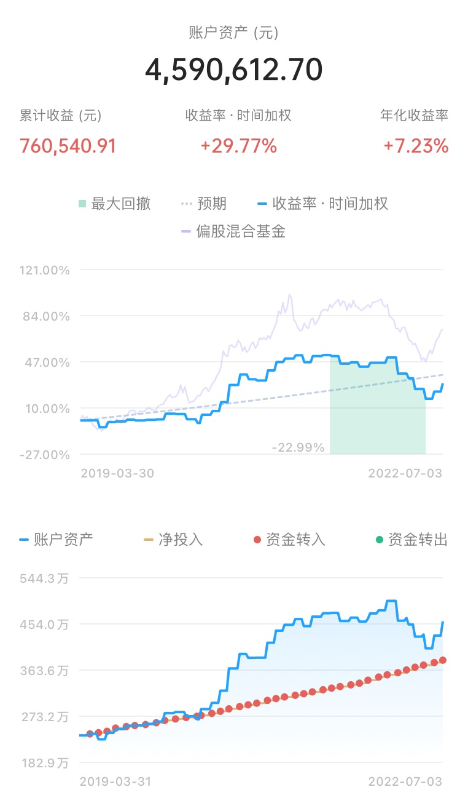
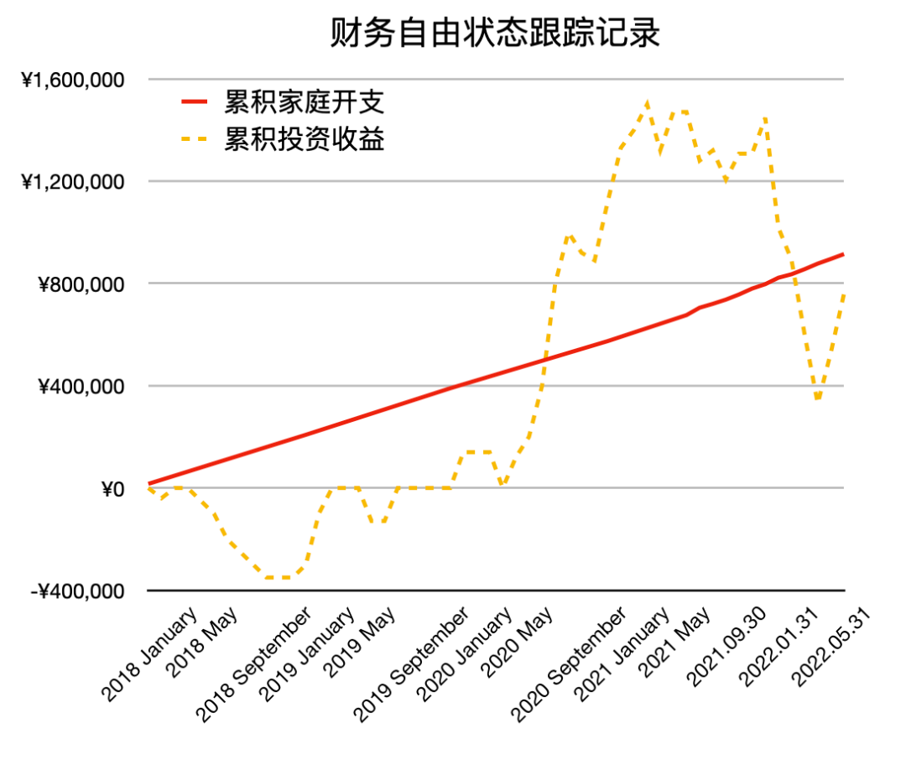

# 上个月，我 30 了 | 财务自由实证 #40

**发布时间**: 2022-07-04 09:35:59

**原文链接**: [http://mp.weixin.qq.com/s?__biz=MzUzNjE3NzQ3Nw==&mid=2247490541&idx=1&sn=d2a1751b8134daaf512507c261978142&chksm=fafb65c7cd8cecd174eba0aa1496a366ff07d99fb514104806e36f72a0dcc41fd4d0b0a8f30a#rd](http://mp.weixin.qq.com/s?__biz=MzUzNjE3NzQ3Nw==&mid=2247490541&idx=1&sn=d2a1751b8134daaf512507c261978142&chksm=fafb65c7cd8cecd174eba0aa1496a366ff07d99fb514104806e36f72a0dcc41fd4d0b0a8f30a#rd)

---

5 年前，我定下了“30 岁前攒到 500 万实现财务自由”这个目标。

离这个数字最近的一次是 499 万 1 千 500

感觉市场跟我开了个玩笑，“我知道你能攒到 500 万，嘿，但我偏不让 🤪”

……

但人们说，上帝在关上门的时候，也许会给你留出一扇窗。

我还真找到了。

2020 年，我给大家[分享过一个思考](https://mp.weixin.qq.com/s?__biz=MzUzNjE3NzQ3Nw==&mid=2247486859&idx=1&sn=ad992ecdd32a267d14350a269734d852&scene=21#wechat_redirect)——**自由路上应该经历一次熊市的检验** 。

> 如果可能，尽量不要在牛市高估时期评估财务自由。即使实现了本金目标，也最好主动等待一次熊市洗礼，在市场低估的时期自由。
> 
> 给我们的资产去一下“水分”。

今年投资不太容易，有说“经济太难了”，有说“投资收益难有 10% 了，5% 才够保守”，还有说“通胀太高，开支没法控制”……

但这样的熊市 + 意外，也刚好是一次检验自由的机会。

我和也太按照最艰难的局面对我们的财务自由计划做了一次压力测试——

  * 在熊市大跌、资产缩水之后，并且…

  * 欧美大通胀来了，并且…

  * 假设我俩都不再工作，断绝除投资以外的所有收入，并且…

  * 未来投资长期能够实现的预期收益率只有 5%

那我们现在的自由还足够稳健吗？

虽然我与 500 万这个数字失之交臂，但在 30 岁之季我得到的这个答案还是有点让我惊喜。

我和也太除去今年一边租房、一边还房贷，近视手术的分期这两笔临时开支（下半年就结束了），目前年度开销是 24000 欧元（平均每月 2000），折合人民币 16.7 万。

考虑到通胀，我们可能会把预算提高 25% 到 30000 欧元（今年欧美的通胀为 8%），折合人民币 21 万。

然后我们假设未来预期年化收益只有 5%，那么我们需要的本金就是，420 万（=21 万 x 20 倍）

而在这轮下跌的钻石坑里，我们的资产净值几乎刚好达到这个位置 👇 再算上我们当前的储蓄情况，第三季度刚好能超过这个目标。

30 岁之季，我们的计划经历过了第一轮考验，积累下了足够自由的本金。

### 路上总有意外，但也会收获惊喜

但细心的小伙伴应该注意到了，等后面扣去了买房的首付，我们的钱恐怕就又刚好不够了…… 

提前置办第一套自己的房子，这是计划之外的情况。我原本的想法是：

  * 2 年前，当时我们的资产大约是 450 万（同有买房打算的小伙伴可以参考我的[实证第 28 期](http://mp.weixin.qq.com/s?__biz=MzUzNjE3NzQ3Nw==&mid=2247488869&idx=1&sn=2e80a0cb6a95ac68b1879d2bff8b411d&chksm=fafb6b4fcd8ce259c302c1b0c6d99aea20e1792c5bb1678f39b24246959cab1dd730dbe2778b&scene=21#wechat_redirect)），这笔钱自己应该可以成长到 500 万，达成目标。

  * 因为我们买的是 1 年半后的期房，这段时间，靠我们俩的攒钱速度应该可以把首付攒出来。

但人算不如天算，虽然第 2 点我们做到了，第 1 点却 👇

所以在下半年扣除了首付以后，按照前面最悲观的压力测试，我们可能会有大约 70 万的缺口 （欧元跌了，首付从 80 万缩水成了 70 万 😂）。

……

但是，**未来真的会按照最悲观的情况展开吗？**

1、市场未来的收益会只有悲观的 5% 吗？统计数据并不答应 👇 正相反，**越是悲观、低估，我们对未来越可以乐观一点**

从最糟糕的时刻往后看，未来几年的年化收益不但不应该是悲观的 5%，反而很可能会超过 10%（其实过去 2 个月，市场就已经上涨了 20%）

2、通胀会一直持续下去吗？上世纪 70 年代，我们已经战胜了一次大通胀，所以这次，我们依然可以相信问题会被解决。

> 推荐一下《跳着踢踏舞去上班》这本书中的记录。当时巴菲特也悲观地认为通胀可能会长期持续，但最终“股神”却也少见地犯错了，他也低估了人们解决问题的决心。

3、而且，我们俩也不至于没有任何收入。

**熊市教给我们的不是消极悲观，而是学会按照最坏的情况做好准备，然后坐等好事儿发生。** 路上总有意外，但也总会收获惊喜。

……

30 岁，我与 5 年前的目标因为 8500 块而失之交臂…… 这是个不完美的计划。

有小伙伴跟我说，就差这么点儿，你就不能把数字稍微改一改，把 ta 圆上？

但这些年财务自由计划教给我的，恰恰就是**数字本身不是最重要的，重要的是通过数字想清楚我们想要的生活** ——

当初我想，我喜欢写东西，财务自由以后我就可以专心分享了。后来我真的成了全职博主，甚至比计划提前了 2 年。

当初我想，“能像我家喵一样懒，又能懒得心安理得”。虽然最后发现自己并不喜欢，但至少试过了，不是说葡萄酸。

此时，我和也太都已实现远程办公。3 个月后，我们将会搬去二线，留住一线的收入，享受二线的低房价、生活成本和慢节奏。

回头看，这 500 万的目标当然还是很重要。如果没有这个目标和随后 5 年的执着，我可能早已迷失在各种别人告诉我的“你应该过的生活”，忘记追求自己的人生。

但最终的数字其实也没那么重要，因为 ta 已经给了我管理财富的能力和体系，这几年的写作也让我把这些思考分享给了大家。

500 万这个数字（且要在买房之后）会迟到，但不会缺席。

坐等好事儿发生～

### 计划进度更新

最后是例行更新我的计划进度。

**普通人通过工资理财也能实现财务自由** ，这是这些年我一直在践行的理念。从最初懵懵懂懂到 2017 年制定具体的财务计划，再到如今渐渐靠近终点，已经走了五六年。

为了能够更加透明、中立地实证普通人财务自由的可能性，从 2019 年开始我决定公开自己的财务进度，成为这个系列内容「财务自由实证」。

不追求大富大贵，但求能够不再纠结生计这些琐碎问题，在重大选择面前获得更多的人生选项，不再瞻前顾后。

有兴趣参考这个实证的朋友建议先看看之前的引导篇，[制定自己的财务自由计划](https://mp.weixin.qq.com/s?__biz=MzUzNjE3NzQ3Nw==&mid=2247484500&idx=1&sn=c04c3de1a1231bef25bb4cda773c00ff&scene=21#wechat_redirect)、[一起财务自由](https://mp.weixin.qq.com/s?__biz=MzUzNjE3NzQ3Nw==&mid=2247484480&idx=1&sn=258e8dd4976c7d3c324ed89b90904d14&scene=21#wechat_redirect)。以往的干货精华也都有汇总 👇

  * [全都安排好了，自由路上我们会遇到的每一个问题](http://mp.weixin.qq.com/s?__biz=MzUzNjE3NzQ3Nw==&mid=2247489926&idx=1&sn=eac357cebcbfd7250828cdda88d9f122&chksm=fafb67accd8ceebaa1e750f129714bb000be9720a990a70c6fba6fc52fd3712014a58d699d6e&scene=21#wechat_redirect)

  * [我的第一本书，整理财务自由方法论](https://mp.weixin.qq.com/s?__biz=MzUzNjE3NzQ3Nw==&mid=2247486809&idx=1&sn=8a80c493837ee044c5d55e0a423507d2&scene=21#wechat_redirect)

  * [一期访谈](http://mp.weixin.qq.com/s?__biz=MzUzNjE3NzQ3Nw==&mid=2247487473&idx=1&sn=10a891429291e78dea82b4df34e773f3&chksm=fafb71dbcd8cf8cdb15f114d6637bc6476a2803f9f0803dcbb4d91c1e68b5cc706c3dc55358b&scene=21#wechat_redirect)和[一期播客](http://mp.weixin.qq.com/s?__biz=MzUzNjE3NzQ3Nw==&mid=2247489401&idx=1&sn=a613497a5d6fdc3325d0424b9a78063e&chksm=fafb6953cd8ce045481121812b61b04f62dfe09a07b785991fc4cdd679bc9af13665d4c0ce62&scene=21#wechat_redirect)聊聊我的经历和观念

我给自己定下的目标是 30 岁前积累到**  家庭年度开支的 10 倍**（结果现在攒到了 20 倍 ✌️），作为创造被动收入的本金。依靠这些本金实现长期 10+% 的年化投资收益就可以实现财务自由，不再依赖上班工资生活，有底气去选择自己真正想做的事儿。

（我的具体目标数字是 500 万，但**这个数字大家没必要参考** ，还是要以自己的生活开销为准）

财务自由路上一些重要节点：

  * 2017 年，计划正式开始，同年获得家人的认可和支持；

  * 2018 年，A 股熊市大跌，出现“钻石坑”机会；

  * 2019 年，开始财务自由公开实证（就是现在大家看到的这个系列）；

  * 2020 年，新冠股灾，自由之路上的又一个关键机会；

  * 2021 年，[自由目标基本达成](http://mp.weixin.qq.com/s?__biz=MzUzNjE3NzQ3Nw==&mid=2247489120&idx=1&sn=e5c5bf6d51914c212c228bc6f42346dc&chksm=fafb684acd8ce15c27cd508a67d57573f4acbeced75f805ef271b4efcf42cf54b363e5f93fcf&scene=21#wechat_redirect)，开始向新的节奏过渡；

  * 2022 年，遭遇自由后的第一次账户大幅回撤，但也是港股 6 年后、A 股 3.5 年后的又一次钻石坑，期待后续……

### 实证账户更新

注：记账工具为[有知有行](http://mp.weixin.qq.com/s?__biz=MzUzNjE3NzQ3Nw==&mid=2247487794&idx=1&sn=b9db83140ef56b777315a5e415954736&chksm=fafb6f18cd8ce60eeebe855dcd793f173a5589e51657877fb9e8a2fff629eeb17688a40e2766&scene=21#wechat_redirect)，每次都有小伙伴问。

……

为了跟踪财务自由状态的**可持续情况** ，[从第 30 期开始](http://mp.weixin.qq.com/s?__biz=MzUzNjE3NzQ3Nw==&mid=2247489372&idx=1&sn=2118934ef05d930f50d2510ff6642cb1&chksm=fafb6976cd8ce06042f2bb8d1ed950a95262d11451fe116440e1ff84ca49c6fdae8a5d664a6d&scene=21#wechat_redirect)我琢磨出了一个新的工具——同时跟踪「累积家庭开支」和「累积被动收入（投资收益）」曲线。关注两条线的趋势变化，如果投资收益曲线长期趋势在家庭开支上方，就说明这个状态是可持续的。

随着市场回暖，收益曲线又快要回到开支曲线上方了 👇

……

当前在我[投资武器库](https://mp.weixin.qq.com/s?__biz=MzUzNjE3NzQ3Nw==&mid=2247490261&idx=1&sn=f1c66e32af2f30ff4d440d776d6df76b&chksm=fafb64ffcd8cede997bcb406e342a53ec9f474d10ca533a5a30dbcfbfcd01e5e4aa58f8aff1e&scene=21#wechat_redirect)中的位置和新增的投资 👇 珍惜现在市场还算低估的时期，**低估时期我们的工资是更值钱的！**

最后要提醒大伙，财务自由的投资和被动收入虽然看起来性感，但「因上努力，果上随缘」。本金和收益只是自由路上的「果」，**主业努力多赚钱、理性消费少挥霍，以此积累本金，再加上不被短期涨跌干扰、坚持投资才是背后的「因」** 。

投资复利只是我们获得被动收入的方式，而不是致富的秘密。

在财务自由实证的最初两年，我写得最多的也不是如何投资，而是如何**少在投资上花时间，好能多花时间关注主业** ，同时理性控制开销，尽快攒钱。

假如有 10 万本金，就算投资翻倍也才赚了 10 万。而投资翻倍极其困难，巴菲特的年化收益也才 20%。相比之下，在职场上努力提升，让收入再增加 10 万则要靠谱得多。

对财务自由而言，“钱生钱”做到 80 分足矣，剩下的精力还是应该关注赚钱和省钱这些“人生钱"。