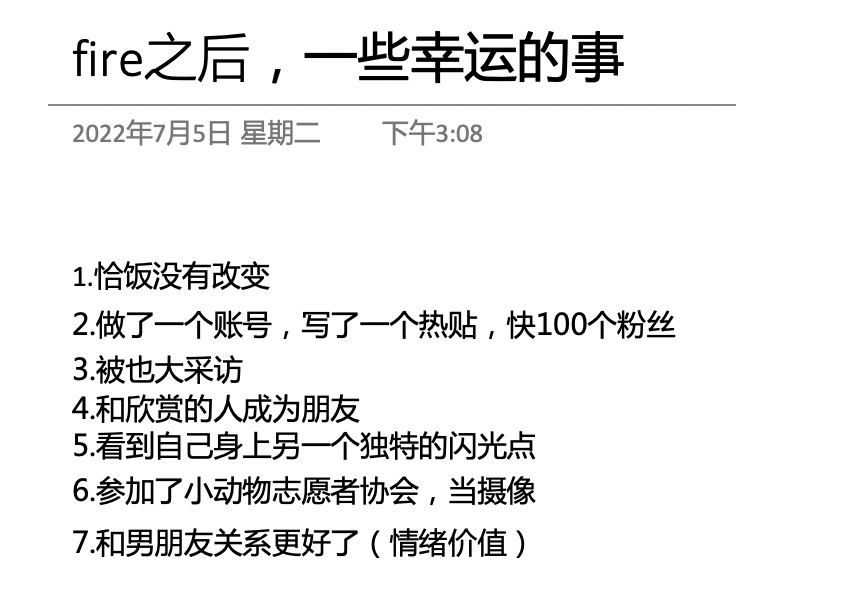

# 先退休，再致富

**发布时间**: 2022-07-06 10:08:00

**原文链接**: [http://mp.weixin.qq.com/s?__biz=MzUzNjE3NzQ3Nw==&mid=2247490566&idx=1&sn=28ba9f47d26993d1b90ce01977f69377&chksm=fafb622ccd8ceb3ab4237b920f327c48bef8452ecb47c6379fac19b2f1faa7d61fe6cae63aff#rd](http://mp.weixin.qq.com/s?__biz=MzUzNjE3NzQ3Nw==&mid=2247490566&idx=1&sn=28ba9f47d26993d1b90ce01977f69377&chksm=fafb622ccd8ceb3ab4237b920f327c48bef8452ecb47c6379fac19b2f1faa7d61fe6cae63aff#rd)

---

两年前我从上班到做自由职业，今年也太从上班到长期居家办公，昨天一起聊天的秋秋在 26 岁退休，我们都经历了一个共同的变化——

不过秋秋也说，ta 发在其他地方的帖子，大家都很难理解这个变化。

但我相信在这里你们会懂的，所以我要再努力一次。

……

这次聊天让我想起一位财务自由博主对退休生活的回顾总结——First Retire… then Get Rich（先退休，再致富）：

> 向他人分享财务自由计划时，总要面对一大波质疑：
> 
> 「你的钱能够这么长时间花吗？万一通胀呢、意外呢？
> 
> 你明明还能赚到更多钱啊，为什么早早停下？
> 
> 你现在可以很节俭，但万一哪天你希望提升自己的生活方式呢？」
> 
> 虽然我没有打算改变自己的生活方式，但我确实有一个秘密计划，在未来的 40 年，比今天再富有一点。
> 
> 恩，在我早已退休的前提下。

对财务自由的普遍看法是，要先攒下一大笔钱。攒够了才退休，把财务自由当做财富之旅的终点（结果钱总也不够，总也不敢停手）

但如果我们可以先退休，然后继续看着财富积累呢？

财富的来源，无外乎**收入减去支出** ，我们来一个一个说。

### 开销

一提到退休，很多人第一个反应是万一以后开支膨胀怎么办？但现实是相反的，你会看到，开销一下少了好多。

昨天有位上班的小伙伴提到养娃的焦虑，但另一位半退休的小伙伴如下回答 👇

**生活中很多焦虑都是基于一个思维定式「我在上班，我没有时间」，** 那我只好花钱来交换他人的时间和精力。

但如果这个前提不存在呢？有时间、有精力，很多事情会变简单：

  * 在别人上班时出去旅行，体验翻倍，费用骨折；

  * 通勤高峰可以不出门，主动避开人潮，做重要不紧急的事儿；

  * 真正把家庭作为教育的第一站，而不是凡事儿指望学校；

  * ……

最近我和也太准备新家，读到各种装修的开销和抓马事儿以后，我和也太决定新家依然还是自己装吧，以后修理维护都方便，熟门熟路。只有那些真搞不定的部分，再请专业人士帮忙（自从试着自己动手，我发现这部分其实很少）

而且我发现个很 bug 的事儿，**把自己动手的时间按照请人的开销折算，算出来的时薪比我以前上班时还高出一倍** 。

……  

以前我和也太还都在上班时留意过一个现象——每逢赶上休假，或者在做的项目是自己喜欢的，当月的开销总比平时低，想买的东西总比平时少。

后来我才知道，1992 年出版的 Your Money or Your Life 已经关注到这个问题：

我们常常处在这样一个无意识循环中——**  做不喜欢的工作养家糊口 ➡️ 疲惫压力 ➡️ 再花掉赚来的钱缓解这份压力**。这种补偿性消费的潜意识常常是，“我都这么辛苦了，我应该拥有一下……”。

但如果前提改变了，我们在做自己喜欢的事儿，很多原本好像必须花的钱、必须得买的东西突然就不香了。

退休对开支的改变主要来自两方面：

  * 帮我们避开人潮，不必再花双倍的价钱去争高峰时段更差的体验；

  * 不再让赚钱产生的负面情绪再把赚到的钱拿回去。

这些本不必要的开销下降，我们就积累下了更多财富。换取我们想要的自由，或者其他我们真心渴望的东西。****

### 收入

很多人觉得，退休就是啥也不干了。但纳瓦尔说，退休，只是意味着你不再通过牺牲今天的方式来等待明天。

秋秋的选择是，不再通过牺牲健康的方式拼命赚钱。

我的选择是，更自由一些，寻找更适合我的工作节奏和频率。

也太的选择是，不断调整与工作的关系，不允许工作带来的负面情绪再蔓延到生活。

退休更像是一种选择：

  1. 一边工作、一边抗拒，随时准备逃出去（攒下一笔钱，我就不干了！），还是…

  2. 找到专长或者自己喜欢的工作方式，沉浸其中。

不过这还是比较理想化，找到自己喜欢的工作，收入还不减反增，确实需要运气。所以我们来考虑一个更现实的情况——**我们选择了自己更喜欢的工作方式，但收入减半** 。

假设一位小伙伴月收入是 15000，上班时的开销是 10000，那他**积累财富的速度就是每个月 5000 元** 。

而另一位小伙伴按照被动收入 10000 元为目标（被动收入大于开销）退休。由于退休对开销的影响，差不多的生活他需要的开销可能只要 6000。而与此同时，假如 ta 选择了一份收入减半但更开心的工作方式，每月收入就是 7500。他**积累财富的速度是每个月 11500** （10000 - 6000 + 7500）。在退休的情况下，ta 的财富积累速度反而是两倍。

我很喜欢这句总结「先退休，再致富」，这是我希望的生活。

### 我们从未停下

我也在想一个问题，为什么一说我们财务自由了、退休了，人们总是下意识地认为，我们的财富之路到头了，并感到惋惜呢？

也许 Morgan Housel 的一个洞见可以回答——**你真正「拥有」的财富，别人常常是看不到的。** 别人看到的，房子、车子、名包、名表，都来自你「消灭」的财富。

我们拥有的财富，拥有的被动收入，生活的幸福感，不会被看到。能被看到的，常常是我们的开销减半，他们以为的“财富”不见了。

后来秋秋给我分享了一张图，我征得了她的同意，分享给大家 👇

“原来我的生活也许只有 1，现在感觉扩宽了生命的宽度”

真正的财富不容易被看见，重要的是我们心里有个属于自己的答案。我们只是先退休、再致富，仅此而已。

  * 财务自由：[我的财务自由实证之路](https://mp.weixin.qq.com/s?__biz=MzUzNjE3NzQ3Nw==&mid=2247490541&idx=1&sn=d2a1751b8134daaf512507c261978142&chksm=fafb65c7cd8cecd174eba0aa1496a366ff07d99fb514104806e36f72a0dcc41fd4d0b0a8f30a&token=1242905607&lang=zh_CN&scene=21#wechat_redirect)

  * 投资笔记：[十年之约，躺赚不难](https://mp.weixin.qq.com/s?__biz=MzUzNjE3NzQ3Nw==&mid=2247490195&idx=1&sn=780a14510603bad6a4c96eafebb65c8f&chksm=fafb64b9cd8cedafa3c339c19b013598d83d0110b3add3a6e85df75c7eb3f4a6487a27383571&scene=21#wechat_redirect)

  * 抵御风险：[6 月保险最推荐](https://mp.weixin.qq.com/s?__biz=MzUzNjE3NzQ3Nw==&mid=2247490480&idx=1&sn=0a4c6b3c94f5ca9c776b2aca85b2b6c0&chksm=fafb659acd8cec8ca03f1bf7b2096dc7689231bc67ad5d47959e5fd36dbbe7c4c0945379985e&token=1880675219&lang=zh_CN&scene=21#wechat_redirect)

  * 干货汇总：[财务自由路上应该了解的每一个问题](http://mp.weixin.qq.com/s?__biz=MzUzNjE3NzQ3Nw==&mid=2247489926&idx=1&sn=eac357cebcbfd7250828cdda88d9f122&chksm=fafb67accd8ceebaa1e750f129714bb000be9720a990a70c6fba6fc52fd3712014a58d699d6e&scene=21#wechat_redirect "全都安排好了，财务自由路上我们需要了解的每一个问题 原创")

👇 First Retire… then Get Rich 这篇文章的链接我附到了「阅读原文」，感兴趣的小伙伴们可以看看