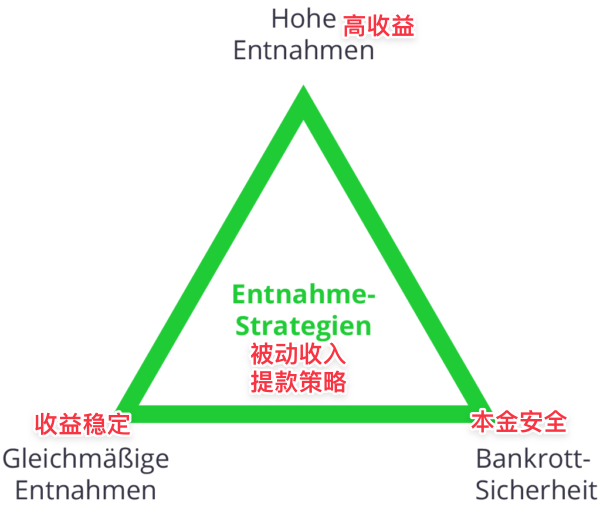

# 用被动收入赚零花钱的几个注意事项

**发布时间**: 2022-07-11 10:31:38

**原文链接**: [http://mp.weixin.qq.com/s?__biz=MzUzNjE3NzQ3Nw==&mid=2247490601&idx=1&sn=6c3654d86e15651c089d9f45300d5665&chksm=fafb6203cd8ceb15a1a3f7f921715127e4848dcb12d87de1e9359ceaddc90c2011a2ebc80ce5#rd](http://mp.weixin.qq.com/s?__biz=MzUzNjE3NzQ3Nw==&mid=2247490601&idx=1&sn=6c3654d86e15651c089d9f45300d5665&chksm=fafb6203cd8ceb15a1a3f7f921715127e4848dcb12d87de1e9359ceaddc90c2011a2ebc80ce5#rd)

---

开头先说一句，最近部分小伙伴手机上出现的字号偏小的问题，我已经和微信联系了，找到了问题的原因，预计这周就可以解决啦。当前显示字号偏小的读者们，也可以等问题修正以后再来重读。等确认后再跟大伙同步～……[上周](https://mp.weixin.qq.com/s?__biz=MzUzNjE3NzQ3Nw==&mid=2247490582&idx=1&sn=5f6c7a6e3be6d19846f55a5e7355f18d&chksm=fafb623ccd8ceb2a3e43b77f31c2299a9caf16b34131dda465d1f737c96619bf2fb7b2835788&token=1134331833&lang=zh_CN&scene=21#wechat_redirect)给大伙分享了一个我在被动收入上的新思路——用被动收入赚零花钱，获得生活中的小确幸。

这篇文章我的关注点主要放在 ta 对我生活的影响和思考，具体的操作写得不多。因为当时在文章中附带的干货链接已经涉及了具体操作的方方面面，当时我觉得重复造轮子意义不大。

不过看了大伙后来的留言，尤其是一些小伙伴依然踩进了那些已经被科普过的坑。我意识到，也许最重要的东西还是值得重复。

所以这篇补上我在用被动收入赚零花钱时会注意的 **3 个细节** 。  

### 1、只用自己不会用到的本金

有小伙伴分享经验说，“一定不要在里面放太多钱，不然遇上大跌 50～60%，心态直接爆炸”。

别放太多钱这个建议我认可，下面第三条我写的也是这个。但我觉得，“可能跌”所以“少放钱”这个逻辑有点问题，**面对风险我们不应该考虑“少买点儿（少亏点）”，而应该规避风险不要亏钱** 。

用基金分红来举个具体的例子：

假设我们发现某只红利指数基金的股息率是 5%，用 1 万买入，那么每年能获得 500 元被动收入。结果刚买没多久，市场大跌，我们的基金跌了 50%……

不管我们钱多、钱少，都不能改变基金腰斩这个现实。但一个前提会让最终结果不一样——只用自己不会用到的本金。

市场大跌虽然会影响基金净值，但实际上**市场涨跌对分红的影响要小得多** （文末有我收集的 08 年金融危机时期的数据）。所以虽然分红数额会有波动，但只是钱多钱少的问题。

短期来看：就算市场跌了 50%，只要我们当初用的是暂时不会用的本金，现金流体系就不会失灵，我们依然可以实现当初”获取被动收入改善生活“的目标。

长期来看：市场不会一直跌下去，遇到牛市也会大涨。用不会用到的本金来获取现金流，最差的情况也就是卧倒装死、等下一轮行情。

**用自己不会用到的本金（避免浮亏变现），去买入自己真正理解的资产（大跌中不会惊慌失措）** ，这才是我认为最好的保障。

之前有小伙伴留言问，能不能拿暂时不用的生活备用金来赚零花钱，我的回答是 👇

### 2、用网格赚零花钱要注意「压力测试」

上面我们说的是基金分红遇上大跌，那网格呢？

**网格很重要的就是压力测试了** 。

网格策略和前面说的买基金等分红有个共同点——市场大涨、大跌之后，即使本金有浮亏，依然能获得现金流。

**但有个例外** ，我画了个示意图：

这就是今年中丐上发生的事儿 👇 

美股中概互联今年以来的走势，截图来自富途牛牛 App 

假如我们为了一时收益把网格都布在了前面左上方的位置，到后面就很难再获得现金流。

所以在规划网格时不要只看眼前的波动，也要同时做好压力测试，把未来可能的大跌也考虑进去，确保网格数量充足。

估计大跌的跌幅，我会参考今年 4 月 26 日的钻石坑里各个 A 股指数的位置，或者中概从高点下跌 80% 的位置（这个思路谨供大伙参考）

### 3、别在“赚零花钱”上放太多资产

长期来看，各种投资都要遵守不可能三角 👇

高收益、稳定的现金流、本金安全，不能三者兼顾。

**选择赚“稳定的现金流”，就相当于放弃部分未来的“高收益”** 。所以这样的策略虽然对日常生活的改善很明显，但长期来却不容易赚到大钱。

如果牛市到来、市场大幅上涨，网格是无能为力的，因为网格策略会让你早早卖出（本想等回撤再接回来）而错过这样“三年不开张、开张吃三年”的机会。

赚基金分红的思路也一样，虽然高分红基金牛市也会涨，但常常会落后平均涨幅。

零花钱策略不用太贪心，这是我上次分享给大家的感悟：

> 其实我在网格上投入的本金很少，才 2% ，绝对收益并不高。
> 
> 但硬币的另一面。
> 
> 我们家每个月的餐饮开支是 250 欧元，网格每个月能带来大约 200 美元的奖励预算（美元现在和欧元汇率差不多 1：1）。
> 
> 2% 的尝试，放在我们生活上，带来的却是 80% 的改变。
> 
> 考虑总量，和考虑边际效益，得出的结论可能完全不同。

既然我们关注零花钱是为了边际效益，是为了不高的收益也能有“突然中奖了”一样的惊喜，就无需放太多。

作为参考，一个应用比较多的经验公式——2:8，赚现金流的资产不要超过 20%，主要本金还是放在长期持有上。

……

以上，就是我在建立零花钱策略时会注意的几个细节。虽然**人都会犯错，我的思路也肯定不是完美的** ，但还是希望能对大伙有个参考和借鉴的价值。

最后附上文中提到的几篇相关文章：

1、上周的文章：[ 用被动收入赚零花钱出去玩 ](https://mp.weixin.qq.com/s?__biz=MzUzNjE3NzQ3Nw==&mid=2247490582&idx=1&sn=5f6c7a6e3be6d19846f55a5e7355f18d&chksm=fafb623ccd8ceb2a3e43b77f31c2299a9caf16b34131dda465d1f737c96619bf2fb7b2835788&token=1134331833&lang=zh_CN&scene=21#wechat_redirect)

2、我收集的 08 年金融危机时期，[几个国家的主要指数分红情况](https://mp.weixin.qq.com/s?__biz=MzUzNjE3NzQ3Nw==&mid=2247484782&idx=1&sn=7f9201205ffb5abca041d57feaa94663&scene=21#wechat_redirect)，基本上可以总结为“稳中有升”。

3、A 股基金的分红文化还是差了些，有些基金公司收到股息也不会分红，而是直接放在基金里继续投资。如果遇到这种情况，我在[这篇文章中](https://mp.weixin.qq.com/s?__biz=MzUzNjE3NzQ3Nw==&mid=2247484792&idx=1&sn=cb4877ea60f9a4c17b7123aaca8393e4&scene=21#wechat_redirect)也分享了一些思路。

（end）

  * 财务自由：[我的财务自由实证之路](https://mp.weixin.qq.com/s?__biz=MzUzNjE3NzQ3Nw==&mid=2247490541&idx=1&sn=d2a1751b8134daaf512507c261978142&chksm=fafb65c7cd8cecd174eba0aa1496a366ff07d99fb514104806e36f72a0dcc41fd4d0b0a8f30a&token=1242905607&lang=zh_CN&scene=21#wechat_redirect)

  * 投资笔记：[十年之约，躺赚不难](https://mp.weixin.qq.com/s?__biz=MzUzNjE3NzQ3Nw==&mid=2247490195&idx=1&sn=780a14510603bad6a4c96eafebb65c8f&chksm=fafb64b9cd8cedafa3c339c19b013598d83d0110b3add3a6e85df75c7eb3f4a6487a27383571&scene=21#wechat_redirect)

  * 抵御风险：[6 月保险最推荐](https://mp.weixin.qq.com/s?__biz=MzUzNjE3NzQ3Nw==&mid=2247490480&idx=1&sn=0a4c6b3c94f5ca9c776b2aca85b2b6c0&chksm=fafb659acd8cec8ca03f1bf7b2096dc7689231bc67ad5d47959e5fd36dbbe7c4c0945379985e&token=1880675219&lang=zh_CN&scene=21#wechat_redirect)

  * 干货汇总：[财务自由路上应该了解的每一个问题](http://mp.weixin.qq.com/s?__biz=MzUzNjE3NzQ3Nw==&mid=2247489926&idx=1&sn=eac357cebcbfd7250828cdda88d9f122&chksm=fafb67accd8ceebaa1e750f129714bb000be9720a990a70c6fba6fc52fd3712014a58d699d6e&scene=21#wechat_redirect "全都安排好了，财务自由路上我们需要了解的每一个问题 原创")

**风险提示** ：本文不构成投资建议，只是我个人投资中的观察和思考。大伙参考为主，投资最终还是要独立决策，毕竟我也可能是错的。