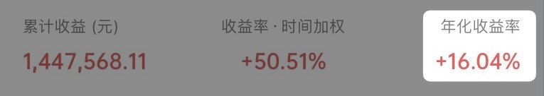
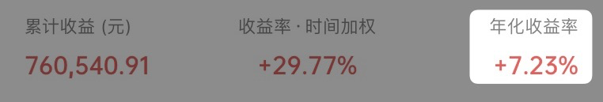
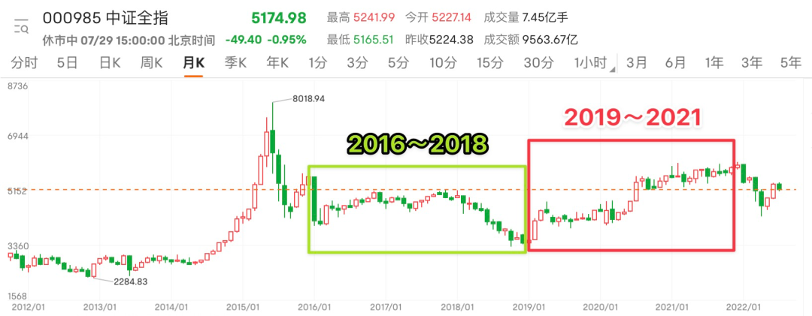
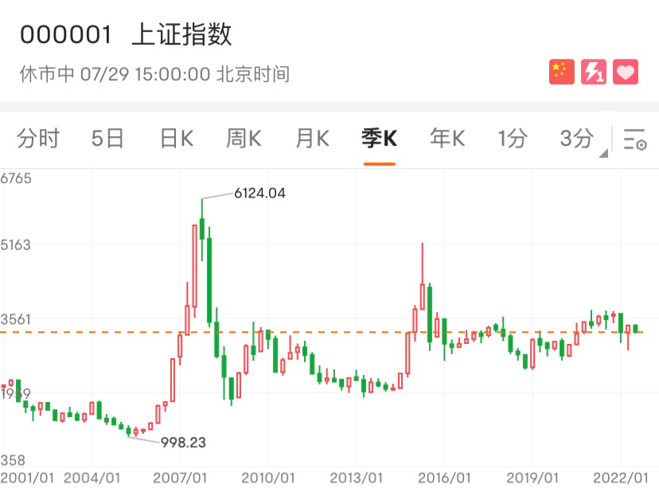

# “3 年” | 财务自由实证 #41

**发布时间**: 2022-08-01 10:05:36

**原文链接**: [http://mp.weixin.qq.com/s?__biz=MzUzNjE3NzQ3Nw==&mid=2247490665&idx=1&sn=808fd19f399fdda01401db565d135980&chksm=fafb6243cd8ceb556a457ac23e79d5c68b475194ae4fa7a382fe4e700ec414a23b6f29de9efb#rd](http://mp.weixin.qq.com/s?__biz=MzUzNjE3NzQ3Nw==&mid=2247490665&idx=1&sn=808fd19f399fdda01401db565d135980&chksm=fafb6243cd8ceb556a457ac23e79d5c68b475194ae4fa7a382fe4e700ec414a23b6f29de9efb#rd)

---

上上期实证有位小伙伴问了我个问题：

> 实证记录到现在年化只有 5%，这么来看，对于投资长期实现 10% 年化收益的预期是不是有点过于乐观了？

我回答，如果可以这么简单地拿以往收益推理未来收益，那万一某年我们投资亏钱了，是不是也要认为投资必将把本金全部亏光吗？

小伙伴又补充，单独某一年肯定不行啊，但实证到现在不也 3 年了，“有些年头了”。

恩，这是个好问题。

如果大伙也有过类似疑惑，那不妨留意一下下面这个细节对比。

如果今年年初看实证，看到的过往年化收益会是 👇 **16.04%** ，甚至远高于 10% 的预期

但短短 4 个月以后再看，年化数字居然连零头都没有了👇 只剩下 **3.47%** ……

而再过 2 个月，数字又翻了一倍到了 **7.23%**  👇

为什么同样是“有些年头了”的实证，只是前后短短几个月看起来却这么不一样？（其实不仅仅是实证，任何投资都会出现这种情况）

**应该怎么剥离噪音，更理性地看一笔投资的过往收益，如何看待我们自己的财富增长呢？**

我们常说，长期投资要 3、5 年以上，但 3、5 年一定能代表一笔投资的过往收益吗？

### 起止时间比时间长短更重要

为啥会出现前面这种情况？我来举个更直观的例子说明。

同样是看 3 年间的市场收益，2016～2018 年，和 2019～2021 年，看到的景象却完全不同 👇

指数：中证全指，来源：富途牛牛

2016～2018 年，市场是从高估到低估，所以我们看到的是市场大跌。如果选这 3 年，观察到的收益会明显偏低，让人对投资过于悲观。

2019～2021 年，市场正相反，从低估到中高估值，所以我们看到的是市场大涨。选这 3 年观察，得出来的收益就会有明显的水分。

而且不仅仅是 3 年如此，**即便选择 5 年、10 年这样更长的时间跨度，也会出现同样的问题** 。

实际上，选择观察收益的时间段，起止时间点比时间长短更重要。

这也回答了前面小伙伴的疑惑——财务自由实证即便有些年头了，但选择不同的截止时间点，依然会带来巨大的不同。

那起止时间点应该怎么选呢？

以前我可能会说，看投资要看一轮或者几轮的完整周期。但后来发现这个思路也不直观，判断周期还是很模糊。

巧的是，我最近刚好在几位不同前辈的分享中看到了同一个思路，要更简单粗暴，给大伙分享一下——看「底部」

### 「底部」

下面是上证过去 20 多年的走势（虽然上证指数的编制有些问题，但考虑到上证指数历史最长，所以我们还是拿 ta 来举例子）

看起来好像涨涨跌跌，指数至今还没回到高点 👇

指数：上涨综指，来源：富途牛牛

但如果我们看上证的底部，却能画出一条向上的曲线 👇 而且斜率还蛮一致的

我再分享几个主要指数的走势，大伙观察一下

数据来源：富途牛牛（下面就不一一说了）

更理性地看一笔投资过往的收益，不能机械地看 3、5 年这样的时间长短，观察每轮市场底部之间的涨跌变化是个更可靠的思路。

后来想起来，其实在之前几期财务自由实证中，我们已经在无意间应用“底部”这个视角了。

1、我有对比过最近两轮底部之间，2018.12～2022.04，偏股基金指数（930950）的变化。“（最近）这一轮牛熊偏股基金的年化收益率是 15.5%，依然高于我们 10% 的投资目标”——[5 月实证原文](https://mp.weixin.qq.com/s?__biz=MzUzNjE3NzQ3Nw==&mid=2247490313&idx=1&sn=7b9e4535106a15d7df59a15730f5076c&chksm=fafb6523cd8cec35b6cda0792423f1f17c643226bfb7110f42ef65ae1af797453d6425d05d93&scene=21#wechat_redirect)

2、利用市场底部来衡量自己的“真实本金”资产，给自己的财富挤水分——[7 月实证原文](https://mp.weixin.qq.com/s?__biz=MzUzNjE3NzQ3Nw==&mid=2247490541&idx=1&sn=d2a1751b8134daaf512507c261978142&chksm=fafb65c7cd8cecd174eba0aa1496a366ff07d99fb514104806e36f72a0dcc41fd4d0b0a8f30a&scene=21#wechat_redirect)

市场的涨跌和顶峰更多由情绪驱动，里面会有噪音与泡沫。相比之下，**底部的不断抬升要更接近背后真实价值的不断增长** （思考人生同理

）

### 实证账户更新

注：记账工具为[有知有行](http://mp.weixin.qq.com/s?__biz=MzUzNjE3NzQ3Nw==&mid=2247487794&idx=1&sn=b9db83140ef56b777315a5e415954736&chksm=fafb6f18cd8ce60eeebe855dcd793f173a5589e51657877fb9e8a2fff629eeb17688a40e2766&scene=21#wechat_redirect)，每次都有小伙伴问。

……

为了跟踪财务自由状态的**可持续情况** ，[从第 30 期开始](http://mp.weixin.qq.com/s?__biz=MzUzNjE3NzQ3Nw==&mid=2247489372&idx=1&sn=2118934ef05d930f50d2510ff6642cb1&chksm=fafb6976cd8ce06042f2bb8d1ed950a95262d11451fe116440e1ff84ca49c6fdae8a5d664a6d&scene=21#wechat_redirect)我琢磨出了一个新的工具——同时跟踪「累积家庭开支」和「累积被动收入（投资收益）」曲线。关注两条线的趋势变化，如果投资收益曲线长期趋势在家庭开支上方，就说明这个状态是可持续的。

收益曲线正在努力回到开支曲线上方 👇

……

当前在我[投资武器库](https://mp.weixin.qq.com/s?__biz=MzUzNjE3NzQ3Nw==&mid=2247490261&idx=1&sn=f1c66e32af2f30ff4d440d776d6df76b&chksm=fafb64ffcd8cede997bcb406e342a53ec9f474d10ca533a5a30dbcfbfcd01e5e4aa58f8aff1e&scene=21#wechat_redirect)中的位置和新增的投资 👇 珍惜现在市场还算低估的时期，**低估时期我们的工资更值钱** 。

最后要提醒大伙，财务自由的投资和被动收入虽然看起来性感，但「因上努力，果上随缘」。本金和收益只是自由路上的「果」，**主业努力多赚钱、理性消费少挥霍，以此积累本金，再加上不被短期涨跌干扰、坚持投资才是背后的「因」** 。

投资复利只是我们获得被动收入的方式，而不是致富的秘密。

在财务自由实证的最初两年，我写得最多的也不是如何投资，而是如何**少在投资上花时间，好能多花时间关注主业** ，同时理性控制开销，尽快攒钱。

假如有 10 万本金，就算投资翻倍也才赚了 10 万。而投资翻倍极其困难，巴菲特的年化收益也才 20%。相比之下，在职场上努力提升，让收入再增加 10 万则要靠谱得多。

对财务自由而言，“钱生钱”做到 80 分足矣，剩下的精力还是应该关注赚钱和省钱这些“人生钱"。