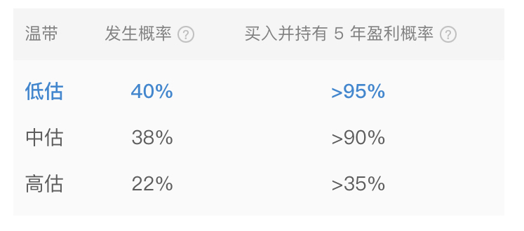

# “万一市场一跌，又不自由了咋办？”

**发布时间**: 2022-08-03 09:05:25

**原文链接**: [http://mp.weixin.qq.com/s?__biz=MzUzNjE3NzQ3Nw==&mid=2247490683&idx=1&sn=8d0c39e0a9fdfcd32de658a289e5de23&chksm=fafb6251cd8ceb475be74c8ba6c06a4a34f14a1db4a4a646baecc9b83e05354a954c13a854e0#rd](http://mp.weixin.qq.com/s?__biz=MzUzNjE3NzQ3Nw==&mid=2247490683&idx=1&sn=8d0c39e0a9fdfcd32de658a289e5de23&chksm=fafb6251cd8ceb475be74c8ba6c06a4a34f14a1db4a4a646baecc9b83e05354a954c13a854e0#rd)

---

最近二刷 E 大推荐书单，读到我最喜欢的一本书《邻居的百万富翁》。有个我在第一次读没注意到的细节：

> 同样的资产状况，继承家业的企业主，和从头创立一家公司的企业主，前者对未来的焦虑程度大约是后者的 4 倍。

这些年我和不少早期抓住互联网红利的小伙伴们聊天，也分享过他们的故事，发现 1000 万净资产是个挺有代表性的数字。

但我也发现，大家的财富数量相当，对未来的焦虑程度却差异巨大。有的潇洒自由（然后变成了我的学习样本 ），有的依然对未来充满焦虑，甚至更甚。

看到这样的两组前后对比，想到以前 E 大谈过关于“有效经历”的话题。

**大部分人有的只是经历，而不是有效经历** 。

把一件事儿从开始、到过程、再到最后的经历，每一步都想得明明白白，这其实很重要。

有过一次有效经历，再考虑类似的问题就会淡定许多。因为我们已经在上次的有效经历中积累下了完整的工具箱，剩下的只是见招拆招。

……

最近有小伙伴问我“如果以后好不容易攒够了财务自由本金，结果市场一回撤、又不自由了咋办？”

我觉得这种焦虑，担心攒够本金以后可能的问题，和前面继承家业的企业主们看未来的焦虑有点像。**问题的答案也许不在攒够本金之后，而是先踏踏实实经历一次攒够本金的过程** 。

1、根据有知有行小伙伴们整理的数据，积累本金的这一路我们大约会有 20% 的时间处在高估的位置 👇

虽然这个比例并不高，但这个时期大家资产快速膨胀，反而大部分小伙伴“攒够了财务自由本金”都发生在这个时期。

但这个时期的有效经历也会告诉我们硬币的另一面——在这样的环境下“攒够了财务自由本金”常常是一种假象，我们的资产中因为高估而掺杂了泡沫。

这样的有效经历会教给我们两件事儿——放低预期 + 管理风险。

这构成了答案的 1/5。

2、这一路我们还会有大约 40% 的时间处于市场低估的位置，经历至少一次资产大幅回撤和缩水。

但换个角度，这也可以是对财务自由本金的一次有效检验。不要有了钱焦虑回撤怎么办，而是一面控制风险不要坐以待毙，另一方面放低预期、主动等待回撤低估到来。因为这个时期我们的资产才最“实诚”。

现在我们拥有了答案的 3/5，**学会识别个人资产的水分，是否真的攒够了本金** 。

3、这一路我们也会经历市场不温不火来回震荡的时刻，A 股大约还有 40% 的时间处在这样的阶段。

而这份经历会告诉我们另一个事实——财务自由的重点是被动收入、而非本金。本金回撤，被动收入一定变少吗？其实不是，有时候反而还可以更多（昨天的文章有提前铺垫这个数据）

我们制定财务自由计划，总要先知道自己一年的开销，再知道自己目标的被动收入，最后，才是从被动收入目标反推出本金目标。不要走着走着只盯着本金，却忘了本来要做什么。

现在，再加上**和市场涨跌相对隔离的[被动收入体系](http://mp.weixin.qq.com/s?__biz=MzUzNjE3NzQ3Nw==&mid=2247488950&idx=1&sn=284d5309e8a8ad44266506b2322dfeb7&chksm=fafb6b9ccd8ce28ade296e6e1ab4091da302d86760c372236b8bb516245c361ca432a3f58148&scene=21#wechat_redirect)**，我们终于拥有了完整的回答。

……

很多关乎「自由以后如果……怎么办」的答案，不是来自攒够钱以后再思考，而是**来自我们还在积累财富时的有效经历** 。

如果焦虑未来，不如先踏踏实实把第一笔本金攒到手。

如果攒够了钱问题犹在，我们至少还拥有了更多解决问题的资源。

而更可能的情况是，等自己攒下了这笔钱，很多焦虑早已在过程中得到解答。

  * 财务自由：[我的财务自由实证之路](http://mp.weixin.qq.com/s?__biz=MzUzNjE3NzQ3Nw==&mid=2247490665&idx=1&sn=808fd19f399fdda01401db565d135980&chksm=fafb6243cd8ceb556a457ac23e79d5c68b475194ae4fa7a382fe4e700ec414a23b6f29de9efb&scene=21#wechat_redirect)

  * 投资笔记：[十年之约，躺赚不难](http://mp.weixin.qq.com/s?__biz=MzUzNjE3NzQ3Nw==&mid=2247490378&idx=1&sn=e333c766a1c4cf35c686e54cf60ac2c7&chksm=fafb6560cd8cec76604ef782e6fdfbd78272365e9c6afd5d7025803d1846caf4fee237e5d59c&scene=21#wechat_redirect)

  * 抵御风险：[6 月保险最推荐](http://mp.weixin.qq.com/s?__biz=MzUzNjE3NzQ3Nw==&mid=2247490480&idx=1&sn=0a4c6b3c94f5ca9c776b2aca85b2b6c0&chksm=fafb659acd8cec8ca03f1bf7b2096dc7689231bc67ad5d47959e5fd36dbbe7c4c0945379985e&scene=21#wechat_redirect)

  * 干货汇总：[财务自由路上应该了解的每一个问题](http://mp.weixin.qq.com/s?__biz=MzUzNjE3NzQ3Nw==&mid=2247489926&idx=1&sn=eac357cebcbfd7250828cdda88d9f122&chksm=fafb67accd8ceebaa1e750f129714bb000be9720a990a70c6fba6fc52fd3712014a58d699d6e&scene=21#wechat_redirect)

**风险提示** ：本文不构成投资建议，只是我个人投资中的观察和思考。大伙参考为主，投资最终还是要独立决策，毕竟我也可能是错的。