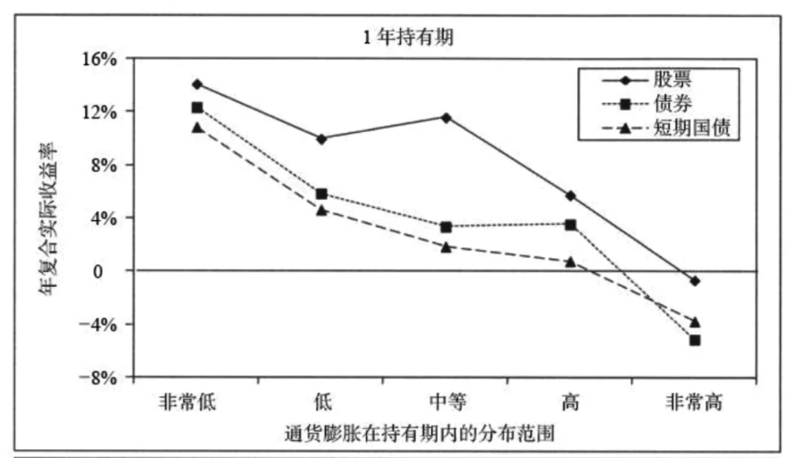

# 意外收获，托通胀的福 | 财务自由实证 #42

**发布时间**: 2022-09-07 09:52:45

**原文链接**: [http://mp.weixin.qq.com/s?__biz=MzUzNjE3NzQ3Nw==&mid=2247490826&idx=1&sn=4117ee1a5c72d34da526aad8faa2a1bd&chksm=fafb6320cd8cea36adfae83a07ce0490a1419dbe932c7cb941caea852d7b25afa8ff175f31bc#rd](http://mp.weixin.qq.com/s?__biz=MzUzNjE3NzQ3Nw==&mid=2247490826&idx=1&sn=4117ee1a5c72d34da526aad8faa2a1bd&chksm=fafb6320cd8cea36adfae83a07ce0490a1419dbe932c7cb941caea852d7b25afa8ff175f31bc#rd)

---

以前说起财务自由后通胀怎么办，我考虑的视角常常是如何对抗通胀，如何抵消不利影响。但实在没想到有一天，我居然会从通胀中收获了一点意外惊喜。

最近读到一篇关于通胀的文章，心情大好。

作者是我很喜欢的财务自由博主，Mr. Money Mustache，也是美国财务自由头号博主了。

有一句话补全了我对通胀的另一个视角：

> inflation is good for borrowers, neutral for investors, and it’s only bad for people who are either holding cash, or stuck with an income source that does not keep up with inflation.

通胀对于负债者是好消息，对于投资者是中性消息，只有对持有**过多** 现金和固定收益的人才是坏消息（注意是「过多」哈，现金和固定收益投资也有自己的价值。只是固定收益虽然规避了波动风险，但也失去了消化通胀的能力。这篇文章的链接我有附在文末）

这波欧美通胀对于消费和投资的影响我们都聊过，但负债这个角度我确实没想到。

通胀后，我们的负债实际上也跟着缩水了。比如这波欧美通胀大约 8%，通胀会慢慢传导到人们的收入上，工资会上涨。但房贷负债却不会跟着上涨，如果房贷利率也是锁定的，相当于负债也跟着缩水了 8%。

读到这里，我默默给自己还有 9 年、利率不到 1% 的房贷算了笔账。突然有点开心呢，没想到有一天还能占到大通胀的便宜

……

那这是不是说明，为了预防通胀我们可以给自己来点债务呢？

其实也不是。因为如果不是通胀，而是反过来，利率下降、工资增速放缓，那最受伤的反而就是负债者了。

就像考虑投资要上涨下跌都舒服，考虑通胀问题也一样，需要把硬币的另一面也考虑进来。

“好”的负债应该满足至少几个前提——**应该是长期债务、利率较低且锁定、负债率合理** 。

这样一来才是不管通胀是否发生都会比较舒服的状态。

……

最近我在重读一些书，自己的经历在变化，每次读到的东西也不同。

书没变，但在如今通胀的背景下，这次读下来发现自己对通胀的理解明显更多了些。

比如按理说投资可以抗通胀，但为什么大通胀发生后的一年，投资常常会下跌 👇

图来自《股市长线法宝》

经历过这波通胀我知道了，因为人们会本能地捂紧口袋、消费更加谨慎。

比如德国这边有个零售业的数据，虽然通胀了这么多，但零售总额其实几乎没变，只微增了 0.7%。相当于短时间大家一起变穷了。

但是，**如果我们用更长期的维度考虑问题，通胀对于股票投资其实是中性的** 👇 发生大通胀的年份和没有大通胀的年份，股票类投资再**剔除通胀** 以后的真实收益是差不多的

通胀涨了、工资会涨，拥有资产最终也会抵消通胀的影响。

“通胀对于投资者是中性的”——不过应该补充一点，**但投资消化通胀的影响可能需要一些时间** ，还是要耐心一些。

……

很多焦虑通胀的人会拿以前的物价和现在的物价比，比如会告诉你现在大米比 40 年前已经涨价了 16 倍。

但如果把我们的工资收入增长也考虑进来，却会看到相反的局面。

  * 1978 年全国职工平均收入是 51 元，一个月工资能买 275 斤大米；

  * 2020 年全国职工平均收入是 6000 元，一个月工资能买 2000 斤大米了。

购买力增加了 7 倍。

我们每个人自己也都是一笔资产，一笔人力资产。

把投资理财做好，好价格持有好资产；用好自己的时间和精力，保护好自己的人力资产，就不用太担心通胀。

之前聊如何投资抗投资时我们有说：

> 人们总喜欢问，通胀来了怎么投资？
> 
> 但实际上只要原原本本地把投资做好，它们自然就会发挥出抗通胀的作用。

后来发现，不仅投资如此，生活也是如此。

想起之前听过的一句话——**吃好、睡好，保持身体和心理健康，这足够战胜大多数困境。但反过来，难道没有困境你就不应该这样吗？**

只关注重要且紧急的事儿，生活里就会有越来越多紧急的任务。

把重要不紧急的事儿做好，久而久之，重要且紧急的事儿就会越来越少找上我们。

最后链接一下之前两篇聊到通胀的文章：

1、[赶上百年不遇的欧洲大通胀](https://mp.weixin.qq.com/s?__biz=MzUzNjE3NzQ3Nw==&mid=2247490412&idx=1&sn=0cfee1382972c3f49c0447e85924412d&chksm=fafb6546cd8cec509d7a7bddfd1bd851f50392621627efba829a923cb4f8c8514268d429b332&scene=21#wechat_redirect)。这是我作为消费者的视角，观察欧美通胀对生活的影响。发现通胀对生活的影响没有看起来那么大。

2、[如何投资抗通胀](https://mp.weixin.qq.com/s?__biz=MzUzNjE3NzQ3Nw==&mid=2247490423&idx=1&sn=ce96cfb1644380826846c69300b5c3b6&chksm=fafb655dcd8cec4b97334572ff964e4ac19c8e1fb4b8dc4b6a934b6ae2ce2eb3f87f0cf2729a&scene=21#wechat_redirect)。好资产大都有抗通胀属性，所以正确的问题不是“通胀来了怎么投资”，而就是原原本本地，如何做好理财投资。

* * *

### 计划进度更新

最后是例行更新我的计划进度。

**普通人通过工资理财也能实现财务自由** ，这是这些年我一直在践行的理念。从最初懵懵懂懂到 2017 年制定具体的财务计划，再到如今渐渐靠近终点，已经走了五六年。

为了能够更加透明、中立地实证普通人财务自由的可能性，从 2019 年开始我决定公开自己的财务进度，成为这个系列内容「财务自由实证」。

不追求大富大贵，但求能够不再纠结生计这些琐碎问题，在重大选择面前获得更多的人生选项，不再瞻前顾后。

有兴趣参考这个实证的朋友建议先看看之前的引导篇，[制定自己的财务自由计划](https://mp.weixin.qq.com/s?__biz=MzUzNjE3NzQ3Nw==&mid=2247484500&idx=1&sn=c04c3de1a1231bef25bb4cda773c00ff&scene=21#wechat_redirect)、[一起财务自由](https://mp.weixin.qq.com/s?__biz=MzUzNjE3NzQ3Nw==&mid=2247484480&idx=1&sn=258e8dd4976c7d3c324ed89b90904d14&scene=21#wechat_redirect)。以往的干货精华也都有汇总 👇

  * [全都安排好了，自由路上我们会遇到的每一个问题](http://mp.weixin.qq.com/s?__biz=MzUzNjE3NzQ3Nw==&mid=2247489926&idx=1&sn=eac357cebcbfd7250828cdda88d9f122&chksm=fafb67accd8ceebaa1e750f129714bb000be9720a990a70c6fba6fc52fd3712014a58d699d6e&scene=21#wechat_redirect)

  * [我的第一本书，整理财务自由方法论](https://mp.weixin.qq.com/s?__biz=MzUzNjE3NzQ3Nw==&mid=2247486809&idx=1&sn=8a80c493837ee044c5d55e0a423507d2&scene=21#wechat_redirect)

  * [一期访谈](http://mp.weixin.qq.com/s?__biz=MzUzNjE3NzQ3Nw==&mid=2247487473&idx=1&sn=10a891429291e78dea82b4df34e773f3&chksm=fafb71dbcd8cf8cdb15f114d6637bc6476a2803f9f0803dcbb4d91c1e68b5cc706c3dc55358b&scene=21#wechat_redirect)和[一期播客](http://mp.weixin.qq.com/s?__biz=MzUzNjE3NzQ3Nw==&mid=2247489401&idx=1&sn=a613497a5d6fdc3325d0424b9a78063e&chksm=fafb6953cd8ce045481121812b61b04f62dfe09a07b785991fc4cdd679bc9af13665d4c0ce62&scene=21#wechat_redirect)聊聊我的经历和观念

我给自己定下的目标是 30 岁前积累到**  家庭年度开支的 10 倍**（结果现在攒到了 20 倍 ✌️），作为创造被动收入的本金。依靠这些本金实现长期 10+% 的年化投资收益就可以实现财务自由，不再依赖上班工资生活，有底气去选择自己真正想做的事儿。

（我的具体目标数字是 500 万，但**这个数字大家没必要参考** ，还是要以自己的生活开销为准）

财务自由路上一些重要节点：

  * 2017 年，计划正式开始，同年获得家人的认可和支持；

  * 2018 年，A 股熊市大跌，出现“钻石坑”机会；

  * 2019 年，开始财务自由公开实证（就是现在大家看到的这个系列）；

  * 2020 年，新冠股灾，自由之路上的又一个关键机会；

  * 2021 年，[自由目标基本达成](http://mp.weixin.qq.com/s?__biz=MzUzNjE3NzQ3Nw==&mid=2247489120&idx=1&sn=e5c5bf6d51914c212c228bc6f42346dc&chksm=fafb684acd8ce15c27cd508a67d57573f4acbeced75f805ef271b4efcf42cf54b363e5f93fcf&scene=21#wechat_redirect)，开始向新的节奏过渡；

  * 2022 年，遭遇自由后的第一次账户大幅回撤，但也是港股 6 年后、A 股 3.5 年后的又一次钻石坑，期待后续……

### 实证账户更新

注：记账工具为[有知有行](http://mp.weixin.qq.com/s?__biz=MzUzNjE3NzQ3Nw==&mid=2247487794&idx=1&sn=b9db83140ef56b777315a5e415954736&chksm=fafb6f18cd8ce60eeebe855dcd793f173a5589e51657877fb9e8a2fff629eeb17688a40e2766&scene=21#wechat_redirect)，每次都有小伙伴问。

……

为了跟踪财务自由状态的**可持续情况** ，[从第 30 期开始](http://mp.weixin.qq.com/s?__biz=MzUzNjE3NzQ3Nw==&mid=2247489372&idx=1&sn=2118934ef05d930f50d2510ff6642cb1&chksm=fafb6976cd8ce06042f2bb8d1ed950a95262d11451fe116440e1ff84ca49c6fdae8a5d664a6d&scene=21#wechat_redirect)我琢磨出了一个新的工具——同时跟踪「累积家庭开支」和「累积被动收入（投资收益）」曲线。关注两条线的趋势变化，如果投资收益曲线长期趋势在家庭开支上方，就说明这个状态是可持续的。

收益曲线正在努力回到开支曲线上方 👇

……

当前在我[投资武器库](https://mp.weixin.qq.com/s?__biz=MzUzNjE3NzQ3Nw==&mid=2247490261&idx=1&sn=f1c66e32af2f30ff4d440d776d6df76b&chksm=fafb64ffcd8cede997bcb406e342a53ec9f474d10ca533a5a30dbcfbfcd01e5e4aa58f8aff1e&scene=21#wechat_redirect)中的位置和新增的投资 👇 珍惜现在市场还算低估的时期，**低估时期我们的工资更值钱** 。

最后要提醒大伙，财务自由的投资和被动收入虽然看起来性感，但「因上努力，果上随缘」。本金和收益只是自由路上的「果」，**主业努力多赚钱、理性消费少挥霍，以此积累本金，再加上不被短期涨跌干扰、坚持投资才是背后的「因」** 。

投资复利只是我们获得被动收入的方式，而不是致富的秘密。

在财务自由实证的最初两年，我写得最多的也不是如何投资，而是如何**少在投资上花时间，好能多花时间关注主业** ，同时理性控制开销，尽快攒钱。

假如有 10 万本金，就算投资翻倍也才赚了 10 万。而投资翻倍极其困难，巴菲特的年化收益也才 20%。相比之下，在职场上努力提升，让收入再增加 10 万则要靠谱得多。

对财务自由而言，“钱生钱”做到 80 分足矣，剩下的精力还是应该关注赚钱和省钱这些“人生钱"。