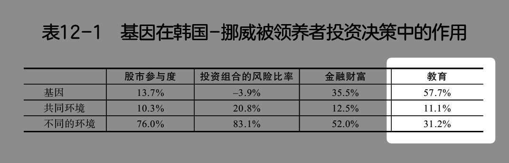

# 娃不是我的吞金兽，养娃也可以财务自由（坐标杭州）

**发布时间**: 2022-09-14 09:13:05

**原文链接**: [http://mp.weixin.qq.com/s?__biz=MzUzNjE3NzQ3Nw==&mid=2247490857&idx=1&sn=af98c9c445490f65db09000bc044ae53&chksm=fafb6303cd8cea15c5b3c99eeb19da81edc0e5cda1b5e4031ff63a837f67ff084a0a3b6f6d31#rd](http://mp.weixin.qq.com/s?__biz=MzUzNjE3NzQ3Nw==&mid=2247490857&idx=1&sn=af98c9c445490f65db09000bc044ae53&chksm=fafb6303cd8cea15c5b3c99eeb19da81edc0e5cda1b5e4031ff63a837f67ff084a0a3b6f6d31#rd)

---

财务自由路上我一直有观察到一个很反差的对比。

一方面，我在聊自己的财务自由计划时总会收到留言，“你没孩子吧，有了孩子这些钱肯定兜不住”。或者有小伙伴会问我，已经退休的朋友们是不是都不婚不育？

但另一方面，我读过调查问卷、也看过很多财务自由博客，其实大部分人还是买房、养娃“正常生活”。

也给大家分享过[一位有点传奇的奶爸](http://mp.weixin.qq.com/s?__biz=MzUzNjE3NzQ3Nw==&mid=2247488257&idx=1&sn=6147416bbf40cd1847469bea700e6cfe&chksm=fafb6d2bcd8ce43d7f0d91c8d737c7b79ca727eba0d8b2e1865f5db33b411f3664f6ea9c4ad4&scene=21#wechat_redirect)，特别喜欢孩子，算上领养家里有 14 个孩子。他的收入也没有高到离谱，最后还比计划**提前了 6 年** 实现财务自由。当时这张全家福惊到了不少小伙伴 👇

> 最后他们还贴了一张 7 年后的全家福，现在是 14 个孩子，8 个孙子孙女了 😅
> 
>

我想，这份反差背后一定有哪些角度还没被我们看到。

……

感谢小伙伴 @拾锦 的两条留言，现在我有个机会近距离观察了～

我很好奇：

  * 上半年家庭开销才 2 万 8，**平均每月不到 5000** ，咋实现的？

  * 养娃时怎么规划消费、执行预算？

  * 养娃教育到底需要规划多少预算？

  * 学区房买和不买之间，还有没有横跨一步，生活和学区房都想兼顾的思路？

这次我也尝试了不一样的分享形式，用播客录制了我们聊天的全过程，好能给大家保留下更多的细节～

我节选了一部分收听地图 🗺️ ，我们聊到的话题 👇

04:16 拾锦在小红书上分享自己的财务自由计划，被怼到自闭

11:04 设想的财务自由生活 VS 真实的财务自由生活

13:36 生娃前和生娃后的消费开支有什么变化？

14:49 带着财务自由实习生的心态来观察生活

30:09 每月家庭花销大概 5000 元，拾锦是怎么做到的？

39:06 一个买学区房的新思路

50:51 算好孩子的教育开支后，我发现比想象中少很多

### 后记

当时聊到教育开支，我问拾锦担不担心自己规划的教育预算用完了，但还没达到预期成果？

拾锦反问我一句——**如果我的孩子一定要花很多钱才能在教育上有所成就，那是不是说明他其实不适合这条路？** 不如多给自己几个选项。

这个反问在我意料之外，但细想想又觉得很有道理，不禁感慨她的视角与豁达。

正巧前两天在《投资心理学》中[读到的这个数据](http://mp.weixin.qq.com/s?__biz=MzUzNjE3NzQ3Nw==&mid=2247490844&idx=1&sn=d15e55c2b849cc6c85a525f1e60227c7&chksm=fafb6336cd8cea2048cfe13838af0ef83b33dda2f8497af6b390ddef527f22e12b0a7665bcc0&scene=21#wechat_redirect) 👇

研究显示一个人在教育上的选择，57.7% 在基因中就已经决定了，然后 31.2% 来自他在**家庭之外** 的独自探索，最后 11.1% 才来自父母、家庭对他的影响。

我意识到，缓解对教育的焦虑也许不是一句豁达和放下就能解释的。

就像我们在播客中聊到的，“焦虑的反义词是具体”，帮我们放下焦虑的并不是心灵修炼，而是具体地了解问题的真相。意识到父母能力的上限，预期自然就降下来了，也避免了无效的折腾和浪费。

再想到投资。虽然投资到最后可能 70% 都是心理学和人性，但一位心理医生却并不会因此更擅长投资。对我们帮助最大的依然还是具体地了解各种投资的方法与事实。

最后殊途同归。

财务自由路上的几座大山——投资、买房、养娃。

前两座山，[这些年我们已经陆陆续续分享了很多思考](http://mp.weixin.qq.com/s?__biz=MzUzNjE3NzQ3Nw==&mid=2247489926&idx=1&sn=eac357cebcbfd7250828cdda88d9f122&chksm=fafb67accd8ceebaa1e750f129714bb000be9720a990a70c6fba6fc52fd3712014a58d699d6e&scene=21#wechat_redirect)。这次补全第三个关注不多的空白领域。

对养娃有焦虑的小伙伴们不妨听听这期播客，希望能帮大伙放下一些对于养娃的焦虑 👇

