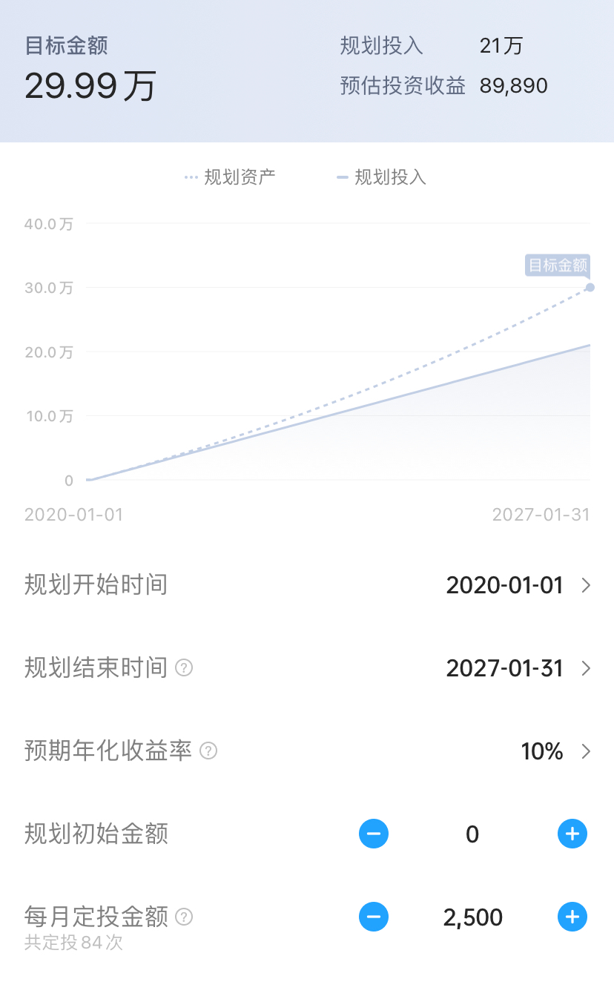

# 财务自由一定要有很高的收入吗？

**发布时间**: 2022-09-16 10:11:32

**原文链接**: [http://mp.weixin.qq.com/s?__biz=MzUzNjE3NzQ3Nw==&mid=2247490873&idx=1&sn=d964e596f43b3998fe46d9ba3c715a26&chksm=fafb6313cd8cea05a0a054fe5d6ed95ead21a83206b2000cfb90083d87052c31dcb8a5959e5f#rd](http://mp.weixin.qq.com/s?__biz=MzUzNjE3NzQ3Nw==&mid=2247490873&idx=1&sn=d964e596f43b3998fe46d9ba3c715a26&chksm=fafb6313cd8cea05a0a054fe5d6ed95ead21a83206b2000cfb90083d87052c31dcb8a5959e5f#rd)

---

提醒：今天的文章会涉及一些公式计算，不复杂但需要一点注意力。大伙可以挑个状态好的时间阅读～

经常有小伙伴会问我，财务自由是不是一定要有很高的收入或者很大一笔初始本金才行？我们之前有聊过「不用初始本金规划财务自由」这个话题，今天再来补上「收入」这个视角。

### 财务自由和钱多钱少没有直接关系

一提起财务自由很多人会想到，要有车、有房、养得起娃，女生可能还会想到最新款的包包，男生可能会想到各种电子产品，换言之，要一大笔钱。当然，一大笔钱要来自一大笔收入。

但我们不妨反过来考虑这个问题，**我们为什么现在感到不自由呢？**

现在是北京时间 16 点，你为什么不能申请提前下班走人？

今天是周五，早上为什么没能想赖床就赖床？

现在是九月中，为什么不能现在就休假旅行、避开十一高峰？

只是因为手机不够新、包不够贵、房子不够大吗，其实都不是。我们感觉自己不自由常常只是因为必须在工作日把自己“锁在”工位上，需要每月的工资才能养活自己，仅此而已。财务自由和有多少钱、能买得起多少东西没有直接关系。

财务自由只是个很简单的公式，**我们能否仅依靠被动收入覆盖生活开销甚至超过工作收入。**

而更关键的点在于，**收入越高的人，实现财务自由所需的本金门槛也在同步提高** 。

举个例子：

  * A，生活在一线，月收入 5 万，每个月的生活开销是 2.5 万

  * B，生活在小城市，月收入是 5000，每个月的生活开销是 2500

他们谁会更快实现财务自由？

答案是一样快。

为了方便理解我们先考虑一个简单情况，A 和 B 一起存钱，暂时不考虑存钱过程中的投资问题，也暂时不考虑通胀，只是简单的储蓄。

10 年后：

  * A 会存下 300 万（2.5 万 x 12 个月 x 10 年）

  * B 会存下 30 万（2500 x 12 个月 x 10 年）

如果他们这个时候开始投资，能获得 10% 的年化收益，他们的被动收入分别是：

  * A 的被动收入是年均 30 万，刚好等于他的生活开销；

  * B 的被动收入是年均 3 万，但也刚好等于他的生活开销。

他们会同时获得财务上的自由。

不过现实情况会比这个复杂一些，我们会面临通胀、在存钱过程中也会有收益，把这些更复杂的因素考虑来。

根据全球范围的统计数据，资本市场投资收益在**扣除通胀以后** 大约是年化 7% 的水平。因为 A 股波动大，会有超额收益，所以我会预期 10% 的年化收益。

如果我们从头开始，一边存钱一边投资，那么**这 10 年的时间大约可以缩短到 7 年** 。有行记账的小伙伴们有开发这个规划功能，大伙可以根据自己的情况参考看看 👇

总的来说，财务自由并不取决于我们收入数值的高低，而是取决于我们能从收入中存下多少比例。

我在《工薪族财务自由说明书》这本书中有画过这张图（最初的启发来自《不上班，也有钱》的作者 Winnie）👇

决定财务自由的是储蓄率（每个月攒下的钱 ÷ 每个月到手的税后工资），而不是收入的高低。

### 高收入 ≠ 高自由

可能有的小伙伴会说，不对啊，收入高的人存钱肯定也更容易。我把开销从 2500 减到 1500 可能难如登天，但从 2 万 5 减到 1 万 5 就容易多了。

但是，问题其实没你想得这么简单。

首先我认同这个逻辑——在财务自由目标不变的前提下，提高收入确实更有利于财务自由。我在给大家分享自己的财务自由规划时，提高收入也是其中一环。毕业找工作时也是按照上学时规划的财务自由目标来筛选工作机会。

不过有个问题常常被忽视，很多人觉得，我提高收入以后理所当然就能存下更多钱了。但现实并非如此，**有相当一部分人收入提高以后存钱反而更难了** 。

之前有小伙伴问我说，ta 也想实现财务自由，但一想到要储蓄存钱，只花掉 1/3 的收入就觉得生活都不快乐了。

我给他算了一笔账，我说：

你看，你年收入大约 30 万，花掉 1/3 就是大约每年花 10 万，每月花 8300。

那你想想，有多少家庭可能一个月收入本来就只有 8000。他们之中肯定不少人也都生活得很幸福、很快乐，甚至看到他们的生活你会觉得羡慕。

现在问题来了，他们能用 8000 元的收入过上这样的生活，你的收入是他们的三倍，理论上拥有的资源更多、安全感更多，为什么花同样的钱生活却觉得更不快乐、更不能忍了。

**为什么你的收入变高了，过好生活、享受当下的能力反而变差了呢？**

人的本性不是钱多了就会存起来，而是钱多了，然后想要更多。所以才会有“高收入穷人”这个概念，收入很高，但却很难存下钱。

如果现在觉得自己很穷，等收入上去了，有没有可能变成一个收入更高但依然很穷的人？

如果我们只是觉得存钱的速度不够快，那有可能是收入的原因。但如果我们完全存不下钱，那一定是自己的问题。

如果你觉得这只是个例，不如看看这份当初专门为银行财富管理部分统计的高净值人群画像——最擅长积累财富、财务上最自由的人，其实不是很多人眼中的高收入行业，比如医生、律师，反而有不少工程师、教师这些低调职业。

行业过于光鲜，人人都知道你收入高，对财富积累反而不利。这份数据后来成为了指导个人积累财富的经典，《邻家的百万富翁》。

也许这也能成为理解「不要露富」的另一个角度。

### 总结

财务自由并不一定要很高的收入，因为自由本就是一个相对的标准。收入越高，对财务自由的预期也往往越高，也反过来提高了自由的门槛。

真正决定自由的不是我们的收入高低，而是我们的储蓄率。我们能从收入中积累下越多的财富，才会越自由。

提高收入可以帮助我们更快达成自由目标，也非常值得在做财务自由计划时认真考虑。但不要忘记前提条件，只有当高收入转化为更多的积累时，才会更自由。

最后链接两篇旧文——[不靠初始本金规划财务自由](https://mp.weixin.qq.com/s?__biz=MzUzNjE3NzQ3Nw==&mid=2247488884&idx=1&sn=840d596e2867e383644e3fd26a0631de&chksm=fafb6b5ecd8ce248ddcceee8678986285693de8181269bad008a4f063e71208f9e5aa6923428&scene=21#wechat_redirect)，[ 闷声致富的低调职业 ](https://mp.weixin.qq.com/s?__biz=MzUzNjE3NzQ3Nw==&mid=2247486433&idx=1&sn=89d0c834bc1336c8097f3633b9413059&scene=21#wechat_redirect)。

  * 财务自由：[我的财务自由实证之路](http://mp.weixin.qq.com/s?__biz=MzUzNjE3NzQ3Nw==&mid=2247490826&idx=1&sn=4117ee1a5c72d34da526aad8faa2a1bd&chksm=fafb6320cd8cea36adfae83a07ce0490a1419dbe932c7cb941caea852d7b25afa8ff175f31bc&scene=21#wechat_redirect)

  * 投资笔记：[十年之约，躺赚不难](http://mp.weixin.qq.com/s?__biz=MzUzNjE3NzQ3Nw==&mid=2247490378&idx=1&sn=e333c766a1c4cf35c686e54cf60ac2c7&chksm=fafb6560cd8cec76604ef782e6fdfbd78272365e9c6afd5d7025803d1846caf4fee237e5d59c&scene=21#wechat_redirect)

  * 抵御风险：[8 月保险最推荐](http://mp.weixin.qq.com/s?__biz=MzUzNjE3NzQ3Nw==&mid=2247490783&idx=1&sn=b95df2de16e099c9c33e600494f3c167&chksm=fafb62f5cd8cebe3d0bacf5aad4b5e2c4f893ad6f847bdd435ccd1df04f77afd2444bf52d0c8&scene=21#wechat_redirect)

  * 干货汇总：[财务自由路上应该了解的每一个问题](http://mp.weixin.qq.com/s?__biz=MzUzNjE3NzQ3Nw==&mid=2247489926&idx=1&sn=eac357cebcbfd7250828cdda88d9f122&chksm=fafb67accd8ceebaa1e750f129714bb000be9720a990a70c6fba6fc52fd3712014a58d699d6e&scene=21#wechat_redirect)