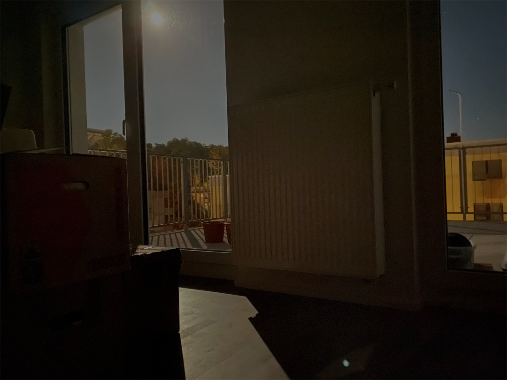
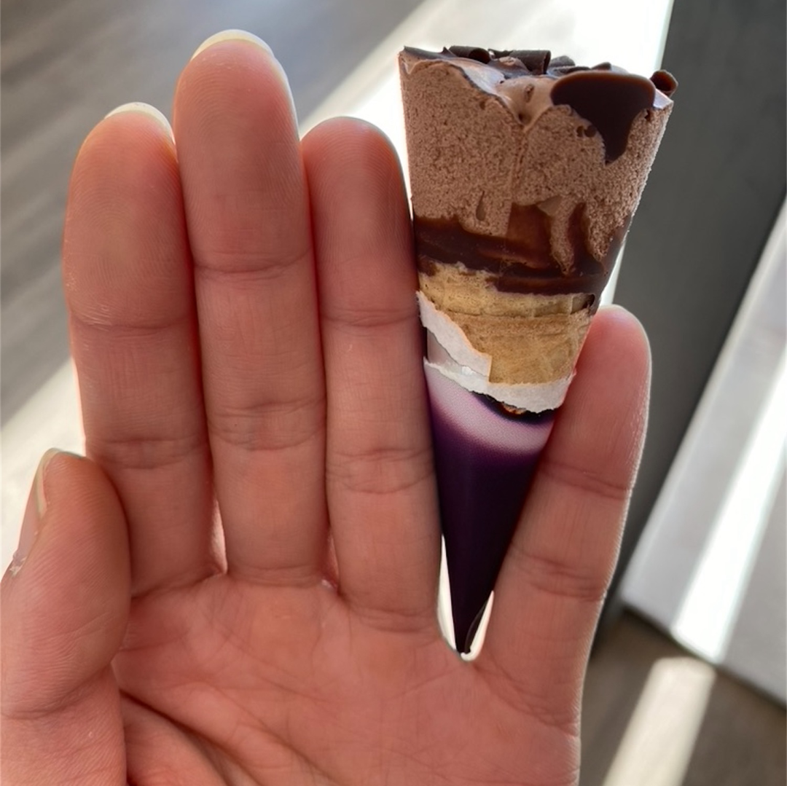
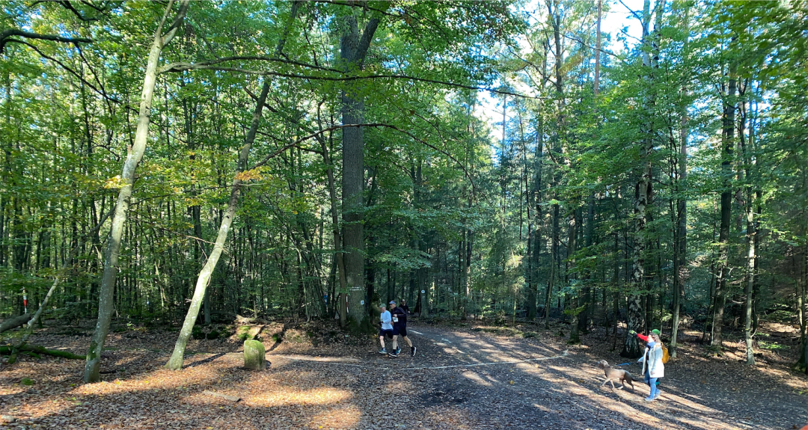
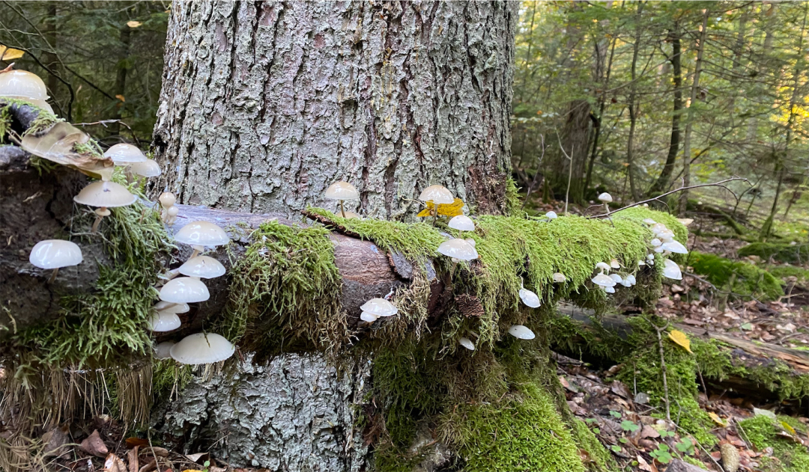
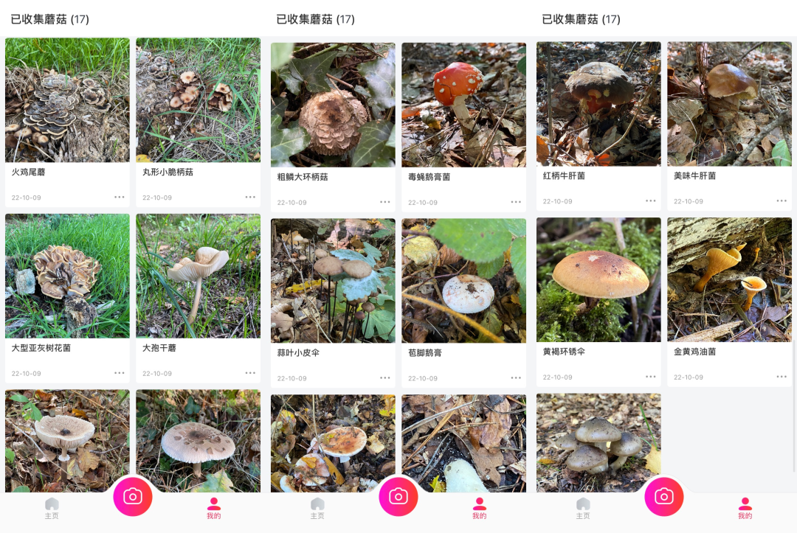
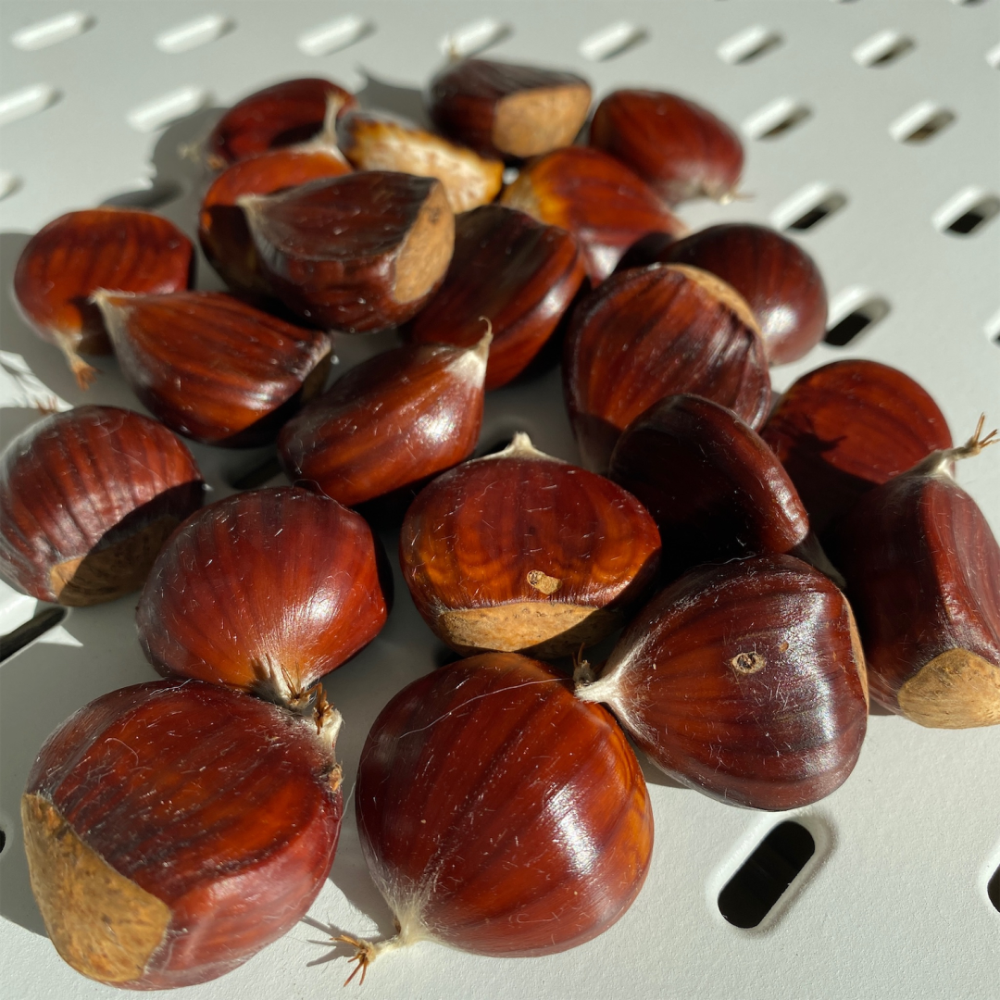

# 我搬去二线了～

**发布时间**: 2022-10-10 07:46:29

**原文链接**: [http://mp.weixin.qq.com/s?__biz=MzUzNjE3NzQ3Nw==&mid=2247490915&idx=1&sn=313fba2e0a82a878f0188795ffe1900f&chksm=fafb6349cd8cea5fdfb9a63648453317d1970941f8c470f7bf697d07cca4054fca66f1dc5fac#rd](http://mp.weixin.qq.com/s?__biz=MzUzNjE3NzQ3Nw==&mid=2247490915&idx=1&sn=313fba2e0a82a878f0188795ffe1900f&chksm=fafb6349cd8cea5fdfb9a63648453317d1970941f8c470f7bf697d07cca4054fca66f1dc5fac#rd)

---

好久不见，非常想念 😊

写这篇文章时我终于结束了来回 1000 多公里的奔袭，带着全部家当待在一座完全陌生的二线城市的新家了。

虽然各处百废待兴，十几个搬家纸箱还等着就位

这只是一面，后面还有两排

还没有厨房，只是暂时把洗碗机和电器接上确保生存（太丑了，没脸发 🤣）

好些房间还没有灯，过了好一段时间日出而作、日落而息生活。没灯以后突然发现原来月亮这么亮：

但肉身和灵魂已经确确实实地到了二线。

现在想想还有点不真实的感觉。一座从没来过的城市，只是看了周边地图觉得位置很方便，看到当地人口在净流入（说明城市有吸引力，不是因为人跑光了房价才便宜），再看到当地比一线三折的房价，我们就这么杀过来。

有点像刚上大学，只是跟着学校的名字，就选择到一个新的环境重新生活。

……

说起二线，经常有观点觉得二线的资源不行，不如一线。

但我一直持相反的看法，一个城市拥有的总体资源，和生活在城市里的自己所能触达的资源是两回事儿。

如果作为一个普通人：

A：在一线只能住在郊区或者卫星城，去哪都不方便。因为高房价，在位置、户型上反复纠结牺牲，让房贷吃掉每个月的大部分收入。

B：能在二三线线自己喜欢的地段买个各方面都满意的房子，每个月还能存下相当收入用于投资，或者是储蓄应对未来生活的变化和意外。

到底谁能在需要时获得更多资源呢？

在德国这些年，我和也太**一共搬过 6 次家** 。从一线市区到一线卫星城，再到二线。目前为止，在新家生活过 2 周以后，感觉二线最香：

  * 在一线时，因为房价不能住在很核心的位置，加上城市规模大、资源太分散，反而去哪都不方便。最近的超市都得坐公交……

  * 在一线卫星城，麻雀虽小五脏俱全，像日常超市、医生、学校、上班这些都变近了。但因为边上一线城市的“吸血效应”，很多活动安排、大型医院、商场都会优先考虑一线城市。偶尔还是要往一线跑。

  * 相比之下二线是最均衡的，自成体系，城市规模也比较适中。

而且我发现，**当房价不再成为选择住址的障碍，生活简直太方便了** 。

### 跟超市做邻居

我和也太安家的标准是「可以步行 15 分钟到大部分日常会去的地方」，最后选在了靠近超市聚集地、距离市中心大约 15 分钟步行距离的城市边缘。

下楼过一条马路就是三家连锁超市。

德国虽然各个城市的超市价格没什么区别，但**住得近一点更容易买到各种打折商品** 。我们已经摸清了超市打折的规律——每天早上 8 点前给临期生鲜贴 7 折标签，晚上 18 点会准时给所有面包、甜点贴全场 5 折。准时去报道 

（因为买东西太方便，我又被禁止独自逛超市了，因为总能成功避开正确答案。这是我的最新成果，拆开包装的瞬间我都惊呆了

### 住在森林隔壁

在生活便利之外，城市边缘给我最大的意外惊喜就是自然环境了。从我家到森林走路居然不到 10 分钟，网上找到好多徒步路线都是从我家附近开始的。

赶上阳光洒下来很舒服，吸氧吸到饱偶遇一场越野跑比赛

很好玩的是我发现这边盛产各种蘑菇（有点像云南？）。遛狗路上正遇到一个老奶奶抱着一大捧蘑菇往家走，一个蘑菇有我脸那么大。后来还发现离我家不远就是当地的蘑菇协会。

所以昨天散步我们有意找了一下

一路收集了 17 种蘑菇品种（👇 照片都是也太拍的，是不是很有百科插图的感觉）

不过自己采蘑菇风险收益比太低了，猜对了吃不了几口，猜错了可能全家躺板板。我就学习学习，不打算尝试 😂

后来我们找到了更适合吃的目标——继当年捡板栗误捡到了有毒的马栗以后，我们找到了真正的板栗树～

刚从树上掉下来的板栗，煮完有点“树叶”的清香味（结论：味道不错，下次……可能不会再捡了 ）

不过说了这么多，我搬家以前最渴望的点其实很简单，「从明天早上开始，我终于又能在自己家看到了初升的太阳了」。住了 1 年朝北的房子，又住了 4 年朝西的房子以后，我可太想念这种感觉了。

现在是德国 7 点多，在发文中等待日出～

总而言之，虽然这趟长途搬家真是辛苦，但感觉很值。期待未来的种种惊喜 

  * 财务自由：[我的财务自由实证之路](http://mp.weixin.qq.com/s?__biz=MzUzNjE3NzQ3Nw==&mid=2247490826&idx=1&sn=4117ee1a5c72d34da526aad8faa2a1bd&chksm=fafb6320cd8cea36adfae83a07ce0490a1419dbe932c7cb941caea852d7b25afa8ff175f31bc&scene=21#wechat_redirect)

  * 投资笔记：[十年之约，躺赚不难](http://mp.weixin.qq.com/s?__biz=MzUzNjE3NzQ3Nw==&mid=2247490378&idx=1&sn=e333c766a1c4cf35c686e54cf60ac2c7&chksm=fafb6560cd8cec76604ef782e6fdfbd78272365e9c6afd5d7025803d1846caf4fee237e5d59c&scene=21#wechat_redirect)

  * 抵御风险：[8 月保险最推荐](http://mp.weixin.qq.com/s?__biz=MzUzNjE3NzQ3Nw==&mid=2247490783&idx=1&sn=b95df2de16e099c9c33e600494f3c167&chksm=fafb62f5cd8cebe3d0bacf5aad4b5e2c4f893ad6f847bdd435ccd1df04f77afd2444bf52d0c8&scene=21#wechat_redirect)

  * 干货汇总：[财务自由路上应该了解的每一个问题](http://mp.weixin.qq.com/s?__biz=MzUzNjE3NzQ3Nw==&mid=2247489926&idx=1&sn=eac357cebcbfd7250828cdda88d9f122&chksm=fafb67accd8ceebaa1e750f129714bb000be9720a990a70c6fba6fc52fd3712014a58d699d6e&scene=21#wechat_redirect)