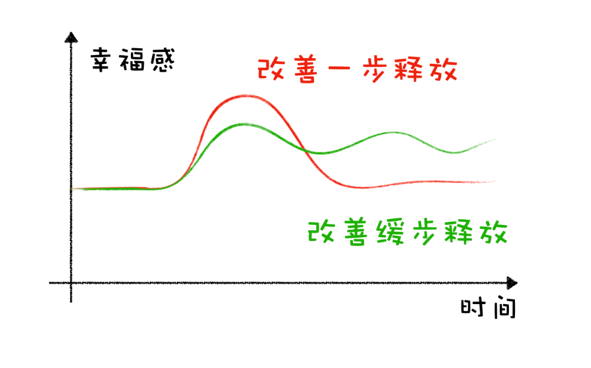
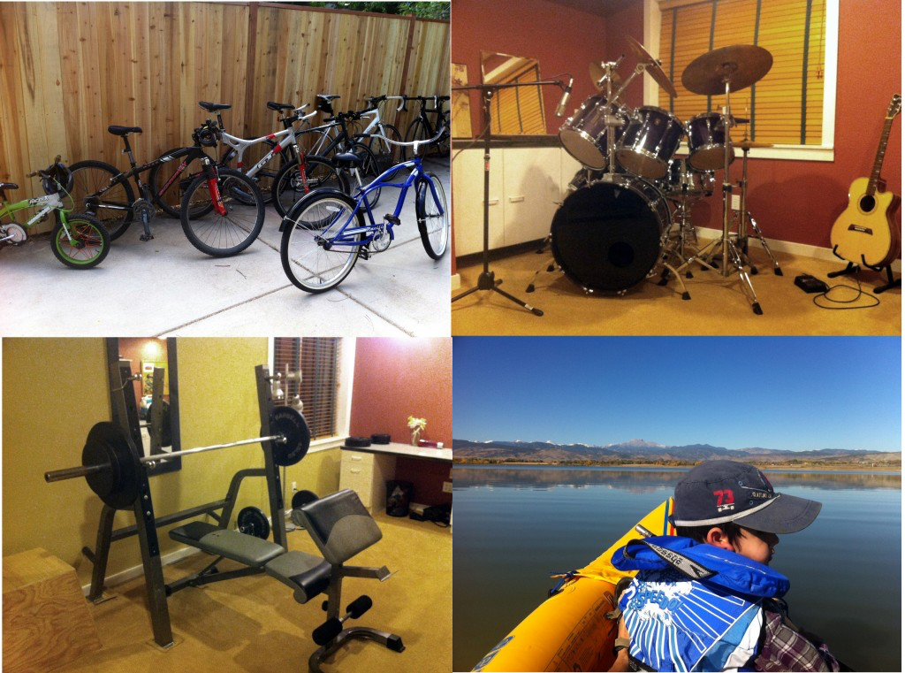

# 用行动向财务自由的前辈们致敬

**发布时间**: 2022-10-12 07:27:32

**原文链接**: [http://mp.weixin.qq.com/s?__biz=MzUzNjE3NzQ3Nw==&mid=2247490933&idx=1&sn=f24e84a152ef68b00298a940dbe23f49&chksm=fafb635fcd8cea49e561b6becce72cacc75cf7dc1a2d4a54ed15a95827cd34793287e09a4fa3#rd](http://mp.weixin.qq.com/s?__biz=MzUzNjE3NzQ3Nw==&mid=2247490933&idx=1&sn=f24e84a152ef68b00298a940dbe23f49&chksm=fafb635fcd8cea49e561b6becce72cacc75cf7dc1a2d4a54ed15a95827cd34793287e09a4fa3#rd)

---

终于有机会大规模实践这些年学习总结的各种心得了，我正在用这些方法置办新家。

得知我要搬家也有挺多小伙伴让我写写关于装修的想法，尤其是规划装修开销方面的心得，也希望这个思路能给焦虑装修问题的伙伴们一些参考。

### 我的思路来源

2021 年我分享过一个来自进化心理学的启发——[嘿，我又悟出来一个快乐凭空产生的新思路](http://mp.weixin.qq.com/s?__biz=MzUzNjE3NzQ3Nw==&mid=2247487572&idx=1&sn=12096b40525018dae60e4cb48447e1cf&chksm=fafb6e7ecd8ce768c586c16493600768a9ed1c5d5f49f5f0c2257db3a291fe9ccd20dcba9f5d&scene=21#wechat_redirect)

> 进化心理学揭示了关于快乐的三个真相：
> 
>   1. 实现目标能够带来快乐；
> 
>   2. 但快乐不能持久；
> 
>   3. 我们渴望快乐。
> 
> 

> 
> 放在一起我们可以理解为，快乐来自于当前生活改善的「过程」，不断实现一系列小目标，而不是当前的绝对生活水平高低。
> 
> 就像收入虽低、但一直持续增长、储蓄不断增加的小伙伴，很可能比收入高很多但不断下降的小伙伴更容易幸福满足。

相比于通常认为的「新房一次性装修好住起来才舒服」，我得出了一个相反的结论——**新房慢慢装修，一点点看着 ta 变成自己理想中的样子，才是最开心、惬意的** 。

当时我花了这么一张图 👇「手里有牌，但不一次性打完，一波一波慢慢来」

……

再后来，我在《投资心理学》中偶然读到，诺奖得主席勒总结的行为金融学也从另一个角度得出了和我一样的结论：

  * 2000 元分两次花，获得的快乐大于 2000 元一次花完；

  * 先攒钱再买东西，获得的快乐大于先买到东西然后再分期付款（多巴胺来自即将获得东西的过程，而在获得以后快速消失，只剩下还债的压力）

……

这还没完，再然后听三五环播客，@刘飞 和家装分享平台好好住创始人 @冯老板 聊天，也从专业装修方面进一步验证了我的想法：

> 除非你能找到极其专业的设计师，而且这个设计师深入观察过你的生活习惯，可以考虑一次性把家装好。否则这样设计常常会带来很多过于理想化却偏离真实生活习惯的空想。
> 
> 对于普通人来说，别一次性把装修方案定死，而是根据自己日常生活习惯的细节来逐步调整完善，才是最理想的思路。

妥了，咱们理论知识已经拉满

 从进化心理学、行为金融学和装修设计三个角度论证了这个策略的可行性。

### 实践感受

我发现**如果愿意慢慢布置新家，原本的日常消费就可以 cover 大部分装修开销了** ，甚至不需要额外花钱。

从 2015 年到德国上学开始，后来工作到 2020 年，我们家的预算一直是 2000 欧元/月（涵盖保险、旅行等等所有开支）。后来因为赶上欧美通胀，我们自己的生活也到了下一阶段，我们把预算稍微提高到了 2550 欧每月（现在汇率大约是 7）

  * 300 欧，我们俩的每月伙食；

  * 50 欧，给两只猫的开销，比如伙食、保险、用品；

  * 100 欧，给狗子的开销，同上；

  * 1000 欧，居家方面开支，比如月供、水电、保险、网络这些；

  * 1100 欧，是我们俩用来日常消费购物的预算；

如果选择慢慢装修升级，就可以用这 1100 欧的消费预来给家里买东西。而且刚好，消费购物是为了让自己开心，把家装修布置好也是让自己开心，正好也是同源的。

然后我和也太一起共享了一个「愿望清单」备忘录，写的都是我们想要给新家添置的物件，想到什么新东西也会及时加进愿望清单：

然后等到每月有预算了，就来把愿望清单排排序，优先买当下觉得对生活改善最大的东西（有网友评价「让它们在清单里面打架，我们坐收渔利」😂）

所以**我们新家装修除了给厨房专门设置了 4000 欧元预算以外，基本就没有额外开销了** ，用平时消费购物的预算就可以解决问题～

> 注：这里要特别说明，德国这边交房是带墙面、地板还有卫生间的，这是我收房时的照片 👇 **国内小伙伴们参考时可能还要加上这部分的开销**
> 
>

……

不过大伙可能注意到一个问题——如果愿望清单里有很多生活“必需”的东西，比如床、灯具等等，这些东西等不了，怎么做到慢慢装修？

这个问题我可以从两个角度回答：

1、判断是否必需且紧急，还是要先尝试一下没有 ta 的生活。

比如经历过很多天没有灯的生活，我突然发现日出而作、日落而息的生活也不是不能接受 😜 很多“紧急”其实不是来自事实，而是我们的想象，来自脑子里太多条条框框的预设。

2、因为慢慢装修这个思路我很早就决定了，所以搬家时有计划地考虑了这个问题 👇 把旧家的东西尽量都带过来

### 搬家，这次我反对断舍离

提起搬家常会想到断舍离，以前我自己搬家时也是这么想的，总觉得扔得越多、搬家越轻松。

这次因为跨省搬家我请了搬家公司，有个很意外的感触——**那些我花几个小时挑挑拣拣扔掉的东西，其实在搬家大哥眼里不到一分钟就能搬上车带走** ，投入产出完全不对等。

与其在已经很忙碌的搬家中再消耗心力搞断舍离，不如去关注更重要的事儿，比如和房东交接、搬家迁户口等等。

这次搬家我们几乎带上了所有物品，包括当初二手买来的冰箱、洗衣机，别人送的不知道多少年头的微波炉，连淋浴都带走了 😜

2018 年买的恒温阀，给新家换上的瞬间再次感慨买得太值，感觉还能顶 10 年。换掉新房原配水阀的当天，也太的评价「一种可以充分信任 ta 的感觉，不用着急到底是热水没来、还是位置不对……」

……

即便是一些后面想换掉的物件，我们搬家也先一起带上了。

到了新家后的几天，不住地感慨这个决定太明智了。搬到新家的晚上已经身心俱疲，在这个状态下再发现家里短缺什么生存物资要去买，估计我会原地爆炸……

我的经验总结：**不要在新物品没有就位时，就在搬家中急于扔掉旧东西“等过去再买”。人在急需一样东西时，很难静下来慢慢思考。**

资源不足时人会进入一种稀缺状态，虽然这个状态会更专注（比如工作赶 deadline），但这时思维也会封闭，进入管状视野，更难有新的创意（参见《稀缺》）。

想要新家慢慢装修，得让心先慢下来。而想要心慢下来，得确保手头有个先能用的。又是那句话「人有近忧，常无远虑」。

### 向前辈们致敬

现在回头想想，突然发现自己在这个过程中也在向常年观察学习的财务自由前辈们致敬——**他们的生活开销并不高，却有着与低开销不匹配的、挺让人羡慕的生活品质** （努力向他们靠拢中

）

这是我当年的记录 👇

> 先放几张照片，分别来自两位博主。
> 
> 第一组照片，一位博主的家，居住面积超过 200 平，四个卧室，有健身房、娱乐室、吧台，装修感觉也特别精致。
> 
>

> 
> 第二组照片，一位带着老婆开房车环游美国的博主，游了四年以后又买了一大块地盖了房子过日子。
> 
>

> 
> 第一位博主是鼻祖财务自由博客「钱胡子」的作者，他家的生活开支是每年 19 万人民币（2.7 万美元，家里两口 + 俩娃），算下来相当于 1.6 万的家庭月收入。
> 
> 第二位博主是 Steve，也是一个很有名的理财专栏作者，他家的年度开支是 21 万（3 万美元，家里两口，大部分开支用于吃喝玩乐），算下来相当于 1.8 万的家庭月收入。
> 
> 这个实际数字比我凭感觉想出来的低了一大半，感觉很意外。
> 
> ——[一条低调的致富路子](http://mp.weixin.qq.com/s?__biz=MzUzNjE3NzQ3Nw==&mid=2247486379&idx=1&sn=d4ee2278fb3b81100b2857259cdf3bee&chksm=fafb7581cd8cfc9722bd7426c3b5fc9635257fc9df588aa0fb1a2806623799f35b390b97e4a7&scene=21#wechat_redirect)

试着了解他们的生活方式，我发现一个很关键的点就是，**他们在物质上很少“推倒重来”，很少买完东西然后闲置再扔掉** 。

想想看，如果每个物件都能长期发挥价值，我们又能定期补充新装备进来，常年积累下来成果是非常可观的，而开销未必有那么大。

在心态上，把每次搬家当做一次重启人生的机会。但在物质上，却不应该每次重来，而是作为原有生活的扩展和延续。这也是一种复利效应。

希望我也是在用自己的方法延续他们的理念。

### 总结一下

可能有的小伙伴会说，我能用这个慢慢装修的方法是因为在旧家已经有了大部分家当，如果现在两手空空就没法参考了。

但在我看来这个思路只是个不断往复的循环：

1、日常生活就应该学会辨别、筛选那些自己真正想要、并且打算长期使用的物件。把有限的资源留给最想要的东西——比如不是用来给别人看的，而是自己真正喜欢；比如即便搬家也愿意带在身上……

2、在搬家时不要急于断舍离，哪怕是打算置换的物件也可以考虑先带上，别让自己进入没东西可用的稀缺心态（我认同断舍离理念，但我认为断舍离更应该作为一种日常习惯，而不是搬家了才急于扔东西）

再然后，我们就会进入下一个循环——因为已经拥有了不少真正需要的物件，没有什么急迫的开销，面对新增消费也越来越容易获得平常心，让自己慢下来，更容易找到下一个珍爱之物。

确实，这是个需要积累的过程，不能一蹴而就。但如果想要改变，总要先有个开始。

  * 财务自由：[我的财务自由实证之路](http://mp.weixin.qq.com/s?__biz=MzUzNjE3NzQ3Nw==&mid=2247490826&idx=1&sn=4117ee1a5c72d34da526aad8faa2a1bd&chksm=fafb6320cd8cea36adfae83a07ce0490a1419dbe932c7cb941caea852d7b25afa8ff175f31bc&scene=21#wechat_redirect)

  * 投资笔记：[十年之约，躺赚不难](http://mp.weixin.qq.com/s?__biz=MzUzNjE3NzQ3Nw==&mid=2247490378&idx=1&sn=e333c766a1c4cf35c686e54cf60ac2c7&chksm=fafb6560cd8cec76604ef782e6fdfbd78272365e9c6afd5d7025803d1846caf4fee237e5d59c&scene=21#wechat_redirect)

  * 抵御风险：[8 月保险最推荐](http://mp.weixin.qq.com/s?__biz=MzUzNjE3NzQ3Nw==&mid=2247490783&idx=1&sn=b95df2de16e099c9c33e600494f3c167&chksm=fafb62f5cd8cebe3d0bacf5aad4b5e2c4f893ad6f847bdd435ccd1df04f77afd2444bf52d0c8&scene=21#wechat_redirect)

  * 干货汇总：[财务自由路上应该了解的每一个问题](http://mp.weixin.qq.com/s?__biz=MzUzNjE3NzQ3Nw==&mid=2247489926&idx=1&sn=eac357cebcbfd7250828cdda88d9f122&chksm=fafb67accd8ceebaa1e750f129714bb000be9720a990a70c6fba6fc52fd3712014a58d699d6e&scene=21#wechat_redirect)