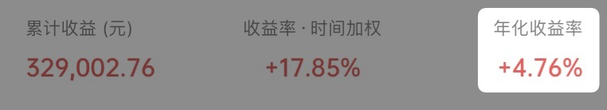
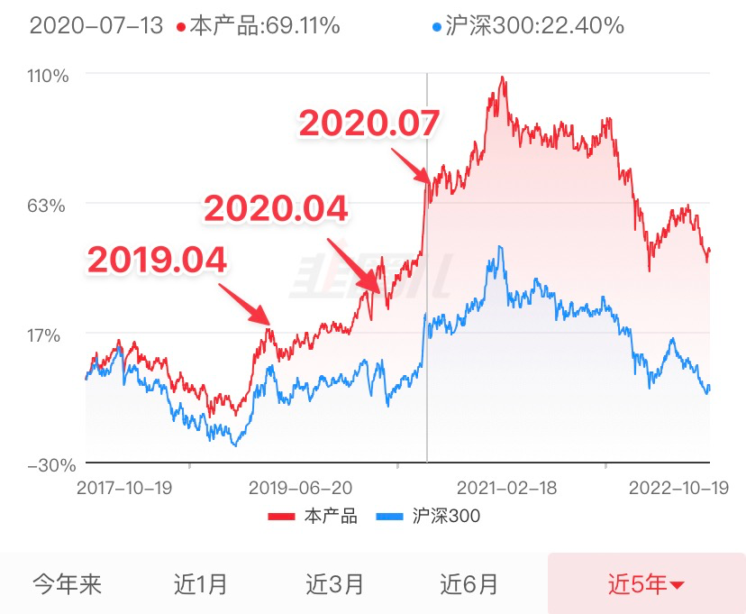
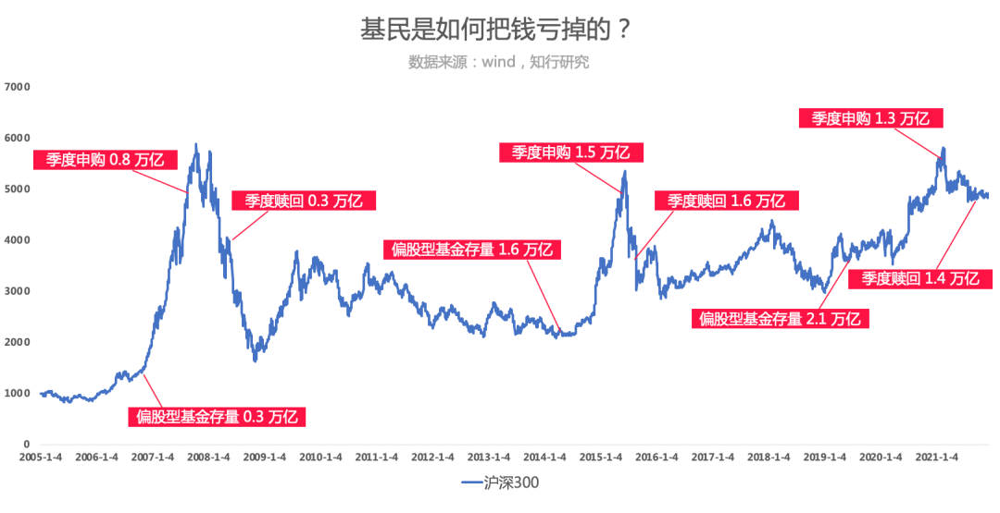

# “是不是假数据，一样的基金为啥我还亏着？”

**发布时间**: 2022-10-25 09:01:19

**原文链接**: [http://mp.weixin.qq.com/s?__biz=MzUzNjE3NzQ3Nw==&mid=2247491020&idx=1&sn=b39dbd5f2e82c70e60436fcf44c5bb72&chksm=fafb63e6cd8ceaf092fa3eb6a0bdd0eaf86cf08422689f388386df42722f2df013690077a7e3#rd](http://mp.weixin.qq.com/s?__biz=MzUzNjE3NzQ3Nw==&mid=2247491020&idx=1&sn=b39dbd5f2e82c70e60436fcf44c5bb72&chksm=fafb63e6cd8ceaf092fa3eb6a0bdd0eaf86cf08422689f388386df42722f2df013690077a7e3#rd)

---

上周五，在这篇迟到的财务自由实证文章下，有小伙伴对我记录的数字提出了质疑

其实这类留言每隔一段时间就会有，我一般也不放在心上。但这次例外，因为碰巧看到小伙伴有过打赏记录。

如果素不相识的人突然跑过来点评你，你常常会嗤之以鼻“你谁啊”。但如果是相识已久、甚至支持过你的人，面对他们的意见心态上总会不一样，会想更多。

后来想想这个角度也值得展开写一写，也希望能给大伙当下的投资带来一点信心。

……

不过呢，正经回答以前先容我皮一句哈

大家当下对投资收益是有多悲观啊，财务自由实证到现在快 4 年了，才年化 4% 的收益都要被怀疑不真实 👇 这么点收益都要造假是不是太没追求了？而且扯谎多累人啊，完全不符合我连投资都想躺赚的性格……

而且对这个收益数字抱相同看法的还不止这一位小伙伴，写文章这会儿又翻到一条留言 👇

这个问题我会选两个角度来回答——时间和成本。

### 时间：早 1 年，会有多大区别？

文初提问的小伙伴说「前年关注」的，也就是 2020 年，而我的实证是从 2019 年初开始。

那这 1 年的区别会有多大不同？

就我当时持有至今的基金而言，从 2019 年 4 月到现在大跌**之后** ，平均涨幅依然有近 40%。

但如果晚一年到 2020 年 4 月开始，平均涨幅会缩水成约 20%。

如果一位投资者现在是负收益，那大部分买入时间应该在 2020 年 7 月以后 👇

前后最多只差了一年零三个月，但结果却从 40% 收益反转成了亏损（假设开始一次性买入）。

问题的关键在于**投资收益在时间上并不均匀** ，早晚一年、甚至几个月都可能有很大区别。

所以在分析投资时除了“买什么”以外，怎么买？什么时候买？起止时间？也同样重要。

原图来自《巴菲特与索罗斯的投资习惯》

### 成本：你是雪中送炭，还是锦上添花？

除了起止时间，买入成本也会带来区别。

比如我自己的财务自由计划在 2019 年公开以前就已经执行了近 2 年，在此以前也投资了挺多年，所以已经有了 200 万的本金 👇

到上个月，我的资产净值大约是 450 万。换言之，**一半以上的投入发生在 2019 年以前** ，那时市场很便宜。

而且后面几年我也是均匀地投入，收入到手就买（**均匀** 是个很重要的关键词 🫣）所以累积投入本金一直是匀速上涨了，不是等市场大涨再突击买入，这会极大影响成本 👇

不知道留言的小伙伴是如何买入投资的，但很普遍的情况是——人们在市场低点时，比如 2018 年、新冠刚爆发、比如现在，都对投资不闻不问。等到市场高点才在亢奋中大力买入。

而且我注意到一个细节，留言的小伙伴开始关注我的真实起点其实是 2018 年，而非 2020 年。但为什么 ta 的记忆却是从 2020 年牛市才开始的呢？这个问题只有本人才能回答了。

有知有行的伙伴们在[《投资第一课》](https://mp.weixin.qq.com/s?__biz=MzUzNjE3NzQ3Nw==&mid=2247489817&idx=1&sn=273d49f380a8bfe9d81f2fe4aa1d9b96&chksm=fafb6733cd8cee25f623bacc109fc0a798cc3f96e47121713219fc1359ed33f4e95605ad888b&token=264254384&lang=zh_CN&scene=21#wechat_redirect)中分享过一个基金申购数据 👇 大伙放大看这个图，尤其是对照 2020 年和 2015 年的时间线会发现，基金的巨量申购往往发生在市场顶点

买入成本的影响可能比时间还要大。

### 重要的是当下的启发

市场低迷时常有观点说，“我先卖了，等行情好了我再回来”。

但从我自己的经历出发，想和大家分享的是，投资收益分布并不均匀。我发现到头来，多的是错过上涨、再没能买回来的人。

这也是为什么人们常说「闪电劈下来的时候你要在场」。因为万一不在，错过可能就补不回来了。

……

我们时常讨论的定投，是那种不管市场低迷还是高涨，都在坚持执行的定投；或者低迷时期加大力度，高涨时期则酌情避险的定投。

不是那种低点嫌弃投资，等到市场涨上来了、看别人赚钱了，才开始的“定投”。

锦上添花式的投资理由，比如某笔投资（过去）涨得好，身边老王买了这笔投资（过去）赚了钱，往往更能打动人。

但能笑到最后的，常是雪中送炭的投资者。

  * 财务自由：[我的财务自由实证之路](http://mp.weixin.qq.com/s?__biz=MzUzNjE3NzQ3Nw==&mid=2247490995&idx=1&sn=5b90cca481c8f33b2a7a19f6ef555791&chksm=fafb6399cd8cea8fb1f295606a40f3167ba1cda5590d10581d3712f34b0f275d64111991cf8c&scene=21#wechat_redirect)

  * 投资笔记：[十年之约，躺赚不难](http://mp.weixin.qq.com/s?__biz=MzUzNjE3NzQ3Nw==&mid=2247490378&idx=1&sn=e333c766a1c4cf35c686e54cf60ac2c7&chksm=fafb6560cd8cec76604ef782e6fdfbd78272365e9c6afd5d7025803d1846caf4fee237e5d59c&scene=21#wechat_redirect)

  * 抵御风险：[10 月保险最推荐](http://mp.weixin.qq.com/s?__biz=MzUzNjE3NzQ3Nw==&mid=2247491005&idx=1&sn=cc2cbc866f98715c825f7367ed4fe79a&chksm=fafb6397cd8cea81d7b4522b9cd3ac465fdd10fbdb47aad85ffd91db83cac6c6583369dc614a&scene=21#wechat_redirect)

  * 干货汇总：[财务自由路上应该了解的每一个问题](http://mp.weixin.qq.com/s?__biz=MzUzNjE3NzQ3Nw==&mid=2247489926&idx=1&sn=eac357cebcbfd7250828cdda88d9f122&chksm=fafb67accd8ceebaa1e750f129714bb000be9720a990a70c6fba6fc52fd3712014a58d699d6e&scene=21#wechat_redirect)

**风险提示** ：本文不构成投资建议，只是我个人投资中的观察和思考。大伙参考为主，投资最终还是要独立决策，毕竟我也可能是错的。