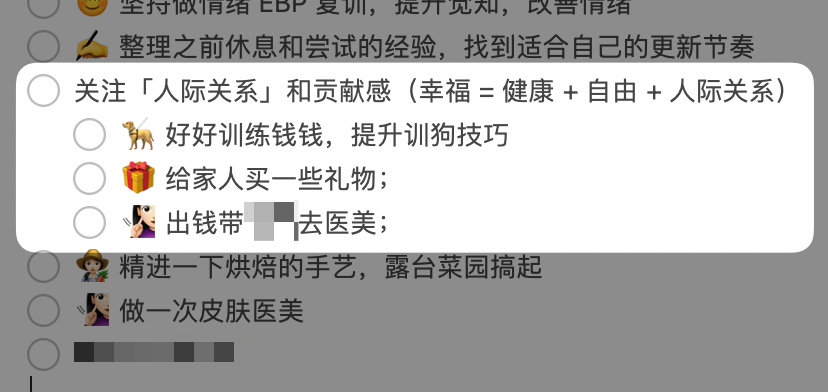
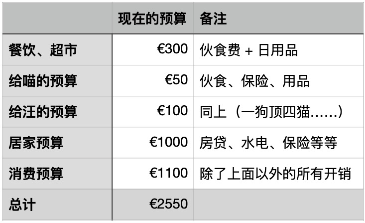

# 今年想做的事儿

**发布时间**: 2023-01-04 07:48:21

**原文链接**: [http://mp.weixin.qq.com/s?__biz=MzUzNjE3NzQ3Nw==&mid=2247491273&idx=1&sn=cdbf19800945395cdcf326514ffff97f&chksm=fafb60e3cd8ce9f568de0c8cbf03d07a6fb69b5c4f997fe230b284571b0121bb3df8dc9e5798#rd](http://mp.weixin.qq.com/s?__biz=MzUzNjE3NzQ3Nw==&mid=2247491273&idx=1&sn=cdbf19800945395cdcf326514ffff97f&chksm=fafb60e3cd8ce9f568de0c8cbf03d07a6fb69b5c4f997fe230b284571b0121bb3df8dc9e5798#rd)

---

又到了每年立 flag 的时候了，大伙都写了哪些内容 😉 

大概从 2021 年开始，我和也太开始共享一篇「20XX 年度目标」的备忘录，里面写的都是我俩这一年里想做的事儿。

比如去年我们写了：

  * 搬家到二线；

  * 也太想要辞职（不过谈的过程中变成了远程办公）；

  * 想养一条狗；

  * 打蜱虫疫苗（防脑膜炎）；

  * 我想改善健康、提升有氧适能，想冬天也能定期冲冷水澡……

说到安排这一年想做的事儿，我最近发现**幸福公式** 是个挺值得参考的视角。毕竟「让自己更幸福一点」算是做大部分事儿的动力了。

在回顾 flomo 笔记时我偶然翻到了两个版本的幸福公式：

> 幸福的来源：
> 
> Naval 说，健康 + 财富 + 人际关系（《纳瓦尔宝典》）
> 
> DeMarco 说，健康 + 自由 + 人际关系（《百万富翁快车道》）
> 
> 但他们说的是一回事儿，因为 Naval 说过，财富只是为了自由，仅此而已。

（每次写新笔记以前先搜一下对应关键词读读旧笔记，能发现好多「哇，我以前还记过这么多好东西」的瞬间）

带着「健康 + 财富 + 人际关系」这个视角，我也重新整理了一下自己的小目标。

### 「健康」+ 财富 + 人际关系

这是我最期待的部分。为了健康，今年我想：

  * 做一次常规体检 + 年度口腔检查 + 洗牙；

  * 参加一个为期 10 周的睡眠改善课程；

  * 参加一个当地社团的跑步训练计划（如果可以的话，看看能不能也参加一下今年的 7 英里越野跑）

  * 认证一个国家运动徽章；

能因此**薅到保险公司羊毛** 是我最大的动力

德国这边很多保险公司为了鼓励大家改善健康，打卡体检、疫苗、运动健身等等，就可以返现金或者给你购买健康装备的补贴。

我在的保险公司，完成 2 项体检任务 + 3 项运动任务，就可以拿 280 欧元补贴去买 Apple Watch 了。我的计划算是量身定做的～

内容不重要，一看给钱我就来劲了

……

后来我在找哪些运动任务**又有意义、又不花钱** 的时候，又有了「国家运动徽章」这个发现。

为了鼓励大家提升体能，而且有个明确的目标指引，德国搞了个运动徽章体系。按照耐力、力量、速度、协调性四个板块，划分出了金银铜三个标准，输入自己的年龄就能看到对应目标（这里我是 31 岁看到的结果）👇

能达成**其中一项铜牌以上** 就可以去报名认证了（每年认证一次），我打算去试试 3 公里跑，跳绳这个项目也太没准可以争取一下。

这个体系设计还挺有参考性的，有个体能健康的明确标准，也是日常努努力就可以达到的范畴，有徽章精神奖励，最后还能拿到钱，想想就很有奔头，hhh～

### 健康 + 财富 +「人际关系」

这是我读到幸福公式以后才开始认真考虑的新话题，以前确实想得不多。

思考「人际关系」，我选了《被讨厌的勇气》阿德勒心理学的视角。里面有两句话，时不时就会想起：

> ……各种烦恼的根源都在于人际关系……幸福来自于「贡献感」……

所以我就在想，也许可以考虑提升贡献感。

首先是「贡献」感，那就得为他人做一点事情。

其实是贡献「感」，这意味着 ta 一定是一种主观体验，而非客观标准。只能自己找答案，却没法让别人告诉自己。同样一件事儿，**有的人得到的是贡献感，但有的人可能得到的反而是牺牲感** 。

最后我选了个比较俗、比较容易的目标下手——在自己的预算范围内，愿望清单里不但要写自己想要的东西，也应该写一些想送给家人的东西 👇

### 健康 +「财富」+ 人际关系

最后是关于财富。这部分得提前说明一下，**关于个人财富，不同阶段需要关注的重点不一样** 。

还在搭建财务自由体系的小伙伴们，我这里的**参考性可能就不太强了** 。建议大家翻一翻这篇干货汇总，从搭建体系开始 👉 [自由路上应该了解的每一个问题](http://mp.weixin.qq.com/s?__biz=MzUzNjE3NzQ3Nw==&mid=2247489926&idx=1&sn=eac357cebcbfd7250828cdda88d9f122&chksm=fafb67accd8ceebaa1e750f129714bb000be9720a990a70c6fba6fc52fd3712014a58d699d6e&scene=21#wechat_redirect)

这些年我们已经搭起了差不多可以自动运转的财富体系：

> 遵守每月开支预算目标 → 余下的收入变成本金 → 本金用来投资 → 投资获得收益或被动收入 → 升级我们的自由

而且，当投资本金积累到比年收入多很多倍，市场行情这种不可控的因素带来的影响要远大于我们一年里能安排的行动计划。逆风局，还是多一点耐心吧。

所以对财富方面的额外计划就不多了，今年继续执行这个开销预算目标就好了 👇

我们现在关注的重点更多是「获得自由以后想做的事儿」，而不是无休止地追求财富的「更多」。

……

好了，我的 flag 就立好了。这是最后我写的 👇

希望做完它们，又能让自己再幸福一点点～

  * 财务自由：[我的财务自由实证之路](http://mp.weixin.qq.com/s?__biz=MzUzNjE3NzQ3Nw==&mid=2247491256&idx=1&sn=4a3f2f0e5c80c85f7b62e58b442ea74b&chksm=fafb6092cd8ce9842990be18fad837e491bdee669445ea40abc2b9438d3e9d732cc8354e8844&scene=21#wechat_redirect)

  * 投资笔记：[十年之约，躺赚不难](http://mp.weixin.qq.com/s?__biz=MzUzNjE3NzQ3Nw==&mid=2247490378&idx=1&sn=e333c766a1c4cf35c686e54cf60ac2c7&chksm=fafb6560cd8cec76604ef782e6fdfbd78272365e9c6afd5d7025803d1846caf4fee237e5d59c&scene=21#wechat_redirect)

  * 抵御风险：[12 月保险最推荐](http://mp.weixin.qq.com/s?__biz=MzUzNjE3NzQ3Nw==&mid=2247491239&idx=1&sn=10c79c4510f985616909ae53e52952e0&chksm=fafb608dcd8ce99bdc4a0b76f1be88286fc2b6c4da5bfefa0a37e9a33b2049c16e3c5ef9f8bc&scene=21#wechat_redirect)

  * 干货汇总：[财务自由路上应该了解的每一个问题](http://mp.weixin.qq.com/s?__biz=MzUzNjE3NzQ3Nw==&mid=2247489926&idx=1&sn=eac357cebcbfd7250828cdda88d9f122&chksm=fafb67accd8ceebaa1e750f129714bb000be9720a990a70c6fba6fc52fd3712014a58d699d6e&scene=21#wechat_redirect)