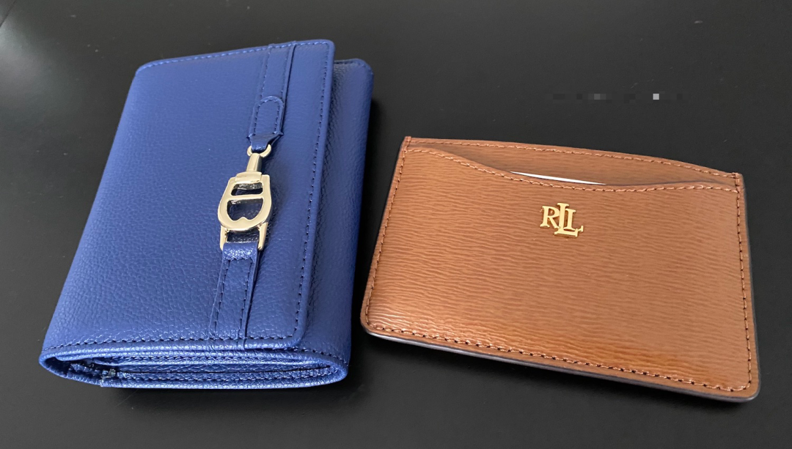

# 和也太互送的礼物～

**发布时间**: 2023-01-13 07:08:49

**原文链接**: [http://mp.weixin.qq.com/s?__biz=MzUzNjE3NzQ3Nw==&mid=2247491309&idx=1&sn=6d85b8d4338aa8ce715fddcaef1a307f&chksm=fafb60c7cd8ce9d1cbde3569be9ff0a62578659421245037286640372d0341306d14c19d1724#rd](http://mp.weixin.qq.com/s?__biz=MzUzNjE3NzQ3Nw==&mid=2247491309&idx=1&sn=6d85b8d4338aa8ce715fddcaef1a307f&chksm=fafb60c7cd8ce9d1cbde3569be9ff0a62578659421245037286640372d0341306d14c19d1724#rd)

---

其实我俩互送的礼物特别简单，就是平平无奇的两个钱包 👇

也正是因为这俩礼物太平凡了，印象才格外深。也太总结的消费思路：

去**互送对方已经用了很多年、确保绝对每天会用的物件** ，哪怕是非常平凡的小东西，带来的体验也可能大于那些追求新鲜感的消费。

互送钱包以前：

我的旧钱包已经用了快 10 年，每天出门带，连证件照都被“复印”到钱包上了 😂

每次出门默念一遍「伸手要钱」（身份证、手机、钥匙、钱包）东西就带齐了。后来新冠出门还得戴口罩，又升级成了「伸手要钱要脸」

也太的更惨，连钱包都不是。当初随便找了个化妆包装一下，没曾想“一下”就过了 4、5 年。

这些会随身好几年的东西，不管再小，在某种程度上都一定是刚需。

所以这次互送礼物太成功了，出乎意料地开心。每次出门把钱包转进口袋，先高兴一下；出门掏出钱包，又高兴一下；回家把钱包放鞋柜上，再高兴一次（我这阈值是不是太低了点 🤔）

突然想到，这次的感受和我们之前唠过的两件事儿特别像：

  1. 人们常常低估二刷旧剧带来的幸福感，却常常对其实没有很好看的新剧期待过高；

  2. 装修新家时，多参考过去这些年「已有的」生活习惯，而不是畅想未来。

眼瞅要过年了，大伙要是想置办点新物件啥的，不妨也看看身上有哪些**平时不起眼、但已经跟了很多年的东西** ，也许会有惊喜呢～

……

对了，说起买东西，最近我还遇到个事儿，跟大伙一起唠唠。

我一直特羡慕也太的小红书，她把算法调校得特别好，总推荐各种德国生活实用信息，今天申报退税的 5 个重点、明天某某银行有 2% 活期利息的……然后她看到再分享给我，我跟着改进家里的生活。

后来我就想，要不自己也训练一下呗，然后打开小红书一顿翻。

「诶？“附近”这个功能不错呀，定位德国，肯定都是推荐德国信息的」

也太立马提醒我，「还是别看了」

果然，画风和我想得完全不一样

 怎么是铺天盖地地“劝我”花钱消费，甚至还有「吃土也要入」「除了贵没毛病」……才想起来，欧美才是消费主义的大本营。

但和很多人说的「人有钱了要对自己好一点」相反，我一直觉得，**小有收入和积蓄以后，才更应该对消费警惕** 。

读过一个关于美国中产的研究，分析一些**中产家庭如何一步步陷入负债** ——不是钱不够，恰好相反，中产陷入负债反而是因为很多东西都开始买得起了。

像很多富人在用的奢侈品、好车、大房子，其实大多数中产也是能买的。但关键的区别在于：

  * 富人买奢侈品更像是在买日用品，而中产家庭则是攒了几个月终于买下，然后像祖宗一样供着；

  * 富人买大房子、买好车，用的是闲钱，有时候甚至是为了抵税刻意花钱。而中产却把这些当做身份象征，为此背上了几年甚至几十年的负债；

摧毁财富的，不是那些我们买不起的东西，而是看起来**刚好** 买得起、但其实承担了太大代价的。

有一次我在看苹果发布会，也太算了算账突然惊呼，「单看一台 iPhone 好像没多少钱，可是攒了几百万，不也才够换 500 次 iPhone 就没了 🤯」。

消耗财富比积累财富容易太多了。

相比之下，我们还是更喜欢看一些“反向”的努力。周二不是给大家分享了一个[计算家庭物质水平在全国排名的计算器](http://mp.weixin.qq.com/s?__biz=MzUzNjE3NzQ3Nw==&mid=2247491291&idx=1&sn=33e0bfc3f99bdba4403be838615279a4&chksm=fafb60f1cd8ce9e75ab6af561b7104c4afd553cd11a2cf610e53d3b0093bc4ee933527973448&scene=21#wechat_redirect)嘛？

我反向使用了一下，不看收入水平而是参考看开销，**我俩能排进全德国最“贫困”的 20%**

「自由 = 能力 - 欲望」，正是这些没被消耗掉的收入才能变成一辈子的财富，支撑着我们选择更想要的生活。

  * 财务自由：[我的财务自由实证之路](http://mp.weixin.qq.com/s?__biz=MzUzNjE3NzQ3Nw==&mid=2247491256&idx=1&sn=4a3f2f0e5c80c85f7b62e58b442ea74b&chksm=fafb6092cd8ce9842990be18fad837e491bdee669445ea40abc2b9438d3e9d732cc8354e8844&scene=21#wechat_redirect)

  * 投资笔记：[十年之约，躺赚不难](http://mp.weixin.qq.com/s?__biz=MzUzNjE3NzQ3Nw==&mid=2247490378&idx=1&sn=e333c766a1c4cf35c686e54cf60ac2c7&chksm=fafb6560cd8cec76604ef782e6fdfbd78272365e9c6afd5d7025803d1846caf4fee237e5d59c&scene=21#wechat_redirect)

  * 抵御风险：[12 月保险最推荐](http://mp.weixin.qq.com/s?__biz=MzUzNjE3NzQ3Nw==&mid=2247491239&idx=1&sn=10c79c4510f985616909ae53e52952e0&chksm=fafb608dcd8ce99bdc4a0b76f1be88286fc2b6c4da5bfefa0a37e9a33b2049c16e3c5ef9f8bc&scene=21#wechat_redirect)

  * 干货汇总：[财务自由路上应该了解的每一个问题](http://mp.weixin.qq.com/s?__biz=MzUzNjE3NzQ3Nw==&mid=2247489926&idx=1&sn=eac357cebcbfd7250828cdda88d9f122&chksm=fafb67accd8ceebaa1e750f129714bb000be9720a990a70c6fba6fc52fd3712014a58d699d6e&scene=21#wechat_redirect)