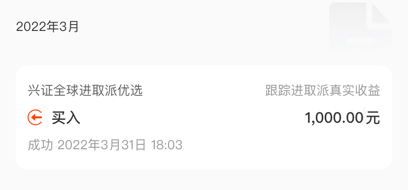
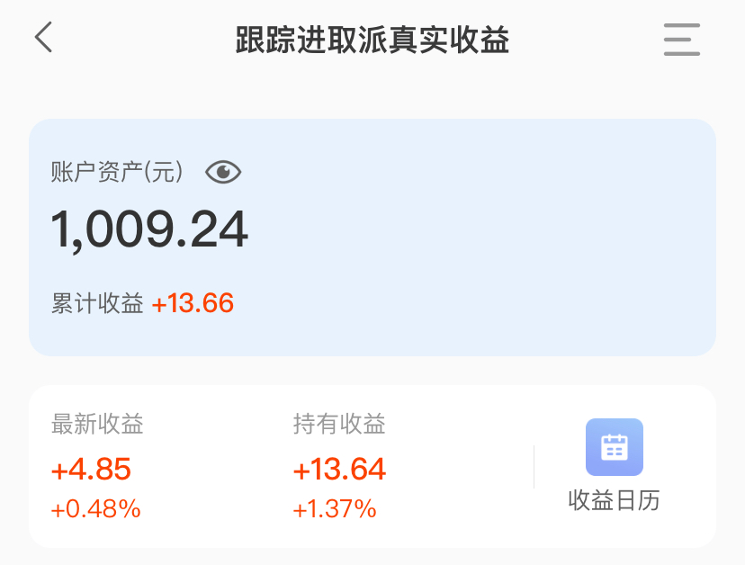
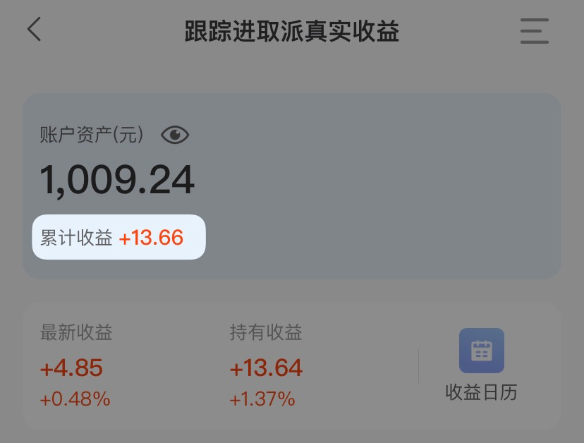
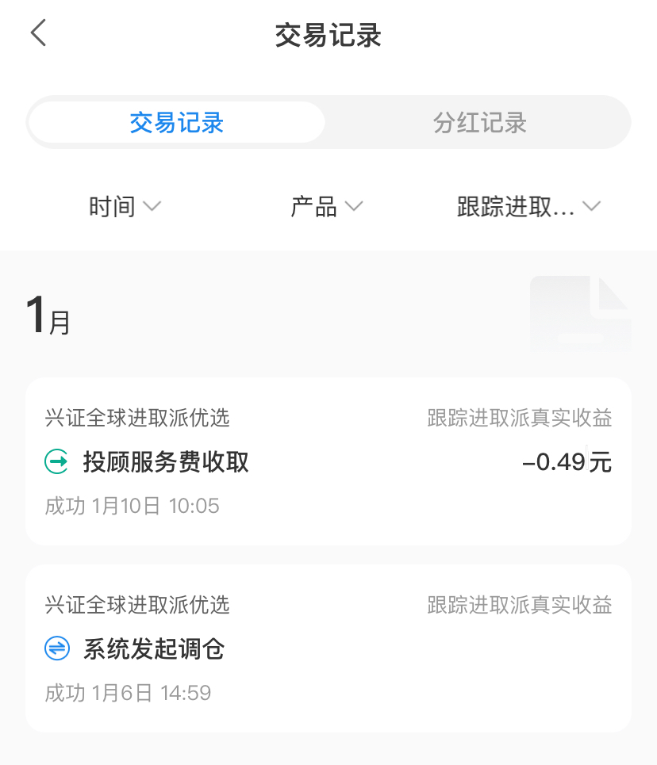
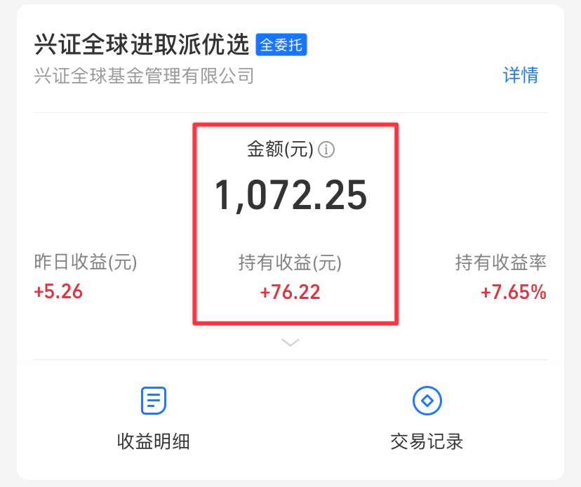

# 虚高 | 财务自由实证 #46

**发布时间**: 2023-02-01 07:32:19

**原文链接**: [http://mp.weixin.qq.com/s?__biz=MzUzNjE3NzQ3Nw==&mid=2247491353&idx=1&sn=0905510e46534774c73b3fb45ae2b87a&chksm=fafb6133cd8ce82593510fbd9a2569a5d7b6badfd19c34df3837a30f2caccf17c422239e256d#rd](http://mp.weixin.qq.com/s?__biz=MzUzNjE3NzQ3Nw==&mid=2247491353&idx=1&sn=0905510e46534774c73b3fb45ae2b87a&chksm=fafb6133cd8ce82593510fbd9a2569a5d7b6badfd19c34df3837a30f2caccf17c422239e256d#rd)

---

临时补一句：发文前突然想到「虚高」这个标题可能有歧义，大伙先想到的会是估值的那个虚高，但我想聊的其实是另外一个话题。不过放心，大家关心的那个“虚高”，后面也会写的～‍‍‍‍‍‍‍‍‍‍‍‍‍……

假期盘点投资账户，我意外发现了个问题——**有些基金 App 统计的收益数据是虚高的** 。

当初为了跟踪兴全进取派投顾的实际收益情况，我在且慢里单独建了个子账户，买了 1000 块，然后**不再做任何转入转出操作，只跟着调仓** ，方便看收益曲线。

当时的转账记录

现在过去快一年了，这个账户从 1000 元增长到了 1009.24 元 👇 真实收益当然就是 9.24 元

但我突然发现且慢统计出的「累计收益」却是 13.66，比真实收益高了不少 👇

根据经验，我猜问题应该出在手续费和投顾费上，要么是手续费也算进收益了，要么是把投顾费算进收益了，也有可能是两个都有。

然后我把过去每次扣除的投顾费手动加了一遍 👇

最后确认**偏差出在投顾费上** ，且慢统计出的 13.66 元，刚好是我的真实收益 9.24 元，加上过去总共 4.42 元的投顾费。所以现实的收益虚高。

后来跟小伙伴们聊完发现这还不是个例，我又顺着翻了支付宝的另一个观察仓 👇

如果不是专门设置了一个观察收益的账户，平时投资资金进进出出，就根本没法发现这个问题了。

现在回头想想，统计收益虚高的问题，我在不少投资平台都遇到过，比如：

  * 以前有的股票 App，显示的投资收益不扣除佣金；

  * 如今在各个平台看到的投顾收益曲线展示，如果专门去问一下客服会被告知，大多都是**扣除投顾管理费以前的曲线** ，用户其实赚不到这么多（👈 这一点是尤其要提醒大家的）

很容易让我们高估自己当前的收益状况……‍‍‍‍‍‍‍

突然觉得有点无奈，一说起投资，网络上这个谈趋势、那个说机会，关注的都是天下大事儿。  

可到头来，我们可能连自己真实赚了多少、赔了多少这样的数字，都是错的

 而如果连以为的收益数据都是错的，还怎么计算被动收入、规划财务自由呢？

所以啊，偶尔手动核对一下投资收益，还是挺有必要的。‍‍

从前我一直是坚持手动记录投资，先是 Excel 表格、后来是且慢小账本、现在是有行记账。但偶尔还会有这样的念头，要不要用基金 App 自动生成的收益数据来取代每次手动记录，再少花点时间。

但现在事实证明，**还是自己画的曲线最让人放心** ，至少每一笔计算过程都是清清楚楚、明明白白。平台自动生成的收益数据，和自己手动记录时的收益计算方法是不同的：

  * 平台自动生成的收益曲线是基于过程，从基金的涨幅中，再减去各种费用。如果某笔费用没有在计算中扣除，算出来的结果就会有偏差（比如今天聊到的投顾费）；‍‍

  * 但我们自己记录时并不需要这么复杂，只需要关注资金转入转出和**当前最近资产净值** 这个结果就好了。各大平台显示的「资产净值」不太可能出错，毕竟，如果账户里只有 100 块，没人会让你变现出 200。  

恩，赶紧又去有行记账更新了一笔，舒服多了 😊

更加感恩有知有行小伙伴们开发了这么实用的功能 🙏 

这里我也再给他们带带货，大家可以去翻翻我当时写的分享 👉 [记录投资收益的工具](https://mp.weixin.qq.com/s?__biz=MzUzNjE3NzQ3Nw==&mid=2247487794&idx=1&sn=b9db83140ef56b777315a5e415954736&chksm=fafb6f18cd8ce60eeebe855dcd793f173a5589e51657877fb9e8a2fff629eeb17688a40e2766&scene=21#wechat_redirect)

### 实证账户更新

内心 OS：哈，还得是我手动记录了快 4 年的实证曲线最放心可靠～

最近一个月市场连续反弹，眼看着快要脱离低估区间了。假如算上之前买房首付减去的 70 万，又一次接近 500 万的关口了 ✌️ 等市场估值彻底回归正常区间那天，再写一篇纪念一下～

……

从投资中获得的「累计被动收入」目前还在「累计日常开销」曲线的下方，静静等待回归 👇

注：这张图的思路来自[第 30 期实证](http://mp.weixin.qq.com/s?__biz=MzUzNjE3NzQ3Nw==&mid=2247489372&idx=1&sn=2118934ef05d930f50d2510ff6642cb1&chksm=fafb6976cd8ce06042f2bb8d1ed950a95262d11451fe116440e1ff84ca49c6fdae8a5d664a6d&scene=21#wechat_redirect)

……

未来投资上的计划，下一期[十年之约](https://mp.weixin.qq.com/s?__biz=MzUzNjE3NzQ3Nw==&mid=2247491220&idx=1&sn=6298208a52eb99eef5fa8a26e720cbda&scene=21#wechat_redirect)我会展开聊

也要提醒大伙，财务自由的投资和被动收入虽然看起来性感，但「因上努力，果上随缘」。本金和收益只是自由路上的「果」，**主业努力多赚钱、理性消费少挥霍，以此积累本金，再加上不被短期涨跌干扰、坚持投资才是背后的「因」** 。

投资复利只是我们获得被动收入的方式，而不是致富的秘密。

在财务自由实证的最初两年，我写得最多的也不是如何投资，而是如何**少在投资上花时间，好能多花时间关注主业** ，同时理性控制开销，尽快攒钱。

假如有 10 万本金，就算投资翻倍也才赚了 10 万。而投资翻倍极其困难，巴菲特的年化收益也才 20%。相比之下，在职场上努力提升，让收入再增加 10 万则要靠谱得多。

对财务自由而言，“钱生钱”做到 80 分足矣，剩下的精力还是应该关注赚钱和省钱这些“人生钱"。

### 最后，这些年的经历汇总

**普通人通过工资理财也能实现财务自由** ，这是这些年我一直在践行的理念。从最初懵懵懂懂到 2017 年制定具体的财务计划，再到如今渐渐靠近终点，已经走了五六年。

为了能够更加透明、中立地实证普通人财务自由的可能性，从 2019 年开始我决定公开自己的财务进度，成为这个系列内容「财务自由实证」。

不追求大富大贵，但求能够不再纠结生计这些琐碎问题，在重大选择面前获得更多的人生选项，不再瞻前顾后。

有兴趣参考这个实证的朋友建议先看看之前的引导篇，[制定自己的财务自由计划](https://mp.weixin.qq.com/s?__biz=MzUzNjE3NzQ3Nw==&mid=2247484500&idx=1&sn=c04c3de1a1231bef25bb4cda773c00ff&scene=21#wechat_redirect)、[一起财务自由](https://mp.weixin.qq.com/s?__biz=MzUzNjE3NzQ3Nw==&mid=2247484480&idx=1&sn=258e8dd4976c7d3c324ed89b90904d14&scene=21#wechat_redirect)。以往的干货精华也都有汇总 👇

  * [全都安排好了，自由路上我们会遇到的每一个问题](http://mp.weixin.qq.com/s?__biz=MzUzNjE3NzQ3Nw==&mid=2247489926&idx=1&sn=eac357cebcbfd7250828cdda88d9f122&chksm=fafb67accd8ceebaa1e750f129714bb000be9720a990a70c6fba6fc52fd3712014a58d699d6e&scene=21#wechat_redirect)

  * [我的第一本书，整理财务自由方法论](https://mp.weixin.qq.com/s?__biz=MzUzNjE3NzQ3Nw==&mid=2247486809&idx=1&sn=8a80c493837ee044c5d55e0a423507d2&scene=21#wechat_redirect)

  * [一期访谈](http://mp.weixin.qq.com/s?__biz=MzUzNjE3NzQ3Nw==&mid=2247487473&idx=1&sn=10a891429291e78dea82b4df34e773f3&chksm=fafb71dbcd8cf8cdb15f114d6637bc6476a2803f9f0803dcbb4d91c1e68b5cc706c3dc55358b&scene=21#wechat_redirect)和[一期播客](http://mp.weixin.qq.com/s?__biz=MzUzNjE3NzQ3Nw==&mid=2247489401&idx=1&sn=a613497a5d6fdc3325d0424b9a78063e&chksm=fafb6953cd8ce045481121812b61b04f62dfe09a07b785991fc4cdd679bc9af13665d4c0ce62&scene=21#wechat_redirect)聊聊我的经历和观念

我给自己定下的目标是 30 岁前积累到**  家庭年度开支的 10 倍**（结果现在攒到了 20 倍 ✌️），作为创造被动收入的本金。依靠这些本金实现长期 10+% 的年化投资收益就可以实现财务自由，不再依赖上班工资生活，有底气去选择自己真正想做的事儿。

（我的具体目标数字是 500 万，但**这个数字大家没必要参考** ，还是要以自己的生活开销为准）

财务自由路上一些重要节点：

  * 2017 年，计划正式开始，同年获得家人的认可和支持；

  * 2018 年，A 股熊市大跌，出现“钻石坑”机会；

  * 2019 年，开始财务自由公开实证（就是现在大家看到的这个系列）；

  * 2020 年，新冠股灾，自由之路上的又一个关键机会；

  * 2021 年，[自由目标基本达成](http://mp.weixin.qq.com/s?__biz=MzUzNjE3NzQ3Nw==&mid=2247489120&idx=1&sn=e5c5bf6d51914c212c228bc6f42346dc&chksm=fafb684acd8ce15c27cd508a67d57573f4acbeced75f805ef271b4efcf42cf54b363e5f93fcf&scene=21#wechat_redirect)，开始向新的节奏过渡；

  * 2022 年，遭遇自由后的第一次账户大幅回撤，但也是港股 6 年后、A 股 3.5 年后的又一次钻石坑，期待后续……

  * 也是同年，[我搬去二线过想要的生活了](https://mp.weixin.qq.com/s?__biz=MzUzNjE3NzQ3Nw==&mid=2247490915&idx=1&sn=313fba2e0a82a878f0188795ffe1900f&chksm=fafb6349cd8cea5fdfb9a63648453317d1970941f8c470f7bf697d07cca4054fca66f1dc5fac&scene=21#wechat_redirect)，[买房钱从计划中扣除](https://mp.weixin.qq.com/s?__biz=MzUzNjE3NzQ3Nw==&mid=2247490995&idx=1&sn=5b90cca481c8f33b2a7a19f6ef555791&scene=21#wechat_redirect)（自住房我会看作消费而不是资产）

继续慢慢播种，等待市场回归～