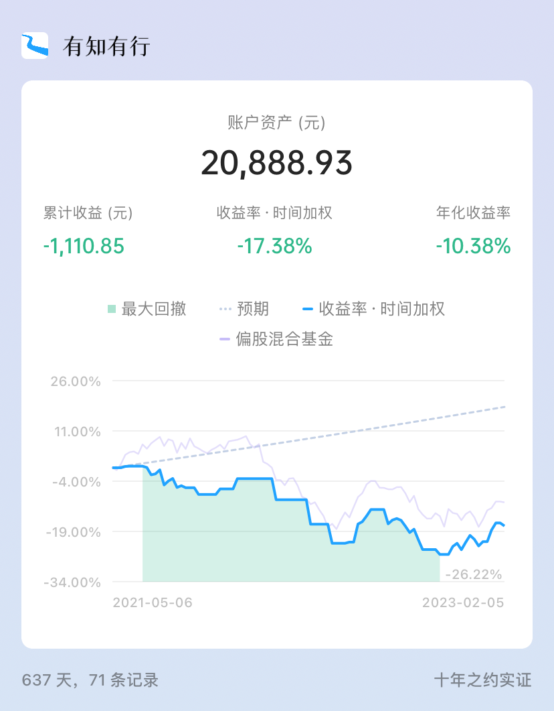

# 怎么给投资记账 | 十年之约 #18

**发布时间**: 2023-02-02 07:20:57

**原文链接**: [http://mp.weixin.qq.com/s?__biz=MzUzNjE3NzQ3Nw==&mid=2247491369&idx=1&sn=7d8e58fc23965eae5bfd01326b4fa0e9&chksm=fafb6103cd8ce81534b1d99da52eafb3e8b8e920830c1e85333d037d10ae8979ce872ff4b33d#rd](http://mp.weixin.qq.com/s?__biz=MzUzNjE3NzQ3Nw==&mid=2247491369&idx=1&sn=7d8e58fc23965eae5bfd01326b4fa0e9&chksm=fafb6103cd8ce81534b1d99da52eafb3e8b8e920830c1e85333d037d10ae8979ce872ff4b33d#rd)

---

昨天又聊到投资记账这个话题——虽然很多投资 App 都能自动计算收益曲线，但却时常收益虚高，显示的收益比我们的真实收益要多。

所以平时手动记录一下投资收益还是挺有必要的。

就着大伙的留言，也补充两个经常被问到的问题：

  * 投资记账的工具怎么选？

  * 收益曲线看时间加权还是资金加权？

### 1、投资记账 ≠ 消费记账

平时我会用 MoneyWiz 来记录我们家的消费开支和预算，这属于消费记账，也是大伙谈起「记账」两个字会先想到的场景。

比如 👆 这张就是 MoneyWiz 统计的开支预算进度

但是**大部分记账 App，并不适合直接给投资记账，会把问题搞得太复杂** 。

比如在 MoneyWiz 里记录投资账户，你要一笔笔记录每只基金的买入、卖出、手续费👇 这么记账，我会被逼疯的……

这还只是买入一笔的工作量

但这些细节对于投资记账根本不重要，投资记账最重要的就一件事儿——**到底赚了多少、赔了多少？**

比如我们往某基金账户转入了 1 万块，买了几只基金，过一段时间发现账户资产变成了 1.1 万。

那我们就知道自己赚了 1000 块，至于具体买了哪只基金、交易手续费是多少，**在记账中** 完全可以选择性忽略。其实**只关注这两个操作就好** ：

  * 我们往账户里转了多少钱？

  * 现在这个账户里有多少钱？

所以投资记账最好用专门的工具，以前我会用 Excel 表格，现在会直接用有知有行开发的有行记账 👇 有行记账主要也是两个按钮，转入转出（转入了多少钱） + 更新资产（现在账户里有多少）

这就够了～

只要定期记录这两个操作，收益曲线 + 市场指数对比慢慢就有了 👇

回顾转入转出记录和资产曲线对比也会有 👇

年度复盘也会有了 👇

这些有行记账都会自动生成，就这么点事儿～

所以第一个建议，**投资记账最好用专门的工具** ，消费记账和投资记账的关注点不一样。

### 2、怎么看曲线

另一个常被问到的是，看曲线应该选「时间加权」还是「资金加权」呢？两条线区别还蛮大的 👇 比如十年之约账户，时间加权收益率是 -17%，资金加权收益率就只有 -10%

先给大伙解释一下时间加权和资金加权的区别。

1、小学数学题，茅台股价先从 1000 元涨到了 2500，现在又跌倒了 1800。

问茅台涨了多少？

答案是涨了 80%，从 1000 元涨到 1800。**这就是「时间加权」** 。

2、但问题是，大家买茅台都赚到钱了吗？

显然没有。

像有的人，茅台 1000 块的时候没买，等茅台涨到 2500，他发现“核心资产才是未来”，赶紧冲进去买一手，到现在就亏了 28%。**这就是「资金加权」** 。

  * 时间加权，衡量的是这笔投资涨了多少？

  * 资金加权，衡量的是我到底赚了多少？

所以我们对比一下十年之约账户的时间加权收益（亏损 🐶）和资金加权。

👇 这是十年之约账户到今天的**时间加权** 收益曲线。曲线很明显落后了偏股混合基金指数，说明这段时间我在十年之约中持有的基金相对跑输了市场

👇 但用**资金加权** 曲线看一下。十年之约的资金加权曲线已经追平甚至反超了偏股混合基金曲线

这个区别来自于十年之约账户在去年市场底部坚持定投，所以拉低了持仓成本，等市场反弹以后，也就拿到了更大的收益。

用**这两条曲线对比，更容易给收益来源归因** ，比如十年之约账户就是：

  * 选择的投资标的暂时跑输市场（时间加权曲线）

  * 但坚持定投的习惯弥补了跑输的部分（资金加权权限）

带着这个结论，我就可以针对性地优化自己的投资体系——说明我的投资配置还不够均衡，可以改进（我从 2021 年以来在试着改进这部分），但投资买卖的习惯还不错，值得继续保持。

所以大家问我，是看时间加权曲线，还是资金加权曲线？

其实都得看，**两条曲线的对比差异，才是最大的价值所在** 。就像去池塘打鱼，选一个鱼多的池塘，和提升自己的打鱼技巧，都很重要。两条曲线都看，才知道问题出在哪。

……

不过平时给大家分享财务自由实证和十年之约实证时，我还是优先选择了时间加权。

原因是，这两个账户的资金转入转出规则都是固定不变的：

  * 财务自由实证衡量的是总资产，转入就是工资收入。显然，我没办法主动控制工资，不能说牛市少发工资，熊市让老板多发点；

  * 十年之约账户也是，每月 28 日定投 1000 元，这是定死的规则，10 年之内是不会变的；

既然是这样，总盯着资金加权曲线就没太大意义了。多花时间关注自己能控制的事儿，而不是纠结自己控制不了的问题。

回到大家的投资记账，我也是差不多的建议，时间加权和资金加权两条曲线都要看：

  * 如果**能够** 自由控制转入转出的账户，就优先看资金加权曲线；

  * 如果**不能** 自由控制转入转出的账户，就优先看时间加权曲线；

最后给大家贴一下我给十年之约记账账户的设置，供参考 👇（记账提醒是每月一次）

希望这两个问题，有给大家解释清楚。

PS：最后，坚持不懈地给有知有行带货，大家一起来记账呀～

* * *

**注：** 「十年之约」是我从 2021 年开始的一份长期实证，希望验证这么一件事儿——投资躺赚，不折腾、不挑时间、不高抛低吸、不看新闻预测未来、不盯盘，普通人也能获得不错的收益，长期年化 10% 的投资回报并不难实现。

但这个实证计划并不是给大家的投资建议，更多是我自己对投资的探索和验证，记录买入并持有过程中可能会面对的意外，也留下沿途的惊喜（**投资有风险** ，行动需谨慎）。感兴趣的小伙伴也可以一起读读之前几篇内容：

  * [不要盲目参考我的思路，建议这么用](http://mp.weixin.qq.com/s?__biz=MzUzNjE3NzQ3Nw==&mid=2247487547&idx=1&sn=0034f4608a935b280fa2ed305c03d393&chksm=fafb6e11cd8ce7073def3eb0fc42a8bda6b79e823f74c38466f4fe7a0af0ea2e12c19117a9f5&scene=21#wechat_redirect)

  * [为什么实证账户每个月才投 1000 元？](http://mp.weixin.qq.com/s?__biz=MzUzNjE3NzQ3Nw==&mid=2247488379&idx=1&sn=cd16ec5885a63fd6abdb6f2fba0fc0ae&chksm=fafb6d51cd8ce447cc0d2f13983463921890787f49cb8ef7706c11a3122b1c5b41ccc2b535ac&scene=21#wechat_redirect)

  * [现在还适合开始定投吗？](http://mp.weixin.qq.com/s?__biz=MzUzNjE3NzQ3Nw==&mid=2247488388&idx=1&sn=96ddf3fd0dc7d920c8a3742aa5fa6d0d&chksm=fafb6daecd8ce4b8d78dbee1e47b814e05bf46aea828a1cb0b4d6e1a7e6e067acc70bddb7b0b&scene=21#wechat_redirect)

  * [2021 年 3 月，我增加了一只基金](http://mp.weixin.qq.com/s?__biz=MzUzNjE3NzQ3Nw==&mid=2247488125&idx=1&sn=ff30274378ecda929a39a28a03a113ba&chksm=fafb6c57cd8ce5412744701e1c0995a20c24ed2562a4e868693cd5792a3f31d90efc3983bf70&scene=21#wechat_redirect)

  * [躺赚策略最大的缺点](http://mp.weixin.qq.com/s?__biz=MzUzNjE3NzQ3Nw==&mid=2247489447&idx=1&sn=763115532cefe70e905f12841e7ab8e2&chksm=fafb698dcd8ce09bb67280fac80e034165a3aaf5e29471ecc6b018aa7964f014938a3c1d1b74&scene=21#wechat_redirect)

  * [跟了 4 年多的基金经理离职了](http://mp.weixin.qq.com/s?__biz=MzUzNjE3NzQ3Nw==&mid=2247489693&idx=1&sn=809f67f0fa9f455bf81096d7e47d42d6&chksm=fafb66b7cd8cefa14558388037ba6133149c0329bc1d18d51bf563f1fc9436028746754b4652&scene=21#wechat_redirect)