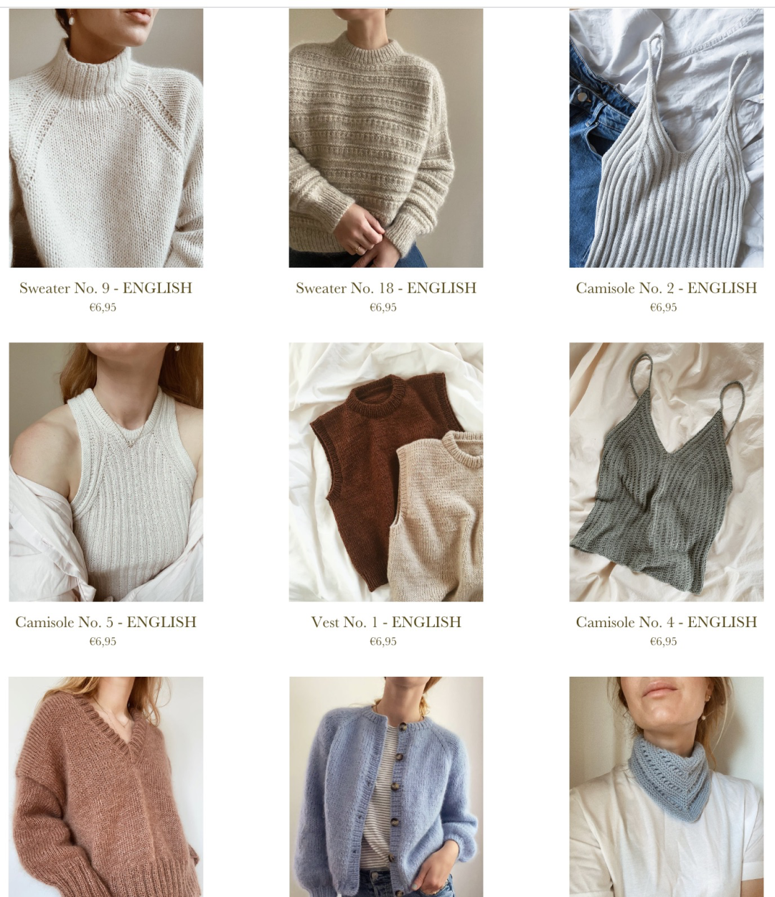

# 时间富裕比物质富裕更能给人幸福

**发布时间**: 2023-02-06 07:23:48

**原文链接**: [http://mp.weixin.qq.com/s?__biz=MzUzNjE3NzQ3Nw==&mid=2247491396&idx=1&sn=ac0e329a7b7a1d6000dcb218cb1a06e4&chksm=fafb616ecd8ce878092f0ffa4925fbbcf0ebebbfdd85cb006376b35d6dea29b5293cbfa85694#rd](http://mp.weixin.qq.com/s?__biz=MzUzNjE3NzQ3Nw==&mid=2247491396&idx=1&sn=ac0e329a7b7a1d6000dcb218cb1a06e4&chksm=fafb616ecd8ce878092f0ffa4925fbbcf0ebebbfdd85cb006376b35d6dea29b5293cbfa85694#rd)

---

后台收到一位小伙伴的留言，感觉很有意思和大家分享一下：

> 最近看你的 2020 年的变化和买房计划，反复看了几遍。
> 
> 我家的情况是需要一个人多点时间在家庭上，如果两个人都忙的话，孩子就没人管了。所以一直很焦虑怎么弄。我收入占家庭收入一半，不想把重担都弄在一人身上，但是一时半会儿也不可能财务自由。
> 
> 看了你的文章，我的想法就是，定个 300 万的目标，这样如果年化收益能达到 8% 的话，那就相当于有人替我上班了，想想都觉着也没那么难了。
> 
> 之前会这么想，有 300 了，又想换好点的学区房，深圳的高房价，买了估计也没剩渣渣了，又得焦虑和不停工作了。
> 
> 真是换个思路，就大为不同啊。

当小伙伴关注「物质」的时候，300 万可能才够换个学区房（应该是基于旧房子的置换），依旧充满焦虑。

但换个角度关注「时间」，用 300 万本金获得被动收入，解放其中一个人的工作时间，感受却全然不同。

最近重读《幸福的方法》，里面有句话特别喜欢——**时间上的富裕比物质上的富裕能带给人更多的幸福感。**

刚好和小伙伴的感受闭环了～

……

也从这个视角分享一下重读这本书以后的感悟。

> 人生有两种基本需要，那就是“当前的快乐 ＋ 未来的获益”。

如果只有当下快乐，却没有未来，最后人就会觉得空虚、焦虑，或者「没有意义」。意义是人生活的原动力。

如果只有未来收获，当下却很难熬。最后我们常常要么不敢停下，想着先苦后甜却一直苦下去；要么中途自暴自弃，最后的结果也是，只有“先苦”没有“后甜”。

就像这个怪圈：上学很辛苦，别人告诉你，「上了大学就好了」。结果到了大学还是很辛苦，别人告诉你，「找到工作就好了」。结果找到工作又卷又辛苦，别人告诉你，「升职加薪，有钱就好了」…… 永远没有尽头

因为生活根本没有终点，所以想要通向幸福，**靠的不是先苦后甜，而是主动寻找对未来有意义、又让自己当下感到快乐的事儿** （或者做事方式）。最幸福的人，不是「熬到辞职就好了」，而是「踩着踢踏舞去上班」。

但是，如何找到这样的事儿呢？

作者的回答很有意思，意外的简单。关键不是想「哪些事儿又有意义、又快乐」，而是问自己，生活中**已有的事儿** ，哪些是自己想做的，哪些是不得不做的，然后：

  * 每天让“想要做”的事儿多一点；

  * 每天让“不得不做”的事儿少一点；

这个方法行动起来很容易，而想要越走越远，就要回到前面说的「时间富裕」

> 时间上的富裕比物质上的富裕能带给人更多的幸福感。
> 
> 时间上的富裕，代表人们有更多的自由时间去追求对个人有意义的事情，有更多的时间去反思，去享受快乐。
> 
> 相反，时间上的窘迫给人的感觉是经常性的压力、忙碌奔波、工作过量，以及挫败感。

就像 Housel 说财富对他的意义——获得支配时间的能力，**可以决定自己何时起床** ，决定自己起床以后做什么、不做什么（他还因此选了很“不划算”的全款买房）

获得时间的富裕，也需要财富，但更取决于我们使用财富的方式。就像我们一直说的，财务自由的意义不是想买啥就买啥，也不是车子、房子，而是不想做的事儿可以不做的权利。不得不做的事儿越少，留给「想做」的时间才会越多。

关注财富，重点应该放在如何获得更多的可支配时间，而非可支配收入。

而反过来想，要获得可支配时间，常常并不需要那么多钱。

  * 财务自由：[我的财务自由实证之路](http://mp.weixin.qq.com/s?__biz=MzUzNjE3NzQ3Nw==&mid=2247491353&idx=1&sn=0905510e46534774c73b3fb45ae2b87a&chksm=fafb6133cd8ce82593510fbd9a2569a5d7b6badfd19c34df3837a30f2caccf17c422239e256d&scene=21#wechat_redirect)

  * 投资笔记：[十年之约，躺赚不难](http://mp.weixin.qq.com/s?__biz=MzUzNjE3NzQ3Nw==&mid=2247491369&idx=1&sn=7d8e58fc23965eae5bfd01326b4fa0e9&chksm=fafb6103cd8ce81534b1d99da52eafb3e8b8e920830c1e85333d037d10ae8979ce872ff4b33d&scene=21#wechat_redirect)

  * 抵御风险：[12 月保险最推荐](http://mp.weixin.qq.com/s?__biz=MzUzNjE3NzQ3Nw==&mid=2247491239&idx=1&sn=10c79c4510f985616909ae53e52952e0&chksm=fafb608dcd8ce99bdc4a0b76f1be88286fc2b6c4da5bfefa0a37e9a33b2049c16e3c5ef9f8bc&scene=21#wechat_redirect)

  * 干货汇总：[财务自由路上应该了解的每一个问题](http://mp.weixin.qq.com/s?__biz=MzUzNjE3NzQ3Nw==&mid=2247489926&idx=1&sn=eac357cebcbfd7250828cdda88d9f122&chksm=fafb67accd8ceebaa1e750f129714bb000be9720a990a70c6fba6fc52fd3712014a58d699d6e&scene=21#wechat_redirect)

* * *

PS：

加一段，**谢谢大家** 在周五给也太的打赏。她开心地用大家的打赏换了一套专门织袖子的短棒针 👇 不用以前几根长针扭来扭曲了～

（是不是也间接验证了，装备不是把爱好做好的原因，只是做好以后的奖励 ☺️）

关于大家问的针织经验，也太补充了一条我这个外行吃瓜群众没想到的，**技术之外，寻找审美好的作者也很重要** 。网上大部分针织教程都在关注技术，提到审美的却不多。

但手工技术再好也很难超越工业流水线。所以织出来的毛衣能经常穿、甚至取代购买，还得是更漂亮、外面买不到的设计。

现在网上已经有很多图解作者，会设计毛衣款式然后出对应图解。我们**不用亲自设计毛衣，只要能区分哪件更好看就行** 。然后每当发现更好看的款式，就留意去找原作者。通常审美好的作者，设计的其他款式也同样在线，还会结识更多同水平的其他作者。最后我们掌握的资源水平就会越来越高了～

我让也太分享了几个她比较喜欢的图样款式和作者 👇

1、Petitknit

2、https://myfavouritethings-knitwear.com

3、gregoriafibers

希望对大家有帮助～

再次感恩大家的鼓励 🙏