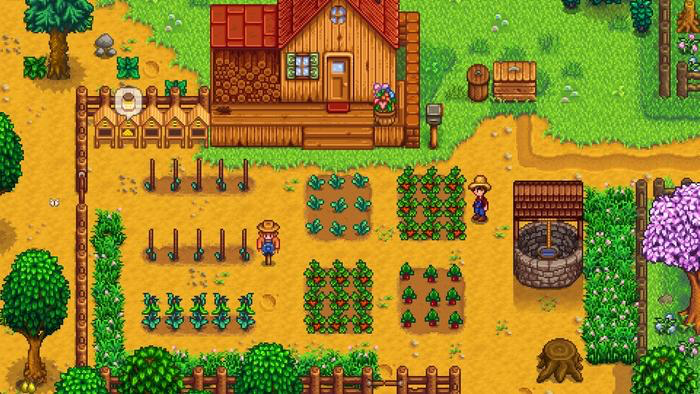
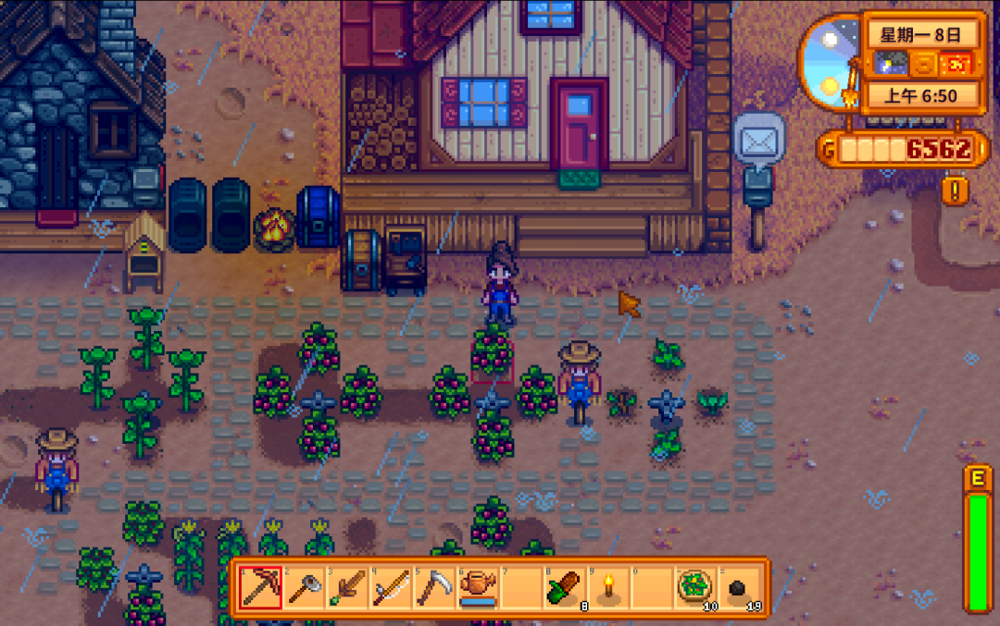
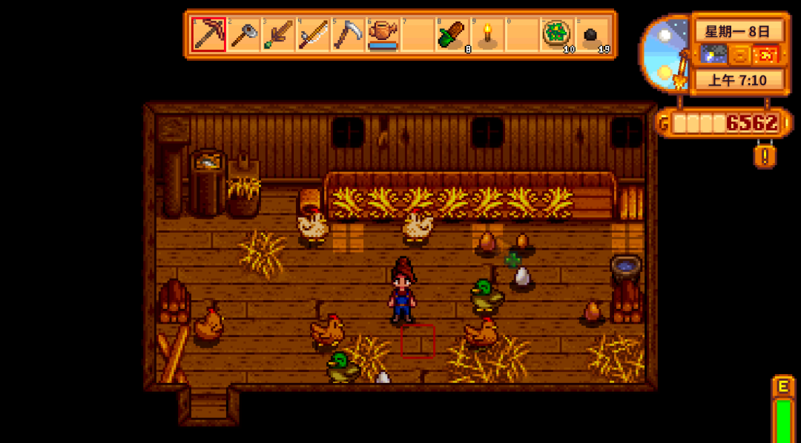
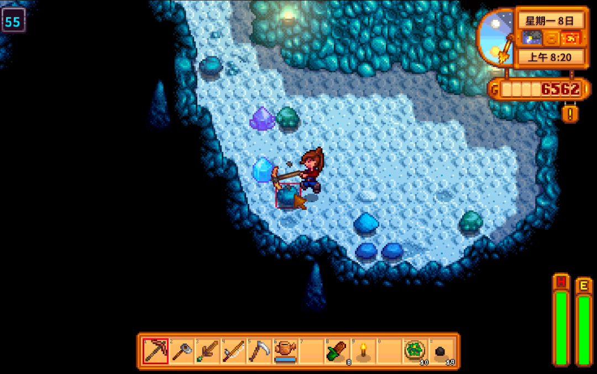
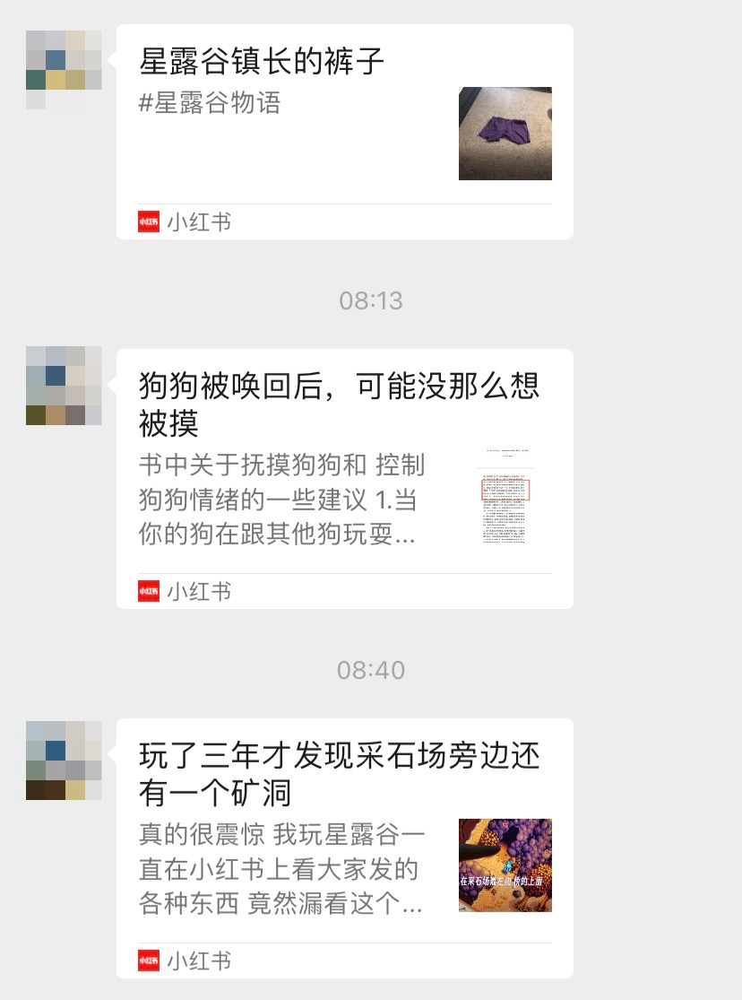

# 最近好玩的

**发布时间**: 2023-02-14 07:28:40

**原文链接**: [http://mp.weixin.qq.com/s?__biz=MzUzNjE3NzQ3Nw==&mid=2247491454&idx=1&sn=d96b831cb46e89357006eac9ef3b7acb&chksm=fafb6154cd8ce84248f5da0d9e9e9acf96389047e17d9339bea387e8235d8a553fdc2632b944#rd](http://mp.weixin.qq.com/s?__biz=MzUzNjE3NzQ3Nw==&mid=2247491454&idx=1&sn=d96b831cb46e89357006eac9ef3b7acb&chksm=fafb6154cd8ce84248f5da0d9e9e9acf96389047e17d9339bea387e8235d8a553fdc2632b944#rd)

---

最近我和也太被安利了一个可以联机、经营生活的游戏——星露谷物语。

先被戳到的是，这个游戏从头到尾、甚至连游戏配乐，都是**作者一个人搞出来的，为此花了大约 5 年的时间** 。而且，此前貌似作者并没有游戏开发经验。

游戏的背景是，主角受够了上班打工的日子，回去继承了爷爷已经荒废的农场，重新开始生活。

这里可以种地：‍‍

建造鸡舍、畜棚：‍‍

进山采矿：‍‍

等等等…… 来获得收入和资源，经营和升级自己的农场，振兴这座小镇。

我和也太一直苦于模拟人生不能联机，发现星露谷物语可以一起搞建设就果断入坑了。

从那以后也太给我分享的各种小红书帖子里，星露谷物语主题就占了一大半：‍‍

……

原本我们就是单纯想玩游戏，没想到玩着玩着，居然**体验到了「主动收入」和「被动收入」的酸甜苦辣** 。

我们还在游戏早期开荒阶段，主要收入来源就是种地、卖农作物换钱。而种地又需要定期浇水，所以面对两个选项：

1、用水壶手动浇水。初期手动浇水能浇灌的面积更大，所以能同时种很多作物，收入更高。但需要人走来走去，一个一个点，消耗时间和体力，属于「比较高的主动收入」。

2、打造喷灌机自动浇水。因为资源有限，我们只能建很少、很初级的喷灌机，能种的作物就少得多了，大约只能有手动浇灌的 1/3，属于「低一些的被动收入」。

显然主动收入来钱快呀，反正也是玩游戏，我和也太就很自然地选了升级水壶、手动浇水。我们原本手动浇水的面积，比这张网友分享的加一起还大不少：

但没过过久，也太就撂挑子了

‍

太影响游戏体验。也太从早上起来开始浇水，**浇完以后就下午 5 点了，体力也消耗无几** 。根本没时间去探索游戏里各种好玩的设定，只剩下重复劳动、不断搞钱。

中间我们升级了一次水壶，一次能浇灌原来的 3 倍面积。按理说应该轻松一些了吧。

结果并没有，更高效的水壶马上就变成了更大的耕种面积，种更多的地、赚更多的钱，到头来还是没有时间。

是不是很像生活里的某件事儿

全程都是下意识行动，直到也太撂挑子不干了，我得想办法把队友留住，才注意到这个问题。

现在，我们就只考虑自动浇水了。能自动浇灌多少面积，就种多少东西，即便能种的面积小得多，还跟狗啃的似的 👇 多的咱不要了，游戏里那么多好玩的东西，哪能把时间都花在浇水上了

游戏里累计十几个小时，我们居然又复刻了一遍现实生活的选择：

  * 主动收入赚得多，但游戏体验却很差。每天浇完水，时间和体力都所剩无几了，也没时间精力去探索其他可能性。

  * 被动收入赚得少，起初很慢，但游戏体验一下好了很多。每天能有大把时间去探索好玩的事儿，收集物品、探索地图、做任务、下矿挖宝……

反过来想，很多小伙伴财务自由路上会焦虑一件事儿——一定要被动收入的金额和主动收入相当才算是自由，但这样一来，就要等太久太久了。

而现实的情况未必如此，更重要的不是收入数额的多少，而是如何获得更多的时间。就像我们上周写的，[时间富裕比物质富裕更能给人幸福](http://mp.weixin.qq.com/s?__biz=MzUzNjE3NzQ3Nw==&mid=2247491396&idx=1&sn=ac0e329a7b7a1d6000dcb218cb1a06e4&chksm=fafb616ecd8ce878092f0ffa4925fbbcf0ebebbfdd85cb006376b35d6dea29b5293cbfa85694&scene=21#wechat_redirect)。数额较少但换来自由时间的被动收入，体验甚至显著好于收入高得多的主动收入。

**财务自由，除了把被动收入提上来，还有另外一个角度，就是主动用自己的生活方式去适配已有的被动收入。**

有类似焦虑的小伙伴应该叫上队友，来玩一把星露谷物语

‍

而且话说回来，有了更多自由时间、探索更多可能性，收入也不会一直都很差。后来我们发现用钱投资鸡舍、畜棚，然后再搞产品深加工，收入也很棒，却比当农民硬肝快乐多了。如果只是惯性地种地浇水、种地浇水，像老鼠赛跑一样，可能很长时间都不会发现这些。

好好的一个模拟经营游戏，居然叫我玩出了这样的感悟。该说是游戏的细节设计太贴近现实体验（**劳作消耗的时间和体力设计很妙** ），还是说，人面对类似的困境总是会做出相似的选择呢～

  * 财务自由：[我的财务自由实证之路](http://mp.weixin.qq.com/s?__biz=MzUzNjE3NzQ3Nw==&mid=2247491353&idx=1&sn=0905510e46534774c73b3fb45ae2b87a&chksm=fafb6133cd8ce82593510fbd9a2569a5d7b6badfd19c34df3837a30f2caccf17c422239e256d&scene=21#wechat_redirect)

  * 投资笔记：[十年之约，躺赚不难](http://mp.weixin.qq.com/s?__biz=MzUzNjE3NzQ3Nw==&mid=2247491369&idx=1&sn=7d8e58fc23965eae5bfd01326b4fa0e9&chksm=fafb6103cd8ce81534b1d99da52eafb3e8b8e920830c1e85333d037d10ae8979ce872ff4b33d&scene=21#wechat_redirect)

  * 抵御风险：[2 月保险最推荐](http://mp.weixin.qq.com/s?__biz=MzUzNjE3NzQ3Nw==&mid=2247491417&idx=1&sn=7d9460869c5c1652fa2800e3e4486b93&chksm=fafb6173cd8ce86532d72bad850018e83ed58489839421953d98947f65f920270a2fcce7b515&scene=21#wechat_redirect)

  * 干货汇总：[财务自由路上应该了解的每一个问题](http://mp.weixin.qq.com/s?__biz=MzUzNjE3NzQ3Nw==&mid=2247489926&idx=1&sn=eac357cebcbfd7250828cdda88d9f122&chksm=fafb67accd8ceebaa1e750f129714bb000be9720a990a70c6fba6fc52fd3712014a58d699d6e&scene=21#wechat_redirect)

* * *

### one more thing

原本写到上周五，我就打算从 A 周（输出分享为主）切换到 B 周（输入充电为主）的。结果翻了翻日历突然发现还不行，多少也得坚持到今天周二，翻完情人节**征友留言** 才行。

这次的寄语是——希望能帮更多小伙伴找到一起玩游戏的队友～‍‍

大伙可以慢慢写，前 30 分钟我先照常翻和前面正文相关的讨论（如果今天还有的话），之后再来翻大家的征友留言

‍‍