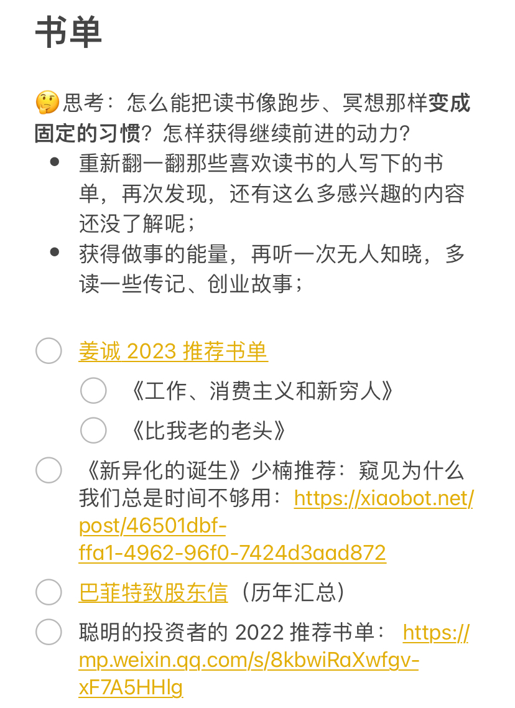

# 回来啦～

**发布时间**: 2023-03-06 07:33:19

**原文链接**: [http://mp.weixin.qq.com/s?__biz=MzUzNjE3NzQ3Nw==&mid=2247491463&idx=1&sn=e07b38504c69a751e745387c3f7ae3ee&chksm=fafb61adcd8ce8bb06fd7dde89eafc2e0617fd8f6daf3ef137ef1842f1732a9bb7dca42ebb8e#rd](http://mp.weixin.qq.com/s?__biz=MzUzNjE3NzQ3Nw==&mid=2247491463&idx=1&sn=e07b38504c69a751e745387c3f7ae3ee&chksm=fafb61adcd8ce8bb06fd7dde89eafc2e0617fd8f6daf3ef137ef1842f1732a9bb7dca42ebb8e#rd)

---

之前和大家分享过一篇「[不上班就会与社会脱节](http://mp.weixin.qq.com/s?__biz=MzUzNjE3NzQ3Nw==&mid=2247490886&idx=1&sn=1dcbd63a60be547c468eb8a5401c5c18&chksm=fafb636ccd8cea7afa4589587920986864ff7ce672f505745637cb7ca8f4c70e9885b67f10c2&scene=21#wechat_redirect)」，这是当时点赞最高的留言 👇

> 讲真我觉得上班才是真的和社会脱节，特别是 996 的工作，连个人时间都没有。假如你是招聘人事，你的世界就只剩下招人/约面试；如果是运营可能就是各种相关数据，根本没有闲心去看世界发生了什么事……

虽然相比于很多还在上班的小伙伴，我平时已经够灵活自由了，可以尝试各种想做的事儿。但刚经过 A 周的忙碌，进入休息充电的 B 周，还是偶尔会有这样的感觉——**忙碌时，我好像没有把自己和生活照顾好** 。

进了 B 周，好像一下充满了能量，跳起来把好多拖延已久的问题都解决了。

搁置几个月，终于把厨房背板装好了。给大家参考一下对比效果 👇 比贴瓷砖便宜，整体感也不错，以后更换也方便

修理了大部分新房交付的问题，比如卧室门关不上。修好以后不禁感慨，我们真能忍，睡眠质量终于大幅提升（到平均水平 😂）

上手了画图 AI Midjourney。虽然还是入门选手，但好歹**今天的题图是我自己“画”的** 。丑但快乐着

正视“眼睛大肚子小”、书单越堆越长，着手消灭他们。除了读，还删了一批承认自己没那么想读的书。

然后，我在书单笔记开头写下了一句提醒：

……

当初读《倦怠社会》，特别喜欢「深度无聊」这个词：

> 如果说，睡眠是身体放松的最高形式，那么深度无聊则是精神放松的终极状态。一味的忙碌不会产生新事物。它只会重复或加速业已存在的事物。

当我们停下来，主动选择一段时间“无所事事”，才更容易看到那些**显而易见、却一直视而不见** 的东西。

最近读《像火箭科学家一样思考》，刚好也有一章「多做点无聊的事情」：

> 我刚起床便抓起手机，把早上该看的消息通知翻一遍。正当我开始滚动阅读各类信息时，我突然领悟了一个真谛——我记不清上一次感到无聊是什么时候了。
> 
> ……陷入无聊之后，我们的大脑不再对外部世界产生反应，而是听从内心感受。这种心态释放出我们已知的最复杂工具，把大脑**从收敛模式转换为发散思维模式** 。当心灵开始漫游和做白日梦时，我们大脑中的默认模式网络便自动连接了起来，而一些研究表明，该网络在发挥创造力方面起关键作用。
> 
> 你的思绪看似在毫无关联的主题之间漂移，但你的潜意识在勤奋工作、巩固记忆、建立关联、把新主题与旧主题结合起来，形成新的组合体……它让你的大脑在截然不同的对象（比如一只苹果和一只橘子）之间自由地建立连接。
> 
> 下次你感到无聊的时候，务必抵抗住诱惑，不要主动去看数据或做一些“有成效”的事情。无聊也许是你能做的最有成效的事情。

无聊，而非用各种任务把日程填满，也不是一停下来就急不可耐地刷起社交媒体、看行情，能给生活注入更多能量。

……

上次有小伙伴让展开聊聊 A、B 周工作模式的感受（A 周：工作输出，B 周：休息充电）

我想，**也许 A、B 周最大的区别并不是输出与输入，而是让我们可以主动选择面对压力和忙碌的态度** 。

A 周，面对压力和忙碌，我们选择坚持和突破。就像健身尽可能“咬牙”完成任务，哪怕有些痛苦。他们不总是负面，也可以让我们更专注、更聚焦。

B 周，就像训练过后的恢复，甚至是超量恢复。人陷入忙碌以后，容易忘了自己当初的目的，只剩下惯性。需要在休息和无聊中重新整合过往的成果和下一步的方向。

（这段是写到这才想到的

 这也是我最喜欢写作的地方。不仅是对外分享，也是理清思路和发现想法的工具）

**但就像忙碌久了，容易忘记初心，深度休息的效果也随时间递减** 。第 1 周觉得自己重获新生；第 2 周开始实践各种新想法；但第 3 周，因为少了压力，慢慢就成了懒惰占据上风……

该回来就得回来了。

……

如果把几个星期放大到几年，财务自由也是个大号的 B 周。

很多人觉得，财务自由以后就是永远都不工作了。但财务自由只是「中点」不是「终点」。

这段时间网上「上海夫妻 300 万退休」的视频很火，有小伙伴让我说说。

虽然没看过原视频，但基于这么多年的观察还是可以大胆预测——如果持续关注他们后面的分享，一定会发现，休息、玩乐的部分会渐渐变少，而思考、“做事儿”的内容会慢慢增加。

其实就是很朴素的道理。

**休息“不再工作”之所以让人心动，恰恰是因为之前的忙碌。**

**也是因为休息“变得空虚”，接下来的忙碌才会如此充实。**

自由，只是给我们决定如何面对忙碌与压力的选择权。我们可以选择停下，也可以选择重新出发。

  * 财务自由：[我的财务自由实证之路](http://mp.weixin.qq.com/s?__biz=MzUzNjE3NzQ3Nw==&mid=2247491353&idx=1&sn=0905510e46534774c73b3fb45ae2b87a&chksm=fafb6133cd8ce82593510fbd9a2569a5d7b6badfd19c34df3837a30f2caccf17c422239e256d&scene=21#wechat_redirect)

  * 投资笔记：[十年之约，躺赚不难](http://mp.weixin.qq.com/s?__biz=MzUzNjE3NzQ3Nw==&mid=2247491369&idx=1&sn=7d8e58fc23965eae5bfd01326b4fa0e9&chksm=fafb6103cd8ce81534b1d99da52eafb3e8b8e920830c1e85333d037d10ae8979ce872ff4b33d&scene=21#wechat_redirect)

  * 抵御风险：[2 月保险最推荐](http://mp.weixin.qq.com/s?__biz=MzUzNjE3NzQ3Nw==&mid=2247491417&idx=1&sn=7d9460869c5c1652fa2800e3e4486b93&chksm=fafb6173cd8ce86532d72bad850018e83ed58489839421953d98947f65f920270a2fcce7b515&scene=21#wechat_redirect)

  * 干货汇总：[财务自由路上应该了解的每一个问题](http://mp.weixin.qq.com/s?__biz=MzUzNjE3NzQ3Nw==&mid=2247489926&idx=1&sn=eac357cebcbfd7250828cdda88d9f122&chksm=fafb67accd8ceebaa1e750f129714bb000be9720a990a70c6fba6fc52fd3712014a58d699d6e&scene=21#wechat_redirect)