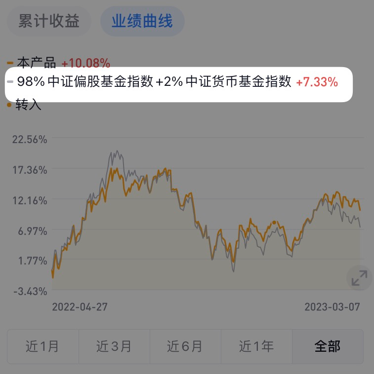
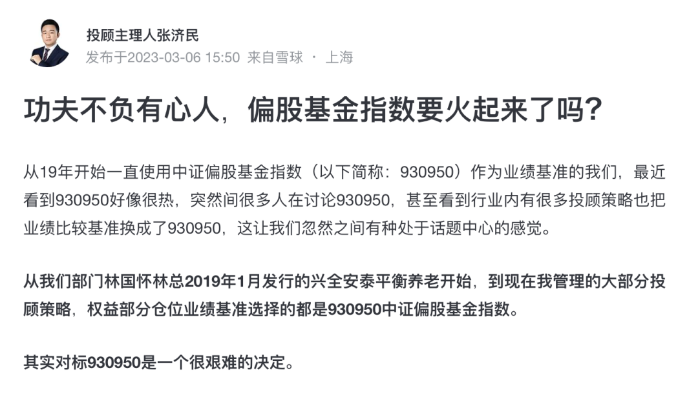

# 想让我的方法更容易持续、更容易参考 | 十年之约 #19

**发布时间**: 2023-03-09 07:27:02

**原文链接**: [http://mp.weixin.qq.com/s?__biz=MzUzNjE3NzQ3Nw==&mid=2247491495&idx=1&sn=1a0be0e5f325a1c12c06eaddee175de5&chksm=fafb618dcd8ce89bef202e6f4d749a2f9ecd8f8867aabd140e2f196d1c38875fe82cddf37e0c#rd](http://mp.weixin.qq.com/s?__biz=MzUzNjE3NzQ3Nw==&mid=2247491495&idx=1&sn=1a0be0e5f325a1c12c06eaddee175de5&chksm=fafb618dcd8ce89bef202e6f4d749a2f9ecd8f8867aabd140e2f196d1c38875fe82cddf37e0c#rd)

---

这是我分享自己财务自由计划的第 6 年。从第 3 年开始，我试着定期整理一篇长文，把过去**所有、认为对大家有持续价值的部分** 整理出来，那一年有了[一文打包三年干货](https://mp.weixin.qq.com/s?__biz=MzUzNjE3NzQ3Nw==&mid=2247486426&idx=1&sn=467d0a4037dc9aa5a2e1fd5dfba066fc&scene=21#wechat_redirect)，后来变成了“四年”，再后来变成了[全都安排好了，财务自由路上我们需要了解的每一个问题](http://mp.weixin.qq.com/s?__biz=MzUzNjE3NzQ3Nw==&mid=2247489926&idx=1&sn=eac357cebcbfd7250828cdda88d9f122&chksm=fafb67accd8ceebaa1e750f129714bb000be9720a990a70c6fba6fc52fd3712014a58d699d6e&scene=21#wechat_redirect "全都安排好了，财务自由路上我们需要了解的每一个问题 原创")。我把自己从上学开始构思 30 岁财务自由、到一步步实现的方法和思考，都整理在里面。

时间又过了一年，特别惊喜，一般公众号写干货阅读量会少一些，当初发这篇时阅读量也只有 1.9 万，比同期低了不少。但现在回头看，陆陆续续居然有 **8.6 万小伙伴看过** ，成了我阅读量最高的文章～

这周一直被大家问到两个问题：

1、现在经济这么差，还能投资吗？

2、我说能，然后举了一些数据。又被追问，数据是很好，但我们怎么赚到这个数据呢？

所以，就有了这篇，更新一下投资部分的思考。从 2021 年到现在，我在投资方法上进化最多的部分，就是让自己的方法更容易持续、更容易参考。

### 先说说这篇文章应该怎么用

获得年化 10% 的投资收益，是我财务自由计划中很重要的一部分。这样一来，攒够家庭年度开销 10 倍的本金，就算是财务自由了。

财务自由不能光盯着本金，重要的是我们能用这些本金获取多少被动收入。比如 **50 万本金看起来不算多，但如果每年能获得 5 万的被动收入** ，是不是也够一个小城市月薪几千的小伙伴财务自由了？

但获取 10% 的投资收益还不够。我的计划中还包含着「[投资亏钱的年份怎么办？](http://mp.weixin.qq.com/s?__biz=MzUzNjE3NzQ3Nw==&mid=2247488950&idx=1&sn=284d5309e8a8ad44266506b2322dfeb7&chksm=fafb6b9ccd8ce28ade296e6e1ab4091da302d86760c372236b8bb516245c361ca432a3f58148&scene=21#wechat_redirect)」、「[如果没实现 10% 的投资收益怎么办？](http://mp.weixin.qq.com/s?__biz=MzUzNjE3NzQ3Nw==&mid=2247488963&idx=1&sn=da44254227d0ca16f3e7e2f9cc30ef5c&chksm=fafb6be9cd8ce2ff9c3ffc043569c3352d124ec85bfa52b4865cbf9c35350eef2528b8a15bb4&scene=21#wechat_redirect)」。这是我想提醒大家的 👉 投资理财也得考虑到，如果这个计划没成功，得有 Plan B。所以，还是非常建议大家给前面的干货汇总增加一下阅读量  里面都有写。这篇文章**只会关注如何获得 10% 投资收益的部分** 。

先从 👇 这个问题开始说

### 我在欧洲，买美股特别方便，为什么还要费劲投资 A 股？

很多人觉得 A 股是垃圾，但我觉得 A 股比美股收益高。只是有个前提，把专业的事儿交给专业的人。

比如「Wind 偏股混合基金指数」，衡量的是偏股混合基金的平均收益，也就是基金经理这些专业的人的平均收益。我们拿这个指数和美股标普 500 比 👇 其实是跑赢的

一个细节：对比 A 股和美股收益时，合理选择起止时间也很重要，一定要考虑到**完整的牛熊周期** 。美股近 10 年收益都很平稳，但 A 股波动很大，如果只看牛市，涨幅巨大；只看熊市，又跌到尘埃里。只有看完整牛熊周期才能还原 A 股的本色。

从 2019 年到今天，算上去年的大跌，偏股混合基金指数的涨幅还是有 101%，**折合年化收益大约 14%** 。比我预期的 10% 要高。

所以我更喜欢 A 股。

### 如何跟上偏股混合基金指数

但是很多小伙伴说，虽然偏股混合基金指数收益很好，但不能直接买啊。在美股你可以直接买标普 500 指数基金，但是在 A 股没有「偏股混合基金指数基金」。基民买基金，能跑赢偏股混合基金指数的太少了。

嘿，这就是我 21 年以来最大的收获了，也是这篇文章最想和大家说的，**有计划地获得偏股混合基金指数的方法** 。

回头看 2 年前和大家聊[如何获得 10% 年化收益](http://mp.weixin.qq.com/s?__biz=MzUzNjE3NzQ3Nw==&mid=2247488904&idx=1&sn=df82b96fcede392249995ea728d1c888&chksm=fafb6ba2cd8ce2b4100cb43171126a08ed4f8754f286d93a5dfb7ed5a23236559805af754022&scene=21#wechat_redirect)，我还是传统「选基金」的思维，想选一个能跟上甚至跑赢偏股混合基金指数的基金。

但这个方法有个缺陷。比如说富国天惠，过去 5 年 ta 和偏股混合基金指数的对比，一致性看起来很好 👇

但如果看某一段时间，比如 2021 年以来 👇 时不时就会有大幅偏离，这时候就容易焦虑

直到后来转变思路，先想偏股混合基金指数是怎么计算出来的？

其实 ta 就是比较有代表性的偏股混合基金的「平均收益」。那转变思路，**与其想着买一只基金超越偏股混合基金指数，不如就分散把代表性的基金都买了，自然就能拿到平均收益了** 。

这个思维转变还要感谢[兴全基金的一篇研究](http://mp.weixin.qq.com/s?__biz=MzUzNjE3NzQ3Nw==&mid=2247489499&idx=1&sn=9af022397ccc526882c953ab0fc5cb20&chksm=fafb69f1cd8ce0e7c6f9604a260f31863f47bee85a162734428a3710f1fdb4ced88971db4efc&scene=21#wechat_redirect)——只要合理分散、持有 10～20 只基金，就可以非常接近偏股混合基金指数的收益了。

再后来，我发现了更简单的方法——继续把专业的事儿交给专业的人——提出这个方法的兴全，早就在按照这个思路做投顾和 FOF。

比如我在十年之约中定投的兴全进取派优选，目标正是跟上并跑赢中证偏股基金指数（注：中证偏股基金指数和 Wind 偏股混合基金指数不完全一样，但逻辑共同）

我也在[有行记账](http://mp.weixin.qq.com/s?__biz=MzUzNjE3NzQ3Nw==&mid=2247487794&idx=1&sn=b9db83140ef56b777315a5e415954736&chksm=fafb6f18cd8ce60eeebe855dcd793f173a5589e51657877fb9e8a2fff629eeb17688a40e2766&scene=21#wechat_redirect)里记录了兴全进取派优选的收益曲线和偏股混合基金指数对比：

这是扣除投顾费以后的真实收益曲线（手动记录没那么及时，所以曲线不太平滑，大伙见谅）

跟踪得很好，暂时也做到了跑赢。

后来读兴全投顾主理人的文章才发现，兴全早在 2019 年就开始逐步采用偏股基金指数作为业绩基准了 👇

原文链接：https://xueqiu.com/1183560953/243632946

这是一种思路，比较直接。

……

然后，我发现自己有了一个心态上的转变。

之前：我是因为自己持有的基金偏离偏股基金指数而焦虑。后来，我有了能够有效跟上偏股基金指数的方法。

之后：好玩的是，一旦有了这个方法，再看我持有的其他基金和组合暂时偏离偏股基金指数，就再也没那么焦虑了。

因为了解的过程中我注意到两件事儿：

  1. 偏股基金指数，只是所有偏股基金的平均收益，并不神奇；

  2. 想要获得平均收益，也不需要买所有的基金，只要合理配置 10～20 只就够了；

所以**可靠的主理人 + 均衡分散的投资方式 + 时间** ，哪怕是暂时偏离偏股基金指数，最后也大概率还能跟得上。

这算不算又验证了一次「焦虑的反义词是具体」。

虽然我们在说如何跟上偏股基金指数，但其实这更多是一种思考方式，去理解投资收益从哪来。并不是只有买偏股基金指数（也买不了）才能获得这样的收益。

### 大幅简化

想明白偏股混合基金指数的问题，我的投资方法就又简单了一些。而且这个方法也比以前更方便大家参考，逻辑更清晰。

**在美股，普通人投资的目标是跟上标普 500。**

**在 A 股，我投资的目标就是跟上偏股混合基金指数。**

A 股收益不比美股差，只是我们需要谨慎地选择观察的视角和时间段。现在我们也有方法跟上偏股混合基金指数，获得同等甚至更高的回报。

上一轮牛熊，偏股混合基金指数的收益达到了年化 14%。虽然下一轮牛熊会是多少我们不能预测，但就像[周二写的](https://mp.weixin.qq.com/s?__biz=MzUzNjE3NzQ3Nw==&mid=2247491470&idx=1&sn=39e0ce9bd67ead9c8fa856cfb9159801&scene=21#wechat_redirect)，我相信可以继续做到：

> **物价通胀 ＜ GDP 增长 ≈ 工资增长 ＜ 投资收益**

这是财务自由计划的基础。而且就像前面说的，我们也要做好了 Plan B，能承受没有实现预期的后果。做个理性的乐观派～

* * *

### 十年之约 #19

虽然我一直在说，**已经设置自动定投，不择时、一直都会投入** 。但还是持续有小伙伴问我——你还在投吗？

那我也只好当个复读机：还在持续投资 😂 十年之约实证账户（每月定投富国天惠、兴全合宜、兴全进取派优选）没有中断过

有了这两年的新知，发现持有少数几只基金的体验确实不够好。有考虑后面换成更均衡分散的投顾组合或者 FOF，在[前两期谈过这个计划](https://mp.weixin.qq.com/s?__biz=MzUzNjE3NzQ3Nw==&mid=2247491220&idx=1&sn=6298208a52eb99eef5fa8a26e720cbda&chksm=fafb60becd8ce9a8d5470ed165b29ec5b9d5480621ed9944ac24e9e433485a7b3ee4685a4031&scene=21#wechat_redirect)。

不过现在还不是时候。一方面是估值，另一方面是我相信靠谱的基金经理长期能跟上偏股基金指数，所以不会在他们跑输的时候换 👇 否则，不就又成了追涨杀跌

以上就是今天想聊的全部啦，希望对大家有帮助。

……

最后还要再提醒一次，不管我这次谈到的偏股基金指数，还是我的十年之约实证，都不是建议大家直接去买 ta（当然你也可以参考，看见熊市里我亏得比你们都惨，多少能有点安慰效果 😜）

更多是想以此给大家一个思考的起点——投资躺赚，不折腾、不挑时间、不高抛低吸、不看新闻预测未来、不盯盘，普通人也能获得不错的收益，长期年化 10% 的投资回报并不难实现。

感兴趣的小伙伴也可以一起读读之前几篇内容：

  * [不要盲目参考我的思路，建议这么用](http://mp.weixin.qq.com/s?__biz=MzUzNjE3NzQ3Nw==&mid=2247487547&idx=1&sn=0034f4608a935b280fa2ed305c03d393&chksm=fafb6e11cd8ce7073def3eb0fc42a8bda6b79e823f74c38466f4fe7a0af0ea2e12c19117a9f5&scene=21#wechat_redirect)

  * [为什么实证账户每个月才投 1000 元？](http://mp.weixin.qq.com/s?__biz=MzUzNjE3NzQ3Nw==&mid=2247488379&idx=1&sn=cd16ec5885a63fd6abdb6f2fba0fc0ae&chksm=fafb6d51cd8ce447cc0d2f13983463921890787f49cb8ef7706c11a3122b1c5b41ccc2b535ac&scene=21#wechat_redirect)

  * [现在还适合开始定投吗？](http://mp.weixin.qq.com/s?__biz=MzUzNjE3NzQ3Nw==&mid=2247488388&idx=1&sn=96ddf3fd0dc7d920c8a3742aa5fa6d0d&chksm=fafb6daecd8ce4b8d78dbee1e47b814e05bf46aea828a1cb0b4d6e1a7e6e067acc70bddb7b0b&scene=21#wechat_redirect)

  * [2021 年 3 月，我增加了一只基金](http://mp.weixin.qq.com/s?__biz=MzUzNjE3NzQ3Nw==&mid=2247488125&idx=1&sn=ff30274378ecda929a39a28a03a113ba&chksm=fafb6c57cd8ce5412744701e1c0995a20c24ed2562a4e868693cd5792a3f31d90efc3983bf70&scene=21#wechat_redirect)

  * [躺赚策略最大的缺点](http://mp.weixin.qq.com/s?__biz=MzUzNjE3NzQ3Nw==&mid=2247489447&idx=1&sn=763115532cefe70e905f12841e7ab8e2&chksm=fafb698dcd8ce09bb67280fac80e034165a3aaf5e29471ecc6b018aa7964f014938a3c1d1b74&scene=21#wechat_redirect)

  * [跟了 4 年多的基金经理离职了](http://mp.weixin.qq.com/s?__biz=MzUzNjE3NzQ3Nw==&mid=2247489693&idx=1&sn=809f67f0fa9f455bf81096d7e47d42d6&chksm=fafb66b7cd8cefa14558388037ba6133149c0329bc1d18d51bf563f1fc9436028746754b4652&scene=21#wechat_redirect)