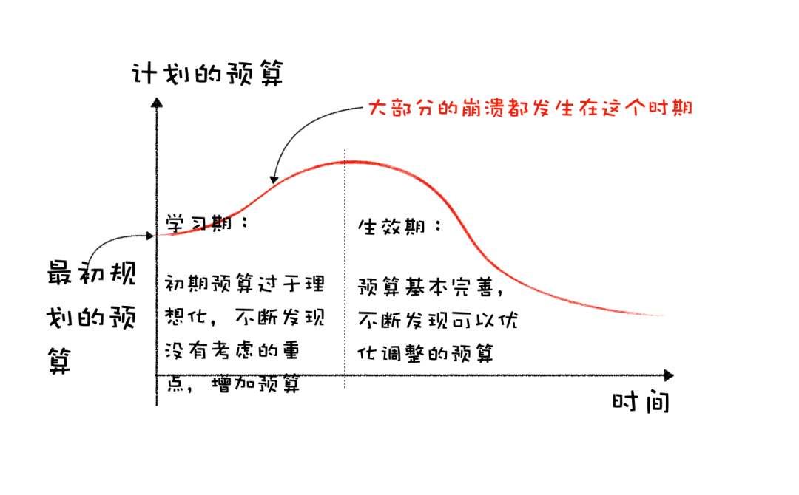
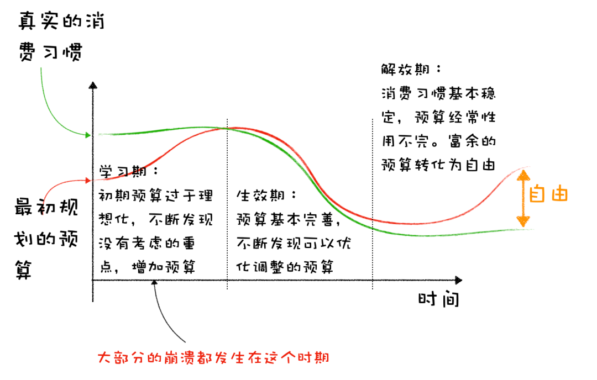

# 加预算，加到不用再考虑预算 | 财务自由实证 #48

**发布时间**: 2023-04-06 07:02:04

**原文链接**: [http://mp.weixin.qq.com/s?__biz=MzUzNjE3NzQ3Nw==&mid=2247491603&idx=1&sn=59757b21ad7234edf5cf58e0d4bd12ab&chksm=faf89e39cd8f172fd524165ccd6af8aada35d6f9b22cd5792880d97a82dddac39fb748b64081#rd](http://mp.weixin.qq.com/s?__biz=MzUzNjE3NzQ3Nw==&mid=2247491603&idx=1&sn=59757b21ad7234edf5cf58e0d4bd12ab&chksm=faf89e39cd8f172fd524165ccd6af8aada35d6f9b22cd5792880d97a82dddac39fb748b64081#rd)

---

几年前有几位小伙伴问过我

> 现在用高储蓄率攒下本金，等到攒够财务自由本金以后，会不会报复性消费又把本金消耗光了？

当时我说，不会，既然能通过规划开支实现财务自由，自由以后自然也不会瞬间失去这个能力。

现在我发现，现实比预想的更有戏剧性——通过高储蓄率攒下本金的小伙伴们，实现财务自由以后可能遇到的问题不但不会是复性消费，而是反过来，想花钱却动不了手

‍

最近听 Ramit Sethi 做客 Mad Fientist 的财务自由播客，里面有两个例子印象深刻。两个资产已经**千万美元** 的家庭：

  * 一个还在开着车跑遍全城，只为了找到最便宜的加油站。但省下的油钱还不如这段时间收的利息；

  * 另一个想吃蓝莓，但还在为蓝莓价格太贵而焦虑……

他们这期聊的话题不是如何攒钱，而是如何花钱，「How to Spend (and Actually Enjoy It)」

> 很多规划并实现财务自由的小伙伴们，通常都很擅长思考哪些线「不该花」。但在哪些钱「该花」的问题上，思考却有些不足。

### 最难摆脱的不是陋习，而是带来成功的习惯

可能很多人会说，资产千万还在找最便宜的加油站、还这么节俭太奇怪了。但这其实一点也不奇怪，相反，正是因为这种节俭，他们才有机会积累下八位数的财富。

只是这样的成功反而可能把我们困住了，疏于思考一个问题——人在年轻时，时间多、财富少时有效的策略（时间 → 钱），到了财富多、时间少的时期，还有效吗？

一个习惯给我们带来过越多好处，我们越可能爱上这个习惯。进而忘记思考，这个习惯可能已经不再适合现在的我们。

想到当初芒格评价巴菲特——他能升级自己的投资体系非常不容易，因为他以前的投资方式实在太成功了。

Morgan Housel 也聊到过这个问题，**节俭的惯性** 。

> Frugality inertia: a lifetime of good savings habits can’t be transitioned to a spending phase.
> 
> 节俭的惯性：保持了一生的良好储蓄习惯，以至于没法接受开始花钱。
> 
> I think what many people really want from money is the ability to stop thinking about money. To have enough money that they can stop thinking about it and focus on other stuff.
> 
> 我认为许多人真正想从金钱中得到的是，**停止思考金钱的能力** 。拥有足够的钱，他们就可以不再考虑它，而专注于其他事情。
> 
> But that ultimate goal can break down when your relationship with money becomes an ingrained part of your personality. You struggle to break away from focusing on money because the focus itself is a big part of who you are.
> 
> 但是，当你与金钱的关系成为你个性中根深蒂固的一部分时，这个最终目标就会难以实现。你很难摆脱对金钱的关注，因为 ta 成了你的一个身份标签。

### 我们加预算了

刚好也是 3 月，我和也太决定**继续增加** 我们家的餐饮预算了 👇 这张图去**去年** 发的，当时餐饮预算加到了 300 欧元

经过近两年的通胀，德国这边生鲜肉类的价格普遍涨了 50% 甚至更多。为了继续实现以前的预算目标，我们也自然而然地投入更多时间来安排三餐、蹲打折等等。

但一段时间过后，经历过各种纠结和不快，我们突然醒悟过来，「我们究竟在干什么？」

其实餐饮开支在我们家的开销中只有大约 1/10，即便食材涨价了 50%，其实也就多花大约 1/20 的预算呗。

但为了省下这 1/20 的钱，我们俩消耗了远比 1/20 多得多的时间和精力。

于是当机立断，我们把餐饮预算继续从之前 300 欧元（两个人）提到了 400 欧元。先观察看看，如果有需要还可以再加。

### 把预算加到不用再考虑预算为止

Housel 提过 2 个思考财务自由的角度：

1、能够自由支配时间和地点，决定自己几点起床，决定自己一天做什么、不做什么。这个我们已经完成了。

2、考虑问题时可以不再为钱所束缚，**钱不再是我们不做一件事儿最大的原因** 。

以前我给大家画过一张图，分享我在预算上的经历 👇

1、第一次制定出来的预算注定会爆掉，太理想化了，对于各种意外开支、低频率开支考虑不足。初期重要的是**接受现实** ，把预算慢慢增加到一个符合现状的程度。

2、等我们的预算真正全面了，把各种问题考虑清楚了，预算和开销才会开始缓慢下降。这个过程中我们会不断思考自己到底想要什么，做减法，然后把资源留给我们更渴望的东西。

时隔几年后，我可以在后面补上第三段了 👇

以前看到总资产提升，我可能会更希望预算保持不动。这样总资产提升、投资收益增加、开销却不变，不就相当于积累财富的速度增加了。

但现在这个思路已经不太适合我们了。我俩现在投资本金大约 400 万，一个月开销才不到 2 万，哪怕就是省出花来，对总财富的贡献也远不如以前。

所以后面我会改变思路，**在被动收入允许的范围内慢慢提升预算，希望最终****把预算加到用不完、不用再关注的程度** 。

我俩会先从餐饮预算开始。

### 始终用富余的交换稀缺的

是节俭积累财富对，还是花钱买时间、买体验更明智？答案取决于我们当下更稀缺什么。

明智的交易是**始终用自己富余的资源，交换对自己来说当下更稀缺的那个** 。

更重要的是，一生中富余和稀缺的资源会发生多次互换，需要我们及时觉察到。不能被惯性和身份标签推着走。

我们是拥有时间、稀缺财富的那个，还是已经拥有财富，更稀缺时间、健康或是其他什么东西，还是要自己来想清楚。

PS：今天文章中提到的两篇博文链接

Ramit Sethi 的「如何花钱（并乐在其中）」

https://www.madfientist.com/i-will-teach-you-to-be-rich-interview/

Morgan Housel 的「消费的科学和艺术」

https://collabfund.com/blog/the-art-and-science-of-spending-money/

* * *

### 实证账户更新

……

被动收入观察——从投资中获得的「累计被动收入」目前还在「累计日常开销」曲线的下方，静静等待回归 👇

注：这张图的思路来自[第 30 期实证](http://mp.weixin.qq.com/s?__biz=MzUzNjE3NzQ3Nw==&mid=2247489372&idx=1&sn=2118934ef05d930f50d2510ff6642cb1&chksm=fafb6976cd8ce06042f2bb8d1ed950a95262d11451fe116440e1ff84ca49c6fdae8a5d664a6d&scene=21#wechat_redirect)。家庭开支曲线里，我没有算买房首付、一次性税费和部分硬装的钱。剩下大家能想到、想不到的，房贷月供、家具、家电、旅行、保险、医疗什么的，每一笔都算进去啦。

……

最后例行提醒大伙，财务自由的投资和被动收入虽然看起来性感，但「因上努力，果上随缘」。本金和收益只是自由路上的「果」，**主业努力多赚钱、理性消费少挥霍，以此积累本金，再加上不被短期涨跌干扰、坚持投资才是背后的「因」** 。

投资复利只是我们获得被动收入的方式，而不是致富的秘密。

在财务自由实证的最初两年，我写得最多的也不是如何投资，而是如何**少在投资上花时间，好能多花时间关注主业** ，同时理性控制开销，尽快攒钱。

假如有 10 万本金，就算投资翻倍也才赚了 10 万。而投资翻倍极其困难，巴菲特的年化收益也才 20%。相比之下，在职场上努力提升，让收入再增加 10 万则要靠谱得多。

对财务自由而言，“钱生钱”做到 80 分足矣，剩下的精力还是应该关注赚钱和省钱这些“人生钱"。

### 一份“小简历”

**普通人通过工资理财也能实现财务自由** ，这是这些年我一直在践行的理念。从最初懵懵懂懂到 2017 年制定具体的财务计划，再到如今渐渐靠近终点，已经走了五六年。

为了能够更加透明、中立地实证普通人财务自由的可能性，从 2019 年开始我决定公开自己的财务进度，成为这个系列内容「财务自由实证」。

不追求大富大贵，但求能够不再纠结生计这些琐碎问题，在重大选择面前获得更多的人生选项，不再瞻前顾后。

有兴趣参考这个实证的朋友建议先看看之前的引导篇，[制定自己的财务自由计划](https://mp.weixin.qq.com/s?__biz=MzUzNjE3NzQ3Nw==&mid=2247484500&idx=1&sn=c04c3de1a1231bef25bb4cda773c00ff&scene=21#wechat_redirect)、[一起财务自由](https://mp.weixin.qq.com/s?__biz=MzUzNjE3NzQ3Nw==&mid=2247484480&idx=1&sn=258e8dd4976c7d3c324ed89b90904d14&scene=21#wechat_redirect)。以往的干货精华也都有汇总 👇

  * [全都安排好了，自由路上我们会遇到的每一个问题](http://mp.weixin.qq.com/s?__biz=MzUzNjE3NzQ3Nw==&mid=2247489926&idx=1&sn=eac357cebcbfd7250828cdda88d9f122&chksm=fafb67accd8ceebaa1e750f129714bb000be9720a990a70c6fba6fc52fd3712014a58d699d6e&scene=21#wechat_redirect)

  * [我的第一本书，整理财务自由方法论](https://mp.weixin.qq.com/s?__biz=MzUzNjE3NzQ3Nw==&mid=2247486809&idx=1&sn=8a80c493837ee044c5d55e0a423507d2&scene=21#wechat_redirect)

  * [一期访谈](http://mp.weixin.qq.com/s?__biz=MzUzNjE3NzQ3Nw==&mid=2247487473&idx=1&sn=10a891429291e78dea82b4df34e773f3&chksm=fafb71dbcd8cf8cdb15f114d6637bc6476a2803f9f0803dcbb4d91c1e68b5cc706c3dc55358b&scene=21#wechat_redirect)和[一期播客](http://mp.weixin.qq.com/s?__biz=MzUzNjE3NzQ3Nw==&mid=2247489401&idx=1&sn=a613497a5d6fdc3325d0424b9a78063e&chksm=fafb6953cd8ce045481121812b61b04f62dfe09a07b785991fc4cdd679bc9af13665d4c0ce62&scene=21#wechat_redirect)聊聊我的经历和观念

我给自己定下的目标是 30 岁前积累到**  家庭年度开支的 10 倍**（结果现在攒到了 20 倍 ✌️），作为创造被动收入的本金。依靠这些本金实现长期 10+% 的年化投资收益就可以实现财务自由，不再依赖上班工资生活，有底气去选择自己真正想做的事儿。

（我的具体目标数字是 500 万，但**这个数字大家没必要参考** ，还是要以自己的生活开销为准）

财务自由路上一些重要节点：

  * 2017 年，计划正式开始，同年获得家人的认可和支持；

  * 2018 年，A 股熊市大跌，出现“钻石坑”机会；

  * 2019 年，开始财务自由公开实证（就是现在大家看到的这个系列）；

  * 2020 年，新冠股灾，自由之路上的又一个关键机会；

  * 2021 年，[自由目标基本达成](http://mp.weixin.qq.com/s?__biz=MzUzNjE3NzQ3Nw==&mid=2247489120&idx=1&sn=e5c5bf6d51914c212c228bc6f42346dc&chksm=fafb684acd8ce15c27cd508a67d57573f4acbeced75f805ef271b4efcf42cf54b363e5f93fcf&scene=21#wechat_redirect)，开始向新的节奏过渡；

  * 2022 年，遭遇自由后的第一次账户大幅回撤，但也是港股 6 年后、A 股 3.5 年后的又一次钻石坑，期待后续……

  * 也是同年，[我搬去二线过想要的生活了](https://mp.weixin.qq.com/s?__biz=MzUzNjE3NzQ3Nw==&mid=2247490915&idx=1&sn=313fba2e0a82a878f0188795ffe1900f&chksm=fafb6349cd8cea5fdfb9a63648453317d1970941f8c470f7bf697d07cca4054fca66f1dc5fac&scene=21#wechat_redirect)，[买房钱从计划中扣除](https://mp.weixin.qq.com/s?__biz=MzUzNjE3NzQ3Nw==&mid=2247490995&idx=1&sn=5b90cca481c8f33b2a7a19f6ef555791&scene=21#wechat_redirect)（自住房我会看作消费而不是资产）

慢慢播种，等待市场回归～