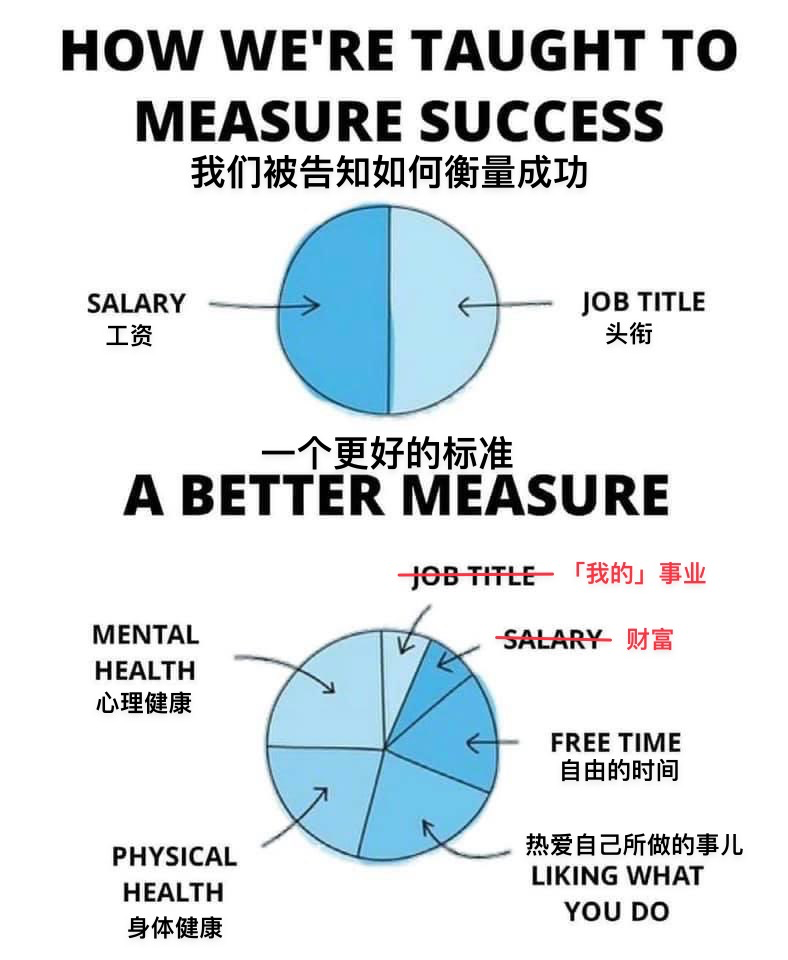
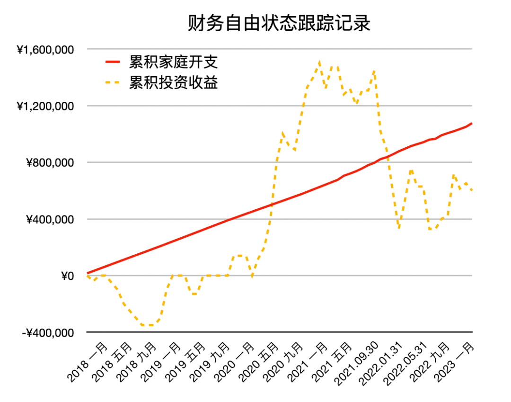

# “身边很多财务自由的人，要么回去上班了，要么抑郁了” | 财务自由实证 #50

**发布时间**: 2023-05-08 07:00:05

**原文链接**: [http://mp.weixin.qq.com/s?__biz=MzUzNjE3NzQ3Nw==&mid=2247491729&idx=1&sn=3d621fd57a94c6db1a8d14e59df61b92&chksm=faf89ebbcd8f17ad3bacac0c722ae5283402e7af614f6d688e864d56420d65f0f1daf4f6579f#rd](http://mp.weixin.qq.com/s?__biz=MzUzNjE3NzQ3Nw==&mid=2247491729&idx=1&sn=3d621fd57a94c6db1a8d14e59df61b92&chksm=faf89ebbcd8f17ad3bacac0c722ae5283402e7af614f6d688e864d56420d65f0f1daf4f6579f#rd)

---

去年，和一个比我**早 10 年** 开始规划财务自由的伙伴聊天。ta 所在的行业收入可观，又踩上了不小的时代红利，所以当时和他一起，不少同事没有对财务自由的规划和思考，仅靠运气也实现了财务自由，不少人也选择了提前退休。

但是时间久了，他发现当初一起退休的人，最后要么回去继续上班让自己忙起来，要么抑郁了。

> 财务独立（自由）只是时间问题，怎么样过好以后的生活才是大学问。

但我当时并不觉得意外，毕竟「财务自由」和「早早退休」是两回事儿。我也早就发现，**其实早早退休只适合一小部分人** 。获得生活的意义感、贡献感，到头来还是绕不过工作的（工作 ≠ 上班）。想明白了，选择回去上班也是个明智之举。

不过时隔一年，我有了点不同看法。

### 像工作一样认真生活

上个月我被体检报告当头一棒，开始认真关注自己的高血脂问题，因此开始学习医学、营养学，并[重新规划日常作息、一日三餐、运动计划](http://mp.weixin.qq.com/s?__biz=MzUzNjE3NzQ3Nw==&mid=2247491677&idx=1&sn=16cad758e51bc8f8e9a3d6f76f461073&chksm=faf89e77cd8f176100785fbed925ee7e009c7723053026eaeedf2c05862cd9a3aa2523ab0488&scene=21#wechat_redirect)。突然发现了一片新大陆——**认真过好日常生活的每一天，也太有意思了吧！**

这让我开始重新思考，我们想要通过财务自由解决的问题 👇

我们真正渴望的东西，自由的时间、热爱的事儿、身心健康，究竟有多少来自「上班」，有多少在上班之外呢？

再回头看财务自由却找不到生活方向，不得不回去上班；当初的观察「早早退休可能只适合一小部分人」，我突然意识到一个问题——**认真把生活过好，看起来好像天经地义，但其实也是一种很稀缺的能力。**

工作的本质是什么？工作就是在解决他人和社会的难题，我们也在这个过程中感受到贡献感、意义感、成就感。

但是，为什么解决他人的问题（工作）可以如此，解决自己和家人的问题（退休）却不能呢？

回头想想，突然发现这样的反差无处不在。

有很多为了向老板汇报工作而学习 PPT 的员工，却很少有为了同父母、家人交流而学习沟通的人。我在得到随手搜了一下「沟通」，都是教你如何与老板、同事、合作方沟通，生活相关几乎没有。而以此同时，我们又在不停地抱怨「家人不懂我」。

在工作上懂得设置目标、规划 KPI 的人也很多，但尝试给生活、健康设置目标和 KPI，并为了“项目”成功而庆祝的人却很少。

如果以后再遇到「财务自由却找不到生活的方向，还是回去上班吧」这样的说法，也许我会想问问——为什么我们不能像工作上做项目一样，把自己的工作态度带回到生活中去，把自己的健康、生活、人际关系规划好，并也因此感受到幸福和充实？

并没有人规定，工作只能用工作的技能，生活只能用生活的技巧，它们本就同源。但我们学习了太多认真工作的知识，却仿佛忘记了好好生活的能力。

### 重要的并不是数字

靠运气实现了财务自由却依然不知道自己想做什么，只好回去上班。想到最近另一位小伙伴的发现——有了财务自由计划以后，反而总在有意无意地**用财务自由逃避现实问题** 。面对自己想做的事儿，或者遇到生活中的困难，不去想如何解决问题，反而总在想「等财务自由以后，我就……」。

我们下意识地觉得只要财务自由了、钱够多了，各种问题自动就不是事儿了。

但实际上，问题并不会因为财务自由而突然消失。相反，是我们解决的问题越多，距离财务自由才越近。一味用财务自由逃避现实的人，总会发现他们想要的“财务自由”的标准越来越高，永远够不到。

财务自由重要的并非财富的数字，而是以财富为指引和反馈，学到的各种解决问题的能力，以及不断思考「自己想要什么」而不是「别人在干什么」。

* * *

### 实证账户更新

……

被动收入观察——从投资中获得的「累计被动收入」目前还在「累计日常开销」曲线的下方，静静等待回归 👇

注：这张图的思路来自[第 30 期实证](http://mp.weixin.qq.com/s?__biz=MzUzNjE3NzQ3Nw==&mid=2247489372&idx=1&sn=2118934ef05d930f50d2510ff6642cb1&chksm=fafb6976cd8ce06042f2bb8d1ed950a95262d11451fe116440e1ff84ca49c6fdae8a5d664a6d&scene=21#wechat_redirect)。家庭开支曲线里，我没有算买房首付、一次性税费和部分硬装的钱。剩下大家能想到、想不到的，房贷月供、家具、家电、旅行、保险、医疗什么的，每一笔都算进去啦。

……

最后例行提醒大伙，财务自由的投资和被动收入虽然看起来性感，但「因上努力，果上随缘」。本金和收益只是自由路上的「果」，**主业努力多赚钱、理性消费少挥霍，以此积累本金，再加上不被短期涨跌干扰、坚持投资才是背后的「因」** 。

投资复利只是我们获得被动收入的方式，而不是致富的秘密。

在财务自由实证的最初两年，我写得最多的也不是如何投资，而是如何**少在投资上花时间，好能多花时间关注主业** ，同时理性控制开销，尽快攒钱。

假如有 10 万本金，就算投资翻倍也才赚了 10 万。而投资翻倍极其困难，巴菲特的年化收益也才 20%。相比之下，在职场上努力提升，让收入再增加 10 万则要靠谱得多。

对财务自由而言，“钱生钱”做到 80 分足矣，剩下的精力还是应该关注赚钱和省钱这些“人生钱"。

### 一份“小简历”

**普通人通过工资理财也能实现财务自由** ，这是这些年我一直在践行的理念。从最初懵懵懂懂到 2017 年制定具体的财务计划，再到如今渐渐靠近终点，已经走了五六年。

为了能够更加透明、中立地实证普通人财务自由的可能性，从 2019 年开始我决定公开自己的财务进度，成为这个系列内容「财务自由实证」。

不追求大富大贵，但求能够不再纠结生计这些琐碎问题，在重大选择面前获得更多的人生选项，不再瞻前顾后。

有兴趣参考这个实证的朋友建议先看看之前的引导篇，[制定自己的财务自由计划](https://mp.weixin.qq.com/s?__biz=MzUzNjE3NzQ3Nw==&mid=2247484500&idx=1&sn=c04c3de1a1231bef25bb4cda773c00ff&scene=21#wechat_redirect)、[一起财务自由](https://mp.weixin.qq.com/s?__biz=MzUzNjE3NzQ3Nw==&mid=2247484480&idx=1&sn=258e8dd4976c7d3c324ed89b90904d14&scene=21#wechat_redirect)。以往的干货精华也都有汇总 👇

  * [全都安排好了，自由路上我们会遇到的每一个问题](http://mp.weixin.qq.com/s?__biz=MzUzNjE3NzQ3Nw==&mid=2247489926&idx=1&sn=eac357cebcbfd7250828cdda88d9f122&chksm=fafb67accd8ceebaa1e750f129714bb000be9720a990a70c6fba6fc52fd3712014a58d699d6e&scene=21#wechat_redirect)

  * [我的第一本书，整理财务自由方法论](https://mp.weixin.qq.com/s?__biz=MzUzNjE3NzQ3Nw==&mid=2247486809&idx=1&sn=8a80c493837ee044c5d55e0a423507d2&scene=21#wechat_redirect)

  * [一期访谈](http://mp.weixin.qq.com/s?__biz=MzUzNjE3NzQ3Nw==&mid=2247487473&idx=1&sn=10a891429291e78dea82b4df34e773f3&chksm=fafb71dbcd8cf8cdb15f114d6637bc6476a2803f9f0803dcbb4d91c1e68b5cc706c3dc55358b&scene=21#wechat_redirect)和[一期播客](http://mp.weixin.qq.com/s?__biz=MzUzNjE3NzQ3Nw==&mid=2247489401&idx=1&sn=a613497a5d6fdc3325d0424b9a78063e&chksm=fafb6953cd8ce045481121812b61b04f62dfe09a07b785991fc4cdd679bc9af13665d4c0ce62&scene=21#wechat_redirect)聊聊我的经历和观念

我给自己定下的目标是 30 岁前积累到**  家庭年度开支的 10 倍**（结果现在攒到了 20 倍 ✌️），作为创造被动收入的本金。依靠这些本金实现长期 10+% 的年化投资收益就可以实现财务自由，不再依赖上班工资生活，有底气去选择自己真正想做的事儿。

（我的具体目标数字是 500 万，但**这个数字大家没必要参考** ，还是要以自己的生活开销为准）

财务自由路上一些重要节点：

  * 2017 年，计划正式开始，同年获得家人的认可和支持；

  * 2018 年，A 股熊市大跌，出现“钻石坑”机会；

  * 2019 年，开始财务自由公开实证（就是现在大家看到的这个系列）；

  * 2020 年，新冠股灾，自由之路上的又一个关键机会；

  * 2021 年，[自由目标基本达成](http://mp.weixin.qq.com/s?__biz=MzUzNjE3NzQ3Nw==&mid=2247489120&idx=1&sn=e5c5bf6d51914c212c228bc6f42346dc&chksm=fafb684acd8ce15c27cd508a67d57573f4acbeced75f805ef271b4efcf42cf54b363e5f93fcf&scene=21#wechat_redirect)，开始向新的节奏过渡；

  * 2022 年，遭遇自由后的第一次账户大幅回撤，但也是港股 6 年后、A 股 3.5 年后的又一次钻石坑，期待后续……

  * 也是同年，[我搬去二线过想要的生活了](https://mp.weixin.qq.com/s?__biz=MzUzNjE3NzQ3Nw==&mid=2247490915&idx=1&sn=313fba2e0a82a878f0188795ffe1900f&chksm=fafb6349cd8cea5fdfb9a63648453317d1970941f8c470f7bf697d07cca4054fca66f1dc5fac&scene=21#wechat_redirect)，[买房钱从计划中扣除](https://mp.weixin.qq.com/s?__biz=MzUzNjE3NzQ3Nw==&mid=2247490995&idx=1&sn=5b90cca481c8f33b2a7a19f6ef555791&scene=21#wechat_redirect)（自住房我会看作消费而不是资产）

慢慢播种，等待市场回归～