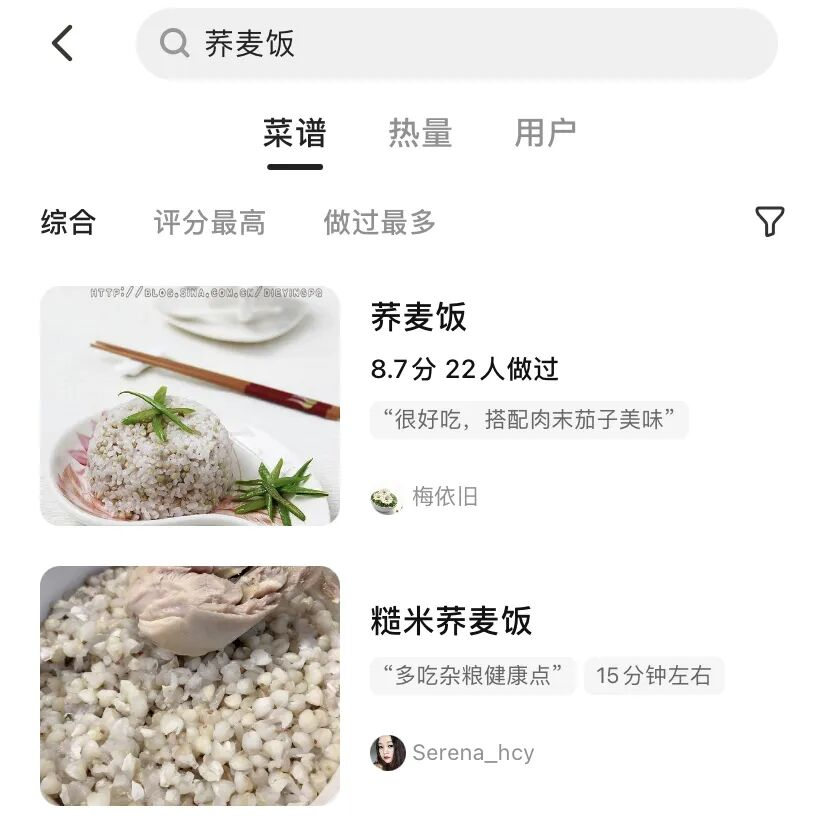
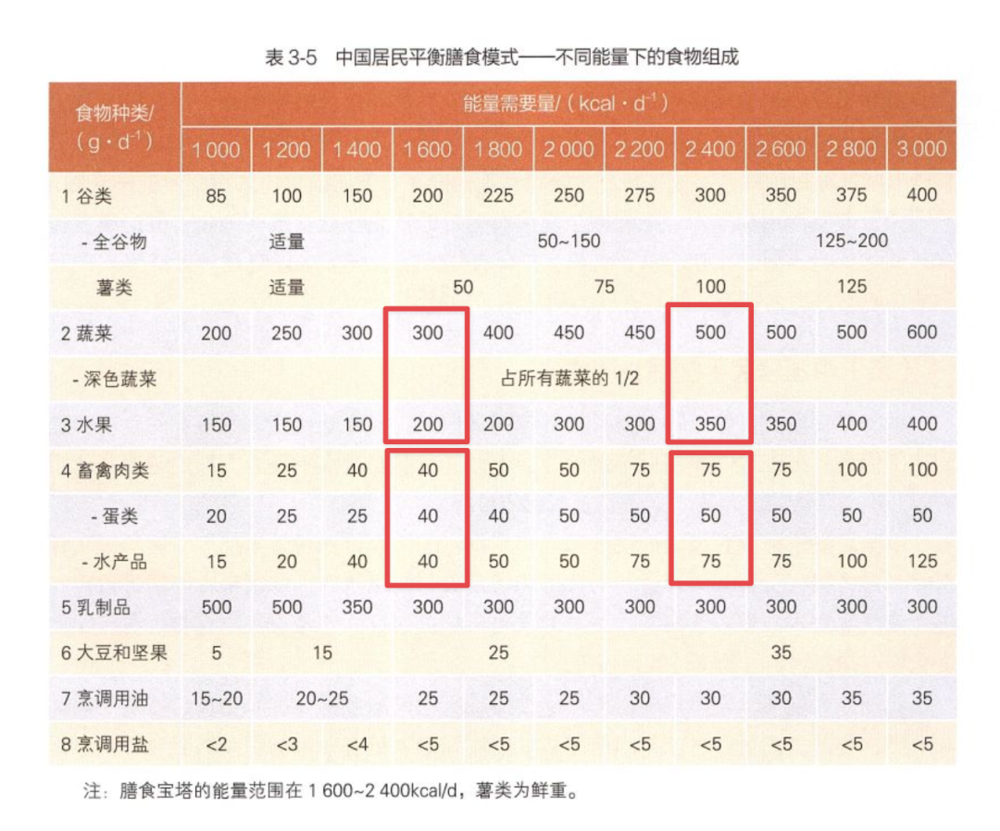
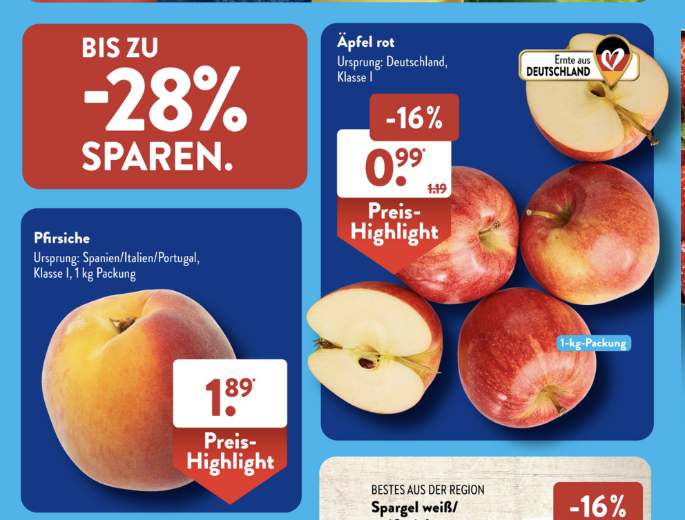
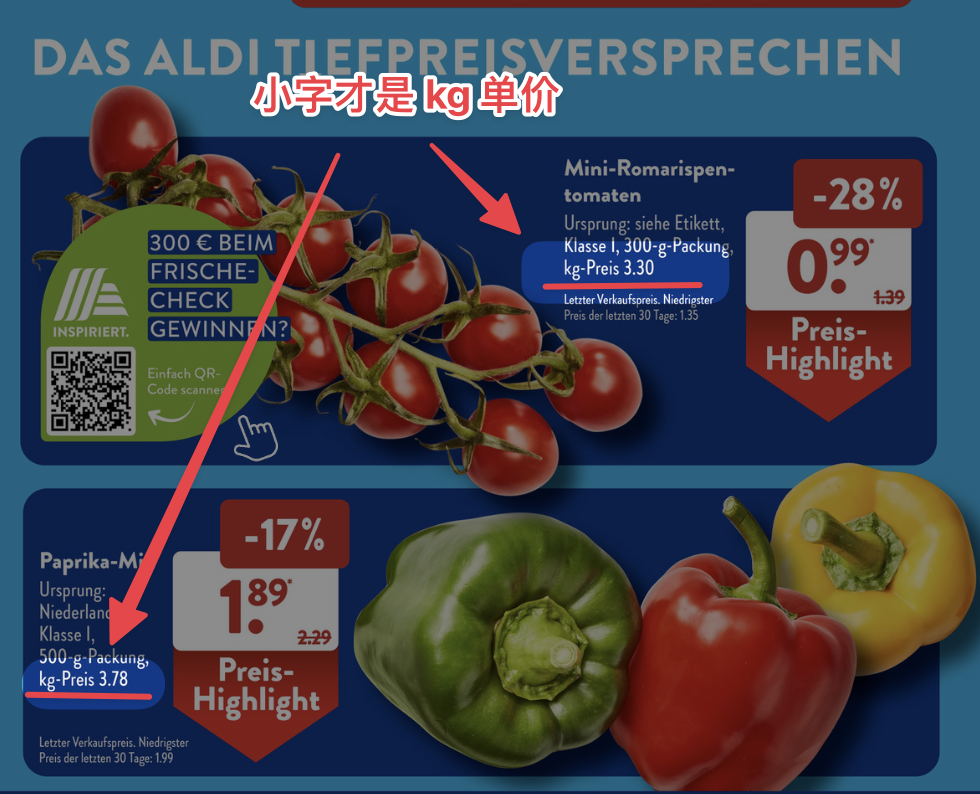

# 年入百万的感觉

**发布时间**: 2023-05-18 07:08:48

**原文链接**: [http://mp.weixin.qq.com/s?__biz=MzUzNjE3NzQ3Nw==&mid=2247491783&idx=1&sn=20eb7d62196d38d6232f5ab94cc28e73&chksm=faf89eedcd8f17fb5b919e744dc9d481c91a14ccc60b92a0bb705adf68207d168efb8be3f487#rd](http://mp.weixin.qq.com/s?__biz=MzUzNjE3NzQ3Nw==&mid=2247491783&idx=1&sn=20eb7d62196d38d6232f5ab94cc28e73&chksm=faf89eedcd8f17fb5b919e744dc9d481c91a14ccc60b92a0bb705adf68207d168efb8be3f487#rd)

---

上大学实习那会儿，听身边已经工作的同事们讨论，年入 100 万会是怎样一种感觉？

有位同事的观察大家一致认同——日常生活还是和大家差不多，买车、买房这些大笔消费虽然会容易些、买好些，但也会有比较和纠结。不过有一点会明显不同，**至少在超市买东西基本可以不看价格、全凭喜好了** 。

一晃 10 年过去了，年入百万我还是木有。但是吧，自从给全家改善饮食以后，我突然体会到逛超市不用看价格的快乐了

‍

  * 以前看价格比来比去还总担心超支；

  * 现在不用看价格了，反倒也不太担心超支～

网上很多人都把健康饮食分享得很贵的样子，但我却看到了完全不同的景象。

### 现在买菜的变化

首先，不管是蔬菜还是肉类，**单价确实变贵了** 。

以前我们买肉以猪肉、牛肉为主，德国这边单价大约 6～12 €/kg。现在开始买各种以前“买不起”的食材，像鱼、虾、牛排，单价普遍贵了 1 倍以上：

  * 虾：15～20 €/kg

  * 鲜鱼：14～25 €/kg，三文鱼：20+ €/kg

  * 牛排：20+ €/kg

以前主食大米（1.99 €/kg）、白面（0.79 €/kg）为主，现在加入了各种粗粮，单价也比以前贵了不少：

  * 荞麦：3.9 €/kg

  * 藜麦：4.9 €/kg

  * 全麦面粉：1.55 €/kg

因为营养成分表新入坑了荞麦 👆然后发现荞麦饭也太好吃了，麦香浓到都有点像奶香味了 👇

甚至买欧包的时候（在德国的地位和我们的包子、馒头差不多），干脆直接从最贵的货架开始看

 超市也是比较实在，最贵的用料确实也是最好的，会放更多全麦和坚果，省得我来回比较了。当然也是因为最贵的也没多少钱，2.99 一个够我吃一个星期。

每家超市必备的面包柜台

……

但是，**开销却没有因此变多** ，是不是很神奇？

我发现关键变化在于饮食结构。在研究了各国的膳食指南以后，发现我们以前吃的肉太多了、蔬菜水果却太少了 👇

来自《中国居民膳食指南》

其实**我们俩加一起** ，一天鱼肉蛋只需要 320g。以前我们一个人一顿就能吃这么多。而蔬菜水果我们吃得严重不够，一天全家至少要保证 800g 的蔬菜和 550g 的水果。

其实蔬菜水果的单价很低，很少超过 5 €/kg。而餐饮开销里贵的主要是肉制品，自从发现肉不用吃这么多，感觉生活都解脱了，像个暴发户：

  * 西蓝花 🥦 400g，1.19 €

  * 胡萝卜 🥕 1.19 €/kg

  * 西红柿 🍅 3～5 €/kg

  * 苹果 🍎 2 €/kg

  * 梨 🍐 2 €/kg

  * 青椒 🫑 4.98 €/kg

  * 茄子 🍆 2.4 €/kg

  * 稍微贵一点的好像只有蓝莓和牛油果了，蓝莓 🫐 大约 10 €/kg，牛油果 🥑 250g 1.11€

再考虑到蔬菜水果超市每周变着样的应季促销，我俩进超市都是先拿一圈本周打折的，再补充搭配自己还想吃的，那单价就更低了。比如这周的打折册子 👇

我发现**健康饮食更多的不是食材变化，而是饮食结构的变化** ：

  * 谷物蔬菜水果为主。因为原本单价就很低，闭着眼睛买总开销也不高；

  * 适量的肉。因为总量不大，就算买单价比较贵的，也花不了多少钱；

（目前我们家餐饮预算是两个人 400 欧元/月，折合约 3000 人民币）

自从欧美通胀以来，有段时间我俩都抵触逛超市了，转了一圈啥也买不着。现如今，每周六一起去超市“开盲盒”又成了每周都期待的事儿，终于又找回了逛超市的快乐。

当钱不用再操心，我们自然就会把喜好和开心放在第一位。全凭喜好，不用在意价格的感觉很幸福，哪怕只是在超市。

### 超市自由

上上个月和大家分享，财务自由的两个角度：

> 1、能够自由支配时间和地点，决定自己几点起床，决定自己一天做什么、不做什么。
> 
> 2、考虑问题时可以不再为钱所束缚，钱不再是我们不做一件事儿最大的原因。

我当时的想法是——在被动收入允许的范围内慢慢提升预算，希望最终把预算加到用不完、不用再关注的程度——关注的还是「更多的钱」。

但随后这两个月的展开让我太意外了，又想到了两年前 Tim Ferriss 的那句话：

金钱的数字本身没有意义，有意义的是我们想要通过这笔钱解决的问题。而真解决问题往往不需要那么多钱。

就像“超市自由”，我最想解决的问题不是能花多少钱买菜，而是怎么真正吃饱、吃好、吃得开心。而在这个过程中，学习了解营养科学带来的改变远大于钱本身，买几本书又能花多少钱呢？

不过话说回来，加预算的计划我依然没有变。自由 = 资源 - 欲望。用不完的预算并不是浪费，恰恰是舒适、余闲的来源。

  * 财务自由：[我的财务自由实证之路](http://mp.weixin.qq.com/s?__biz=MzUzNjE3NzQ3Nw==&mid=2247491729&idx=1&sn=3d621fd57a94c6db1a8d14e59df61b92&chksm=faf89ebbcd8f17ad3bacac0c722ae5283402e7af614f6d688e864d56420d65f0f1daf4f6579f&scene=21#wechat_redirect)

  * 投资笔记：[十年之约，躺赚不难](http://mp.weixin.qq.com/s?__biz=MzUzNjE3NzQ3Nw==&mid=2247491631&idx=1&sn=734892fb288659189dc723f1ce1ca512&chksm=faf89e05cd8f1713696e3c6dc3613b900cabe29939b2baafab2e5d58457a912252b63a1cf79f&scene=21#wechat_redirect)

  * 抵御风险：[4 月保险最推荐](http://mp.weixin.qq.com/s?__biz=MzUzNjE3NzQ3Nw==&mid=2247491705&idx=1&sn=5ae2a2425311671ff238ec740331b89f&chksm=faf89e53cd8f1745abd9ca7ab87bfef64d0c8d60f7ab490cdbe48e13e63f1a1f778b52870ffb&scene=21#wechat_redirect)

  * 干货汇总：[财务自由路上应该了解的每一个问题](http://mp.weixin.qq.com/s?__biz=MzUzNjE3NzQ3Nw==&mid=2247489926&idx=1&sn=eac357cebcbfd7250828cdda88d9f122&chksm=fafb67accd8ceebaa1e750f129714bb000be9720a990a70c6fba6fc52fd3712014a58d699d6e&scene=21#wechat_redirect)