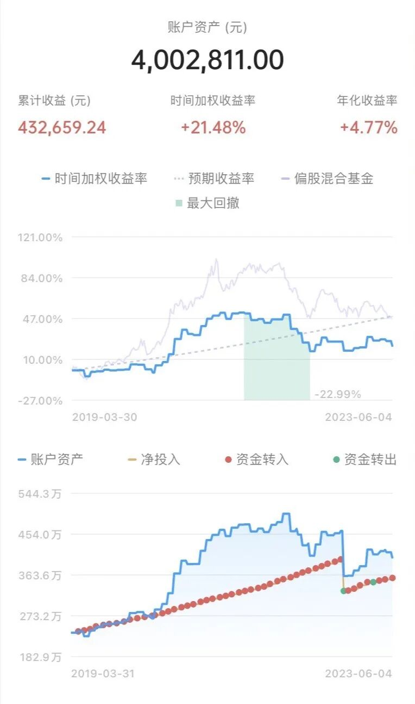
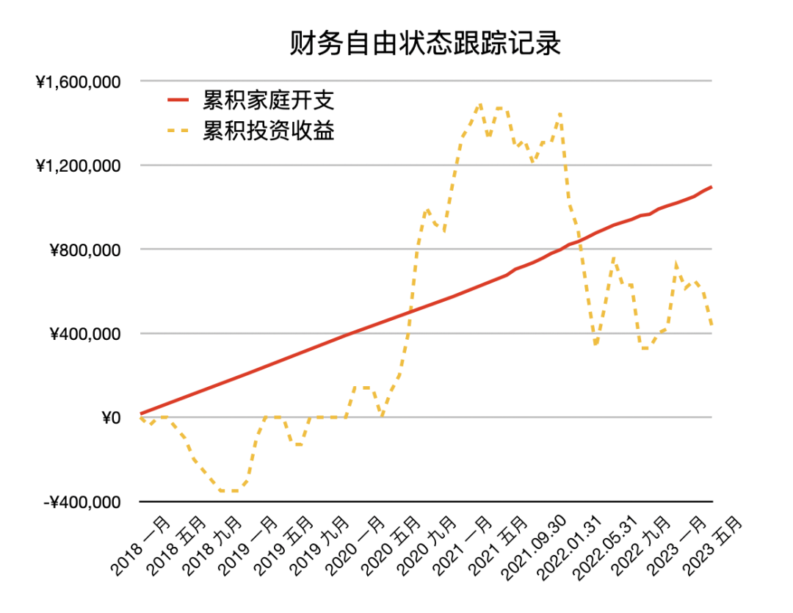

# 辞职倒计时（不是我哈）｜财务自由实证 #50

**发布时间**: 2023-06-08 07:05:22

**原文链接**: [http://mp.weixin.qq.com/s?__biz=MzUzNjE3NzQ3Nw==&mid=2247491837&idx=1&sn=459bdf1c1cdb11e4f60c5e395f5b591a&chksm=faf89ed7cd8f17c1ff77c00576d2f16470cd7d8f586548b356e9625f6991750fced7405d016c#rd](http://mp.weixin.qq.com/s?__biz=MzUzNjE3NzQ3Nw==&mid=2247491837&idx=1&sn=459bdf1c1cdb11e4f60c5e395f5b591a&chksm=faf89ed7cd8f17c1ff77c00576d2f16470cd7d8f586548b356e9625f6991750fced7405d016c#rd)

---

一位小伙伴纠结了许久终于从公司辞职了，兴冲冲地给我看了一组照片——离职前一个月，每天一张自拍记录自己的变化。

看着照片让我想到这个梗「说是失业一直很焦虑，面色却肉眼可见地红润起来」 照片里的小伙伴笑得越来越自然，「眼睛里有光了」说的就是这种感觉吧。

有些让我们纠结许久不敢做出的决定，可一旦真走出这一步，身体立刻就会有强烈的信号，这个选择是对的。

……

闲聊过程中有个细节特别有意思。当时我们东拉西扯，突然就说到超市里的某个面包，小伙伴起身就要去买。

我说算了吧，就去买个面包效率也太低了，我一般去超市都是写个单子，一次买一批，这样比较高效。

「我都离职了，为什么还要高效？」

 一句话给我整不会了

> 等你把这些想做的事儿都攒到一起，效率是上来了，但到时候肯定就不是这个感觉了。
> 
> 终于可以把自己的感受放在第一位，就是要做点低效但开心的事儿～

前段时间网上有个帖子很火，写了一篇很详细的清单——如何把 Gap Year 的人生收益最大化。

正好适合小伙伴的情况，我就分享了一下。

结果小伙伴一边看一边嘀咕：

> 总感觉哪里不对呢…… 我发现问题了，都 Gap Year 了怎么还在想着「收益最大化」呢？开头明明说，身心疲惫、卷不动了才 Gap Year，怎么回头又把 Gap Year 卷起来了‍‍

我还挺喜欢这种视角的。和小伙伴聊完我也在想，我做事儿时总是下意识地想着高效，想要做更多的事儿，这样我才能有更多的「自由」时间。但有了自由时间我在干什么呢？好像还在试图再干更多的事儿……

有时候我会这样被一个习惯、一种思维方式、或者“别人都在”推着走，却没明白自己到底在干什么。

……

最近我还有个观察，放在一起说好像很合适

我会非常感恩这样的瞬间——当我还在苦苦纠结选 A 还是选 B 的时候，有人告诉我，下面还有 C、D、E 可以选。

* * *

### 实证账户更新

……

被动收入观察——从投资中获得的「累计被动收入」目前还在「累计日常开销」曲线的下方，静静等待回归 👇

注：这张图的思路来自[第 30 期实证](http://mp.weixin.qq.com/s?__biz=MzUzNjE3NzQ3Nw==&mid=2247489372&idx=1&sn=2118934ef05d930f50d2510ff6642cb1&chksm=fafb6976cd8ce06042f2bb8d1ed950a95262d11451fe116440e1ff84ca49c6fdae8a5d664a6d&scene=21#wechat_redirect)。家庭开支曲线里，我没有算买房首付、一次性税费和部分硬装的钱。剩下大家能想到、想不到的，房贷月供、家具、家电、旅行、保险、医疗什么的，每一笔都算进去啦。

……

最后例行提醒大伙，财务自由的投资和被动收入虽然看起来性感，但「因上努力，果上随缘」。本金和收益只是自由路上的「果」，**主业努力多赚钱、理性消费少挥霍，以此积累本金，再加上不被短期涨跌干扰、坚持投资才是背后的「因」** 。

投资复利只是我们获得被动收入的方式，而不是致富的秘密。

在财务自由实证的最初两年，我写得最多的也不是如何投资，而是如何**少在投资上花时间，好能多花时间关注主业** ，同时理性控制开销，尽快攒钱。

假如有 10 万本金，就算投资翻倍也才赚了 10 万。而投资翻倍极其困难，巴菲特的年化收益也才 20%。相比之下，在职场上努力提升，让收入再增加 10 万则要靠谱得多。

对财务自由而言，“钱生钱”做到 80 分足矣，剩下的精力还是应该关注赚钱和省钱这些“人生钱"。

### 关于这份实证

**普通人通过工资理财也能实现财务自由** ，这是这些年我一直在践行的理念。从最初懵懵懂懂到 2017 年制定具体的财务计划，再到如今渐渐靠近终点，已经走了五六年。

为了能够更加透明、中立地实证普通人财务自由的可能性，从 2019 年开始我决定公开自己的财务进度，成为这个系列内容「财务自由实证」。

不追求大富大贵，但求能够不再纠结生计这些琐碎问题，在重大选择面前获得更多的人生选项，不再瞻前顾后。

有兴趣参考这个实证的朋友建议先看看之前的引导篇，[制定自己的财务自由计划](https://mp.weixin.qq.com/s?__biz=MzUzNjE3NzQ3Nw==&mid=2247484500&idx=1&sn=c04c3de1a1231bef25bb4cda773c00ff&scene=21#wechat_redirect)、[一起财务自由](https://mp.weixin.qq.com/s?__biz=MzUzNjE3NzQ3Nw==&mid=2247484480&idx=1&sn=258e8dd4976c7d3c324ed89b90904d14&scene=21#wechat_redirect)。以往的干货精华也都有汇总 👇

  * [全都安排好了，自由路上我们会遇到的每一个问题](http://mp.weixin.qq.com/s?__biz=MzUzNjE3NzQ3Nw==&mid=2247489926&idx=1&sn=eac357cebcbfd7250828cdda88d9f122&chksm=fafb67accd8ceebaa1e750f129714bb000be9720a990a70c6fba6fc52fd3712014a58d699d6e&scene=21#wechat_redirect)

  * [我的第一本书，整理财务自由方法论](https://mp.weixin.qq.com/s?__biz=MzUzNjE3NzQ3Nw==&mid=2247486809&idx=1&sn=8a80c493837ee044c5d55e0a423507d2&scene=21#wechat_redirect)

  * [一期访谈](http://mp.weixin.qq.com/s?__biz=MzUzNjE3NzQ3Nw==&mid=2247487473&idx=1&sn=10a891429291e78dea82b4df34e773f3&chksm=fafb71dbcd8cf8cdb15f114d6637bc6476a2803f9f0803dcbb4d91c1e68b5cc706c3dc55358b&scene=21#wechat_redirect)和[一期播客](http://mp.weixin.qq.com/s?__biz=MzUzNjE3NzQ3Nw==&mid=2247489401&idx=1&sn=a613497a5d6fdc3325d0424b9a78063e&chksm=fafb6953cd8ce045481121812b61b04f62dfe09a07b785991fc4cdd679bc9af13665d4c0ce62&scene=21#wechat_redirect)聊聊我的经历和观念

我给自己定下的目标是 30 岁前积累到**  家庭年度开支的 10 倍**（结果现在攒到了 20 倍 ✌️），作为创造被动收入的本金。依靠这些本金实现长期 10+% 的年化投资收益就可以实现财务自由，不再依赖上班工资生活，有底气去选择自己真正想做的事儿。

（我的具体目标数字是 500 万，但**这个数字大家没必要参考** ，还是要以自己的生活开销为准）

财务自由路上一些重要节点：

  * 2017 年，计划正式开始，同年获得家人的认可和支持；

  * 2018 年，A 股熊市大跌，出现“钻石坑”机会；

  * 2019 年，开始财务自由公开实证（就是现在大家看到的这个系列）；

  * 2020 年，新冠股灾，自由之路上的又一个关键机会；

  * 2021 年，[自由目标基本达成](http://mp.weixin.qq.com/s?__biz=MzUzNjE3NzQ3Nw==&mid=2247489120&idx=1&sn=e5c5bf6d51914c212c228bc6f42346dc&chksm=fafb684acd8ce15c27cd508a67d57573f4acbeced75f805ef271b4efcf42cf54b363e5f93fcf&scene=21#wechat_redirect)，开始向新的节奏过渡；

  * 2022 年，遭遇自由后的第一次账户大幅回撤，但也是港股 6 年后、A 股 3.5 年后的又一次钻石坑，期待后续……

  * 也是同年，[我搬去二线过想要的生活了](https://mp.weixin.qq.com/s?__biz=MzUzNjE3NzQ3Nw==&mid=2247490915&idx=1&sn=313fba2e0a82a878f0188795ffe1900f&chksm=fafb6349cd8cea5fdfb9a63648453317d1970941f8c470f7bf697d07cca4054fca66f1dc5fac&scene=21#wechat_redirect)，[买房钱从计划中扣除](https://mp.weixin.qq.com/s?__biz=MzUzNjE3NzQ3Nw==&mid=2247490995&idx=1&sn=5b90cca481c8f33b2a7a19f6ef555791&scene=21#wechat_redirect)（自住房我会看作消费而不是资产）

慢慢播种，等待市场回归～