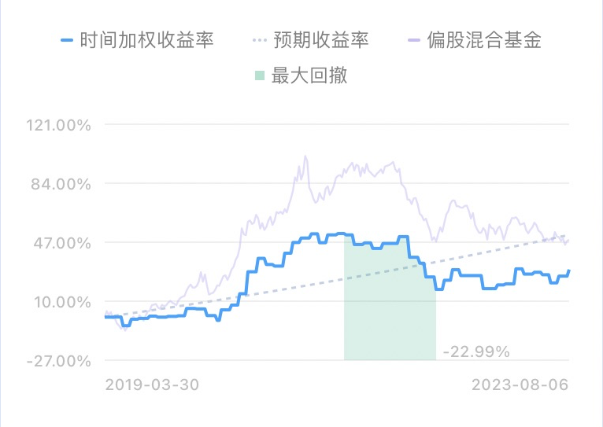
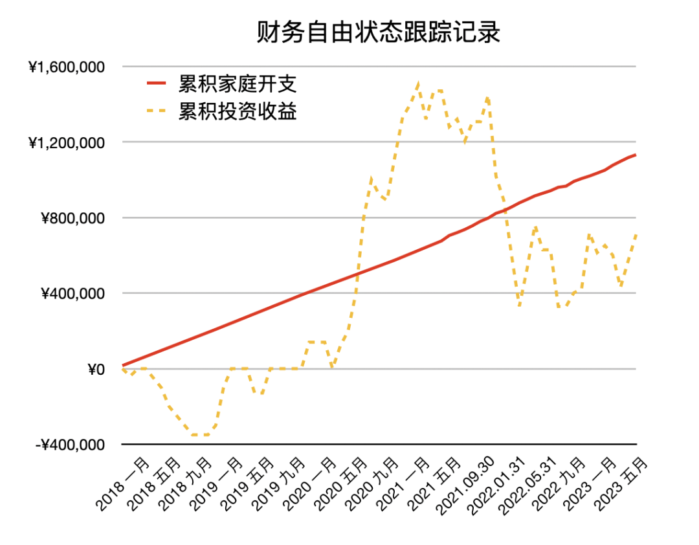

# 财务自由实证和十年之约有啥区别？｜财务自由实证 #52

**发布时间**: 2023-08-07 07:42:05

**原文链接**: [http://mp.weixin.qq.com/s?__biz=MzUzNjE3NzQ3Nw==&mid=2247492023&idx=1&sn=fe35983f7e1fa725ef616c308f4f09a2&chksm=faf89f9dcd8f168b06fdb9555a98bd8a269b7c8feb31649e253d60125a44172ef3e892a82aa6#rd](http://mp.weixin.qq.com/s?__biz=MzUzNjE3NzQ3Nw==&mid=2247492023&idx=1&sn=fe35983f7e1fa725ef616c308f4f09a2&chksm=faf89f9dcd8f168b06fdb9555a98bd8a269b7c8feb31649e253d60125a44172ef3e892a82aa6#rd)

---

前段时间收到一位小伙伴的留言：

> 从17年的文章一路肝到了现在，着实感受了一波牛熊转换的心态变化，前几天看20年的部分想的都是梭哈，这几天开始思考资金的配比。

这正是我希望的结果  希望实证记录可以穿越时间，不论当下环境如何、情绪如何，阅读文字时依然可以创造出这样一个独立空间，传递当时的经历、情绪和感受。

……

常有小伙伴问我，财务自由实证和十年之约实证的区别是什么？这篇具体解释一下。

财务自由实证，是我生活的真实记录，计算的是「全部」现金 + 投资。所以也包括不会用来长期投资的备用金、闲置现金，也全面记录了各种意外变化。

希望这样可以更直观地记录下——为了实现财务自由目标我们都会做些什么？面对一个个生活的选择，我们会如何取舍？钱，只是财务自由中的一环。更大的部分是，我们**通过对钱的思考，理清自己的生活** 。

对于财务自由而言，高收入、高收益都不是最重要的，最重要的是高储蓄率——**财富和自由来自我们没有花掉的钱** 。而高储蓄率背后是这样的生活理念，最舒服、最自由的生活方式，是主动选择比同收入水平“应该的生活”低一档的方式。

所以在财务自由实证里，大家看到最多的可能不是搞钱，而是如何攒钱并且乐在其中。我会晒电费账单，只有德国家庭平均水平的一半不到；我会分享开销、预算的思考，帮助自己做到 60～70% 储蓄率；最近也会反思，储蓄过犹不及，能实现目标就行，也不要追求过高的储蓄率，储蓄是为了更安心地生活，不能是牺牲生活来储蓄……

这是财务自由实证的视角。

不过相应的，也是因为财务自由实证记录了生活的各种细节，里面投资的部分就没那么有参考性了。现金、备用金、意外开销，都给实证曲线加入了噪音。

所以大家也别问我为啥财务自由实证曲线比偏股混合基金指数落后这么多了。持有相当比例现金、又有海外投资组合，跑不赢才正常，偶尔短期跑赢实属侥幸

……

在记录的同时我也慢慢发现，**做好投资有助于提高储蓄率** 。

很多小伙伴惊奇，我为什么可以前期「坚持」几年不买房，积累下财务自由本金。可能因为我觉得投资的长期预期不比房价差，而且有了本金买房会更容易（有 100 万再攒 100 万，比从头再攒 100 万更容易），所以并没那么焦虑难熬，也谈不上坚持。

常有小伙伴觉得攒钱太辛苦，但我也不觉得，因为攒下来的钱能赚更多钱啊，赚钱不比花钱有意思。

如果钱可以生钱，而不是放在那里贬值，我会更愿意把钱攒下来投资。也因此距离「没有花掉的钱」更近了一步。

所以后来就有了专门针对财务自由计划投资部分的实证——十年之约。

这是个**相对理想化、简单化的账户** ，每个月固定打钱，很少调整（目测一年可能调整不超过一次）。主打就一个**不折腾、少花时间** 。对于渴望实现财务自由的伙伴们来说，成为全职投资者通常并不是我们的目标，共同的目标是有时间更好地关注生活。

希望几年后大家回看十年之约曲线，会发现其实这样在投资上也能获得还不错的回报。

* * *

### 实证账户更新

如果把买房首付的 70 万加回来，这是实证第一次超过目标 👇

被动收入观察 👇 从投资中获得的「累计被动收入」目前还在「累计日常开销」曲线的下方，耐心等待回归 

注：这张图的思路来自[第 30 期实证](http://mp.weixin.qq.com/s?__biz=MzUzNjE3NzQ3Nw==&mid=2247489372&idx=1&sn=2118934ef05d930f50d2510ff6642cb1&chksm=fafb6976cd8ce06042f2bb8d1ed950a95262d11451fe116440e1ff84ca49c6fdae8a5d664a6d&scene=21#wechat_redirect)。家庭开支曲线里，我没有算买房首付、一次性税费和部分硬装的钱。剩下大家能想到、想不到的，房贷月供、家具、家电、旅行、保险、医疗什么的，每一笔都算进去啦。

……

最后例行提醒大伙，财务自由的投资和被动收入虽然看起来性感，但「因上努力，果上随缘」。本金和收益只是自由路上的「果」，**主业努力多赚钱、理性消费少挥霍，以此积累本金，再加上不被短期涨跌干扰、坚持投资才是背后的「因」** 。

投资复利只是我们获得被动收入的方式，而不是致富的秘密。

在财务自由实证的最初两年，我写得最多的也不是如何投资，而是如何**少在投资上花时间，好能多花时间关注主业** ，同时理性控制开销，尽快攒钱。

假如有 10 万本金，就算投资翻倍也才赚了 10 万。而投资翻倍极其困难，巴菲特的年化收益也才 20%。相比之下，在职场上努力提升，让收入再增加 10 万则要靠谱得多。

对财务自由而言，“钱生钱”做到 80 分足矣，剩下的精力还是应该关注赚钱和省钱这些“人生钱"。

### 关于这份实证

**普通人通过工资理财也能实现财务自由** ，这是这些年我一直在践行的理念。从最初懵懵懂懂到 2017 年制定具体的财务计划，再到如今渐渐靠近终点，已经走了五六年。

为了能够更加透明、中立地实证普通人财务自由的可能性，从 2019 年开始我决定公开自己的财务进度，成为这个系列内容「财务自由实证」。

不追求大富大贵，但求能够不再纠结生计这些琐碎问题，在重大选择面前获得更多的人生选项，不再瞻前顾后。

有兴趣参考这个实证的朋友建议先看看之前的引导篇，[制定自己的财务自由计划](https://mp.weixin.qq.com/s?__biz=MzUzNjE3NzQ3Nw==&mid=2247484500&idx=1&sn=c04c3de1a1231bef25bb4cda773c00ff&scene=21#wechat_redirect)、[一起财务自由](https://mp.weixin.qq.com/s?__biz=MzUzNjE3NzQ3Nw==&mid=2247484480&idx=1&sn=258e8dd4976c7d3c324ed89b90904d14&scene=21#wechat_redirect)。以往的干货精华也都有汇总 👇

  * [全都安排好了，自由路上我们会遇到的每一个问题](http://mp.weixin.qq.com/s?__biz=MzUzNjE3NzQ3Nw==&mid=2247489926&idx=1&sn=eac357cebcbfd7250828cdda88d9f122&chksm=fafb67accd8ceebaa1e750f129714bb000be9720a990a70c6fba6fc52fd3712014a58d699d6e&scene=21#wechat_redirect)

  * [我的第一本书，整理财务自由方法论](https://mp.weixin.qq.com/s?__biz=MzUzNjE3NzQ3Nw==&mid=2247486809&idx=1&sn=8a80c493837ee044c5d55e0a423507d2&scene=21#wechat_redirect)

  * [一期访谈](http://mp.weixin.qq.com/s?__biz=MzUzNjE3NzQ3Nw==&mid=2247487473&idx=1&sn=10a891429291e78dea82b4df34e773f3&chksm=fafb71dbcd8cf8cdb15f114d6637bc6476a2803f9f0803dcbb4d91c1e68b5cc706c3dc55358b&scene=21#wechat_redirect)和[一期播客](http://mp.weixin.qq.com/s?__biz=MzUzNjE3NzQ3Nw==&mid=2247489401&idx=1&sn=a613497a5d6fdc3325d0424b9a78063e&chksm=fafb6953cd8ce045481121812b61b04f62dfe09a07b785991fc4cdd679bc9af13665d4c0ce62&scene=21#wechat_redirect)聊聊我的经历和观念

我给自己定下的目标是 30 岁前积累到**  家庭年度开支的 10 倍**（结果现在攒到了 20 倍 ✌️），作为创造被动收入的本金。依靠这些本金实现长期 10+% 的年化投资收益就可以实现财务自由，不再依赖上班工资生活，有底气去选择自己真正想做的事儿。

（我的具体目标数字是 500 万，但**这个数字大家没必要参考** ，还是要以自己的生活开销为准）

财务自由路上一些重要节点：

  * 2017 年，计划正式开始，同年获得家人的认可和支持；

  * 2018 年，A 股熊市大跌，出现“钻石坑”机会；

  * 2019 年，开始财务自由公开实证（就是现在大家看到的这个系列）；

  * 2020 年，新冠股灾，自由之路上的又一个关键机会；

  * 2021 年，[自由目标基本达成](http://mp.weixin.qq.com/s?__biz=MzUzNjE3NzQ3Nw==&mid=2247489120&idx=1&sn=e5c5bf6d51914c212c228bc6f42346dc&chksm=fafb684acd8ce15c27cd508a67d57573f4acbeced75f805ef271b4efcf42cf54b363e5f93fcf&scene=21#wechat_redirect)，开始向新的节奏过渡；

  * 2022 年，遭遇自由后的第一次账户大幅回撤，但也是港股 6 年后、A 股 3.5 年后的又一次钻石坑，期待后续……

  * 也是同年，[我搬去二线过想要的生活了](https://mp.weixin.qq.com/s?__biz=MzUzNjE3NzQ3Nw==&mid=2247490915&idx=1&sn=313fba2e0a82a878f0188795ffe1900f&chksm=fafb6349cd8cea5fdfb9a63648453317d1970941f8c470f7bf697d07cca4054fca66f1dc5fac&scene=21#wechat_redirect)，[买房钱从计划中扣除](https://mp.weixin.qq.com/s?__biz=MzUzNjE3NzQ3Nw==&mid=2247490995&idx=1&sn=5b90cca481c8f33b2a7a19f6ef555791&scene=21#wechat_redirect)（自住房我会看作消费而不是资产）

慢慢播种，等待市场回归～