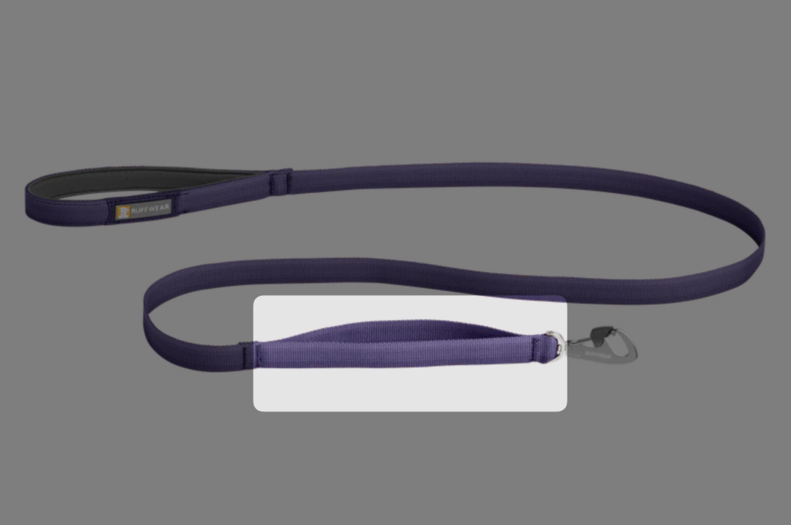
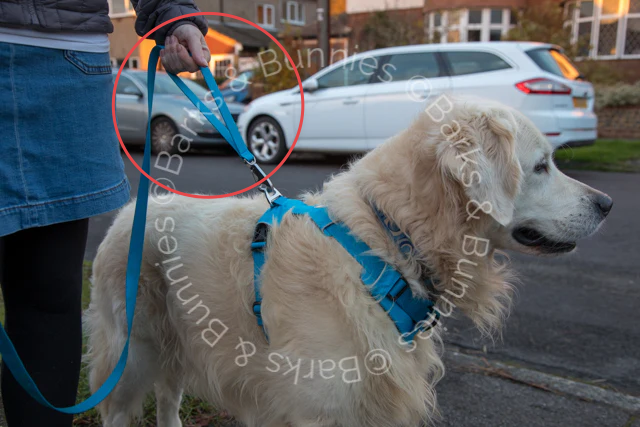

# 如何平衡花钱和攒钱，并在未来不容易后悔

**发布时间**: 2023-08-09 16:04:24

**原文链接**: [http://mp.weixin.qq.com/s?__biz=MzUzNjE3NzQ3Nw==&mid=2247492041&idx=1&sn=542602836962695eb16a8a32f999c495&chksm=faf89fe3cd8f16f5987667629c106af275e6a674fedf189f41d02428e5acb089e2777a8e2853#rd](http://mp.weixin.qq.com/s?__biz=MzUzNjE3NzQ3Nw==&mid=2247492041&idx=1&sn=542602836962695eb16a8a32f999c495&chksm=faf89fe3cd8f16f5987667629c106af275e6a674fedf189f41d02428e5acb089e2777a8e2853#rd)

---

关于花钱和攒钱，互联网上经常有这样相反的声音：

  1. 有人鼓励大家攒钱、存钱，动用「理性」反思自己

  2. 有人鼓励大家花钱、消费，动用「灵性」打开自己

享受当下和未雨绸缪都很对，难的是什么时候该选哪一个？更难的是，如何在几年后不为这个决定感到后悔。

过度消费，未来的后悔可能来自遇到意外没有应急资金、可能来自中年危机、可能来自终于接触理财投资却感慨「早攒下一笔本金就好了」。

过于节俭，未来的后悔可能来自错过，当我们终于可以追求一些年轻时渴望过的东西，才发现已经不是最初的那个感觉。

和大家聊聊这些年的思考，试图找到中间的平衡。

先从避免过度消费开始——常有小伙伴列举了一笔消费的种种好处，然后问我怎么看。我疑惑，难道不是先看你有多少钱吗？

### 消费和投资一样，先看风险，再谈收益

关于理财有个经验公式可能已经深入人心：

  * 1 年内要用的钱，最好买货币基金，就别拿去理财投资了；

  * 1～3 年内要用的钱，可以买点稳健理财，但不适合买（股票型）基金；

  * 只有 3 年以上、并且是闲钱，才适合用来买这些长期投资；

明明长期投资的预期收益最高，为什么很多情况却不适合？因为长期投资的风险超出了短期资金的承受能力，投资必须先考虑风险，在自己的风险承受范围内考虑问题。

但看到人们谈一笔消费值不值的时候，买房时「你要有个自己的家」、城市公交不方便「买车是刚需」、「体验是无价的」…… 你发现问题了吗？大部分人只谈这笔消费的收益是什么，却没人谈风险。

消费的风险来自**花掉这笔钱以后才突然意识到，这笔钱还有更重要的去处** 。比如当你花 5000 元买一台手机时，背后的风险可能是家人突然生病急需 5000 元医疗费；比如当你遭遇互联网裁员，看着贷款买来的房子和车子时，却发现同龄人已经利用积蓄实现财务自由急流勇退……

一笔消费的风险我们是否可以承担，要看两个因素：

  1. 意外

  2. 储蓄目标

如果积蓄和保险足以应对大部分意外（比如足够家庭无收入生活 6 个月），花掉这笔钱依然可以实现储蓄目标，这笔消费的风险就是我们可以承受的。

我们家当初的预算是这么定的：我和也太希望可以 30 岁财务自由，不再依赖上班收入。然后我们根据自己的财务自由本金目标、预期收益和时间，计算出应该攒下大约一半的收入，那剩下的就是我们可以花的钱。

消费和投资一样，应该先衡量风险，确保自己可以实现最重要的财务目标。再考虑收益，考虑这笔消费能带来怎样的体验、值不值得。**如果一笔消费超出了你的承受能力，它再值得、再刚需对你都没有意义。**

想要避免过度消费的后悔，需要多一点理性分析。但想要避免过度节俭的后悔，则正好相反。

下面我们来聊聊如何避免过度节俭的问题。

### 理性能告诉你可以花多少，但灵性更能告诉你应该买什么

特别擅长攒钱的小伙伴，容易犯的错误是过于关注逻辑和算计，得到了各种比较数字却错过了「心动」的瞬间。

或者精打细算、反复做功课买到了最划算、性价比最高的产品，但最后得到的教训却是「如果一个东西哪都好，只是有点贵，当初就该买的。平替真是除了便宜，哪哪都不好……」

更有家庭已经千万资产还在找全市最便宜的加油站，最后省下的油钱还不够多花时间里收到的利息。

攒钱会慢慢形成一种惯性，哪怕是你知道自己能花的钱，还是会忍不住想「我能不能再多攒一点，能不能买个更划算的东西」。

所以习惯理性和计算的小伙伴，面对的可能是这个课题——消费的收益（体验）很难用数字来衡量，**要买的不是别人喜欢的东西，也不是最划算的东西，而是你喜欢的东西** 。

如果一笔消费在我们的承担能力内，划不划算、能不能再攒更多都没有「我喜欢」重要。

我最近发现两笔**事前感觉冤大头、做了很久心理建设，但事后真的非常非常喜欢的消费。**

先是花了近 400 块买了一条 Ruffwear 的牵狗绳，为了这个细节 👇 牵狗绳前段有个拉手，在拥挤路段可以快速把狗拉在身边

秒变短绳 👇

客观来讲，这个设计完全对不起溢价，一点也不划算。但因此减少的手忙脚乱的体验值多少钱呢？总之用了一年多，下次我还会买。

我还花了 800 块买了一条苹果手表的原装表带，放弃了网上几十块就能找到的平替。

就产品和体验而言，他们的区别可能微乎其微。但我有点强迫症，如果买了平替遇到瑕疵和问题，到时候肯定会无比纠结「如果是原装的会怎么样」然后花特别多的时间来纠结和后悔。买了原装的反而舒坦了，最多感慨一句「原装也不过如此」。

这省去的纠结和比较，又该如何定价？

**消费最大的收获不是物品，不是他人的评价，是自己的体验** 。我很在意的、你可能完全不 care；你很在意的，对我来说又可能无所谓。所以体验无法用数字计量，只有一个标准「我喜欢」。

> 注：也是因为如此，本来想找一些比较通用的例子，但想了想还是用了更片面的自己的经历‍‍

想要避免过度节俭的后悔，需要把注意力从「最划算」换到「最喜欢」，买承受能力范围内最喜欢的东西。

另外，**有没有过度节俭，只取决于自己（和家人）的感受，并没有外在标准** 。如果你很喜欢攒钱并乐在其中，这也是一种我喜欢。我们之前聊过[一位网友的经历](https://mp.weixin.qq.com/s?__biz=MzUzNjE3NzQ3Nw==&mid=2247486728&idx=1&sn=280342698df7e4d7a0a3416dafa312c9&scene=21#wechat_redirect)——临近退休才发现，他的积蓄比同事们多了很多倍，千万量级没有负债。然后就被一同事怼了，说这叫过度储蓄，以后肯定要后悔。但这位网友就觉得很委屈，他从没觉得生活里缺了啥。

如果生活幸福满足，一辈子乐乐呵呵还存了几千万，这哪是过度储蓄，这不就是世俗定义的成功嘛（7% 的投资收益率，夫妻双方每人每个月攒下 7300 元，工作 30 年就能有近 2000 万了。复利效应拉长时间还是很可观的）

但如果你虽然攒下很多钱，花钱时却犹犹豫豫、束手束脚，买东西做功课做到让自己焦虑烦躁，很不舒服，也许应该考虑多为购买体验和时间花一点钱。比如**想想生活中有哪些特别讨厌的瞬间，是只要多花钱就可以解决的。**

### 如何看待他人的消费

曾和伙伴聊起过一位博主，主打鼓励消费、让内心觉得富裕。「看了 ta 的文章就会想花钱，直到最后我看到了 ta 的收入」。一年花 100 万，听起来花得很多。但如果同时一年赚了 500 万，80% 的储蓄率，其实就比绝大多数人都要节俭。

再或者，如果你的时薪是 1000 元，你还应该为了省下 100 元去做一个小时的功课比价吗？不，你应该喜欢就买。

但如果在这样的影响下，让时薪 50 元的你果断花掉了口袋里最后一点积蓄「我在购买体验、我在充盈内心」，这还明智吗？

就像 Housel 说的，一个人花掉的钱很容易被看到，不容易看到的是 ta 攒下来的钱。

如何平衡花钱和攒钱，其实就是如何平衡理性和感性。

诉诸理性，是想筑起一道安全的围栏。但这个围栏并不是为了尽可能地束缚自己，而是为自己划出一个安全范围——在这个范围内，自己可以放心地做自己喜欢的事儿。

理性能告诉你，应该花多少。但灵性更能告诉你，应该买什么。花多少要考虑的是风险，但买什么要考虑的是幸福。

  * 财务自由：[我的财务自由实证之路](http://mp.weixin.qq.com/s?__biz=MzUzNjE3NzQ3Nw==&mid=2247491917&idx=1&sn=9e19aca506ac023ad831fe4d11a334d1&chksm=faf89f67cd8f16711512e6cd8a22a337fc388b9d130f52abd1c5783143c3fc248c98629350a0&scene=21#wechat_redirect)

  * 投资笔记：[十年之约，躺赚不难](http://mp.weixin.qq.com/s?__biz=MzUzNjE3NzQ3Nw==&mid=2247491855&idx=1&sn=32bb658b557f2d4aaa540ed74ace11f9&chksm=faf89f25cd8f1633277f8805b34425cc25db7a50ca8f7933cae718460a09a9ffc961dc2a923f&scene=21#wechat_redirect)

  * 抵御风险：[7 月保险最推荐](http://mp.weixin.qq.com/s?__biz=MzUzNjE3NzQ3Nw==&mid=2247491932&idx=1&sn=7cb4028029409daa7131fe35fdbd12aa&chksm=faf89f76cd8f16603eec4025728dc8c8cdee672f4adde6f0876141a7dc2fe37564cea54ce9ff&scene=21#wechat_redirect)

  * 干货汇总：[财务自由路上应该了解的每一个问题](http://mp.weixin.qq.com/s?__biz=MzUzNjE3NzQ3Nw==&mid=2247491818&idx=1&sn=c4d5171acfab76ba65b56c47d6d384da&chksm=faf89ec0cd8f17d6aad08ad69e208c2b896678e1a51266702ca1eceeec768ad75d1bb6184d74&scene=21#wechat_redirect)