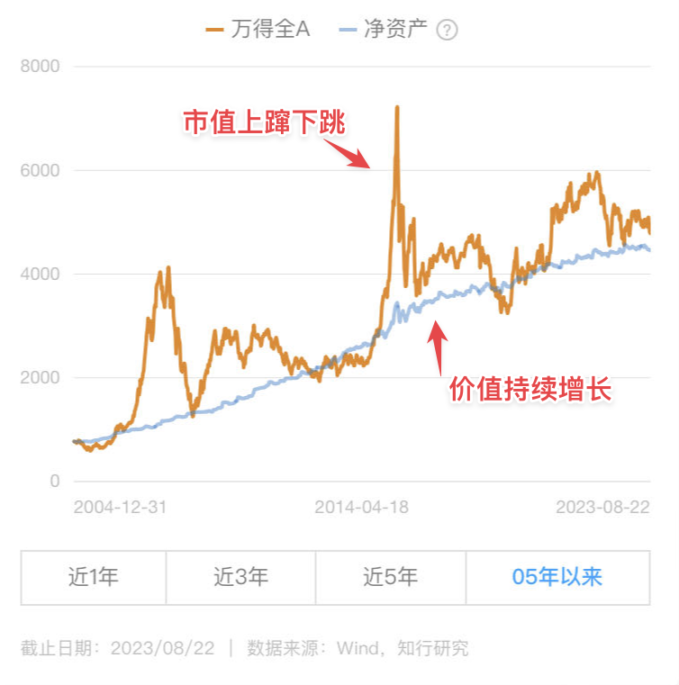
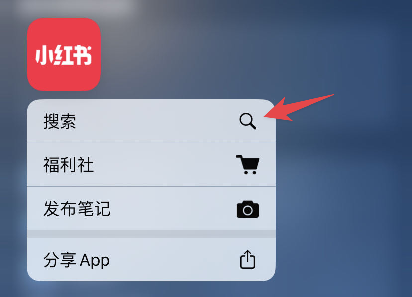

# 如何管住自己不看行情

**发布时间**: 2023-08-23 10:30:25

**原文链接**: [http://mp.weixin.qq.com/s?__biz=MzUzNjE3NzQ3Nw==&mid=2247492092&idx=1&sn=60213d01779839d0c06bd85d2edc4784&chksm=faf89fd6cd8f16c041f9ed4620f62150e2b04e312e5340733395174fedc8b1b173ab771510a0#rd](http://mp.weixin.qq.com/s?__biz=MzUzNjE3NzQ3Nw==&mid=2247492092&idx=1&sn=60213d01779839d0c06bd85d2edc4784&chksm=faf89fd6cd8f16c041f9ed4620f62150e2b04e312e5340733395174fedc8b1b173ab771510a0#rd)

---

周一我突然意识到一件事儿——到了每天可以刷社交媒体、读新闻的时间段才知道，原来现在都这么悲观了？而我完全没感受到  一天天都乐呵呵的

写财务自由实证时，偶尔也有小伙伴问我「是买了啥投资，看起来这么稳？波动小很多」

其实投资大家都差不多，区别只是实证曲线一个月才更新一个点，相当于一个月才看一次行情。**每天看行情、看净值，看到的是惊险刺激的过山车、V 型反转，但放在每个月记录可能就只是一条平平无奇的直线** 。

就像今年，情绪几次起落，但如果和年初比变化并不大。如果换作一位只在年初和今天看两次行情的投资者，他看到的只是——市场相比于年初没啥变化，可能完全无感。

对收益的影响可以继续观察，但普通人把投资委托出去或者自动化，以此少看行情、少操作，绝对有利于改善生活幸福感。看看好山好水、看看家人，不比看行情幸福嘛～

说起来，最近三天晚上，我和也太都**在露台上躺着看流星** 🌠。我长这么大头一回看到，感觉太值了。昨天晚上学着认星座，还找到了隔着银河相望的织女和牛郎，再想到当天七夕，突然还挺浪漫的～

少看行情，对我来说一方面是省时间、少了无谓的情绪波动，但更重要的是，**我发现看行情会浪费我的好奇心** ——我们都想知道身边在发生什么，但好奇心总量有限，在股市里好奇心得到快速满足，也少了再去阅读高质量内容的动力（无脑刷社交媒体也有类似影响）。总之遇到行情不好的时候，会做事儿提不起劲；遇到行情太好的时候，满脑子都是各个账户数钱 

……

后来有小伙伴问我，如何管住自己不看行情呢？

单纯从「自律」这个目标很难实现。想起之前聊好好吃饭，有小伙伴写下的留言 👇 总想吃零食甜点是身体的信号——碳水摄入不够——所以想要减少吃零食、甜点的习惯，最重要的是在正餐中把主食吃够，碳水摄入比例合理了，自然就没那么喜欢吃零食了。

想看行情也是，动机来自好奇心，有好奇心是好事儿。需要的不是克制，而是找到一个更优质的满足好奇心的方法。

目前用下来觉得 2 个方法对我最有帮助：

### 1、不看市值，看价值

> 白天看完行情觉得世界要完蛋了，晚上看了财报感觉我又行了

这个方法最初来自陈嘉禾老师，虽然市值波动很大，但我们所持有的投资背后的底层资产增长很稳定。比如这是 👇 有知有行计算的万得全 A 市值和净资产的走势对比

嘉禾老师自己做了个价值计算器，定期汇总持仓公司背后的价值变化。不过他毕竟是专业投资者，我没法直接照抄，所以我转化成的办法是——**不看行情，看估值** 。

想看行情的时候，就翻一翻各个估值最近的变化，比如有知有行温度计、兴全的兴动信号，或者看长赢当天的发车通知。

一来，看估值和看行情心态天然就不一样。我发现人一旦清楚自己能做什么、有清晰的预案，心态自然就会积极很多。看行情跌了第一反应是「钱怎么又少了 」，但看估值跌了第一反应会是「让我看看还能买点啥 」

二来，因为估值数据都在当天晚上甚至第二天才更新，远不如行情这么刺激，所以也不会有上瘾、急不可耐的感觉，人会慢慢变得有耐心。

### 2、把顺序反过来

看行情遇到大涨大跌，我们都会想知道发生了什么，然后焦虑地到处找解释、找观点，或者问主理人应该怎么办。

那么为什么不把这个过程反过来呢？直接**通过看主理人的观点反过来了解行情动态** ，少了等答案的焦虑，不会错过重要事件，还过滤了无意义的噪音。而且靠谱主理人也会分享很多不限于投资的高质量信息，这不就是我们想要动用好奇心的地方嘛。

想看行情时就会去刷一刷主理人的更新。如果没聊到行情，那就说明今天也没啥事儿，不用看；如果聊到行情了，他们会给出看法，有必要直接调仓投顾，很省心。

跳过了看行情的过程，直接得到了看行情的结果～

另外在刷主理人社交媒体时有个细节——不要通过信息流找主理人，八成会被各种消息带走，直接**用搜索框跳转主理人主页** 是更好的办法。

现在很多 App 都可以直接进搜索，要没有这个功能我都不敢开小红书的 ‍

### 管理好我们的注意力

以上是经过尝试对我比较有帮助的两个办法，希望对大家有帮助。

此外也有小伙伴提过一些限制屏幕用时的 App，安卓上「不做手机控」，苹果上自带的「屏幕使用时间」可以控制各个 App 的打开时间或者限制累计时常，也是个可行的思路。

最后想再分享一下《财富自由》中的这张图 👇

财富和自由，一定程度上是我们如何管理注意力的结果。

  * 财务自由：[我的财务自由实证之路](http://mp.weixin.qq.com/s?__biz=MzUzNjE3NzQ3Nw==&mid=2247491917&idx=1&sn=9e19aca506ac023ad831fe4d11a334d1&chksm=faf89f67cd8f16711512e6cd8a22a337fc388b9d130f52abd1c5783143c3fc248c98629350a0&scene=21#wechat_redirect)

  * 投资笔记：[十年之约，躺赚不难](http://mp.weixin.qq.com/s?__biz=MzUzNjE3NzQ3Nw==&mid=2247491855&idx=1&sn=32bb658b557f2d4aaa540ed74ace11f9&chksm=faf89f25cd8f1633277f8805b34425cc25db7a50ca8f7933cae718460a09a9ffc961dc2a923f&scene=21#wechat_redirect)

  * 抵御风险：[7 月保险最推荐](http://mp.weixin.qq.com/s?__biz=MzUzNjE3NzQ3Nw==&mid=2247491932&idx=1&sn=7cb4028029409daa7131fe35fdbd12aa&chksm=faf89f76cd8f16603eec4025728dc8c8cdee672f4adde6f0876141a7dc2fe37564cea54ce9ff&scene=21#wechat_redirect)

  * 干货汇总：[财务自由路上应该了解的每一个问题](http://mp.weixin.qq.com/s?__biz=MzUzNjE3NzQ3Nw==&mid=2247491818&idx=1&sn=c4d5171acfab76ba65b56c47d6d384da&chksm=faf89ec0cd8f17d6aad08ad69e208c2b896678e1a51266702ca1eceeec768ad75d1bb6184d74&scene=21#wechat_redirect)