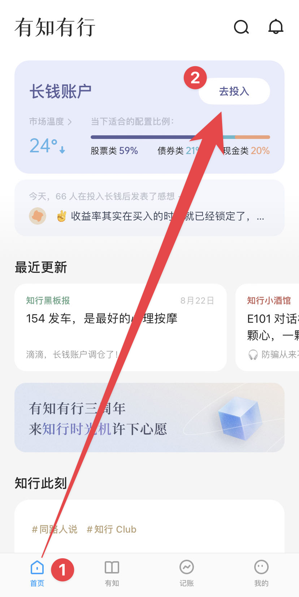
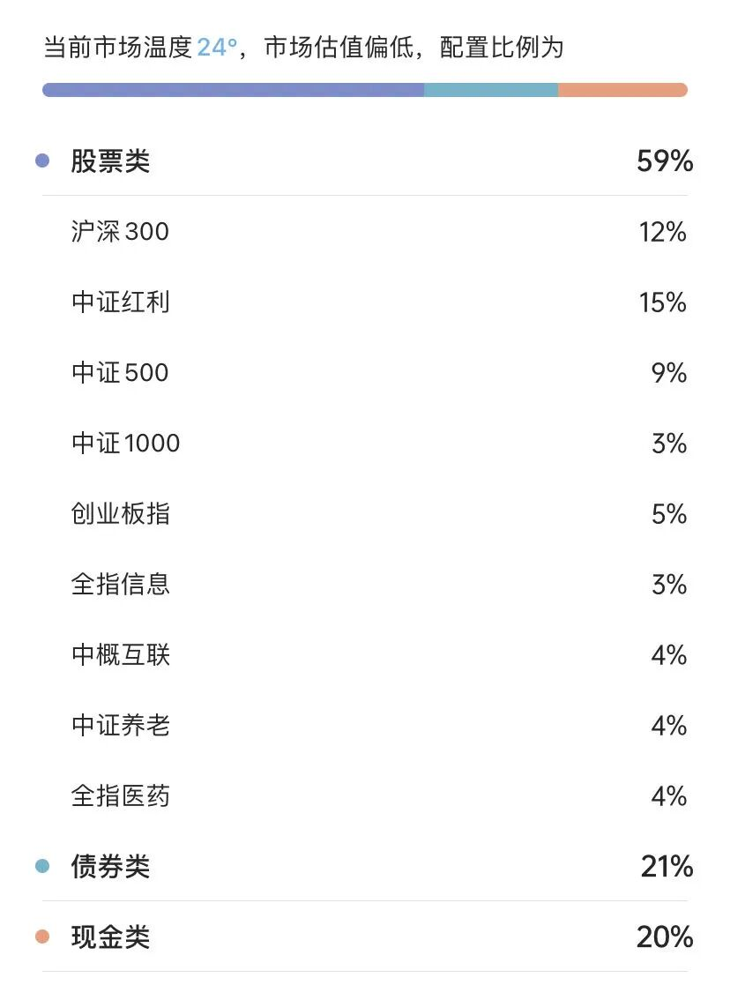
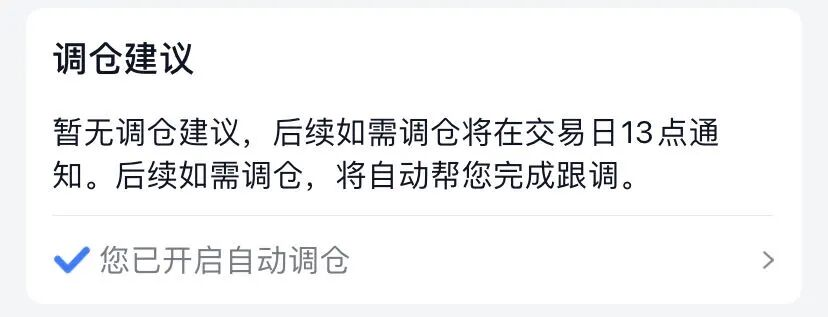
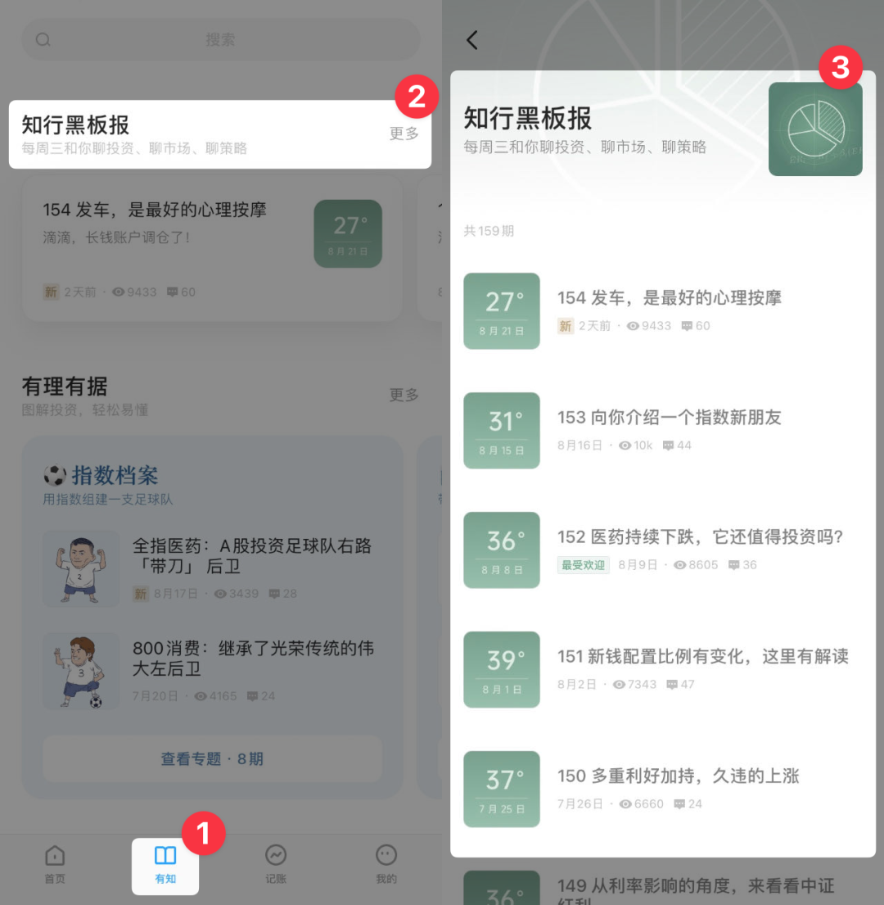
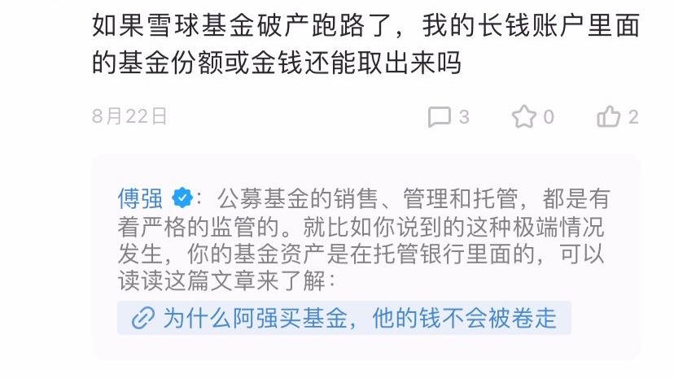
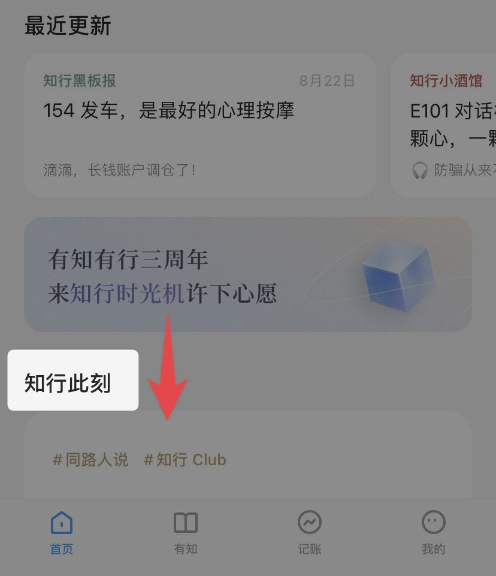
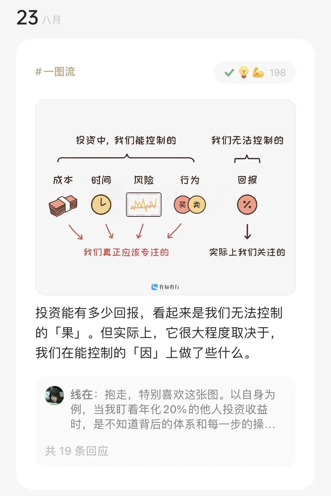
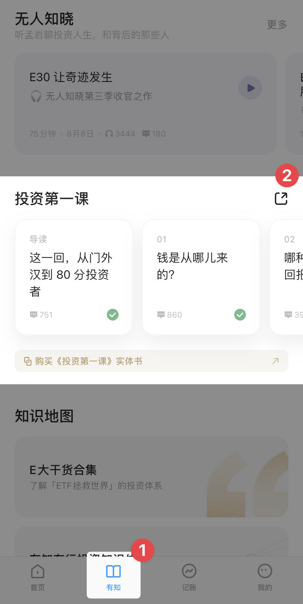

# 从零开始了解投资，可以买什么？

**发布时间**: 2023-08-25 09:57:52

**原文链接**: [http://mp.weixin.qq.com/s?__biz=MzUzNjE3NzQ3Nw==&mid=2247492124&idx=1&sn=f3b2ebcdf5a0f0d9deb0ec16831c0d87&chksm=faf89c36cd8f1520cfed2c5a43d56d21ee3d90b7004f7c3a2cd2507ec02f3148c8d6533bd914#rd](http://mp.weixin.qq.com/s?__biz=MzUzNjE3NzQ3Nw==&mid=2247492124&idx=1&sn=f3b2ebcdf5a0f0d9deb0ec16831c0d87&chksm=faf89c36cd8f1520cfed2c5a43d56d21ee3d90b7004f7c3a2cd2507ec02f3148c8d6533bd914#rd)

---

也太最近在学一些投资知识，突然问我有没有这样的内容，可以「**就算完全没有你帮忙** ，我**从零开始** 也能知道应该买什么？做什么？」

我想了一会儿，那就下有知有行，买长钱吧。

投资最重要的不是买什么，而是背后的投资体系，以及相关行动。

如果我只告诉你代码，什么用也没用。

如果我只给你书单，你还是不知道应该做什么。

只有有知有行的长钱是我觉得能概率最高，既能告诉你当下应该买什么、先解决当下问题，又能学到投资体系、把你慢慢培养成合格投资者，而且可以一直持有下去、不用“赶时间”的投资。

所以就有了今天这篇文章，我给也太装了有知有行，并整理了**一步步的使用指南** （也算是怕她记不住留的图文小抄 ）如果大家也有过类似问题，也许可以作为一个思路参考。

### 0、下载入口

二维码可以直接跳转到应用商店

### 1、先开启通知权限

我俩都有点通知栏强迫症，App 通知权限默认都是关闭。也太比我还过分，移动网络、定位啥的也都不开，所以记得专门开一下 👇

这样可以确保不错过重要信息，**尤其是买了长钱以后的调仓通知** 。有知有行的推送频率比较低，主要就是周三知行黑板报、周五播客更新、以及一些不定期的干货，不担心打扰，我应该不至于挨骂 

### 2、然后买一笔长钱

投资中大部分认知都要在行动亏钱中学，「把手弄脏」是基本前提

买之前先仔细读一下长钱的理念介绍，也是个学习过程。**开始的金额不要太多，投资初期就算侥幸赚到钱以后也会凭实力亏回去的** 。主要还是在行动中学习，感受投资波动并且观察学习长钱账户如何在各种行情下调仓应对。

长钱会告诉你，他们认为最适合当下的资产配置比例，应该买什么👇 市场估值越低股票仓位会越高，反之越低，照着买就好

买入的时候记得顺手**开一下「自动调仓」**  👇 开启自动调仓以后每次调仓还是会照常通知，让你知道当下在做什么。

买入完成后有知有行会问你要不要记个账 👇 虽然我觉得记账很重要，但你八成也懒得记，那就看心情随缘吧。

### 3、等每周的「知行黑板报」

每周三会推送知行黑板报，聊过去一周的市场状况，长钱账户会如何应对（调仓或者不调仓）。**我觉得很值得看，这些观点对应长钱账户的操作，能让人更快理解投资上重要的事儿** 。

有三个方法找到知行黑板报：

1、等推送消息

2、在长钱买入界面找到最新文章 👇

3、在「有知」标签找到全部历史文章 👇

有疑问可以直接在文章下面留言，基本都会得到解答 👇 比如

### 4、闲暇时间和发生大事儿时看什么

有事没事可以来**首页往下翻** 刷刷「知行此刻」，是像微博、小红书一样的简短分享，读起来不会有压力，可以日常每天看 👇 

发生“大事”还会有孟岩来按摩 👇

### 5、系统学习

最后，有整块的时间可以来读读《投资第一课》。前面的内容更多是告诉你现在应该做什么、可以买什么，而投资第一课会更系统、更底层地说明，投资到底是什么？

以上就是我最建议做的几件事儿：

  1. 能先解决你最迫切的「买什么」的问题；

  2. 确保自己能收到重要信息，然后在每周推送和日常阅读中了解自己的投资在发生什么，不用再为投资「现在是不是该卖了」焦虑；

  3. 想要深入学习的系统内容也安排上好了；

虽然还有很多事这里没有提到，但按照这几个建议持续行动，你都会慢慢接触到，剩下的问题就交给好奇心和时间吧。

### PS：为什么这么建议呢？

这篇建议可能和很多小伙伴的预想不一样，也太问的明明是投资问题，我却给她写了一篇 App 使用指南 😂

但我觉得，这恰恰是好问题的价值。

也太问的不是「投资应该买什么？」，每笔投资背后都有大量的思考和经历，说个代码容易，但背后的隐性经验三言两语很难说清楚。

也太问的是，能不能有一篇文章，就一篇，让我没有任何基础、也没人从旁实时指导，也能知道自己该做什么，并且慢慢学会投资？

所以我先想到的不是把我知道的东西教给她。而是给她一个可靠的信息源、一个能自己找到答案的入口，然后相信她的好奇心和学习能力，她一定会找到最适合自己的答案，也许会比我的答案更好。

  * 财务自由：[我的财务自由实证之路](http://mp.weixin.qq.com/s?__biz=MzUzNjE3NzQ3Nw==&mid=2247491917&idx=1&sn=9e19aca506ac023ad831fe4d11a334d1&chksm=faf89f67cd8f16711512e6cd8a22a337fc388b9d130f52abd1c5783143c3fc248c98629350a0&scene=21#wechat_redirect)

  * 投资笔记：[十年之约，躺赚不难](http://mp.weixin.qq.com/s?__biz=MzUzNjE3NzQ3Nw==&mid=2247491855&idx=1&sn=32bb658b557f2d4aaa540ed74ace11f9&chksm=faf89f25cd8f1633277f8805b34425cc25db7a50ca8f7933cae718460a09a9ffc961dc2a923f&scene=21#wechat_redirect)

  * 抵御风险：[7 月保险最推荐](http://mp.weixin.qq.com/s?__biz=MzUzNjE3NzQ3Nw==&mid=2247491932&idx=1&sn=7cb4028029409daa7131fe35fdbd12aa&chksm=faf89f76cd8f16603eec4025728dc8c8cdee672f4adde6f0876141a7dc2fe37564cea54ce9ff&scene=21#wechat_redirect)

  * 干货汇总：[财务自由路上应该了解的每一个问题](http://mp.weixin.qq.com/s?__biz=MzUzNjE3NzQ3Nw==&mid=2247491818&idx=1&sn=c4d5171acfab76ba65b56c47d6d384da&chksm=faf89ec0cd8f17d6aad08ad69e208c2b896678e1a51266702ca1eceeec768ad75d1bb6184d74&scene=21#wechat_redirect)