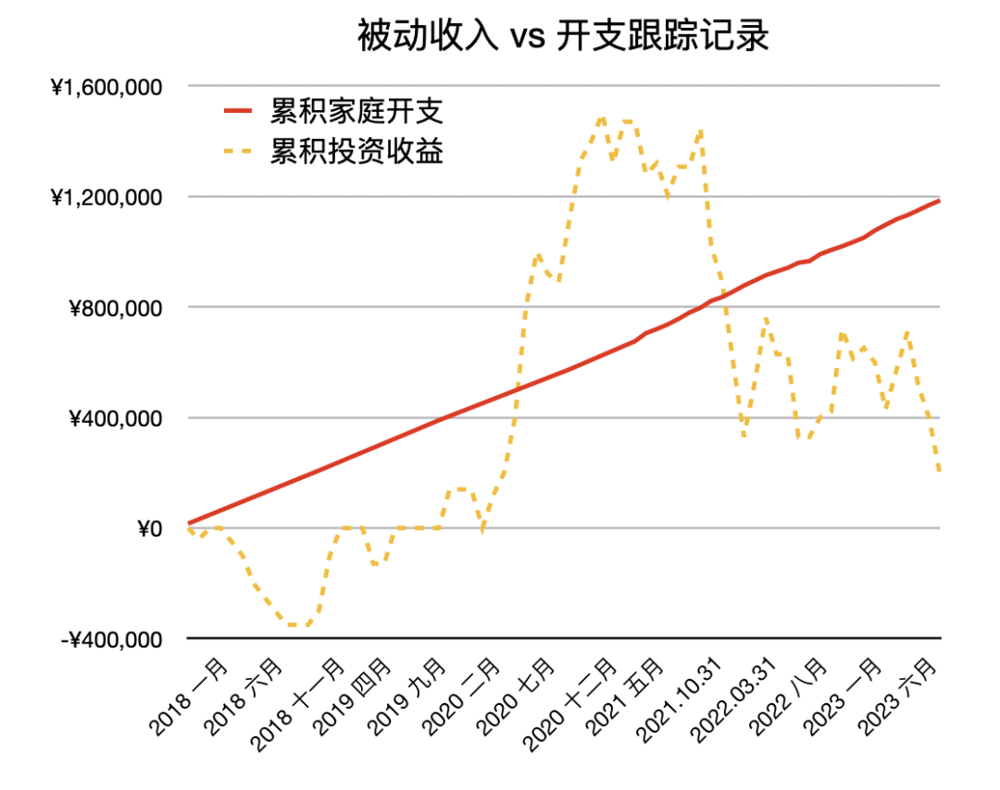

# 熊市快 2 年，财务自由生活开支从何而来？｜财务自由实证 #55

**发布时间**: 2023-11-01 07:56:41

**原文链接**: [http://mp.weixin.qq.com/s?__biz=MzUzNjE3NzQ3Nw==&mid=2247492427&idx=1&sn=4aa9bd89f63cf2d432c386b66647b5b6&chksm=faf89d61cd8f1477e5aaddc9d4e9dfc5fa63408a7ccbdf79a2969e1bbe882c3dc6e98aff6678#rd](http://mp.weixin.qq.com/s?__biz=MzUzNjE3NzQ3Nw==&mid=2247492427&idx=1&sn=4aa9bd89f63cf2d432c386b66647b5b6&chksm=faf89d61cd8f1477e5aaddc9d4e9dfc5fa63408a7ccbdf79a2969e1bbe882c3dc6e98aff6678#rd)

---

这是一位小伙伴在星球里的提问，但和实证的关联还挺多的，所以一起转过来。

在我的实证里，代表被动收入的「累计投资收益」已经挺长时间低于代表生活开支的「累计家庭开支」了 👇

那么在这种持续时间较长的熊市里，应该如何获得生活开支呢？小伙伴在提问中也提出了 4 种思路，并推演了可能的结果

  1. 利用主动收入补贴，渡过熊市；

  2. 在投资之外，额外准备与投资隔离的生活备用金；

  3. 依然强行从投资本金里支取；

  4. 之前每月生活费里没用完的结余；

如果是 1，可能对于很多人，不能完全放弃主动型收入；

如果是 2，做一个账户层级的隔离，应该对心态帮助最大；

如果是 3，可能在这种行情对心态有巨大影响，继而有不理智的决策（还可能伤及本金）

如果是 4，可能会长久的在真实生活中，不断压抑自己的真实需求；

### 出乎意料的选择

聊聊我的思考和行动。

我对自己的财务自由体系[做了 6 层安全边际](https://mp.weixin.qq.com/s?__biz=MzUzNjE3NzQ3Nw==&mid=2247488963&idx=1&sn=da44254227d0ca16f3e7e2f9cc30ef5c&chksm=fafb6be9cd8ce2ff9c3ffc043569c3352d124ec85bfa52b4865cbf9c35350eef2528b8a15bb4&scene=21#wechat_redirect)，其中也包括了小伙伴提到的 1. 主动收入和 2. 三年的备用金，额外还包括可以接受更低的投资预期、更灵活的生活方式（降低固定开支占比）、保险和心态上的安全边际。不过**目前只用到了备用金这一层** 。

但还有个事实估计会很让大家意外，也是我今年投资上很大的收获——财务自由最值得学习的榜样，耶鲁捐赠基金用的居然是第 3 种「依然强行从投资本金里支取」。为什么耶鲁没有遇到「可能在这种行情对心态有巨大影响，继而有不理智的决策」和伤及投资本金的问题呢？

因为投资上的**有效分散、多元化，对于投资的贡献比我以前想得更大** 。如果能做到熊市里少亏甚至不亏，又有前期牛市里的收益做安全垫，变现投资的压力自然就小得多。

其实我们身边也有这样的例子 👇 今年感觉这么惨，但长赢（和长钱）就几乎没亏钱。

这是雪球上网友 @府库 对各个投顾的统计，时间点是 10 月 23 日，这波下跌幅度最大那几天

而且我觉得这不是运气，「熊市里少亏、不亏，牛市能跟上就行」一直是他们的投资理念。

所以在谈安全边际以前，我们也需要先关注好自己的投资，抗风险能力也是投资体系的一部分。这一点我以前考虑得不够周到——**在积累本金的阶段，我们可以无视波动、长期持有。但到了需要定期变现的阶段，就应该慢慢改变思路了。**

### 主动收入

然后说说小伙伴提到的第 1 点「可能对于很多人，不能完全放弃主动型收入」。

我觉得这句话可以改一改，甚至可以是**对于任何人，都不应该放弃主动型收入** 。

可能很多小伙伴会疑惑，那这样财务自由还有什么意义呢？这个问题我是在 21 年想明白的，当时给大家分享过[这个思考](http://mp.weixin.qq.com/s?__biz=MzUzNjE3NzQ3Nw==&mid=2247488909&idx=1&sn=74c33a53392fe53e3da89df938772207&chksm=fafb6ba7cd8ce2b12287f696b5a63515fbab5108ca986392506e5deb81b56d43bb7270b2f9c0&scene=21#wechat_redirect)——我发现**财务自由最大的价值不是不用工作，而是改变我们与财富和工作的关系。**

以前我们是通过主动收入支付生活，再希望通过投资来积累财富。但实际上这并不符合整个社会的财富规律——7 成财富来自人生钱，3 成财富才来自钱生钱（哪怕是特别富有的家庭钱生钱比例也不超过 5 成）。

后来《百万富翁快车道》中的一句话点醒了我：

> 投资复利并不是致富的秘密，它只是获得被动收入的工具。主动收入才是用来创造财富的。

财务自由更重要的是帮我实现这个视角转变——**用被动收入来支付生活，用主动收入来积累财富、进行改善** 。

这对现实生活的影响体现在：

1、如果是用主动收入来支付生活，遇到这两年大环境不好、尤其收入下降就会特别焦虑，还会影响生活状态。

但如果用被动收入支付生活、主动收入积累财富，首先我们的生活不会受到收入下降的影响。其次因为有主动收入在、哪怕收入下降了，本金依然在增加，生活状态不但不会受到负面影响，还可以继续有所改善。

2、主动收入上，以前觉得对人生有意义，但因为短期收入不能或者不敢做的尝试，现在可以做了。喜欢的工作，但以前因为收入不确定性或者不够高不能选择的，现在可以了。

再贴两条当时文章下读者的留言

**有主动收入不只是为了抗风险，更重要的是这本身就是一种更幸福、更符合财富规律的生活方式，抗风险只是一个顺便的结果。**

大家可以仔细想想，我们财务自由追求的到底是什么？

  * 只是为了不工作；

  * 还是为了面对风险更平和，面对机会更积极，面对错误更诚实，让自己更开心、更幸福；

如果大家的想法和我一样，都是后者，那么财务自由就不是一个拒绝工作的工具，而是寻找自己理想工作的机会。

### 万一被动收入降了呢？

但这里还有一个问题，就是到了这个时候很多小伙伴会担心，我是可以用被动收入支付生活，但万一被动收入降了呢？

我觉得真正的被动收入不是指「今年的收入」和「明年的收入」，而是指「未来十年、二十年的收入」，这样的收入，不会仅仅因为一两年的熊市而变化。

我们需要做的，更多是构建一个体系，如果「十年的收入」来得太晚，确保自己可以等到那一天。

相关思路我在这 3 篇历史文章有聊过：

[财务自由的 6 层安全边际](http://mp.weixin.qq.com/s?__biz=MzUzNjE3NzQ3Nw==&mid=2247488963&idx=1&sn=da44254227d0ca16f3e7e2f9cc30ef5c&chksm=fafb6be9cd8ce2ff9c3ffc043569c3352d124ec85bfa52b4865cbf9c35350eef2528b8a15bb4&scene=21#wechat_redirect)

[被动收入体系](http://mp.weixin.qq.com/s?__biz=MzUzNjE3NzQ3Nw==&mid=2247488950&idx=1&sn=284d5309e8a8ad44266506b2322dfeb7&chksm=fafb6b9ccd8ce28ade296e6e1ab4091da302d86760c372236b8bb516245c361ca432a3f58148&scene=21#wechat_redirect)

另外很多小伙伴会觉得，那备用金是不是得额外积累一笔本金呢，这样又要多攒两年了。我之前也这么想，但后来回测以后发现并不会 👉[自由之路提前两年](https://mp.weixin.qq.com/s?__biz=MzUzNjE3NzQ3Nw==&mid=2247490022&idx=1&sn=27a9cce20d644e2fcbb7dc82056756a9&scene=21#wechat_redirect)

总而言之，就是这 3 件事儿：

1、优化自己的投资，通过均衡分散降低波动和风险；

2、理解自己和财富的关系，工作，也是一种多元化的收入方式，而且可以让人很开心；

3、建立风控体系，接受世界的不确定性，成为最后一批倒下的。

* * *

### 实证账户更新

记账工具来自[有知有行](http://mp.weixin.qq.com/s?__biz=MzUzNjE3NzQ3Nw==&mid=2247487794&idx=1&sn=b9db83140ef56b777315a5e415954736&chksm=fafb6f18cd8ce60eeebe855dcd793f173a5589e51657877fb9e8a2fff629eeb17688a40e2766&scene=21#wechat_redirect)

被动收入观察 👇 从投资中获得的「累计被动收入」目前还在「累计日常开销」曲线的下方，耐心等待回归 

注：这张图的思路来自[第 30 期实证](http://mp.weixin.qq.com/s?__biz=MzUzNjE3NzQ3Nw==&mid=2247489372&idx=1&sn=2118934ef05d930f50d2510ff6642cb1&chksm=fafb6976cd8ce06042f2bb8d1ed950a95262d11451fe116440e1ff84ca49c6fdae8a5d664a6d&scene=21#wechat_redirect)。家庭开支曲线里，我没有算买房首付、一次性税费和部分硬装的钱。剩下大家能想到、想不到的，房贷月供、家具、家电、旅行、保险、医疗什么的，每一笔都算进去啦。

……

最后例行提醒大伙，财务自由的投资和被动收入虽然看起来性感，但「因上努力，果上随缘」。本金和收益只是自由路上的「果」，**主业努力多赚钱、理性消费少挥霍，以此积累本金，再加上不被短期涨跌干扰、坚持投资才是背后的「因」** 。

投资复利只是我们获得被动收入的方式，而不是致富的秘密。

在财务自由实证的最初两年，我写得最多的也不是如何投资，而是如何**少在投资上花时间，好能多花时间关注主业** ，同时理性控制开销，尽快攒钱。

假如有 10 万本金，就算投资翻倍也才赚了 10 万。而投资翻倍极其困难，巴菲特的年化收益也才 20%。相比之下，在职场上努力提升，让收入再增加 10 万则要靠谱得多。

对财务自由而言，“钱生钱”做到 80 分足矣，剩下的精力还是应该关注赚钱和省钱这些“人生钱"。

### 关于这份实证

**普通人通过工资理财也能实现财务自由** ，这是这些年我一直在践行的理念。从最初懵懵懂懂到 2017 年制定具体的财务计划，再到如今渐渐靠近终点，已经走了五六年。

为了能够更加透明、中立地实证普通人财务自由的可能性，从 2019 年开始我决定公开自己的财务进度，成为这个系列内容「财务自由实证」。

不追求大富大贵，但求能够不再纠结生计这些琐碎问题，在重大选择面前获得更多的人生选项，不再瞻前顾后。

有兴趣参考这个实证的朋友建议先看看之前的引导篇，[制定自己的财务自由计划](https://mp.weixin.qq.com/s?__biz=MzUzNjE3NzQ3Nw==&mid=2247484500&idx=1&sn=c04c3de1a1231bef25bb4cda773c00ff&scene=21#wechat_redirect)、[一起财务自由](https://mp.weixin.qq.com/s?__biz=MzUzNjE3NzQ3Nw==&mid=2247484480&idx=1&sn=258e8dd4976c7d3c324ed89b90904d14&scene=21#wechat_redirect)。以往的干货精华也都有汇总 👇

  * [全都安排好了，自由路上我们会遇到的每一个问题](http://mp.weixin.qq.com/s?__biz=MzUzNjE3NzQ3Nw==&mid=2247489926&idx=1&sn=eac357cebcbfd7250828cdda88d9f122&chksm=fafb67accd8ceebaa1e750f129714bb000be9720a990a70c6fba6fc52fd3712014a58d699d6e&scene=21#wechat_redirect)

  * [我的第一本书，整理财务自由方法论](https://mp.weixin.qq.com/s?__biz=MzUzNjE3NzQ3Nw==&mid=2247486809&idx=1&sn=8a80c493837ee044c5d55e0a423507d2&scene=21#wechat_redirect)

  * [一期访谈](http://mp.weixin.qq.com/s?__biz=MzUzNjE3NzQ3Nw==&mid=2247487473&idx=1&sn=10a891429291e78dea82b4df34e773f3&chksm=fafb71dbcd8cf8cdb15f114d6637bc6476a2803f9f0803dcbb4d91c1e68b5cc706c3dc55358b&scene=21#wechat_redirect)和[一期播客](http://mp.weixin.qq.com/s?__biz=MzUzNjE3NzQ3Nw==&mid=2247489401&idx=1&sn=a613497a5d6fdc3325d0424b9a78063e&chksm=fafb6953cd8ce045481121812b61b04f62dfe09a07b785991fc4cdd679bc9af13665d4c0ce62&scene=21#wechat_redirect)聊聊我的经历和观念

我给自己定下的目标是 30 岁前积累到**  家庭年度开支的 10 倍**（结果现在攒到了 20 倍 ✌️），作为创造被动收入的本金。依靠这些本金实现长期 10+% 的年化投资收益就可以实现财务自由，不再依赖上班工资生活，有底气去选择自己真正想做的事儿。

（我的具体目标数字是 500 万，但**这个数字大家没必要参考** ，还是要以自己的生活开销为准）

财务自由路上一些重要节点：

  * 2017 年，计划正式开始，同年获得家人的认可和支持；

  * 2018 年，A 股熊市大跌，出现“钻石坑”机会；

  * 2019 年，开始财务自由公开实证（就是现在大家看到的这个系列）；

  * 2020 年，新冠股灾，自由之路上的又一个关键机会；

  * 2021 年，[自由目标基本达成](http://mp.weixin.qq.com/s?__biz=MzUzNjE3NzQ3Nw==&mid=2247489120&idx=1&sn=e5c5bf6d51914c212c228bc6f42346dc&chksm=fafb684acd8ce15c27cd508a67d57573f4acbeced75f805ef271b4efcf42cf54b363e5f93fcf&scene=21#wechat_redirect)，开始向新的节奏过渡；

  * 2022 年，遭遇自由后的第一次账户大幅回撤，但也是港股 6 年后、A 股 3.5 年后的又一次钻石坑，期待后续……

  * 也是同年，[我搬去二线过想要的生活了](https://mp.weixin.qq.com/s?__biz=MzUzNjE3NzQ3Nw==&mid=2247490915&idx=1&sn=313fba2e0a82a878f0188795ffe1900f&chksm=fafb6349cd8cea5fdfb9a63648453317d1970941f8c470f7bf697d07cca4054fca66f1dc5fac&scene=21#wechat_redirect)，[买房钱从计划中扣除](https://mp.weixin.qq.com/s?__biz=MzUzNjE3NzQ3Nw==&mid=2247490995&idx=1&sn=5b90cca481c8f33b2a7a19f6ef555791&scene=21#wechat_redirect)（自住房我会看作消费而不是资产）

慢慢播种，等待市场回归～