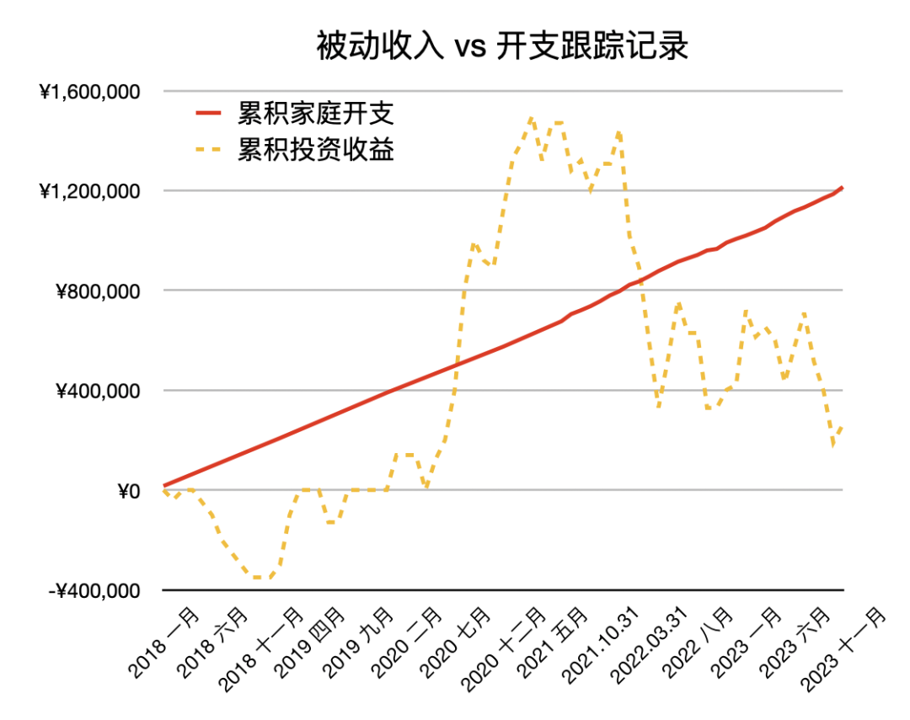

# 如果未来经济不好，投资还能赚钱吗？｜财务自由实证 #56

**发布时间**: 2023-12-01 07:25:00

**原文链接**: [http://mp.weixin.qq.com/s?__biz=MzUzNjE3NzQ3Nw==&mid=2247492572&idx=1&sn=45a6ab206f664a221600a04ef93a88ab&chksm=faf89df6cd8f14e0aa291a5520c781f6119e35d1fd2c2937022fd42cba5508a347f9c90f2db3#rd](http://mp.weixin.qq.com/s?__biz=MzUzNjE3NzQ3Nw==&mid=2247492572&idx=1&sn=45a6ab206f664a221600a04ef93a88ab&chksm=faf89df6cd8f14e0aa291a5520c781f6119e35d1fd2c2937022fd42cba5508a347f9c90f2db3#rd)

---

先给大家分享一段[《投资第一课》](http://mp.weixin.qq.com/s?__biz=MzUzNjE3NzQ3Nw==&mid=2247489817&idx=1&sn=273d49f380a8bfe9d81f2fe4aa1d9b96&chksm=fafb6733cd8cee25f623bacc109fc0a798cc3f96e47121713219fc1359ed33f4e95605ad888b&scene=21#wechat_redirect)的书摘，预期收益是怎么算出来的？读完也许就会有自己的答案。

1、投资投的是国运，收益的基础来自 GDP 增长

> 随着我们经济体量的增大、人口红利的减少以及科技与工业化的阶段转型，未来的速度肯定要稍微慢下来一些。参照过去几年的数据，我们可以相对保守地认为，**每年 5%～6%  **的增速是比较可预期的。这个数字，就是我们收益率的一个基础保障。

2、国运又是由无数个体构成的，GDP 的背后是企业和个人。而我们可以相信，上市公司的盈利能力会比全社会的平均水平高一些

> 上市公司是所有企业中的一部分，但它们的整体盈利能力要超过全部企业的平均水平。如果我们投资中国所有的上市公司，大概我们可以获得**年化 6～7% 左右** 的收益。
> 
> 再进一步，沪深 300、中证 500 等宽基指数中的企业是上市公司中的一部分，指数编制的特点和方式，保证了它们是上市公司中头部的企业。如果我们可以通过沪深 300 、中证 500 以及中概股等指数覆盖了中国经济未来 15 年主要的发展方向，大概我们可以获得**年化 7～8% 的增长速度** 。

就此，我们得到了一个基本的股市投资预期收益，5～6% 的 GDP + 2% 左右的上市公司超额收益。这个数字，也大约可以代表上市公司净资产的增速（如果不考虑分红）。虽然市场会大幅上下波动，但长期收益的基础还是公司净资产的变化 👇

过去 19 年，万得全 A 指数的收益率约等于年化 10%

3、现在，我们再把可能提升收益的操作考虑进来

> ……乐观估计，基于估值的低买高卖，可以帮我们提高 3%～5% 左右的年化收益。
> 
> ……乐观估计，增强型指数基金，可以帮助我们提高 1%～2% 左右的年化收益。
> 
> ……如果我们能找到好的基金经理，主动基金可以帮助我们提高 2%～3% 的年化收益。

最后综合考虑：

> 如果能这样长期坚持「低买高卖」，并且系统性地选到表现比较好的公司，我们就有可能把预期收益率拉高到 12%～15% 的水平。

上面的具体数字大家可能有不同想法，但总的来说，预期收益总是由这 3 部分构成：

  * GDP 增长

  * 上市公司相比于社会平均水平的竞争优势

  * 我们能做的操作

……

然后再回到开头的问题，如果经济不好呢？

实际上我们感觉的「经济不好」，是来自 GDP 放缓，而非倒退。2023 年 Q3 GDP 的同比增速依然有 4.9%，这还是当下各种不利因素的结果。像经济体量增大、人口红利减少，这些因素更是在预期之内，前面已经考虑过了。

当然我们也会看到上市公司利润下滑，但这更多是因为企业盈利周期比 GDP 周期波动更大一点 👇 而市场周期、或者说我们的情绪，又要比企业盈利周期波动更大

而剩下的几点，上市公司的规模优势，指数中上市公司的优胜劣汰，A 股依然波动巨大可能带来的 2～3% 的超额收益。这些也并未改变。

那么，如果经济不好，投资还能赚钱吗？我觉得依然能。这些年我们看了太多变化的东西，却也忽视了背后很多不变的。

……

而且到这还没完，还有个简单的算术题，对我们看待投资也许会有帮助。

假设有笔投资，2 年刚好实现年化 10% 的投资收益，并且第一年跌了 10%，那么第二年这笔投资「理应」涨多少呢？

**34.4%**

如果一笔投资，5 年刚好实现年化 10% 的投资预期，并且前 2 年跌了 30%，那么后 3 年这笔投资「理应」涨多少呢？

**130%**

当然，预期收益不同算出来的结果会不一样。但把预期收益调节成 5%、7% 或其他数字，大致结论也会是一样的。

牛市顶点，想想这个计算，也许就不会再那么狂热。熊市底部，想想这个计算，也许就不会那么悲观。

* * *

### 实证账户更新

记账工具来自[有知有行](http://mp.weixin.qq.com/s?__biz=MzUzNjE3NzQ3Nw==&mid=2247487794&idx=1&sn=b9db83140ef56b777315a5e415954736&chksm=fafb6f18cd8ce60eeebe855dcd793f173a5589e51657877fb9e8a2fff629eeb17688a40e2766&scene=21#wechat_redirect)

被动收入观察 👇 从投资中获得的「累计被动收入」目前还在「累计日常开销」曲线的下方，耐心等待回归 

注：这张图的思路来自[第 30 期实证](http://mp.weixin.qq.com/s?__biz=MzUzNjE3NzQ3Nw==&mid=2247489372&idx=1&sn=2118934ef05d930f50d2510ff6642cb1&chksm=fafb6976cd8ce06042f2bb8d1ed950a95262d11451fe116440e1ff84ca49c6fdae8a5d664a6d&scene=21#wechat_redirect)。家庭开支曲线里，我没有算买房首付、一次性税费和部分硬装的钱。剩下大家能想到、想不到的，房贷月供、家具、家电、旅行、保险、医疗什么的，每一笔都算进去啦。

……

最后例行提醒大伙，财务自由的投资和被动收入虽然看起来性感，但「因上努力，果上随缘」。本金和收益只是自由路上的「果」，**主业努力多赚钱、理性消费少挥霍，以此积累本金，再加上不被短期涨跌干扰、坚持投资才是背后的「因」** 。

投资复利只是我们获得被动收入的方式，而不是致富的秘密。

在财务自由实证的最初两年，我写得最多的也不是如何投资，而是如何**少在投资上花时间，好能多花时间关注主业** ，同时理性控制开销，尽快攒钱。

假如有 10 万本金，就算投资翻倍也才赚了 10 万。而投资翻倍极其困难，巴菲特的年化收益也才 20%。相比之下，在职场上努力提升，让收入再增加 10 万则要靠谱得多。

对财务自由而言，“钱生钱”做到 80 分足矣，剩下的精力还是应该关注赚钱和省钱这些“人生钱"。

### 关于这份实证

**普通人通过工资理财也能实现财务自由** ，这是这些年我一直在践行的理念。从最初懵懵懂懂到 2017 年制定具体的财务计划，再到如今渐渐靠近终点，已经走了五六年。

为了能够更加透明、中立地实证普通人财务自由的可能性，从 2019 年开始我决定公开自己的财务进度，成为这个系列内容「财务自由实证」。

不追求大富大贵，但求能够不再纠结生计这些琐碎问题，在重大选择面前获得更多的人生选项，不再瞻前顾后。

有兴趣参考这个实证的朋友建议先看看之前的引导篇，[制定自己的财务自由计划](https://mp.weixin.qq.com/s?__biz=MzUzNjE3NzQ3Nw==&mid=2247484500&idx=1&sn=c04c3de1a1231bef25bb4cda773c00ff&scene=21#wechat_redirect)、[一起财务自由](https://mp.weixin.qq.com/s?__biz=MzUzNjE3NzQ3Nw==&mid=2247484480&idx=1&sn=258e8dd4976c7d3c324ed89b90904d14&scene=21#wechat_redirect)。以往的干货精华也都有汇总 👇

  * [全都安排好了，自由路上我们会遇到的每一个问题](http://mp.weixin.qq.com/s?__biz=MzUzNjE3NzQ3Nw==&mid=2247489926&idx=1&sn=eac357cebcbfd7250828cdda88d9f122&chksm=fafb67accd8ceebaa1e750f129714bb000be9720a990a70c6fba6fc52fd3712014a58d699d6e&scene=21#wechat_redirect)

  * [我的第一本书，整理财务自由方法论](https://mp.weixin.qq.com/s?__biz=MzUzNjE3NzQ3Nw==&mid=2247486809&idx=1&sn=8a80c493837ee044c5d55e0a423507d2&scene=21#wechat_redirect)

  * [一期访谈](http://mp.weixin.qq.com/s?__biz=MzUzNjE3NzQ3Nw==&mid=2247487473&idx=1&sn=10a891429291e78dea82b4df34e773f3&chksm=fafb71dbcd8cf8cdb15f114d6637bc6476a2803f9f0803dcbb4d91c1e68b5cc706c3dc55358b&scene=21#wechat_redirect)和[一期播客](http://mp.weixin.qq.com/s?__biz=MzUzNjE3NzQ3Nw==&mid=2247489401&idx=1&sn=a613497a5d6fdc3325d0424b9a78063e&chksm=fafb6953cd8ce045481121812b61b04f62dfe09a07b785991fc4cdd679bc9af13665d4c0ce62&scene=21#wechat_redirect)聊聊我的经历和观念

我给自己定下的目标是 30 岁前积累到**  家庭年度开支的 10 倍**（结果现在攒到了 20 倍 ✌️），作为创造被动收入的本金。依靠这些本金实现长期 10+% 的年化投资收益就可以实现财务自由，不再依赖上班工资生活，有底气去选择自己真正想做的事儿。

（我的具体目标数字是 500 万，但**这个数字大家没必要参考** ，还是要以自己的生活开销为准）

财务自由路上一些重要节点：

  * 2017 年，计划正式开始，同年获得家人的认可和支持；

  * 2018 年，A 股熊市大跌，出现“钻石坑”机会；

  * 2019 年，开始财务自由公开实证（就是现在大家看到的这个系列）；

  * 2020 年，新冠股灾，自由之路上的又一个关键机会；

  * 2021 年，[自由目标基本达成](http://mp.weixin.qq.com/s?__biz=MzUzNjE3NzQ3Nw==&mid=2247489120&idx=1&sn=e5c5bf6d51914c212c228bc6f42346dc&chksm=fafb684acd8ce15c27cd508a67d57573f4acbeced75f805ef271b4efcf42cf54b363e5f93fcf&scene=21#wechat_redirect)，开始向新的节奏过渡；

  * 2022 年，遭遇自由后的第一次账户大幅回撤，但也是港股 6 年后、A 股 3.5 年后的又一次钻石坑，期待后续……

  * 也是同年，[我搬去二线过想要的生活了](https://mp.weixin.qq.com/s?__biz=MzUzNjE3NzQ3Nw==&mid=2247490915&idx=1&sn=313fba2e0a82a878f0188795ffe1900f&chksm=fafb6349cd8cea5fdfb9a63648453317d1970941f8c470f7bf697d07cca4054fca66f1dc5fac&scene=21#wechat_redirect)，[买房钱从计划中扣除](https://mp.weixin.qq.com/s?__biz=MzUzNjE3NzQ3Nw==&mid=2247490995&idx=1&sn=5b90cca481c8f33b2a7a19f6ef555791&scene=21#wechat_redirect)（自住房我会看作消费而不是资产）

慢慢播种，等待市场回归～