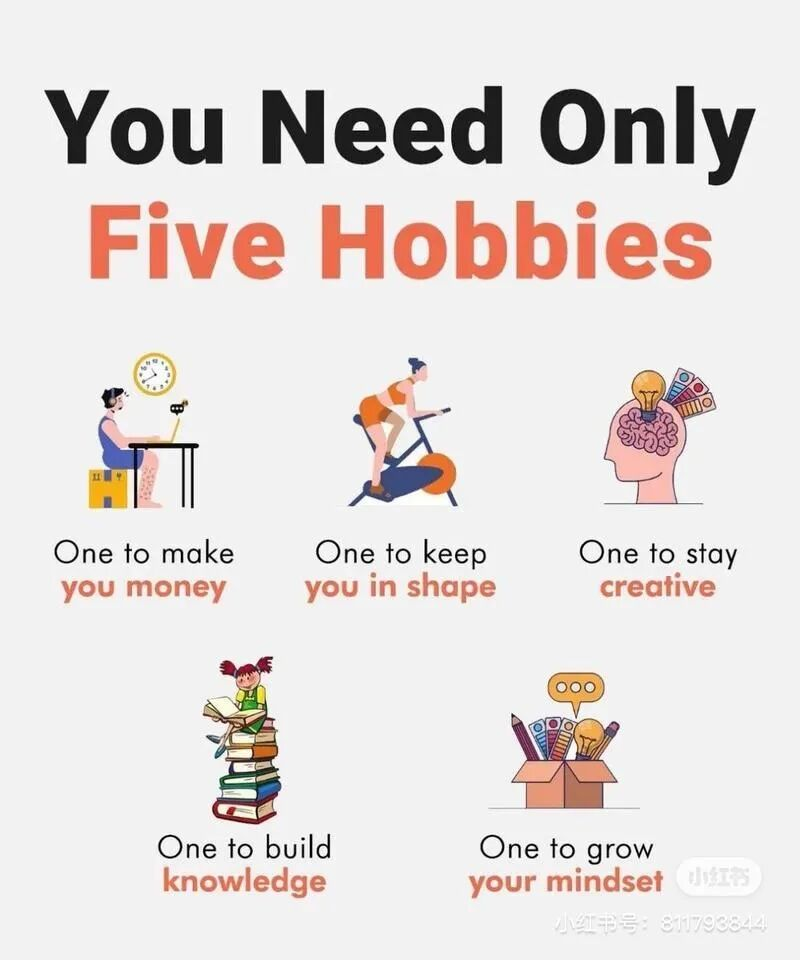
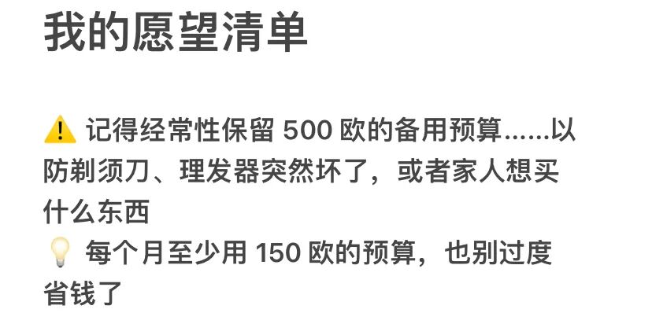

# 「不停克制后，我枯萎了」

**发布时间**: 2023-12-04 07:25:00

**原文链接**: [http://mp.weixin.qq.com/s?__biz=MzUzNjE3NzQ3Nw==&mid=2247492580&idx=1&sn=e95f3d04fe74b3a1860be96a2ed4becd&chksm=faf89dcecd8f14d80f52e00cfb63cd728362249686e5282d64e21d24918e77257dd520705749#rd](http://mp.weixin.qq.com/s?__biz=MzUzNjE3NzQ3Nw==&mid=2247492580&idx=1&sn=e95f3d04fe74b3a1860be96a2ed4becd&chksm=faf89dcecd8f14d80f52e00cfb63cd728362249686e5282d64e21d24918e77257dd520705749#rd)

---

最舒服的生活方式，是选择比你「应该的」消费水平低一档，live below your means。但每个选择这样生活的小伙伴们，一定都被别人或者自己这样问过——这样是不是太抠了，是不是应该多花一点？

这两天刚好还刷到一条小红书 👇

所以看到 Housel 的最新一篇博客，Frugal vs Indenpent（抠门 vs 自由），我很好奇他是怎么考虑这个问题的。一方面，自由 = 资源 - 欲望。管理欲望是自由的前提条件。但另一方面，这和不停克制自己的区别在哪呢？

Housel 提供了这么一个观察视角

  * 抠门：意味着剥夺自己「想要」**且负担得起** 的东西；

  * 自由：意味着有其他非消费的途径，所以「不想」再通过某笔消费购买满足或者他人的认同；

> 世界在你耳边劝诱——每个人都应该想要同样的东西，一栋大房子、一辆好车、高级学位、证书、社交俱乐部等等。
> 
> 我喜欢其中大部分东西。但你必须意识到，他们的吸引力有多少是对地位（他人的认同）的吸引力，这可能与幸福完全无关。
> 
> 原文链接：https://collabfund.com/blog/frugal-vs-independent/

如何在做到 live below your means 的同时不要滑向抠门，而是更接近自由和幸福，我觉得**这三件事都很重要** ：

  1. 管理欲望，并非压制一切需求。而是学会分辨哪些是社会、他人植入给我们的，哪些才是我们自己的真实想法；

  2. 寻找满足自己欲望的更好方式，很多时候消费某个物品并非最合适的选择。凡事总先想到买，也是一种头脑的懒惰；

  3. 最后，如果一个欲望是自己的真实需求、也能通过消费满足、并且[在负担能力范围内](http://mp.weixin.qq.com/s?__biz=MzUzNjE3NzQ3Nw==&mid=2247492041&idx=1&sn=542602836962695eb16a8a32f999c495&chksm=faf89fe3cd8f16f5987667629c106af275e6a674fedf189f41d02428e5acb089e2777a8e2853&scene=21#wechat_redirect)，那么「这笔消费必不必需、值不值、划不划算」都不如「我想要」重要。

减少消费后觉得自己枯萎了——我觉得这个问题不能仅仅归因于花钱多、花钱少，还有一个隐藏的细节。**貌似在贴主的思维习惯中，想要的东西只有「买」和「放弃」这两个选项** ，这也会导致很大的匮乏感。

用这样的习惯思考，也许即便没有减少消费也会遇到类似的问题。在满足了自己、就没有足够储蓄，和满足了储蓄、就没有满足自己间两难。

这还让我想到有些人不上班后遇到的意义感缺失，感觉根源也是雷同的的——**研究显示，越是能在生活中发展多个「重心」的人，心理会越健康** 。过于依赖消费，还是过于依赖工作，都是因为生活的重心太少了。

如果从消费、工作、爱好、运动、照顾自己等等很多方面都能获得满足感，就没那么容易因为某一环节缺失导致意义感危机。

……

Housel 在文章最后讲述了这样一个故事。

> 免税店创始人查克·菲尼上个月去世。
> 
> 菲尼故事中众所周知的部分是，他在几年前捐出了自己 80 亿美元财富的 99.99%。他和他的妻子拥有 200 万美元，住在一间小公寓里，乘坐经济舱，其余的都捐给了慈善机构。
> 
> 菲尼的故事中不太为人所知的部分是，他曾经诚实地尝试过上流生活。 《华盛顿邮报》这样描述他 20 世纪 80 年代的生活，当时他刚刚暴富——他在纽约、伦敦和巴黎拥有豪华公寓，在阿斯彭和法国里维埃拉拥有豪华度假胜地。他在游艇和私人飞机上与其他超级富豪交往密切。如果他想要的话，他买得起。
> 
> 他很快意识到这不适合他。社会告诉他他应该想要那些东西。但这并不是真正让他高兴的事情。

之前给大家推荐过《瓦尔登湖》这本书，记录了 200 年前梭罗关于财务自由的思考。

后来几位小伙伴留言说，梭罗的经历不值得参考，因为他本身是个富二代。但我反而觉得，正是因为这样梭罗的经历才更有现实意义。

因为很多时候，当一个物品不在我们承受范围内时，我们认为的「不需要」，实际上很难判断是真的不需要，还是安慰自己。

能获得但选择放手，才是真的自由。经历过复杂的简单，才是真的简单。

……

说起来，最近我在尝试一件事儿，不完全相同，但思路有点类似。给自己定预算的同时，也在心里留一个最低预算。不能超出预算，但也尽量别低于最低预算 👇

为了给一些「部分的我」觉得不该买、不划算，但「另一部分的我」还是会一直心动的愿望或者体验一些机会。

要么，我会发现一种新的体验和机会。

要么，拥有过、体验过，发现，哦，我确实没那么喜欢。这个结论才是最诚实的。

  * 财务自由：[我的财务自由实证之路](http://mp.weixin.qq.com/s?__biz=MzUzNjE3NzQ3Nw==&mid=2247492572&idx=1&sn=45a6ab206f664a221600a04ef93a88ab&chksm=faf89df6cd8f14e0aa291a5520c781f6119e35d1fd2c2937022fd42cba5508a347f9c90f2db3&scene=21#wechat_redirect)

  * 投资笔记：[十年之约，躺赚不难](http://mp.weixin.qq.com/s?__biz=MzUzNjE3NzQ3Nw==&mid=2247491855&idx=1&sn=32bb658b557f2d4aaa540ed74ace11f9&chksm=faf89f25cd8f1633277f8805b34425cc25db7a50ca8f7933cae718460a09a9ffc961dc2a923f&scene=21#wechat_redirect)

  * 抵御风险：[11 月保险最推荐‍‍‍‍‍‍‍‍‍‍‍‍‍‍‍‍‍‍‍‍](http://mp.weixin.qq.com/s?__biz=MzUzNjE3NzQ3Nw==&mid=2247492503&idx=1&sn=6ffb2bbb75ea6c04151eadaddcc38027&chksm=faf89dbdcd8f14ab19b568264bd3805662f383876382e110e88e2b9236aaabff541a8e9a507b&scene=21#wechat_redirect)‍

  * 干货汇总：[财务自由路上应该了解的每一个问题](http://mp.weixin.qq.com/s?__biz=MzUzNjE3NzQ3Nw==&mid=2247491818&idx=1&sn=c4d5171acfab76ba65b56c47d6d384da&chksm=faf89ec0cd8f17d6aad08ad69e208c2b896678e1a51266702ca1eceeec768ad75d1bb6184d74&scene=21#wechat_redirect)