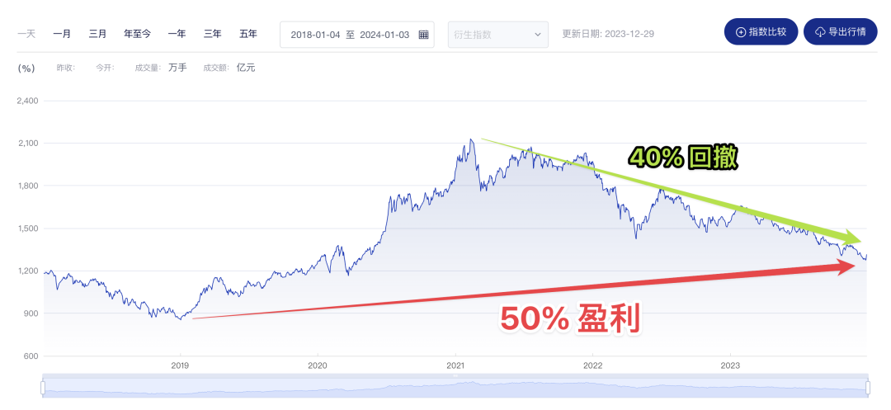

# 如何通过投资获得稳定的现金流

**发布时间**: 2024-01-04 07:15:00

**原文链接**: [http://mp.weixin.qq.com/s?__biz=MzUzNjE3NzQ3Nw==&mid=2247492671&idx=1&sn=333f7d55055dec260583fd6a7b3bc2de&chksm=faf89a15cd8f1303c0cbd05a32ca94e5a448492269ed3b821eb3fa0c225eab3cd50234b056d8#rd](http://mp.weixin.qq.com/s?__biz=MzUzNjE3NzQ3Nw==&mid=2247492671&idx=1&sn=333f7d55055dec260583fd6a7b3bc2de&chksm=faf89a15cd8f1303c0cbd05a32ca94e5a448492269ed3b821eb3fa0c225eab3cd50234b056d8#rd)

---

说起稳定的现金流，大家先想到的常是，红利基金、债券、房租这些现金流稳定的投资。但其实，**通过投资获得稳定的现金流 ≠ 要买现金流稳定的投资** 。

通过投资获得现金流，在美国高校、捐赠基金已经有了半个多世纪的经验。这个问题前人已经积累了非常多的经验，我们可以直接拿来参考。当时也有人提出过，直接买现金流稳定的投资就好了，投资带来多少分红、利息，就支取多少「被动收入」用作当年的开支。简单省事儿。

但当时接手耶鲁大学捐赠基金的斯文森明确反对这种做法，因为投资的长期收益来自：

  1. 相对稳定的红利、利息，也就是现金流

  2. 和波动的资产增值

他们一定程度上相互矛盾。如果仅仅以稳定现金流为投资目标，长此以往容易动作变形，偏向能带来短期稳定分红、却损失长期收益的选择（参见《机构投资的创新之路》第三章，投资目标与支出目标）

而且「稳定」都是相对的。稳定的现金流有时候会给你一种安全的假象，反而更疏于防范意外风险，忘记投资可以下跌、工作可以失业、分红可以变少、房租也可能空置……

但如果我们不选现金流稳定的投资，遇到投资亏损的年份怎么办？如何支取投资呢？这是我结合前人经验 + 自己探索的整理：

  1. 「丰年」有没有攒下足够的安全垫，对「歉年」的影响会很大；

  2. 分散投资能明显降低波动。像 2020 年美股很惨但 A 股不错，今年 A 股表现不佳，但海外市场收益还可以；

  3. 准备足够几年生活的备用金，像水库蓄水一样削峰填谷。雨水不稳定，但农业也得正常开展；

  4. 最后就是 plan B 了。担心意外不如假设意外一定会发生，想清楚如果最后依然没能获得预期收益，应该如何准备。

我们一个个展开说。

### 1.「丰年」的收益是「歉年」的安全垫

斯文森掌管耶鲁捐赠基金以后，得益于他的投资水平、加上美国 80、90 年代的大牛市，到 2005 年耶鲁捐赠基金已经实现了超过 15% 的年化收益。遥遥领先于目标 👇

来自《机构投资的创新之路》

但与此同时，耶鲁捐赠基金却一直保持传统，每年只支取 5% 左右的资产，来支付学校的各项开支。这时很多人质疑斯文森，要求捐赠基金增加开支。

斯文森在书中是这么回答的：

> 当意外获得丰厚的投资收益时，人类本能的反应是将这笔财富消费掉。但是，如果市场一旦表现强劲就相应地提高支出比率，可能会给捐赠基金带来长期损失。主要原因如下：
> 
> 首先，如果机构在「丰年」提高支出比率，可能会把本该用于补充「歉年」的缓冲资金消费掉。
> 
> 其次，支出水平具有一定的刚性，提高后很难再降低，这会减少经营支出的灵活性。如果在市场繁荣时期提高支出比率，那么，在市场萧条时期，机构将面临双重困境:既没有缓冲资金来缓解财务困难，又要承受预算基数增加的负担。

获得投资带来的现金流，要从丰年着手准备。储备冬粮的时机是春夏秋，等到冬天才开始就太晚了。

A 股也是如此。虽然从 21 年到现在，中证偏股基金指数已经从最高点下跌 40%。但如果能获得从 2018 年底部至今的完整上涨收益，到今天依然还有 50% 的盈利。

**度过投资下跌年份的第一步，是在下跌之前的上涨中吃饱。**

但这也反过来提醒我们，**在丰年不要高估自己的收益，评价投资收益要拉长时间** 。2020 年主动基金牛市里，很多小伙伴兴冲冲地和我说，他们的被动收入已经超了工资。而 3 年后的今天，我又几乎孤身一人了……

### 2\. 分散投资降低波动

但这还不够。丰年的收益固然能给歉年的亏损提供安全垫，但还是有两个问题没能解决：

  * 熊市里糟糕的持有体验和心理压力；

  * 在熊市底部变卖投资带来的本金永久性损失；

我们前面提到，斯文森在耶鲁校产基金中不会过度依赖稳定现金流的投资，那他是如何解决这个问题的呢？

实际上，耶鲁校产基金的净值波动要比市场平均水平小得多。2000-2003 年互联网泡沫破裂，美股标普 500 从最高点大跌 50%。而 2000、2001、2002 财年，耶鲁基金却逆市取得 41%、9.2%、0.7% 的**正收益** （注：耶鲁统计收益的「财年」是从 7 月 1 日到下一年的 6 月 30 日，并非我们常说的「自然年」）

这样的结果一方面是斯文森的投资水平（作为普通人我们还是要降低预期），但另一方面分散投资、多元化资产配置也功不可没。

像我们感觉很难的 2023 年，海外市场比如美股、欧洲股市反而都在上涨，涨幅还不小。A 股内部的红利指数也逆市实现了近 10% 的收益。反过来时间拨回 2020 年，美股新冠崩盘期间，我们的 A 股走势相比要平稳得多。

降低投资波动，靠的不是现金流稳定的投资，而是**在自己的认知范围内，增加投资的多元化、分散配置** （在认知范围内这个前提很重要，为了分散而分散就本末倒置了）

当然，现金流稳定的投资方式，也可以是资产配置的一环。

坦率地说，这部分过去几年我做得并不好，所以账户总体波动还是挺大的 👇 直到去年才真正想明白

我大致推算了一下，如果做好分散，2022 年亏损可以缩小到 15% 以内，2023 年更是可以取得正收益。未来 2～3 年里我会着重考虑这个问题。

……

但我们也要知道，**凡事都有代价** 。2000 年笑傲股市、如今被模仿的耶鲁捐赠基金，在美国 80、90 年代的大牛市里，因为跑输标普 500 没少遭白眼（这个画面是不是似曾相识？）

> 事实上，在截至 1998 年 6 月 30 日的 10 年中，耶鲁基金的年均收益率为 15.5%，比标准普尔 500 指数同期 18.6% 的收益率低 3 个多百分点。由于耶鲁基金的业绩逊于国内股票这一当时表现最好的资产类别，许多怀疑主义者开始质疑，我们致力于开创一个充分分散化、以股权为导向的组合这一艰巨的任务是否明智。

所以分散投资也要做好预期管理，这意味着在大部分时间里，我们的投资收益都不出众。最后的结果，还要看一轮完整的牛熊。

### 3\. 通过备用金削峰填谷

耶鲁捐赠基金因为斯文森的投资能力，在熊市里甚至依然可以获得正收益。但作为一个普通人，我可不敢预期这么高。如果我们分散持有的所有投资，全部都在亏钱呢？

在「看天吃饭」这个问题上，投资和农业还挺像的，一对难兄难弟。

农业：我们可以大致预期一年的降雨量，却不能要求降水均匀地分布在每一天，甚至可能遇上连年的干旱或者洪涝。

投资：就像马克斯在《周期》中的观察

> 美国标普 500 指数的年化增长率是 10%，但 47 年里，当年回报在 8%～12%「合理」范围内的只有 3 年。
> 
> 而当年回报「不正常」（偏离 10% 超过 20 个百分点，即上涨超过 30%，或者下跌超过 10%）的，有 13 年。

所以，如果希望从投资中获取稳定现金流，构建自己的蓄水池也很重要。这部分我在[以前的文章](http://mp.weixin.qq.com/s?__biz=MzUzNjE3NzQ3Nw==&mid=2247488950&idx=1&sn=284d5309e8a8ad44266506b2322dfeb7&chksm=fafb6b9ccd8ce28ade296e6e1ab4091da302d86760c372236b8bb516245c361ca432a3f58148&scene=21#wechat_redirect)中有过详细说明，这里就不展开了。

但是额外补充一点——很多小伙伴担心蓄水池会拉低投资的预期收益。但我[后续回测](https://mp.weixin.qq.com/s?__biz=MzUzNjE3NzQ3Nw==&mid=2247490022&idx=1&sn=27a9cce20d644e2fcbb7dc82056756a9&scene=21#wechat_redirect)发现，通过蓄水池削峰填谷，低估支取备用金、保护本金，遇上投资高估再变现投资补足备用金，不会拉低收益水平。遇上逆风年份，甚至还能贡献一部分超额收益。

### 4\. Plan B

任何可能发生的坏事，只要拉长时间就一定会发生——墨菲定律

所以担心意外不如假设意外一定会发生，想清楚如何应对。努力获得预期收益，和**为无法实现目标做好准备、考虑最差的情况** ，同等重要。「凡事做好最坏的准备，好事儿会水到渠成」。

这个问题我们之前也聊过，至少可以有 6 种思路

  1. 高收益目标，低支取目标：比如按照 10% 的目标投资，但实际只支取 5% 的本金。就算未来收益下滑，也留出了安全边际

  2. 准备备用金：这个前面已经说过了

  3. 保持灵活的生活方式：必要时可以降得下来，警惕开支中没法停下的「固定开支」

  4. 保险和社保：可以预知的风险通过保险来分散，没必要自己扛

  5. 收入多元化：有被动收入也不轻视主动收入，这样不但能抵御风险，还能反过来利用危机

  6. 心态管理：降低预期，选择都是可逆的。以 Gap Year 的心态试验财务自由，做好准备「不行我再回去上班」的小伙伴，心态反而比总想着「一辈子都不再上班」的小伙伴好得多

具体展开大家可以顺着[这篇文章（和里面的链接）](https://mp.weixin.qq.com/s?__biz=MzUzNjE3NzQ3Nw==&mid=2247492535&idx=1&sn=e59820c2d8269cd09bcd3095fc227565&scene=21#wechat_redirect)往回翻。

这里我想着重再说说主动收入和被动收入。我现在越来越觉得，被动收入和主动收入其实不分孰优孰劣。**只有被动收入、没有主动收入的家庭，和只有工资、没有被动收入的家庭可能同样脆弱，这只是换一种方式受制于人** （以家庭为单位）。

我们向往被动收入，恰恰是因为手里已经有了主动收入。带来安定感和底气的并不是被动收入本身，而是**收入的多元化和可持续性** 。

很多人觉得，财务自由就应该是只靠被动收入，不再需要主动收入。但我们不妨退一步思考，财务自由的终极目标是什么？

耶鲁捐赠基金是这么回答的——保持独立性、增强稳定性与创造优越的教学环境。

但实际上做到这几点，捐赠基金带来的投资收益只占耶鲁大学总收入的一半而已。反过来也是因为耶鲁有非常多元的收入，而且收入可持续性很高，才能做到真正的长期投资，因而获得很多他人没有的投资机会 👇 感兴趣的小伙伴可以一起听听这期小酒馆的播客，嘉宾陈鹏博士曾与斯文森共事，分享了很多不常被看到的细节

被动收入 > 主动收入/开支，这是个衡量财务状况的思路，但工具不是目的。投资、现金流、财务自由的终极目标都是服务于生活——幸福安稳地过完一生。

  * 财务自由：[我的财务自由实证之路](http://mp.weixin.qq.com/s?__biz=MzUzNjE3NzQ3Nw==&mid=2247492655&idx=1&sn=6a072157eb22c90824eeddcb36807d82&chksm=faf89a05cd8f131305a0b7818f9a9fd1c62735fa50e44e959311f30166f68a467a0570a68891&scene=21#wechat_redirect)

  * 投资笔记：[十年之约，躺赚不难](http://mp.weixin.qq.com/s?__biz=MzUzNjE3NzQ3Nw==&mid=2247491855&idx=1&sn=32bb658b557f2d4aaa540ed74ace11f9&chksm=faf89f25cd8f1633277f8805b34425cc25db7a50ca8f7933cae718460a09a9ffc961dc2a923f&scene=21#wechat_redirect)

  * 抵御风险：[12 月保险最推荐‍‍‍‍‍‍‍‍‍‍‍‍‍‍‍‍‍‍‍‍](http://mp.weixin.qq.com/s?__biz=MzUzNjE3NzQ3Nw==&mid=2247492619&idx=1&sn=202ef7a2b6c025e4d14fb82c50b6cfee&chksm=faf89a21cd8f13373e4314d53fbfb3688438776939498c99aa187b68744498e36e3f2b057635&scene=21#wechat_redirect)‍

  * 干货汇总：[财务自由路上应该了解的每一个问题](http://mp.weixin.qq.com/s?__biz=MzUzNjE3NzQ3Nw==&mid=2247491818&idx=1&sn=c4d5171acfab76ba65b56c47d6d384da&chksm=faf89ec0cd8f17d6aad08ad69e208c2b896678e1a51266702ca1eceeec768ad75d1bb6184d74&scene=21#wechat_redirect)