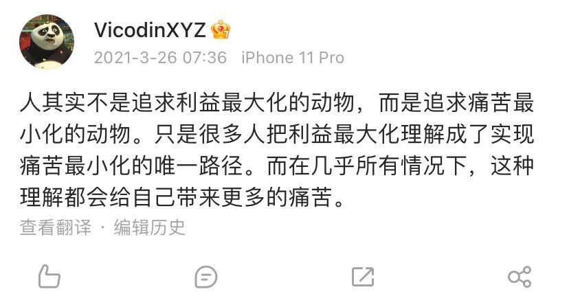
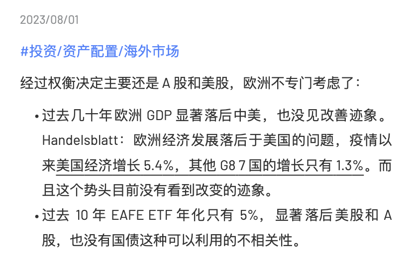

# 杀人诛心……

**发布时间**: 2024-01-10 06:00:00

**原文链接**: [http://mp.weixin.qq.com/s?__biz=MzUzNjE3NzQ3Nw==&mid=2247492697&idx=1&sn=f5be62d9593c8c448b94caeca498cad7&chksm=faf89a73cd8f13650e305d490f57be1f96b9bb3b625240b01bc4ffb799de848e3ea89399848a#rd](http://mp.weixin.qq.com/s?__biz=MzUzNjE3NzQ3Nw==&mid=2247492697&idx=1&sn=f5be62d9593c8c448b94caeca498cad7&chksm=faf89a73cd8f13650e305d490f57be1f96b9bb3b625240b01bc4ffb799de848e3ea89399848a#rd)

---

开年这几天的行情，让我对「熊市最后一跌，最是杀人诛心」有了更多体会

 当然了，是不是最后一跌还不知道，也可能反复____。

最近我在整理关于资产配置的思考，碰巧也有小伙伴和我表示对未来的不确定，不知道应该如何选择——要是全世界所有人一起亏钱倒还好，怕就怕一边我们的投资亏得稀里哗啦，一边其他人（总数还不少）在 2023 年里赚得盆满钵盈。这样的反差，最让人怀疑自我。

和大家分享三个对我很有帮助的问题。

说起资产配置，很多内容会先关注到大盘、小盘、成长、价值、美股、A 股等等。但是我渐渐发现，这些问题只要花很小的成本——比如直接买资产配置类的投顾——就可以获得一份至少 80 分的答案了。

**当下更能给我确定感，是这几个没那么容易获得标准答案的问题：**

  1. 我是否有一个清晰、合理的预期收益？

  2. 我想以怎样的过程实现这个目标？

  3. 如何判断一笔投资的长期预期收益？

很多困惑都来自这三个问题考虑不清，以至于我们对投资的潜意识常是这样的

  * 既对自己的目标收益没概念，只是觉得收益越高越好。然后看见别人的收益比自己高，立刻就开始焦虑纠结。

  * 又对一笔投资本身的长期预期收益没概念，只是买入以后「希望」收益很多，却什么也做不了。

下面是我对这 3 个问题的思考。虽然这个答案未必有共性，但也许能给大家一个思考的起点。

### 1\. 设置一个清晰、合理的预期收益

2022 年有一个对我冲击很大的画面。这一年德国房价大幅打折，有能力全款买房的人，买房变得更便宜了。但需要贷款买房的，成本却没变甚至更贵了。因为利息从不到 1% 直涨到 4%。

反而是不那么可丁可卯、不那么追求资金效率、不那么在意最后几个点收益的人，更可能留有现金。

这两年的行情里我越来越意识到，**想要把投资成功变成生活幸福，靠的不是尽可能高的最终收益，而是实现目标收益的过程痛苦尽可能小**

我发现应该设定一个明确且合理的、让我会感到知足、知道何时收手的预期收益。

举个例子，比如我大约知道 400 万本金带来的长期现金流，可以满足我对财务自由生活的规划。那么当我有 500 万本金时，相比于追求更高收益，把多出的一部分现金留下来，追求意外中更小的痛苦，更可能让我开心。

想明白这个问题，再面对特别高的收益时（也意味着背后可能更高的风险）就没那么容易上头了。

这是孟大在有知有行转发的一张图 👇 追求足够（而非超常）的回报、愿意持有现金，都是获得内心平和的要素之一

### 2\. 我想以怎样的方式实现目标

上周文章里我们聊到印度股市——看起来不断上涨的印度市场背后，一半是持续贬值的货币——但后来有读者表示不解 👇

> 大家羡慕的印度股市涨幅和汇率貌似没有关系？假设我是个印度人 10 年 3 倍，只要我投资和消费的全过程不涉及到外币，我就是 3 倍收益。大家羡慕的是这个，应该并不是后悔没有 10 年前先购汇卢比，3 倍收益后再结汇成人民币

这个说法我不是很认同。回想咱们房地产的黄金 10 年，涨幅比印度股市还大，但也没见那时候大家少担心通胀啊。同理，我也不觉得股市涨了 3 倍，人就不会在意 iPhone、电脑、汽车价格翻倍（不止进口商品，印度过去 10 年平均年通胀 5%）

Morgan Housel 谈过，如何减少对他人的羡慕和嫉妒：

> 当我们羡慕别人的生活时，总是假设身边所有条件都不变，然后获得别人生活中自己喜欢的部分。但现实不会这样，你必须一起背这个好处背后的成本和痛苦。

在投资历程中，我们会遇到无数收益比我们好的人，但仔细想想，这不说明什么。

首先，这可能是幸存者效应。我们可能只看到如此投资赚大钱的人，却没看到背后失败的；或者向你展示收益的人，只展示了赚钱那部分。看别人的年终总结也是如此，通常去年赚钱的人更有动力做总结。

其次，这个方法是否适合我们、是否学得会。我们想要这个收益，但是否想要这个收益背后的代价？就像很多人羡慕全职投资，但他们其实并不喜欢投资，只是在脑补不劳而获的感觉。

90% 的羡慕嫉妒，只是这样的噪音。

那剩下的 10% 呢？如果我们真的找到了更有效、更适合自己的投资方式，这是好事儿啊。

### 3\. 学会分析一笔投资的长期预期收益

2023 年我学到的最重要的，是认识到资产配置、投资多元化的价值。但在此时，这么做也有可能是个坑（微博原文我没找到，复述下大意哈）

> 现在说起资产配置、投资多元化，都是涨得好的美股、印度、越南。但同样能增加多元化的欧洲股市、亚太新加坡，怎么就很少有人提呢？到底是真想增加投资多元化，还是单纯看哪个历史收益高？

投资贵在对自己诚实。如果只是看过往历史收益做资产配置，不就又回到了前面的迷茫——买入然后「希望」获得收益。

去年我在考虑资产配置时，也纠结过这个问题。如果在个人资产配置中增加多元化，为什么不一起投资欧洲股市。搜索一下，我发现很多类似这样的回答——欧洲 GDP 多年停滞不前，美股资产代表更先进的科技，利润增速更快等等。起初我也很认同这样的想法：

但这个回答依然没法告诉我，如何分析每笔投资的预期收益。直到回忆起了《共同基金常识》中的公式：

> 预期收益 ≈ 股息率 + 盈利增长率 + 估值变化（+ 汇率变化 👈 这个是我加的）

定量分析，我突然发现关于「为什么要投资美股」的很多观点其实站不住脚，最出乎意料的数据是——过去 20 年，美股标普 500 和欧洲 STOXX 600 每股盈利增长率是差不多的，都是大约 6～7%。美股稍高一点点，但区别不到 1%，并没有像很多人以为的美股有更多「科技企业」，所以利润增速更快。这让我相当意外。

真正拉开差距的，还是估值变化。但我们知道，投资期限越长，估值变化的影响越小。而且估值越高，未来下降的概率也越大。

所以我修正了对美股的滤镜，只是把 ta 作为一个分散配置的途径。考虑清楚长期可能的预期收益，也没那么容易因为短期波动而对投资感到不确定。

对了，说起分散投资，还要给大家推荐一下有知有行的《海外投资白皮书》。这是我重新开始思考资产配置的契机。

里面有个视角，就是**看我们的社保基金如何做资产配置** 。我们社保基金的资产来自国内、用钱也在国内，但与此同时还是配置了大约 10% 的海外投资，通过各类市场间的不相关性降低投资波动 👇 而且社保基金中大部分的钱也是「委托投资」，在很多主动基金的持有人名单中都会看到社保基金的名字。

全国社会保障基金理事会社保基金年度报告(2022年度)

是不是还挺有启发的？

### 经历 2 年的风险教育

**以上不作为投资建议** ，历史数据也无法代表未来。但数据至少可以告诉我们，哪些说法其实站不住脚，也能避免很多未来的痛苦。

希望这几个问题能给当下感到不确定的伙伴们一些帮助。

以前我总觉得，投资应该在自己的风险承受范围内，追求尽可能高的收益，生怕有一点「浪费」。

但现在我一点点意识到，有明确且合理的收益目标，在能够实现目标的基础上，追求过程中的风险最小、更平稳地实现目标更容易幸福。

PS：今天内容比较长，2 个小时后再来翻留言

  * 财务自由：[我的财务自由实证之路](http://mp.weixin.qq.com/s?__biz=MzUzNjE3NzQ3Nw==&mid=2247492572&idx=1&sn=45a6ab206f664a221600a04ef93a88ab&chksm=faf89df6cd8f14e0aa291a5520c781f6119e35d1fd2c2937022fd42cba5508a347f9c90f2db3&scene=21#wechat_redirect)

  * 投资笔记：[十年之约，躺赚不难](http://mp.weixin.qq.com/s?__biz=MzUzNjE3NzQ3Nw==&mid=2247491855&idx=1&sn=32bb658b557f2d4aaa540ed74ace11f9&chksm=faf89f25cd8f1633277f8805b34425cc25db7a50ca8f7933cae718460a09a9ffc961dc2a923f&scene=21#wechat_redirect)

  * 抵御风险：[12 月保险最推荐‍‍‍‍‍‍‍‍‍‍‍‍‍‍‍‍‍‍‍‍](http://mp.weixin.qq.com/s?__biz=MzUzNjE3NzQ3Nw==&mid=2247492619&idx=1&sn=202ef7a2b6c025e4d14fb82c50b6cfee&chksm=faf89a21cd8f13373e4314d53fbfb3688438776939498c99aa187b68744498e36e3f2b057635&scene=21#wechat_redirect)‍

  * 干货汇总：[财务自由路上应该了解的每一个问题](http://mp.weixin.qq.com/s?__biz=MzUzNjE3NzQ3Nw==&mid=2247491818&idx=1&sn=c4d5171acfab76ba65b56c47d6d384da&chksm=faf89ec0cd8f17d6aad08ad69e208c2b896678e1a51266702ca1eceeec768ad75d1bb6184d74&scene=21#wechat_redirect)