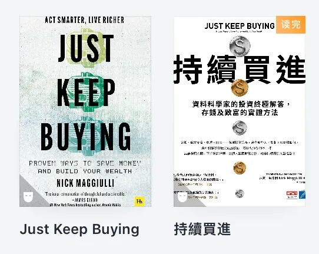

# 不要购买体验

**发布时间**: 2024-02-08 07:00:00

**原文链接**: [http://mp.weixin.qq.com/s?__biz=MzUzNjE3NzQ3Nw==&mid=2247492765&idx=1&sn=64943c2c81a1171cb4b84c31f6f7a877&chksm=faf89ab7cd8f13a12399aeb25652da39af9be9289357b1433fb8ebe3d9e8ad0b94fdb413b156#rd](http://mp.weixin.qq.com/s?__biz=MzUzNjE3NzQ3Nw==&mid=2247492765&idx=1&sn=64943c2c81a1171cb4b84c31f6f7a877&chksm=faf89ab7cd8f13a12399aeb25652da39af9be9289357b1433fb8ebe3d9e8ad0b94fdb413b156#rd)

---

曾经和一个**比我早 10 年开始财务自由计划** 的前辈聊天，他的经历特别有意思。

先是实现财务自由，退休了。刚开始特别爽，但玩了小半年发现，当初觉得「只要不用上班，就可以一直玩下去」的事儿，都开始变得无趣，不知道自己到底想做什么。[当初这个观察](http://mp.weixin.qq.com/s?__biz=MzUzNjE3NzQ3Nw==&mid=2247491729&idx=1&sn=3d621fd57a94c6db1a8d14e59df61b92&chksm=faf89ebbcd8f17ad3bacac0c722ae5283402e7af614f6d688e864d56420d65f0f1daf4f6579f&scene=21#wechat_redirect)「身边很多财务自由的人，要么回去上班了，要么抑郁了」也是他分享给我的。

所以作为权宜之计，他**又回去上班了** 。但也知道上班并非长久之计，只是做个过渡，帮自己维持状态、有能量去寻找自己真正喜欢做的事儿。

后来再过了几年，他终于准备好了，**再次退休，持续至今** 。现在时不时听他说带着老婆孩子，去某个喜欢的城市 1、2 个月深度游。

他在这段经历中的一个洞察对我特别有启发——无聊 vs 没有价值感，这其实是两码事儿，我们却常常混为一谈：

  * 解决无聊、获得快乐的方法有很多，购买体验、出去玩、学新东西等等，都可以；

  * 但能够带来价值感的方法却少得多，而且因人而异（那位退休后确诊抑郁的朋友，怎么做都不见好。后来回去上班，抑郁很快就好了 😂）

**很多****时候我们以为的「无聊」，实际上是价值感缺失。但我们却在用应对无聊的方式，所以总是找不到答案** 。

……

Just Keep Buying 这本书里也有一段探讨——**关注满足感（价值感）最大化，而不是快乐最大化** ——我就又想起了这段聊天，觉得很有共鸣。

我们可以购买快乐，但这未必能带来长久满足。相反，跑马拉松过程未必快乐，但事后却可能很满足。

能带来快乐的几种花钱方式：购买体验、偶尔犒劳自己、购买时间、为他人花钱、先付钱再享受（比如自助餐。同理，想要更多快乐就不要分期买东西，先攒钱再购买）。这些都能带来更多快乐，如果是无聊了，这些方法都会很有帮助。

但满足感需要的则是另外三大要素，甚至**有两条和购买快乐都是相反的** ：

**1、自主，自我主导** 。相比于获得快乐，获得满足感的方式更因人而异。重要的是「我想做什么」，不是别人觉得我应该做什么。

Ramit Sethi 与 Netflix 合作的纪录片《致富攻略》，里面有句话我特别喜欢：

> 富裕应该是自由的，做你自己想做的事儿。不是好莱坞式的“富裕”，那只是别人觉得你应该做的事儿。
> 
> 别人觉得你应该开好车、住大房子，但你在意的可能只是，能不能每天亲自接孩子放学。

这也可以解释，为什么一个人财务自由之前过得不快乐，自由以后大体还是如此。

**2、专精，改进技能** 。

学习新东西、新领域会让人快乐，但获得满足感却要精进已有的技能。

寻找爱好有时候也是这样。爱好不总是因为喜欢才做得好，也可能是因为做到好才喜欢。如果一件事儿我们总能做得比别人更好，正反馈就会让我们越来越喜欢这件事儿，也因此更容易获得经济回报。

**3、目标，连接到比自我更宏大的东西上** 。

《基业长青》说，伟大的企业都有利润之上的追求。比如 iPhone 应该是对盲人最友好的手机，即便开发这个功能带来的营收不大，但开发这个功能的团队，应该很满足。

写作，大家看到的是一篇篇内容。但对于大家愿意长期关注的内容来说，影响更大的可能是内容之上那条看不见的主线。

《幸福的方法》也说，不那么幸福的建筑工人看到的是「我在砌墙」，幸福的建筑工人想的是「我在建造摩天大厦」。

甚至有时候同一笔消费连接的目标不同，感受也会不同。换个角度看，工作忙碌间歇的那杯咖啡，满足感可能才是最高的，也是最值得花钱的。

……

而且我还发现一个细节

  * 获得快乐，购买体验、购买时间、帮助他人，都是可以花钱解决的；

  * 但获得满足感的方式，最需要的却不是钱，甚至还可能反过来赚钱。

这又从一个角度解释了——**获得自由，靠的不是堆砌金钱的数量，不要试图用花钱来逃避真正解决问题** 。

很多人在自由之后会遭遇「意义感危机」，有没有可能也是搞混了快乐和满足的区别？

如果 快乐 ≠ 幸福，那么更接近幸福的方式，就不是购买体验，而是找到让自己感到满足、感到价值的事，然后把（少得多的）钱花在这些让自己觉得满足的事情上。它们需要的是自主、专精和目标。

  * 财务自由：[我的财务自由实证之路](http://mp.weixin.qq.com/s?__biz=MzUzNjE3NzQ3Nw==&mid=2247492572&idx=1&sn=45a6ab206f664a221600a04ef93a88ab&chksm=faf89df6cd8f14e0aa291a5520c781f6119e35d1fd2c2937022fd42cba5508a347f9c90f2db3&scene=21#wechat_redirect)

  * 投资笔记：[十年之约，躺赚不难](http://mp.weixin.qq.com/s?__biz=MzUzNjE3NzQ3Nw==&mid=2247492724&idx=1&sn=09f3418f32f1e53839dbe093e4125e2d&chksm=faf89a5ecd8f13487c9c50f16bdb53c2f2d90b95abfdf2d8a085894b0d40982d7b6e531bb82f&scene=21#wechat_redirect)

  * 抵御风险：[1 月保险最推荐‍‍‍‍‍‍‍‍‍‍‍‍‍‍‍‍‍‍‍‍](http://mp.weixin.qq.com/s?__biz=MzUzNjE3NzQ3Nw==&mid=2247492711&idx=1&sn=d3e91502ce7cfc568fa672e9fe6125cc&chksm=faf89a4dcd8f135be8cb95bc5c8157296b65bfbef60479aed6f0df188ed83f13fa8d27399ccc&scene=21#wechat_redirect)‍

  * 干货汇总：[财务自由路上应该了解的每一个问题](http://mp.weixin.qq.com/s?__biz=MzUzNjE3NzQ3Nw==&mid=2247491818&idx=1&sn=c4d5171acfab76ba65b56c47d6d384da&chksm=faf89ec0cd8f17d6aad08ad69e208c2b896678e1a51266702ca1eceeec768ad75d1bb6184d74&scene=21#wechat_redirect)

PS：后面几天不一定有更新，就提前祝大家新年快乐啦

