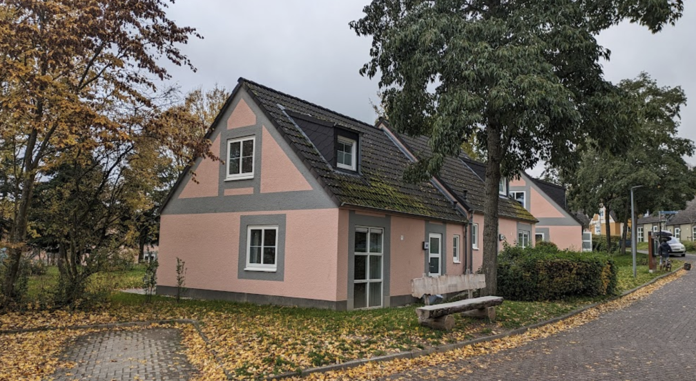
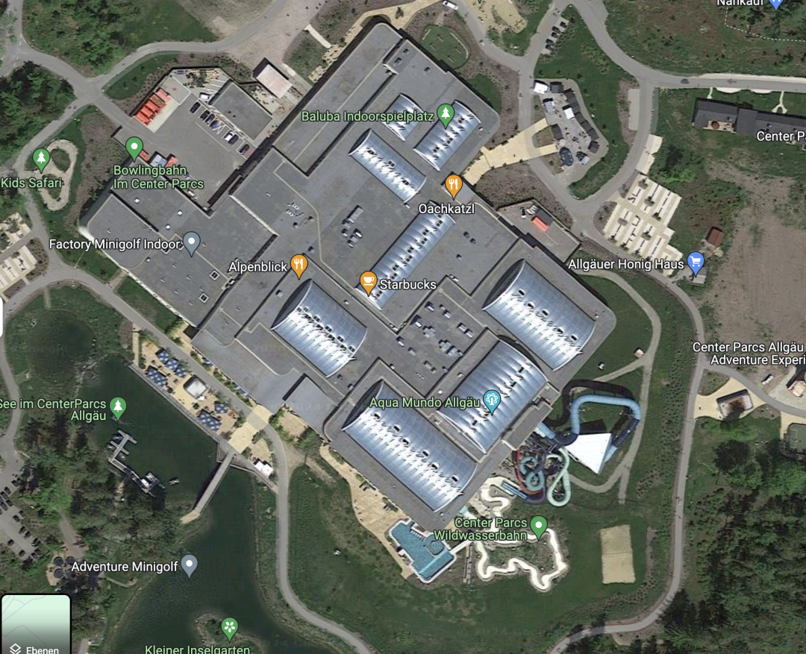
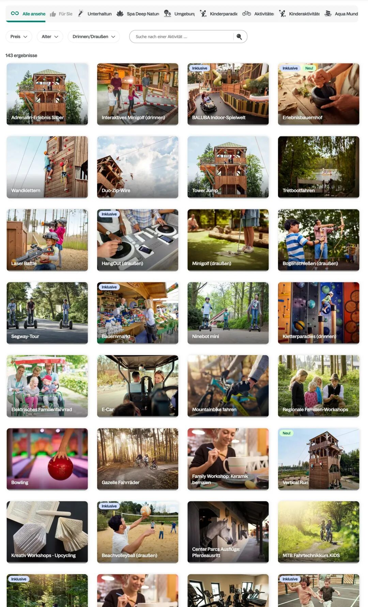
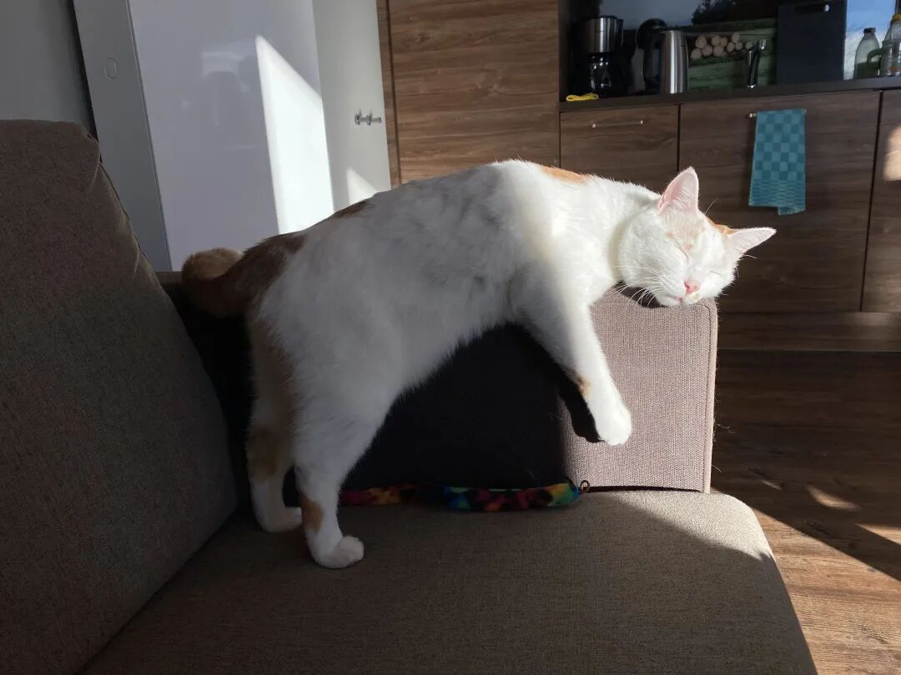

# 久违的旅行｜财务自由实证 #60

**发布时间**: 2024-03-07 07:00:00

**原文链接**: [http://mp.weixin.qq.com/s?__biz=MzUzNjE3NzQ3Nw==&mid=2247492838&idx=1&sn=ec37f2054b31e63b1e7758d54c519eb4&chksm=faf89acccd8f13da062881f58316f95918e78cc83acd7297e1240a2afdb8d6e42c798b4684c9#rd](http://mp.weixin.qq.com/s?__biz=MzUzNjE3NzQ3Nw==&mid=2247492838&idx=1&sn=ec37f2054b31e63b1e7758d54c519eb4&chksm=faf89acccd8f13da062881f58316f95918e78cc83acd7297e1240a2afdb8d6e42c798b4684c9#rd)

---

家人们，已经 2 年没旅行过的我终于出门了  出去玩了一个星期，在 2024 年度计划「每个季度去一个地方」上前进了一小步

我和也太都不喜欢打卡景点，曾经在维也纳坐半小时车到美泉宫门口了，突然觉得太无聊，又坐车回主街吃冰淇淋去了（同一家冰淇淋店，我们两天吃了 3 次）。从那以后就想清楚了，还是休养生息、随心所欲式的旅行更适合我们。

两年前旅行我们发现了 Center Parcs（一个欧洲连锁度假村），甚为满意，所以这次果断回购。最好玩的是，这次同行的伙伴也超级满意，表示没玩够，然后**旅行的最后一天，我们又一起订了今年 11 月的另一个园区～**

这里和我们气场太合拍了，给大伙也安利下这个旅行思路。

首先房子就很给力，就算让我们连宅 7 天啥也不干，也觉得不亏了。

每个度假屋一个小 House，房型从 2 人到 8 人，设施也分几档可选，**可以带猫狗**  😚

淡季旅行可以无痛订最贵的 VIP 房型，**带桑拿和按摩浴缸，每天早上会送面包过来** 。我们订的 4 人 VIP、2 个卧室，一周不到 800 欧（含宠物清洁费 98 欧）👇

睡觉之前一边桑拿，一边打牌。第二天早上起来，4 个人有 3 个表示自己好像皮肤有变好 ‍

我们这次的房子刚好在园区边缘，正对着大田野 👇

狗子也甚为满意，下次还来～

……

Center Parcs 除了度假屋，还有一个主打特色是每个园区的水上乐园和娱乐设施 👇 

我们两年前去的 Allgäu 园区，水上乐园是全德最大的，可能把调起高了。以至于这次初到 Eifel，看水上乐园小了不少还有点担心。但真玩起来也就全忘了，我和也太住 7 晚去了 3 次。同行伙伴更“过分”，住 3 天，每天都去。

说来好玩，回忆起来我**印象最深的居然是这个很小的瞬间** ——有一天我们用力过猛，到了水上乐园才发现还有 30 分钟开门。以往这是个很尴尬的时间段，等也不是，回去也不是。但这里太方便了，从度假屋到水上乐园走路就 5 分钟，大家果断回去打了 3 把牌，再重新出来。全员松弛，仿佛焦虑、纠结这些情绪都不存在了。

我一个周一到周日，几乎全年 6 点起、22 点睡，作息锚点偏了半个小时都会焦虑的人，在这里却可以完全不在意时间和计划。

我剪了一段油管网友 @Splash One 拍的 Allgäu 园区视频，大家可以参考下 👇 **综合对比下来，德国首选还是更推荐 Allgäu 园区**

 Center Parcs Allgäu 水上乐园的谷歌卫星图

然后各种常规娱乐设施，比如迷你高尔夫、保龄球、棋牌室、游戏厅、各种运动项目算是标配，有的园区还有 SPA、攀岩和滑索。不用出园区也可以玩得很爽了。

……

然后想去周边也不远。园区里的超市稍微小了点、而且价格小贵，所以我们都是去周边城镇的超市采购，开车也才 10 分钟 👇

加上每个度假屋都是厨房电器齐全，吃饭就和在家一样，不需要额外的预算。伙伴们带了火锅，我们趁平时打折囤了不少预制菜料包 👇 按照说明 + 个人喜欢堆料就行了，简单省事。然后所有餐具扔洗碗机，搞定～

顺便还给伙伴们种草了谷物咖啡 👇 用麦子烘焙的，完全没咖啡因

……

我和也太说好了，像我们这种拖猫带狗的，以后旅行就以 Center Parcs 为根据地。每想去一个地方，就定个附近的房子，然后再从这里辐射周边 😜

比如德国南边阿尔卑斯山附近有 Allgäu，冬天可以去玩雪，附近开车半个小时就是雪场。我和也太不滑雪，但也感受了这个惊人雪量 👇 21 年冬天的照片

还有北边靠海的 Nordseeküste 园区，可以出门直接去赶海（但貌似这里硬件设施一般，主要是吃位置红利）

我们这次的 Eifel 园区临近法国边境，这边算是田园风，靠近田野和森林。游客里一半都是法国、荷兰过来的（终于见识了和谁都说法语的法国人，根本也不管你能不能听懂……）

……

再记录几个旅行中的插曲和瞬间。

1、出发第一天，我差点疯了。开开心心从租车点回来，拿到了刚 3000 公里的新车。然后刚装第一批行李，突然发现车钥匙锁后备箱了 🤯 第一时间跑回租车点（坐公交往返 1 小时），结果被告知没有备用钥匙！要从总部寄过来，第二天才能到。

当时我万念俱灰，给也太打电话说今天走不了了…… 结果没想到后来峰回路转，想到找开锁师傅，问了一家说开不了，问了第二家说过来试试，路费 30 欧，打不开也要收。没抱希望，就合计让自己死心一下，结果师傅过来，三下五除二直接打开车门（又收了 90 欧开门费），看得我惊喜交加，然后暗自提醒自己——**以后再也不把重要物品放车里，尤其是副驾了，这开门也太容易了吧？**

然后旅行结束回来翻租车合同，突然发现自己租车时附带了钥匙保险，120 欧有可能失而复得！

2、旅行的双重收获：

  * 对外，扩大地理上的「舒适圈」，出门路上更淡定；

  * 对内，回来也更爱自己的家了，路上还总能学到各种改善生活的新思路。

回家以后最期待的小确幸——接上一瓶自来水。在家太久，都快忘了**甜甜的自来水** 是多么可贵 😝

3、出来玩的时候也太就一直念叨着，再多玩几次，我们就能拿到 Center Parcs Friends 会员了，可以提前到 13 点入住（正常是 16 点）。一般来说入住以前就可以使用园区设施，影响不大。但像我们需要先把猫狗安置好的，13 点入住就会特别方便。

结果意外惊喜，预定 11 月旅行的时候，突然发现我们已经是会员资格了——3 年内预定第 3 次。

4、出门这一周基本没用手机、电脑，也经常想不起来用保湿滴眼液，回家以后突然发现**干眼症大为改善** 。 算是亲身检验了这个统计数据「每天在电脑前工作 3 小时以上的人中，90％ 以上有干眼问题」

回家以后我也开始考虑，每天用这么久的手机电脑，是否必要？

这也是每次出门旅行我最期待的部分——**重启生活** ——完全打乱以往的生活节奏，总能发现很多没留意到的细节。

5、回家以后，狗子（和我们都）累屁了，倒头就睡

* * *

### 实证账户更新

记账工具来自[有知有行](http://mp.weixin.qq.com/s?__biz=MzUzNjE3NzQ3Nw==&mid=2247487794&idx=1&sn=b9db83140ef56b777315a5e415954736&chksm=fafb6f18cd8ce60eeebe855dcd793f173a5589e51657877fb9e8a2fff629eeb17688a40e2766&scene=21#wechat_redirect)

被动收入观察 👇 从投资中获得的「累计被动收入」目前还在「累计日常开销」曲线的下方，耐心等待回归

注：这张图的思路来自[第 30 期实证](http://mp.weixin.qq.com/s?__biz=MzUzNjE3NzQ3Nw==&mid=2247489372&idx=1&sn=2118934ef05d930f50d2510ff6642cb1&chksm=fafb6976cd8ce06042f2bb8d1ed950a95262d11451fe116440e1ff84ca49c6fdae8a5d664a6d&scene=21#wechat_redirect)。家庭开支曲线里，我没有算买房首付、一次性税费和部分硬装的钱。剩下大家能想到、想不到的，房贷月供、家具、家电、旅行、保险、医疗什么的，每一笔都算进去了。

……

最后例行提醒大伙，财务自由的投资和被动收入虽然看起来性感，但「因上努力，果上随缘」。本金和收益只是自由路上的「果」，**主业努力多赚钱、理性消费少挥霍，以此积累本金，再加上不被短期涨跌干扰、坚持投资才是背后的「因」** 。

投资复利只是我们获得被动收入的方式，而不是致富的秘密。

在财务自由实证的最初两年，我写得最多的也不是如何投资，而是如何**少在投资上花时间，好能多花时间关注主业** ，同时理性控制开销，尽快攒钱。

假如有 10 万本金，就算投资翻倍也才赚了 10 万。而投资翻倍极其困难，巴菲特的年化收益也才 20%。相比之下，在职场上努力提升，让收入再增加 10 万则要靠谱得多。

对财务自由而言，“钱生钱”做到 80 分足矣，剩下的精力还是应该关注赚钱和省钱这些“人生钱"。

### 关于这份实证

**普通人通过工资理财也能实现财务自由** ，这是这些年我一直在践行的理念。从最初懵懵懂懂到 2017 年制定具体的财务计划，再到如今渐渐靠近终点，已经走了五六年。

为了能够更加透明、中立地实证普通人财务自由的可能性，从 2019 年开始我决定公开自己的财务进度，成为这个系列内容「财务自由实证」。

不追求大富大贵，但求能够不再纠结生计这些琐碎问题，在重大选择面前获得更多的人生选项，不再瞻前顾后。

有兴趣参考这个实证的朋友建议先看看之前的引导篇，[制定自己的财务自由计划](https://mp.weixin.qq.com/s?__biz=MzUzNjE3NzQ3Nw==&mid=2247484500&idx=1&sn=c04c3de1a1231bef25bb4cda773c00ff&scene=21#wechat_redirect)、[一起财务自由](https://mp.weixin.qq.com/s?__biz=MzUzNjE3NzQ3Nw==&mid=2247484480&idx=1&sn=258e8dd4976c7d3c324ed89b90904d14&scene=21#wechat_redirect)。以往的干货精华也都有汇总 👇

  * [全都安排好了，自由路上我们会遇到的每一个问题](http://mp.weixin.qq.com/s?__biz=MzUzNjE3NzQ3Nw==&mid=2247489926&idx=1&sn=eac357cebcbfd7250828cdda88d9f122&chksm=fafb67accd8ceebaa1e750f129714bb000be9720a990a70c6fba6fc52fd3712014a58d699d6e&scene=21#wechat_redirect)

  * [我的第一本书，整理财务自由方法论](https://mp.weixin.qq.com/s?__biz=MzUzNjE3NzQ3Nw==&mid=2247486809&idx=1&sn=8a80c493837ee044c5d55e0a423507d2&scene=21#wechat_redirect)

  * [一期访谈](http://mp.weixin.qq.com/s?__biz=MzUzNjE3NzQ3Nw==&mid=2247487473&idx=1&sn=10a891429291e78dea82b4df34e773f3&chksm=fafb71dbcd8cf8cdb15f114d6637bc6476a2803f9f0803dcbb4d91c1e68b5cc706c3dc55358b&scene=21#wechat_redirect)和[一期播客](http://mp.weixin.qq.com/s?__biz=MzUzNjE3NzQ3Nw==&mid=2247489401&idx=1&sn=a613497a5d6fdc3325d0424b9a78063e&chksm=fafb6953cd8ce045481121812b61b04f62dfe09a07b785991fc4cdd679bc9af13665d4c0ce62&scene=21#wechat_redirect)聊聊我的经历和观念

我给自己定下的目标是 30 岁前积累到**  预计家庭年度开支的 10 倍**（但后来发现钱不需要那么多，开销变少，本金变成了 20 倍），作为创造被动收入的本金。依靠这些本金实现长期 10+% 的年化投资收益就可以实现财务自由，不再依赖上班工资生活，有底气去选择自己真正想做的事儿。

（我的具体目标数字是 500 万，但**这个数字大家没必要参考** ，还是要以自己的生活开销为准）

财务自由路上一些重要节点：

  * 2017 年，计划正式开始，同年获得家人的认可和支持；

  * 2018 年，A 股熊市大跌，出现“钻石坑”机会；

  * 2019 年，开始财务自由公开实证（就是现在大家看到的这个系列）；

  * 2020 年，新冠股灾，自由之路上的又一个关键机会；

  * 2021 年，[自由目标基本达成](http://mp.weixin.qq.com/s?__biz=MzUzNjE3NzQ3Nw==&mid=2247489120&idx=1&sn=e5c5bf6d51914c212c228bc6f42346dc&chksm=fafb684acd8ce15c27cd508a67d57573f4acbeced75f805ef271b4efcf42cf54b363e5f93fcf&scene=21#wechat_redirect)，开始向新的节奏过渡；

  * 2022 年，遭遇自由后的第一次账户大幅回撤，但也是港股 6 年后、A 股 3.5 年后的又一次钻石坑，期待后续……

  * 也是同年，[我搬去二线过想要的生活了](https://mp.weixin.qq.com/s?__biz=MzUzNjE3NzQ3Nw==&mid=2247490915&idx=1&sn=313fba2e0a82a878f0188795ffe1900f&chksm=fafb6349cd8cea5fdfb9a63648453317d1970941f8c470f7bf697d07cca4054fca66f1dc5fac&scene=21#wechat_redirect)，[买房钱从计划中扣除](https://mp.weixin.qq.com/s?__biz=MzUzNjE3NzQ3Nw==&mid=2247490995&idx=1&sn=5b90cca481c8f33b2a7a19f6ef555791&scene=21#wechat_redirect)（自住房我会看作消费而不是资产）

慢慢播种，等待市场回归～