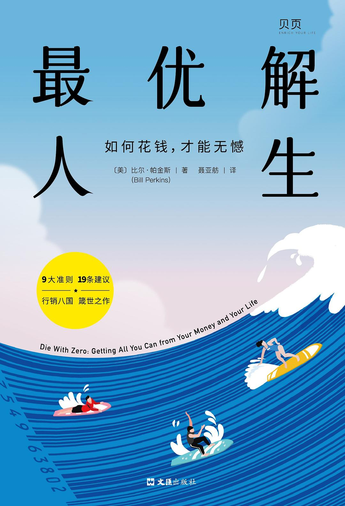
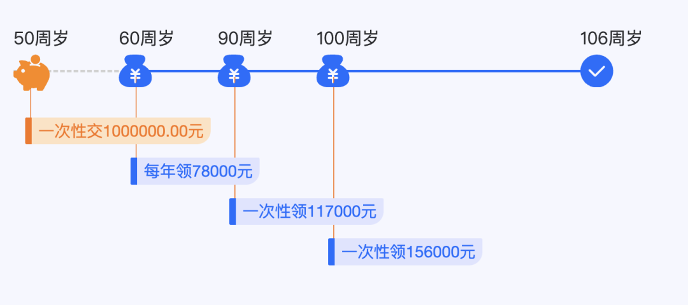

# 死前把钱花光

**发布时间**: 2024-03-11 07:00:00

**原文链接**: [http://mp.weixin.qq.com/s?__biz=MzUzNjE3NzQ3Nw==&mid=2247492848&idx=1&sn=f02d6094743dee44d3ad8dfe39488f0c&chksm=faf89adacd8f13cc9a96ec699cfd96ea6593921a77d99d3aec31ae3de2369621f34becc91f25#rd](http://mp.weixin.qq.com/s?__biz=MzUzNjE3NzQ3Nw==&mid=2247492848&idx=1&sn=f02d6094743dee44d3ad8dfe39488f0c&chksm=faf89adacd8f13cc9a96ec699cfd96ea6593921a77d99d3aec31ae3de2369621f34becc91f25#rd)

---

之前聊新年计划，我说 2024 年希望[允许更多奇迹发生](https://mp.weixin.qq.com/s?__biz=MzUzNjE3NzQ3Nw==&mid=2247492646&idx=1&sn=439269850cc16bd9b3cd811e7b8b2fbf&chksm=faf89a0ccd8f131af2446119b2c8a5a939fb5721bad0a4e77feaa50fb93b3f6d5d3e365515b9&token=289859631&lang=zh_CN&scene=21#wechat_redirect)。对我来说，每天阅读 1 个小时、每个季度去 1 个不同的地方，听到不同的想法、遇到不同的人，都可以增加奇迹发生的概率。

第一个季度即将过去，已经慢慢感受到了奇迹降临

👆 flomo 热力图，一个格子代表一天，当天记录越多、颜色越深，约等于发现新想法的频率。自从把阅读作为重要的事儿，flomo 里开始灵感爆发。

这次旅行的体验，加上最近在读的一本书《最优解人生》，突然给我在「花钱」这个问题上打开了新视角——这本书最特别的一个观点是鼓励大家**「死前把钱花光」，最大化人生的体验** （花光不一定是消费，捐赠、帮助他人，也是花钱的一种方式）

之前有小伙伴问到过这本书，我虽然**不完全认同这个观点** ，但这依然带给我很多启发。

先说下我不认同，或者说和我目前人生体验不一致的部分吧。作者得出死前把钱花光的建议，是基于两个前提——**人生是所有体验的总和，回忆有复利效应** 。

这两点我不太同意。

1、在[不要购买体验](https://mp.weixin.qq.com/s?__biz=MzUzNjE3NzQ3Nw==&mid=2247492765&idx=1&sn=64943c2c81a1171cb4b84c31f6f7a877&scene=21#wechat_redirect)中我们聊到，我们时常混淆 无聊（快乐） vs 空虚（满足感、意义感）。很多财务自由的伙伴，最后要么回去上班了，要么抑郁了。他们最大化快乐，却缺失了满足感。

购买（新的）体验能够带来快乐，但获得满足感需要的是自主、专精、目标，这和获得快乐有时是相反的。而且满足感通常不需要购买，甚至反过来创造财富。

2、我很少感受到作者口中的回忆的复利效应。我自己的生活感受，最大部分来自当下，小部分来自未来，过去占比微乎其微，我很少主动回忆过去。

作者认同「这些经历给我再多钱我都不换」，他会羡慕年轻伙伴去欧洲旅行的经历，即便他的旅行开支是高利贷借来的…… 但对我来说，只要你开价够高，我不介意把所有「过去」的体验都卖给你 ‍

不过这不妨碍我喜欢并想给大家推荐这本书。不同的前提、个性，我们会得出不同的结论，但思考过程是互通的。

### 花钱很难

在财务自由之路早期，困扰我们的常常是储蓄率不够，存钱的速度不够快。

但到后期问题却会反过来，最后你会看到**很多财务自由博主特别擅长省钱、非常清楚什么钱不该花，但在判断什么钱应该花时，却有些不知所措。**

可能有小伙伴难以理解，觉得这太凡尔赛，那我们换个角度想一下——为什么你不喜欢自己现在的工作，却依然每天准时去上班呢？

  1. 工作有好处，ta 会给你最直接的奖励，钱。

  2. 习惯了。所谓的焦虑没钱、担心社会认同等等都是表象，背后的根本原因还是习惯了，所以我们害怕改变。

从这个角度看，省钱也一样。**越是在过去带来好处的习惯，越容易在未来禁锢住我们。**

去年 Ramit Sethi 和 Netflix 合作的纪录片《致富攻略》以及他本人的播客，在财务自由博主的圈子带起一波思潮——很多博主都开始思考如何花钱、会不会省太多的问题。

最近我也在做一些尝试，比如更积极地重设、增加预算，给预算设置「最小目标」，每个月至少要花到一定比例，避免自己过度省钱等等。

### 花钱难，「死前清零」更难

书中关于死前清零的讨论，促使我开始思考一个问题——**如果真的明天就是最后一天，而账户里还剩这么多钱，有哪些事是我觉得，其实本来应该做的？**

但这个问题没那么简单。我想很多人都想过这个问题，但第二天改变的却很少。因为毕竟明天不是真的最后一天。

一个人如果不清楚如何当坏人，通常也没法当好人，因为早就被坏人害死了。

花钱也是。如果不知道自己为什么攒钱，通常也很难把钱花明白。「知道很多道理依然过不好这一生」，因为很多道理是矛盾的，关键在于何时、何地用什么，找到不同道理的平衡点。

死前清零最难的，是和「人还活着，钱没了」的风险共处。世界是不确定的，所以我们才总希望手里留下一些资金，哪怕花不完。

比如审视自己，我发现花钱的阻力常常来自这几个原因：

  1. 对各种突发意外的担忧；

  2. 提防由奢入俭难，生活品质提上去了，难以降下来；

  3. 活得比预期太久；

所以我很关心如何在花钱的同时，避免这几个风险。

1、**应对突发意外相对容易，因为大部分意外概率可以量化** 。比如我习惯把意外风险转化成保险保费来思考，当我们可以覆盖生病、失业、财产损失的风险时，大部分意外就不是问题了。

另外，财务自由本身也是一款终极保险，可以理解为我们未来一生的现金流保险。

2、我在花钱上的克制也来自对人性的担忧，更多开销短时间内可能很快乐，但长期也会**提高我们的快乐阈值，反而让我们更难开心** 。

比如对于年入 10 万的家庭来说的难忘体验，对年入 50 万的家庭反而可是是「苦」。我不想这样。

也太提供了一个思路，我很喜欢，也给大家分享一下：

  * 把增加的开支作为「临时」奖励预算，和日常预算分开，每年重新考虑，避免成为习惯；

  * **定期全家军训，过能力范围内最穷、最简单的生活** ，校准自己的快乐阈值。

哈哈哈，这很斯多葛主义。我表示赞同，军训的部分甚至还有点期待，很想知道我们的能力边界到底在哪～

3、那么**活太久的风险呢？** 也太路过我身边时，刚好瞄到这张图 👇 大家慧选 B 款的保费和现金流试算

也太看到这张图一脸兴奋——这是什么啊？哇，一年能领 7 万 8？如果能这样把本金转化成现金流，那我担心的市场涨跌、老后变傻、本金被人惦记的问题不就都解决了吗！

我则是一脸无奈——哈？这是年金险啊，这个思路我都[写了好几年了](https://mp.weixin.qq.com/s?__biz=MzUzNjE3NzQ3Nw==&mid=2247492626&idx=1&sn=bf2a880f8f8b8c4014aba7e58d5a3141&scene=21#wechat_redirect)，是我最津津乐道的老后管钱的思路之一。你怎么好像从来没看过一样 

其实读到死前清零这个观点时，我就立刻想到了年金险。于是用大家慧选 B 款（没有现金价值，最大化领取现金流）做了计算：

  * 我自己的投资理财，在[考虑了各种风险、安全边际以后](https://mp.weixin.qq.com/s?__biz=MzUzNjE3NzQ3Nw==&mid=2247492535&idx=1&sn=e59820c2d8269cd09bcd3095fc227565&scene=21#wechat_redirect)，每年从本金中转化出 5% 的现金流；

  * 用大家慧选 B 款的话，可以转化出每年 **5.8% 的稳定现金流** ；

自己打理的好处是，长期而言提取 5% 的现金流以后还能留下本金。变成年金险以后，本金死后归零。

但年金险的好处是，完全不用再操心、100% 稳定，花钱再没有后顾之忧。相当于用一笔本金买了老后几十年的潇洒、安全。这对年轻人可能不算有吸引力，但对一个已经没有「以后」的老年人，可能是莫大的幸福。

对了，这里插播一下 👉 因为报行合一，[大家慧选]()停止录单的时间**可能在这个月中旬** 。这个领取比例很有性价比，需要的小伙伴可以关注一下。

### 不是「死前清零」，而是清醒地活

其实如果生活的目标是幸福最大化，我们不太可能真的死前清零：

  1. 随着年龄增加，欲望会越来越少，我们越来越容易感到满足；

  2. 很多重要的东西买不到；

  3. 消费带来的改善边际递减；

  4. 储蓄带来的安全感，也是幸福的来源之一；

所以最终我们总会达到一个平衡点，花钱带来的额外改善，比不过把钱留下带来的安全感和工作带来的满足感。

《最优解人生》中有个细节，作者举例身价 40 亿美元的朋友，说他赚得太多、花得太少。但巴菲特的财富比这位朋友多得多，为什么作者没提到巴菲特呢？

因为他们俩最大的区别——作者的朋友从没真正想清楚工作对自己的意义，一直在被过去的习惯牵着走，不断追求更大的目标。赚钱，但不开心（后来他 38 岁时想清楚，然后退休了）。而巴菲特每天踩着踢踏舞去上班。

**作者在谈的并不完全是死前清零，而是如何认清自己、清醒地活。** 「死前清零」对我而言更像是一种提醒——我们有没有过于克扣自己，有哪些事儿、哪些体验、哪些消费明明在我们能力范围之内，我们却总认为自己做不到？

人最容易欺骗自己。不想要，还是要不到，还是不敢要，有时候我们说不清。试过了，才知道。

  * 财务自由：[我的财务自由实证之路](http://mp.weixin.qq.com/s?__biz=MzUzNjE3NzQ3Nw==&mid=2247492838&idx=1&sn=ec37f2054b31e63b1e7758d54c519eb4&chksm=faf89acccd8f13da062881f58316f95918e78cc83acd7297e1240a2afdb8d6e42c798b4684c9&scene=21#wechat_redirect)

  * 投资笔记：[十年之约，躺赚不难](http://mp.weixin.qq.com/s?__biz=MzUzNjE3NzQ3Nw==&mid=2247492724&idx=1&sn=09f3418f32f1e53839dbe093e4125e2d&chksm=faf89a5ecd8f13487c9c50f16bdb53c2f2d90b95abfdf2d8a085894b0d40982d7b6e531bb82f&scene=21#wechat_redirect)

  * 抵御风险：[2 月保险最推荐‍‍‍‍‍‍‍‍‍‍‍‍‍‍‍‍‍‍‍‍](http://mp.weixin.qq.com/s?__biz=MzUzNjE3NzQ3Nw==&mid=2247492792&idx=1&sn=458ce4dc2b2201bbeadeee5617e8b433&chksm=faf89a92cd8f1384abe78aa75fe9fefe27267fa48643358bb9dbfd5f9aec666bc40110700cb8&scene=21#wechat_redirect)‍

  * 干货汇总：[财务自由路上应该了解的每一个问题](http://mp.weixin.qq.com/s?__biz=MzUzNjE3NzQ3Nw==&mid=2247491818&idx=1&sn=c4d5171acfab76ba65b56c47d6d384da&chksm=faf89ec0cd8f17d6aad08ad69e208c2b896678e1a51266702ca1eceeec768ad75d1bb6184d74&scene=21#wechat_redirect)