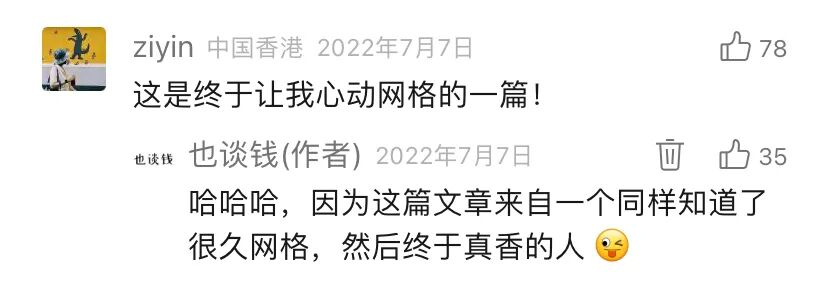
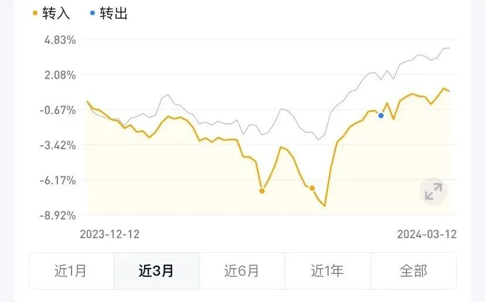
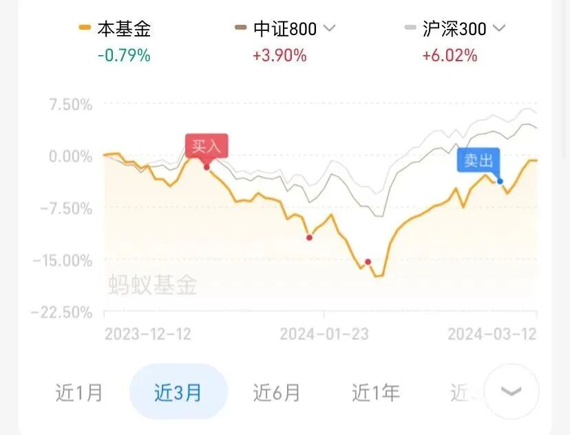

# 卖出一点

**发布时间**: 2024-03-14 06:05:35

**原文链接**: [http://mp.weixin.qq.com/s?__biz=MzUzNjE3NzQ3Nw==&mid=2247492875&idx=1&sn=14fbc412ba64e9c4920d9f3b7b7d4d6e&chksm=faf89b21cd8f1237a3a620123ec385f27508a6cd87b5e9a648b939babbf44ea515f361166bea#rd](http://mp.weixin.qq.com/s?__biz=MzUzNjE3NzQ3Nw==&mid=2247492875&idx=1&sn=14fbc412ba64e9c4920d9f3b7b7d4d6e&chksm=faf89b21cd8f1237a3a620123ec385f27508a6cd87b5e9a648b939babbf44ea515f361166bea#rd)

---

之前和大家分享过我这个[零花钱策略](https://mp.weixin.qq.com/s?__biz=MzUzNjE3NzQ3Nw==&mid=2247490582&idx=1&sn=5f6c7a6e3be6d19846f55a5e7355f18d&chksm=fafb623ccd8ceb2a3e43b77f31c2299a9caf16b34131dda465d1f737c96619bf2fb7b2835788&scene=21#wechat_redirect)——拿一小部分本金创造高频的小确幸，每当获得「意外的钱」就拿收益安排些有仪式感的活动。

钱不多，一次 50 刀，幸福感提升却相当明显。**也太对这个策略的评价远高于其他收益更高（但浮盈不能变现）的投资。** 当时不少小伙伴还因为这篇文章被种草网格策略

现在，可以给大家分享下我的「零花钱策略 2.0」了，和网格策略并行。今年 1、2 月市场一跌一涨，收获了**相当于以前的 8 网** ，我已经准备好下次出去玩的预算了～

碰巧也太在 Instagram 上刷到一个旅行博主的推荐，目的地都在大约一小时车程内 👇

德国最长的索桥，我一定要去试试这个！

你有点子，而我有钱，这是什么神仙搭配

‍

### 零花钱策略 2.0

2023 年我在投资上最大的收获是重新开始重视资产配置。突然意识到一个被忽视细节——**资产配置中的「再平衡」，不就是一个以总资产为基础的巨大网格么？** 都是从市场波动中收益。

很多小伙伴知道资产配置，但多是关注资产配置中各类资产的比例，重视并实践再平衡的少之又少。

我这次的「零花钱」，就是来自两次再平衡。

[上次再平衡](https://mp.weixin.qq.com/s?__biz=MzUzNjE3NzQ3Nw==&mid=2247492744&idx=1&sn=e95797a2caafed3363b2bec25e7f761b&scene=21#wechat_redirect)是在 1 月底，A 股的仓位低于目标值，再平衡方向是 现金 → A 股，让比例回到目标值。

再随着 2 月至今的市场反弹，A 股持仓开始高于目标值。最近第二次再平衡就是卖出一些，A 股 → 现金。两次再平衡中间变现的收益，就成了我们的零花钱预算。

现在再回头看当初这张图，感觉应该会更明显。**没有再平衡，只是回本的过程。加上再平衡，意外波动带来了额外的收益。**

>

 资产配置+再平衡，面对美股 08 年崩盘，会更快回归正收益

「资产配置是投资中唯一的免费午餐」，不用像网格一样专门设置一个策略、分配一笔钱，只是基于自己原有的投资（而且再平衡也没有网格的击穿问题）

### 不是「收益」，而是「幸福」

这些年我有个观念上的转变，就是不再关注数字、收益的最大化，而是关注过程中幸福感的最大化。

像这样的市场波动中卖出一些（注：不是随意卖出哈，而是根据再平衡这样理性思考后的投资纪律），以前我是断然不会做的，我会说「现在市场很低，收益尽可能再投资才会最大化！」。

但过去这轮牛熊里，也太常说的一句话我特别在意：

> 以前牛市行情好、收益多的时候，那些钱我一分也没花到。现在熊市里投资下跌的痛苦却一样没少挨！

自从开始有意识地设置一些零花钱策略，家人的体验明显改善。**能够体会到上涨对现实生活的改善，面对下跌心态会更平衡、更淡定** 。现在我们可以说——这次反弹的改善我们已经收获了，就算再跌下去也不亏，反而是在给下次收获积蓄力量。

……

大家如果对这个思路感兴趣，可以一起回顾下过往的三篇文章：

  * [用被动收入赚零花钱出去玩](https://mp.weixin.qq.com/s?__biz=MzUzNjE3NzQ3Nw==&mid=2247490582&idx=1&sn=5f6c7a6e3be6d19846f55a5e7355f18d&chksm=fafb623ccd8ceb2a3e43b77f31c2299a9caf16b34131dda465d1f737c96619bf2fb7b2835788&scene=21#wechat_redirect)

  * [网格策略的几个注意事项](https://mp.weixin.qq.com/s?__biz=MzUzNjE3NzQ3Nw==&mid=2247490601&idx=1&sn=6c3654d86e15651c089d9f45300d5665&chksm=fafb6203cd8ceb15a1a3f7f921715127e4848dcb12d87de1e9359ceaddc90c2011a2ebc80ce5&scene=21#wechat_redirect)

  * [再平衡](https://mp.weixin.qq.com/s?__biz=MzUzNjE3NzQ3Nw==&mid=2247492744&idx=1&sn=e95797a2caafed3363b2bec25e7f761b&scene=21#wechat_redirect)

然后这里再补充几个重要细节：

1、很多小伙伴可能会问，那我应该怎么做资产配置呢？

老实说，资产配置太因人而异了，没有标准答案，我也是花了很长时间才想清楚。但我们可以先从一个小事开始——**先盘点清楚自己当前各类资产的比例，不再凡事都「大概」。**

然后以这个状态为起点，先引入再平衡，再慢慢思考自己目标的资产配置比例是什么样的，逐步贴近目标。

2、一个提升收益的细节。

对于在 A 股投资的小伙伴们，**跟踪恒生科技指数的 ETF（例如 513180）比跟踪中概互联的 ETF 更值得考虑** 。尤其是网格策略，恒生科技的触发机会比中概互联高不少，政策风险也更小。

中概互联的成分股中有不少美股，但美股和 A 股的交易时间不重合。A 股开市时，美股已经收盘了，很多的日间大幅波动捕捉不到。比如我之前收的一网，卖出价格发生在美股盘中，等到 A 股开盘就没机会了，然后一路向下……

相比之下，和 A 股同交易时间的恒生科技机会要很多（这波恒生科技再反弹 10%，我又能收一个 10 倍的大网，下下次的钱也出来了 🤩）

3、**资产配置对自己的重要程度可以看「每月新增可投资本金 ÷ 当前已有总资产」** 。这个比例越小，资产配置的价值越大。以 1% 为例，已有本金是每月新增本金的 100 倍，那随便一点市场波动，带来的影响都比新钱大得多。

4、最后还要补充一点，**再平衡带来的「零花钱」只是资产配置的副产品，ta 的根本价值在于控制风险，而不是提高收益** 。

比如一位投资者，同时配置 A 股和美股。随着这两年 A 股持续下跌、美股持续上涨，ta 的美股持仓一定大幅高于原计划，在一类资产上暴露了过多风险。

再平衡的本意其实是防止一类资产过度偏离自己的风险偏好和目标。只不过再平衡无意间顺应了均值回归，才带来了额外的收益。

哪怕再平衡带来的可能是当下的负收益（投资中一类资产猛涨时，会出现这种情况），再平衡依然是有意义的。

  * 财务自由：[我的财务自由实证之路](http://mp.weixin.qq.com/s?__biz=MzUzNjE3NzQ3Nw==&mid=2247492838&idx=1&sn=ec37f2054b31e63b1e7758d54c519eb4&chksm=faf89acccd8f13da062881f58316f95918e78cc83acd7297e1240a2afdb8d6e42c798b4684c9&scene=21#wechat_redirect)

  * 投资笔记：[十年之约，躺赚不难](http://mp.weixin.qq.com/s?__biz=MzUzNjE3NzQ3Nw==&mid=2247492724&idx=1&sn=09f3418f32f1e53839dbe093e4125e2d&chksm=faf89a5ecd8f13487c9c50f16bdb53c2f2d90b95abfdf2d8a085894b0d40982d7b6e531bb82f&scene=21#wechat_redirect)

  * 抵御风险：[3 月保险最推荐‍‍‍‍‍‍‍‍‍‍‍‍‍‍‍‍‍‍‍‍](http://mp.weixin.qq.com/s?__biz=MzUzNjE3NzQ3Nw==&mid=2247492855&idx=1&sn=6dbd96dcb84ba9912c329509d3a9265e&chksm=faf89addcd8f13cbb882a97a3c0e8a9aad59ea2b7df8dfbbed8026c9f2fe112e5d65f6a19690&scene=21#wechat_redirect)‍

  * 干货汇总：[财务自由路上应该了解的每一个问题](http://mp.weixin.qq.com/s?__biz=MzUzNjE3NzQ3Nw==&mid=2247491818&idx=1&sn=c4d5171acfab76ba65b56c47d6d384da&chksm=faf89ec0cd8f17d6aad08ad69e208c2b896678e1a51266702ca1eceeec768ad75d1bb6184d74&scene=21#wechat_redirect)