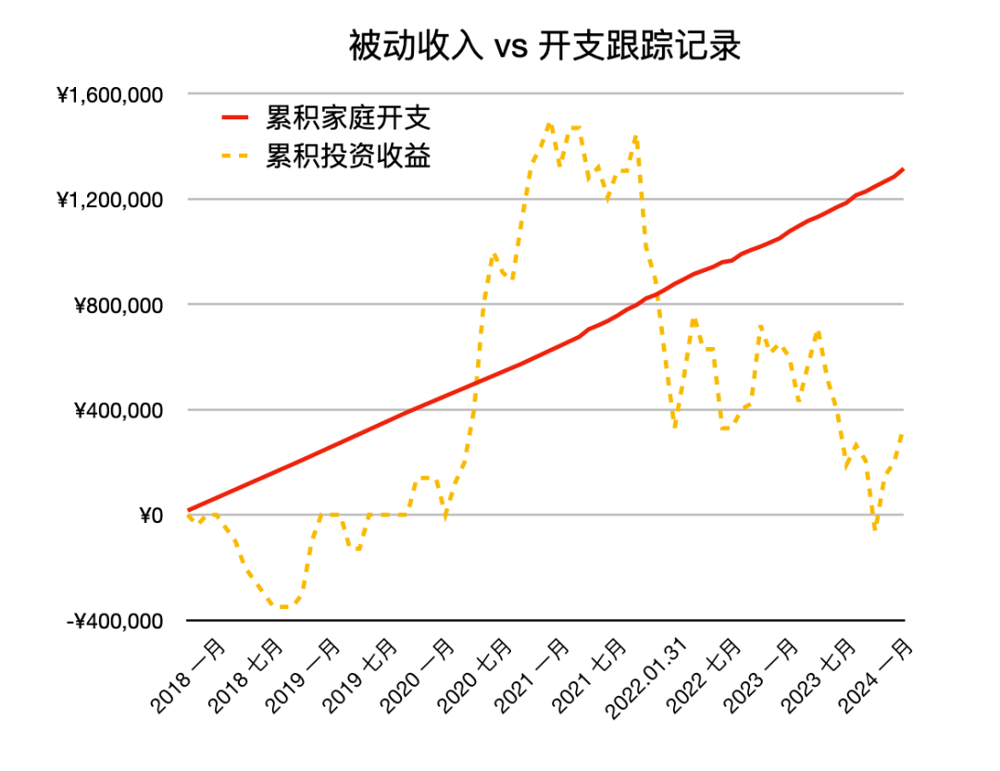

# 金钱买不来幸福，但能缓解痛苦｜财务自由实证 #61

**发布时间**: 2024-05-06 07:00:00

**原文链接**: [http://mp.weixin.qq.com/s?__biz=MzUzNjE3NzQ3Nw==&mid=2247492952&idx=1&sn=f8fb1715463edbf8c143ed19d225ebd5&chksm=faf89b72cd8f1264f9707cd8bc7b5fe6e5d867c9579cf0672a6c7daeba7c2eff95e0b06d1043#rd](http://mp.weixin.qq.com/s?__biz=MzUzNjE3NzQ3Nw==&mid=2247492952&idx=1&sn=f8fb1715463edbf8c143ed19d225ebd5&chksm=faf89b72cd8f1264f9707cd8bc7b5fe6e5d867c9579cf0672a6c7daeba7c2eff95e0b06d1043#rd)

---

之前和大家聊过，读完《人生最优解》我开始思考这个问题——很多财务自由博主特别擅长省钱、非常清楚什么钱不该花，但在判断什么钱应该花时，却有些不知所措——[死前把钱花光](http://mp.weixin.qq.com/s?__biz=MzUzNjE3NzQ3Nw==&mid=2247492848&idx=1&sn=f02d6094743dee44d3ad8dfe39488f0c&chksm=faf89adacd8f13cc9a96ec699cfd96ea6593921a77d99d3aec31ae3de2369621f34becc91f25&scene=21#wechat_redirect)。

但最近有几件事儿，**我试着允许自己花更多的钱，但结果体验反而更糟糕了** 。

比如我在改造工位，挑选显示器。我以前的思路是，先花 4.9 欧买一篇第三方评测报告，然后结合自己的预算在评测 Top3 里面选。原本 350 欧就能解决问题 👇

办公显示器评测第一，到手价格也才 350 欧

但自从把选择扩大到包括 2000 欧的苹果 Studio 显示器以后，我纠结坏了。花了巨多时间（可能有十几个小时）了解不同显示器的区别、性能、色准等等，高考填志愿都没这么紧张焦虑、怕选错……

结果你猜怎么着，后来我还是买了 350 欧的显示器，然后到手开了**最防蓝光模式用到现在** ，这是最体现不出高端显示器色准、亮度的工况 😂 瞬间觉得之前的自己是个白痴，为不需要的东西浪费这么多时间。

重复了几次类似经历，我意识到两个问题：

  1. 更多的钱确实可以让我们有更多选择，但除非在你非常精通的领域，否则**太多选择反而等于没有选择** ；

  2. 经济能力不上不下最纠结。往上够吧，感觉好像买得起，但背后的纠结在时刻提醒你，你还差一些（**我一直觉得，能买得起但会纠结，本质上还是买不起** ）

如果消费总是这样的体验，那我宁可别消费了。完全违背了「让自己更幸福一些，放大生活体验」的初衷。

……

直到后来有句话启发了我：

> 人对幸福的定义，不是得到了幸福的最大值，而是把痛苦的量缩到最小。
> 
> ——叔本华

这让我想到另一句洞察：

> 金钱买不来幸福，但能缓解痛苦。

相比简单粗暴的「买更贵的」，我发现这样的消费方式更舒服：

  1. **凡事先尝试基础大众款，大部分时候这就够用了。省钱是一方面，最重要的是这能避免很多焦虑和纠结；**

  2. **在感到痛苦时，再果断升级。**

只试图选「更好」的时候，我们在假设所有人的需求都是一样的。

试图解决「痛苦」的时候，我才意识到每个人在意的点完全不同。

因为每个人的感受完全不同，只是买更贵的，你得到的未必是自己想要的。但当我们感到痛苦的时候，我们非常清楚当下自己需要什么。

回国旅程里两个让我觉得花得超值、也没纠结的瞬间：

1、一趟短途火车，当天中午没有午睡，特别困倦。我们后半段从硬座补票到了卧铺，虽然最后只用上了 30 分钟，而且是按照全程 1 小时 30 分补的差价，但对一个急需午睡的人来说，却像是救命稻草。

2、以前我觉得坐长途飞机加价 800 块选前排「额外腿部空间」是个智商税，直到这次切身感受到了长途飞机的腰酸背痛（明明以前没事儿的，也不知道是人到 30 变弱了，还是变矫情了 🥲）

回德国的航班我果断加价选了前排座位。这次旅程最高光的时刻，就是我发现自己的腿部空间比前排价格翻倍的超级经济舱还要大一倍的时候 👇

这趟回国往返机票价格大致对比，经济舱 650 欧，超级经济舱 2000 欧，商务舱 5000 欧。这么一算，110 欧（单程）的选座费很超值了，关键是适合我。

回国期间一个 3 小时航班刚好有优惠升舱，我加价 600 块体验了下国内航线商务舱（≈ 国际航线的超级经济舱）。帮我确认了一件事儿，我不需要商务舱的服务（作为 i 人总被问需要啥反而尴尬到扣脚）、人瘦也不需要更宽大的座椅，但前排腿部空间更大、能把腿伸直，真的让旅途舒服很多。

下次我应该还会这么选。

回到金钱让人幸福的本质——缓解痛苦——这让我舒服多了。**与其想什么是更好的，不如关注自己的感受，还有哪些痛苦是可以改善的。**

* * *

### 实证账户更新

数据中断了一个月，这次把 3、4 月一起记录了👇 投资收益有一点点改善迹象，留待后续

记账工具来自[有知有行](http://mp.weixin.qq.com/s?__biz=MzUzNjE3NzQ3Nw==&mid=2247487794&idx=1&sn=b9db83140ef56b777315a5e415954736&chksm=fafb6f18cd8ce60eeebe855dcd793f173a5589e51657877fb9e8a2fff629eeb17688a40e2766&scene=21#wechat_redirect)

被动收入观察 👇 从投资中获得的「累计被动收入」目前还在「累计日常开销」曲线的下方，耐心等待回归

注：这张图的思路来自[第 30 期实证](http://mp.weixin.qq.com/s?__biz=MzUzNjE3NzQ3Nw==&mid=2247489372&idx=1&sn=2118934ef05d930f50d2510ff6642cb1&chksm=fafb6976cd8ce06042f2bb8d1ed950a95262d11451fe116440e1ff84ca49c6fdae8a5d664a6d&scene=21#wechat_redirect)。家庭开支曲线里，我没有算买房首付、一次性税费和部分硬装的钱。剩下大家能想到、想不到的，房贷月供、家具、家电、旅行、保险、医疗什么的，每一笔都算进去了。

……

最后例行提醒大伙，财务自由的投资和被动收入虽然看起来性感，但「因上努力，果上随缘」。本金和收益只是自由路上的「果」，**主业努力多赚钱、理性消费少挥霍，以此积累本金，再加上不被短期涨跌干扰、坚持投资才是背后的「因」** 。

投资复利只是我们获得被动收入的方式，而不是致富的秘密。

在财务自由实证的最初两年，我写得最多的也不是如何投资，而是如何**少在投资上花时间，好能多花时间关注主业** ，同时理性控制开销，尽快攒钱。

假如有 10 万本金，就算投资翻倍也才赚了 10 万。而投资翻倍极其困难，巴菲特的年化收益也才 20%。相比之下，在职场上努力提升，让收入再增加 10 万则要靠谱得多。

对财务自由而言，“钱生钱”做到 80 分足矣，剩下的精力还是应该关注赚钱和省钱这些“人生钱"。

### 关于这份实证

**普通人通过工资理财也能实现财务自由** ，这是这些年我一直在践行的理念。从最初懵懵懂懂到 2017 年制定具体的财务计划，再到如今渐渐靠近终点，已经走了五六年。

为了能够更加透明、中立地实证普通人财务自由的可能性，从 2019 年开始我决定公开自己的财务进度，成为这个系列内容「财务自由实证」。

不追求大富大贵，但求能够不再纠结生计这些琐碎问题，在重大选择面前获得更多的人生选项，不再瞻前顾后。

有兴趣参考这个实证的朋友建议先看看之前的引导篇，[制定自己的财务自由计划](https://mp.weixin.qq.com/s?__biz=MzUzNjE3NzQ3Nw==&mid=2247484500&idx=1&sn=c04c3de1a1231bef25bb4cda773c00ff&scene=21#wechat_redirect)、[一起财务自由](https://mp.weixin.qq.com/s?__biz=MzUzNjE3NzQ3Nw==&mid=2247484480&idx=1&sn=258e8dd4976c7d3c324ed89b90904d14&scene=21#wechat_redirect)。以往的干货精华也都有汇总 👇

  * [全都安排好了，自由路上我们会遇到的每一个问题](http://mp.weixin.qq.com/s?__biz=MzUzNjE3NzQ3Nw==&mid=2247489926&idx=1&sn=eac357cebcbfd7250828cdda88d9f122&chksm=fafb67accd8ceebaa1e750f129714bb000be9720a990a70c6fba6fc52fd3712014a58d699d6e&scene=21#wechat_redirect)

  * [我的第一本书，整理财务自由方法论](https://mp.weixin.qq.com/s?__biz=MzUzNjE3NzQ3Nw==&mid=2247486809&idx=1&sn=8a80c493837ee044c5d55e0a423507d2&scene=21#wechat_redirect)

  * [一期访谈](http://mp.weixin.qq.com/s?__biz=MzUzNjE3NzQ3Nw==&mid=2247487473&idx=1&sn=10a891429291e78dea82b4df34e773f3&chksm=fafb71dbcd8cf8cdb15f114d6637bc6476a2803f9f0803dcbb4d91c1e68b5cc706c3dc55358b&scene=21#wechat_redirect)和[一期播客](http://mp.weixin.qq.com/s?__biz=MzUzNjE3NzQ3Nw==&mid=2247489401&idx=1&sn=a613497a5d6fdc3325d0424b9a78063e&chksm=fafb6953cd8ce045481121812b61b04f62dfe09a07b785991fc4cdd679bc9af13665d4c0ce62&scene=21#wechat_redirect)聊聊我的经历和观念

我给自己定下的目标是 30 岁前积累到**  预计家庭年度开支的 10 倍**（但后来发现钱不需要那么多，开销变少，本金变成了 20 倍），作为创造被动收入的本金。依靠这些本金实现长期 10+% 的年化投资收益就可以实现财务自由，不再依赖上班工资生活，有底气去选择自己真正想做的事儿。

（我的具体目标数字是 500 万，但**这个数字大家没必要参考** ，还是要以自己的生活开销为准）

财务自由路上一些重要节点：

  * 2017 年，计划正式开始，同年获得家人的认可和支持；

  * 2018 年，A 股熊市大跌，出现“钻石坑”机会；

  * 2019 年，开始财务自由公开实证（就是现在大家看到的这个系列）；

  * 2020 年，新冠股灾，自由之路上的又一个关键机会；

  * 2021 年，[自由目标基本达成](http://mp.weixin.qq.com/s?__biz=MzUzNjE3NzQ3Nw==&mid=2247489120&idx=1&sn=e5c5bf6d51914c212c228bc6f42346dc&chksm=fafb684acd8ce15c27cd508a67d57573f4acbeced75f805ef271b4efcf42cf54b363e5f93fcf&scene=21#wechat_redirect)，开始向新的节奏过渡；

  * 2022 年，遭遇自由后的第一次账户大幅回撤，但也是港股 6 年后、A 股 3.5 年后的又一次钻石坑，期待后续……

  * 也是同年，[我搬去二线过想要的生活了](https://mp.weixin.qq.com/s?__biz=MzUzNjE3NzQ3Nw==&mid=2247490915&idx=1&sn=313fba2e0a82a878f0188795ffe1900f&chksm=fafb6349cd8cea5fdfb9a63648453317d1970941f8c470f7bf697d07cca4054fca66f1dc5fac&scene=21#wechat_redirect)，[买房钱从计划中扣除](https://mp.weixin.qq.com/s?__biz=MzUzNjE3NzQ3Nw==&mid=2247490995&idx=1&sn=5b90cca481c8f33b2a7a19f6ef555791&scene=21#wechat_redirect)（自住房我会看作消费而不是资产）

慢慢播种，等待市场回归～