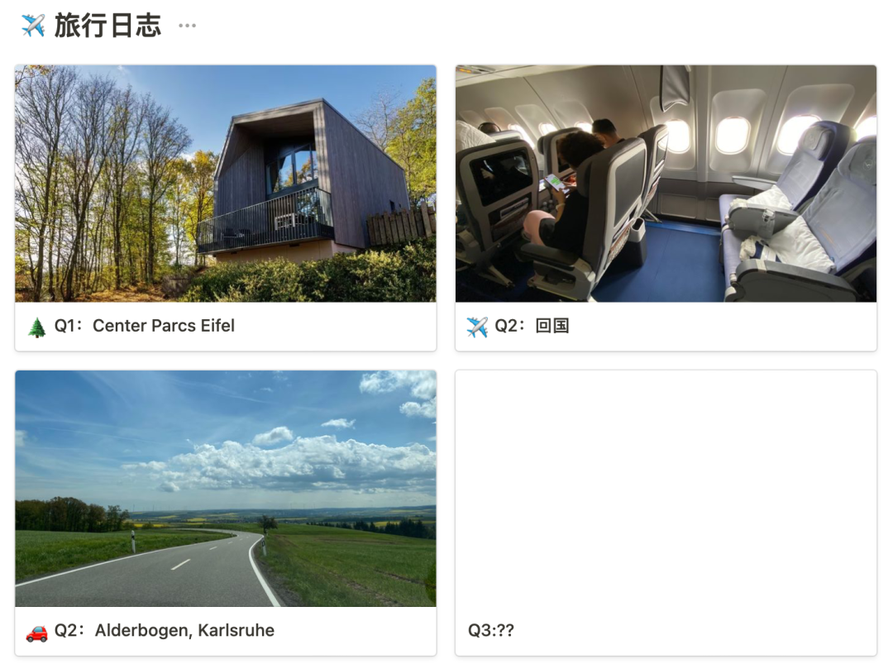
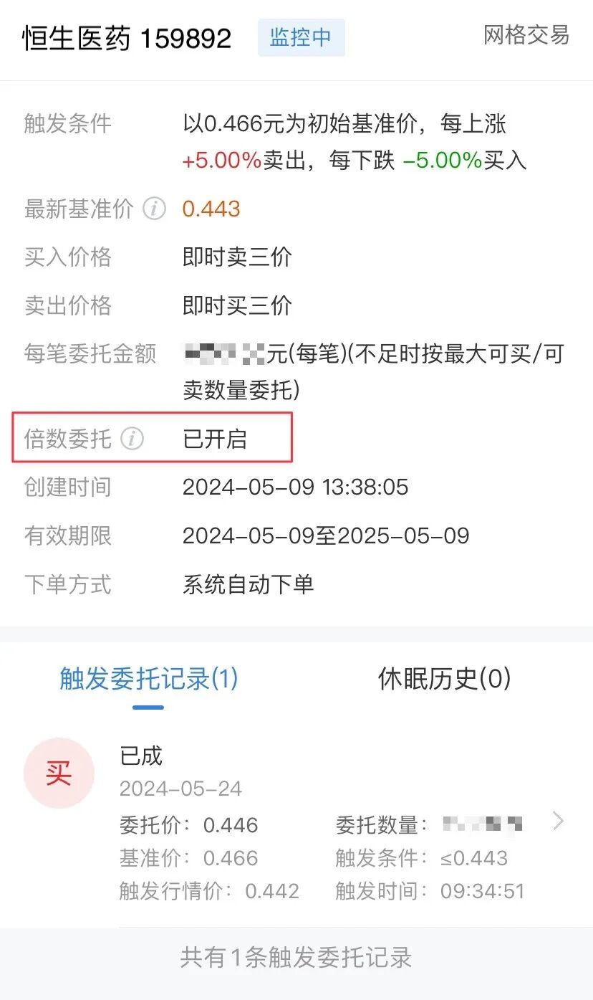
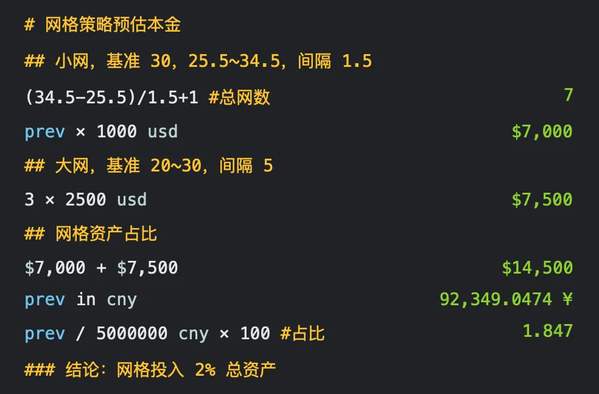
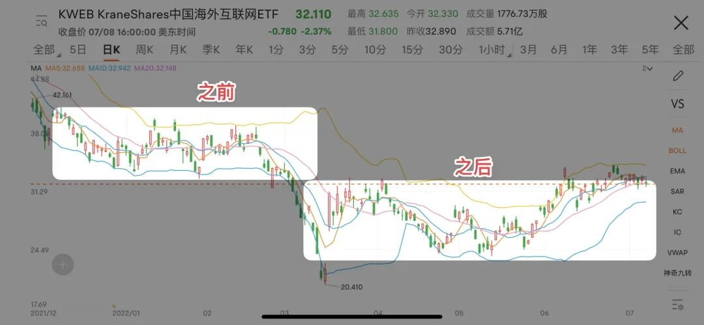

# 我在用的两个零花钱策略｜财务自由实证 #62

**发布时间**: 2024-06-05 07:00:00

**原文链接**: [http://mp.weixin.qq.com/s?__biz=MzUzNjE3NzQ3Nw==&mid=2247493082&idx=1&sn=b85f92d23782a6d3e8e25b194fc5cbeb&chksm=faf89bf0cd8f12e6dbdc1c7c7d1fffa69ddbf8fbf217584c271916c328dc491fc38a1f02dc11#rd](http://mp.weixin.qq.com/s?__biz=MzUzNjE3NzQ3Nw==&mid=2247493082&idx=1&sn=b85f92d23782a6d3e8e25b194fc5cbeb&chksm=faf89bf0cd8f12e6dbdc1c7c7d1fffa69ddbf8fbf217584c271916c328dc491fc38a1f02dc11#rd)

---

这周末我们计划租车短途出游，预算是 2 年前建立起的[这个零花钱策略](http://mp.weixin.qq.com/s?__biz=MzUzNjE3NzQ3Nw==&mid=2247490582&idx=1&sn=5f6c7a6e3be6d19846f55a5e7355f18d&chksm=fafb623ccd8ceb2a3e43b77f31c2299a9caf16b34131dda465d1f737c96619bf2fb7b2835788&scene=21#wechat_redirect)给的～

去年宅了一整年的两个人，我俩今年的目标计划之一就是每个季度去一个不同的地方。从家里走出去，遇到奇迹。

Q1：[去了 Eifel](http://mp.weixin.qq.com/s?__biz=MzUzNjE3NzQ3Nw==&mid=2247492838&idx=1&sn=ec37f2054b31e63b1e7758d54c519eb4&chksm=faf89acccd8f13da062881f58316f95918e78cc83acd7297e1240a2afdb8d6e42c798b4684c9&scene=21#wechat_redirect)，Q2：回国三周，又安排了 2 次短途出游，Q4：行程已经订好了。平均一下，1 年目标可算有保底了。

……

目前我设置了两个用来赚零花钱的「网格策略」，一个基于中概/恒生科技，已经运行了 2 年；一个是最近刚搭起来的恒生医药。

基本思路都一样——小网以 5% 为间隔，每下跌 5% 买入一网，每上涨 5% 卖出一网，变现收益。大网以 20% 为间隔

最先设置的中概（恒生科技）网格

5 月港股波动大，收了 1 个大网、2 个小网：

  * 小网一次够我们短途周边玩一天，或者出去吃一顿；

  * 大网两次够我们出去一次一周的旅行。

有些 A 股券商 App 也可以设置自动网格交易了，恒生医药的网格我是在东方财富弄的 👇 

网格这两个特点很适合和零花钱结合起来：

  1. 赚波动的钱。选低估、不会死的品种，不管行情是好、是坏，只要市场有波动，总能获得现金流。不会像牛市一样让我们等太久。

  2. 但相对稳定的同时，又有点无法预测，更有惊喜的感觉（我俩也考虑过用分红，但分红的时间太固定，久而久之对零花钱的惊喜就钝感了）

之前几次聊网格，发现大家的感受区别很大。这次展开聊聊我用了 2 年后的体会——上面这些选什么品种、如何设置网格等等，很容易看见的东西其实没啥门槛，打开 App 两下就搞定了。**重要的是背后不容易看见的思考，尤其是风险控制** 。

### 开心钱，未必要赚大钱

关于财富和幸福，有一个很容易被忽视的道理：

> 财富来自少数的大高潮，但幸福来自高频的小确幸。

对我来说，网格是一笔「开心钱」。ta 的代价是，**会错过牛市的大收益** 。比如我现在恒生科技的网格，再涨 17% 所有网格就都清仓了。如果牛市一下大涨 50% 甚至翻倍，网格赚不到这笔钱。投资收益长期来看，还是少数大高潮、长期持有带来的。

但于此同时，**如果只有长期持有，等待牛市的时间会变得难熬** 。对幸福来说，一次幸福有多大不重要，重要的是时不时来一下，别让我们等太久。

所以我在设置网格时就有了这 3 个思考：

1、**不管是出于财富还是幸福的考虑，网格里都不用放太多钱和精力** 。大头还是长期持有，零花钱重点在「零」，只要能提供一点额外惊喜就够了。我在网格上投入的本金不到 4%，而且包括网格里备用的现金。精力投入也是如此。

偶尔会有小伙伴问，网格某某参数怎么选，为什么？老实说，几乎所有参数我都是拍脑袋想的。因为我觉得网格只要「能用」就行了，就 4% 的本金，再优化又如何？

这是我[两年前的笔记](http://mp.weixin.qq.com/s?__biz=MzUzNjE3NzQ3Nw==&mid=2247490582&idx=1&sn=5f6c7a6e3be6d19846f55a5e7355f18d&chksm=fafb623ccd8ceb2a3e43b77f31c2299a9caf16b34131dda465d1f737c96619bf2fb7b2835788&scene=21#wechat_redirect) 👇 当时依据 KWEB 算的（A 股可以用 513180）。现在依然在用，一点没改，至少也是「一劳 2 年逸」了

2、只选当下**低估、不会死** 的投资来做网格。如果一笔投资可能永久性下跌甚至归零，网格也无能为力，甚至损失更大。然后从这些投资里选择**波动率大** 的，容易更频繁触发网格。我目前只选了两个，恒生科技和恒生医药。

网格只是一个工具，背后更重要的「好资产、好价格」依然要我们自己把握。

3、第三个原则，**网格的可持续性，比收益最大化重要** 。这点值得展开说说，纠结参数的重要性远不如控制风险。

### 赚得多不如赚得久

这是当时的[另一篇笔记](http://mp.weixin.qq.com/s?__biz=MzUzNjE3NzQ3Nw==&mid=2247490601&idx=1&sn=6c3654d86e15651c089d9f45300d5665&chksm=fafb6203cd8ceb15a1a3f7f921715127e4848dcb12d87de1e9359ceaddc90c2011a2ebc80ce5&scene=21#wechat_redirect)

> **网格很重要的就是压力测试了** 。
> 
> 网格策略和前面说的买基金等分红有个共同点——市场大涨、大跌之后，即使本金有浮亏，依然能获得现金流。
> 
> **但有个例外** ，我画了个示意图：
> 
> 
> 
> 这例子不是我瞎编的，就是今年中丐上发生的事儿 👇 
> 
> 
> 
> 假如我们为了一时收益把网格都布在了前面左上方的位置，到后面就很难再获得现金流。
> 
> 所以在规划网格时不要只看眼前的波动，也要同时做好压力测试，把未来可能的大跌也考虑进去，确保网格数量充足。

当时小伙伴的留言 😂

我的思路是至少按照**上一轮下跌到过的最低价** 来准备，确保自己到了这个价格网格里依然还有可以买的资金。保险一点也可以比最低价再低 20%。中概也可以参考 E 大的「80% 下跌定律」，从上次最高点下跌 80%。

这样的缺点显而易见——大部分时间网格策略都要保留相当的闲置资金。但这个「浪费」能明显增加网格的可持续性，确保网格产生稳定的现金流。

还是前面那句话——幸福来自于高频的小确幸——**网格能一直产生零花钱，比一笔零花钱的数额大小重要得多** 。

我的感受，钱多钱少都会很高兴，会觉得这是「额外的钱」。但为了更多钱，冒着被中断的风险，就不划算了。

### 知道自己在干什么

写到最后突然发现一个好玩的事儿，一边这个零花钱策略让我乐此不疲，一边我却在大部分篇幅聊不要做这个、不要做那个：

  * 不要在零花钱策略放太多钱；

  * 不要投入太多精力去优化参数；

  * 不要追求更高的收益，有点钱就行了，长久更重要；

  * ……

投资是为了更好地生活，但更好的生活却不一定要「更好的投资」，重要的是时刻知道自己在干什么。

**对于开心钱而言，最重要的不是收益，是频率、长久、惊喜** 。为了这些我甚至愿意主动放弃一些收益。

作为个人投资者，我们的幸福可能并不来自更好的投资技术。我自评投资水平只比及格稍好一点点，但我觉得自己很幸福，因为我有个最大的优势——非常清楚自己在干什么、想要什么，也知道自己为此应该不做什么。

* * *

### 实证账户更新

记账工具来自[有知有行](http://mp.weixin.qq.com/s?__biz=MzUzNjE3NzQ3Nw==&mid=2247487794&idx=1&sn=b9db83140ef56b777315a5e415954736&chksm=fafb6f18cd8ce60eeebe855dcd793f173a5589e51657877fb9e8a2fff629eeb17688a40e2766&scene=21#wechat_redirect)

被动收入观察 👇 从投资中获得的「累计被动收入」目前还在「累计日常开销」曲线的下方，耐心等待回归

注：这张图的思路来自[第 30 期实证](http://mp.weixin.qq.com/s?__biz=MzUzNjE3NzQ3Nw==&mid=2247489372&idx=1&sn=2118934ef05d930f50d2510ff6642cb1&chksm=fafb6976cd8ce06042f2bb8d1ed950a95262d11451fe116440e1ff84ca49c6fdae8a5d664a6d&scene=21#wechat_redirect)。家庭开支曲线里，我没有算买房首付、一次性税费和部分硬装的钱。剩下大家能想到、想不到的，房贷月供、家具、家电、旅行、保险、医疗什么的，每一笔都算进去了。

……

最后例行提醒大伙，财务自由的投资和被动收入虽然看起来性感，但「因上努力，果上随缘」。本金和收益只是自由路上的「果」，**主业努力多赚钱、理性消费少挥霍，以此积累本金，再加上不被短期涨跌干扰、坚持投资才是背后的「因」** 。

投资复利只是我们获得被动收入的方式，而不是致富的秘密。

在财务自由实证的最初两年，我写得最多的也不是如何投资，而是如何**少在投资上花时间，好能多花时间关注主业** ，同时理性控制开销，尽快攒钱。

假如有 10 万本金，就算投资翻倍也才赚了 10 万。而投资翻倍极其困难，巴菲特的年化收益也才 20%。相比之下，在职场上努力提升，让收入再增加 10 万则要靠谱得多。

对财务自由而言，“钱生钱”做到 80 分足矣，剩下的精力还是应该关注赚钱和省钱这些“人生钱"。

### 关于这份实证

**普通人通过工资理财也能实现财务自由** ，这是这些年我一直在践行的理念。从最初懵懵懂懂到 2017 年制定具体的财务计划，再到如今渐渐靠近终点，已经走了五六年。

为了能够更加透明、中立地实证普通人财务自由的可能性，从 2019 年开始我决定公开自己的财务进度，成为这个系列内容「财务自由实证」。

不追求大富大贵，但求能够不再纠结生计这些琐碎问题，在重大选择面前获得更多的人生选项，不再瞻前顾后。

有兴趣参考这个实证的朋友建议先看看之前的引导篇，[制定自己的财务自由计划](https://mp.weixin.qq.com/s?__biz=MzUzNjE3NzQ3Nw==&mid=2247484500&idx=1&sn=c04c3de1a1231bef25bb4cda773c00ff&scene=21#wechat_redirect)、[一起财务自由](https://mp.weixin.qq.com/s?__biz=MzUzNjE3NzQ3Nw==&mid=2247484480&idx=1&sn=258e8dd4976c7d3c324ed89b90904d14&scene=21#wechat_redirect)。以往的干货精华也都有汇总 👇

  * [全都安排好了，自由路上我们会遇到的每一个问题](http://mp.weixin.qq.com/s?__biz=MzUzNjE3NzQ3Nw==&mid=2247489926&idx=1&sn=eac357cebcbfd7250828cdda88d9f122&chksm=fafb67accd8ceebaa1e750f129714bb000be9720a990a70c6fba6fc52fd3712014a58d699d6e&scene=21#wechat_redirect)

  * [我的第一本书，整理财务自由方法论](https://mp.weixin.qq.com/s?__biz=MzUzNjE3NzQ3Nw==&mid=2247486809&idx=1&sn=8a80c493837ee044c5d55e0a423507d2&scene=21#wechat_redirect)

  * [一期访谈](http://mp.weixin.qq.com/s?__biz=MzUzNjE3NzQ3Nw==&mid=2247487473&idx=1&sn=10a891429291e78dea82b4df34e773f3&chksm=fafb71dbcd8cf8cdb15f114d6637bc6476a2803f9f0803dcbb4d91c1e68b5cc706c3dc55358b&scene=21#wechat_redirect)和[一期播客](http://mp.weixin.qq.com/s?__biz=MzUzNjE3NzQ3Nw==&mid=2247489401&idx=1&sn=a613497a5d6fdc3325d0424b9a78063e&chksm=fafb6953cd8ce045481121812b61b04f62dfe09a07b785991fc4cdd679bc9af13665d4c0ce62&scene=21#wechat_redirect)聊聊我的经历和观念

我给自己定下的目标是 30 岁前积累到**  预计家庭年度开支的 10 倍**（但后来发现钱不需要那么多，开销变少，本金变成了 20 倍），作为创造被动收入的本金。依靠这些本金实现长期 10+% 的年化投资收益就可以实现财务自由，不再依赖上班工资生活，有底气去选择自己真正想做的事儿。

（我的具体目标数字是 500 万，但**这个数字大家没必要参考** ，还是要以自己的生活开销为准）

财务自由路上一些重要节点：

  * 2017 年，计划正式开始，同年获得家人的认可和支持；

  * 2018 年，A 股熊市大跌，出现“钻石坑”机会；

  * 2019 年，开始财务自由公开实证（就是现在大家看到的这个系列）；

  * 2020 年，新冠股灾，自由之路上的又一个关键机会；

  * 2021 年，[自由目标基本达成](http://mp.weixin.qq.com/s?__biz=MzUzNjE3NzQ3Nw==&mid=2247489120&idx=1&sn=e5c5bf6d51914c212c228bc6f42346dc&chksm=fafb684acd8ce15c27cd508a67d57573f4acbeced75f805ef271b4efcf42cf54b363e5f93fcf&scene=21#wechat_redirect)，开始向新的节奏过渡；

  * 2022 年，遭遇自由后的第一次账户大幅回撤，但也是港股 6 年后、A 股 3.5 年后的又一次钻石坑，期待后续……

  * 也是同年，[我搬去二线过想要的生活了](https://mp.weixin.qq.com/s?__biz=MzUzNjE3NzQ3Nw==&mid=2247490915&idx=1&sn=313fba2e0a82a878f0188795ffe1900f&chksm=fafb6349cd8cea5fdfb9a63648453317d1970941f8c470f7bf697d07cca4054fca66f1dc5fac&scene=21#wechat_redirect)，[买房钱从计划中扣除](https://mp.weixin.qq.com/s?__biz=MzUzNjE3NzQ3Nw==&mid=2247490995&idx=1&sn=5b90cca481c8f33b2a7a19f6ef555791&scene=21#wechat_redirect)（自住房我会看作消费而不是资产）

慢慢播种，等待市场回归～