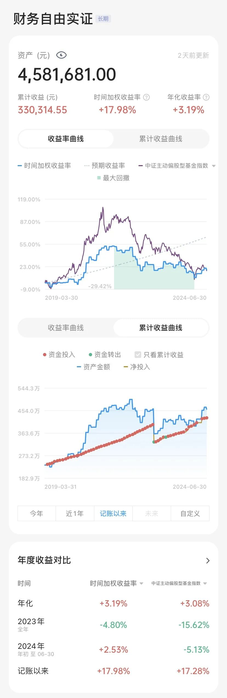

# 最理想的储蓄额，是有点后悔的那种｜财务自由实证 #63

**发布时间**: 2024-07-04 08:00:00

**原文链接**: [http://mp.weixin.qq.com/s?__biz=MzUzNjE3NzQ3Nw==&mid=2247493176&idx=1&sn=e8c2d76bc640fd9611033567d1104448&chksm=faf89812cd8f1104079ba58024eb403f3a508b991d5c917f23c85c960236b99cc1307e6ce820#rd](http://mp.weixin.qq.com/s?__biz=MzUzNjE3NzQ3Nw==&mid=2247493176&idx=1&sn=e8c2d76bc640fd9611033567d1104448&chksm=faf89812cd8f1104079ba58024eb403f3a508b991d5c917f23c85c960236b99cc1307e6ce820#rd)

---

月初刚做完再平衡，继续买入长钱、主动基金和海外投资（定投我会结合到再平衡一起做）。然后去有知有行打卡上墙，突然发现这天上墙的小伙伴只有寥寥 20 多人了 👇 记得以往都是几十上百的

和伙伴们聊了几句，「A 股情绪又冰点了……」。

这几年 A 股的投资体验很差，我的实证账户收益曲线也不太理想。但换个角度想想，我发现也是正是实证的意义之一。就像当初写《工薪族财务自由说明书》时我很喜欢的一句话：

> 事实上，人们只是在成功以后，才去编造那些他们成功的理由，从而给人一个印象，仿佛他们的成功是必然的。

相比于已经知道结果再去回忆，**像现在这样对未来的不确定、过程的酸甜苦辣才占到了真实体验的大多数** 。

……

这期实证想和大伙聊两个思考：

1、我[做过一次估算](http://mp.weixin.qq.com/s?__biz=MzUzNjE3NzQ3Nw==&mid=2247490223&idx=1&sn=900754a68983d0982b01bd5eaf89db1e&chksm=fafb6485cd8ced935d4ed2db07c34da894b37315e7b41bd1ee1d7ac656da5165ae39dac68da8&scene=21#wechat_redirect)，过往 A 股熊市最大跌幅有多少，多久可能重回新高？（最大回撤 >40%，重回新高可能要 5～7 年，底部成交量不到 3000 亿）

至少目前来看，现在还在 A 股的历史规律范围内，**希望这些数据能减少一些大家的失控感** 。

而且换个角度想想，这也说明目前我们遇到的这些，是有可能提前准备的。

2、但反差的是，我当时不愿意相信这些数字，找了很多理由「不会这么差吧」。没想到，后来真就有这么差……

这是对我启发更大的部分——我们不可能每次都提前预料困难和意外，那应该如何为它们做好准备？

**有价值的不仅是记录困难本身，也是记录我们对困难的应对，留待未来检验。**

……

我观察到的**三个历史数据** ：

1、最大回撤。

**2015 年后那轮熊市，中证偏股基金指数的最大回撤是 40%** 。2022年，我当时用「GDP + 3%」作为股票市场的基础收益率，对比 2018 年后偏股基金的实际涨幅，估算出来如果均值回归最大回撤也是 40%（巧合）。

截止到现在，A 股的最低点是今年 2 月，中证偏股基金指数最大回撤 48%，中证全指的最大回撤是 39%。比历史回撤大了一些，但也没到颠覆的程度。

2、重回新高的时间。

**偏股混合基金（主动基金）收复 2007 年高点用了 7 年，收复 2015 年高点用了 5 年** 。

目前我们距离 2021 年 2 月主动基金的高点过去了 3 年零 4 个月。虽然体感上已经是很长一段时间了，但这也只走完了历史进程的一部分。

3、熊市底部成交量

这两天 A 股的单日成交量掉到了 6000 亿，感觉已经很低了。但实际上**  2018 年 12 月，A 股整月的平均成交量只有 2500 亿**。考虑到 A 股过去 6 年的总市值增长，换算过来相当于今天的 4000 亿。

这部分想和大家说的是，如果一个人愿意客观了解历史，是有可能为当下的状况做好准备的。这是我们未来可以努力的方向之一。

……

不过回到现实，为熊市做好准备最好的时机是牛市里、然后是熊市初，但这时我们受到周围乐观情绪的影响，反而最难做到这件事儿。我也是，当时看到了这样的数字，但即便如此还是更愿意相信「不会这么糟」。

所以，**如果我们没能提前预料困难和意外，那应该如何为它们做好准备？**

我的一个思考就是安全边际。作为普通人我们可能做不到预知未来，但还是有很多事情可以做——**我不知道未来会发生什么，但我知道如果发生意外，这么做到时候会让自己更安全** 。

这是可以给财务自由规划的 [6 层安全边际](http://mp.weixin.qq.com/s?__biz=MzUzNjE3NzQ3Nw==&mid=2247492535&idx=1&sn=e59820c2d8269cd09bcd3095fc227565&chksm=faf89d9dcd8f148bddad8131e9282e63898c236e905ccc4412db704e172610617328eaa4adc7&scene=21#wechat_redirect)：

  1. 给预期收益打个折，用更低的收益率做规划；

  2. 留够至少 3 年家庭开销的备用金；

  3. 缴社保，配置完备的保险；

  4. 生活方式尽可能灵活，可以开销大，但要减得下来（以房贷、卡债为反例）；

  5. 保持收入多元化，不能只有主动收入，也不能只有被动收入。这也能增加财务的反脆弱；

  6. Gap Year 心态，降低预期。没人能决定未来一辈子，带着 Gap Year 的心态，当自己不得不回来的时候，会容易接受得多。

后来我又叠了两层：

  1. 不是闲钱不投资——**「闲钱」的重点在于，不要在上面寄托太多改善生活的希望** 。把改善生活的希望变成我们当下的努力和行动，而不是「等这笔钱赚了以后我要……」，否则人会很痛苦；

  2. 更合理的资产配置、均衡分散，海外投资仓位这段时间给了我很大的支持：[如何通过投资获得（相对）稳定的现金流](http://mp.weixin.qq.com/s?__biz=MzUzNjE3NzQ3Nw==&mid=2247492671&idx=1&sn=333f7d55055dec260583fd6a7b3bc2de&chksm=faf89a15cd8f1303c0cbd05a32ca94e5a448492269ed3b821eb3fa0c225eab3cd50234b056d8&scene=21#wechat_redirect)

虽然我的预期没太靠谱，但幸运的是，这些安全边际给了我足够的保护。

……

当时聊到安全边际大家讨论的一个点是，这会不会太多了？留 3 年甚至 7 年的备用金不投资，分散持有，买很多保险，交几十年后才会用上的社保，这会不会影响收益？

但现在来看，这些安全边际反而保护了我们的收益，尽可能降低我们底部被迫卖出的风险。

我和也太偶尔会聊起一件事儿——因为考虑到各种安全边际，我们的房子有点买小了（月供 500 欧，当时的想法是不要比房租贵），有时会显得局促——有点后悔，会想「按照自己的经济状况，也许当时可以买大一点」。

但也让我想起 Morgan Housel 在《一如既往》中的一句话，**  最理想的储蓄额，就是有点后悔的那种**（后悔自己存多了）。就像保险的保费被浪费掉，安全边际最终没有用上，这可能反而是最幸运的事儿。

PS：突然想到，关于要不要「储蓄到后悔」这和话题，很适合和「[死前把钱花光](http://mp.weixin.qq.com/s?__biz=MzUzNjE3NzQ3Nw==&mid=2247492848&idx=1&sn=f02d6094743dee44d3ad8dfe39488f0c&chksm=faf89adacd8f13cc9a96ec699cfd96ea6593921a77d99d3aec31ae3de2369621f34becc91f25&scene=21#wechat_redirect)」放在一起考虑呢。相互矛盾的道理有很多，找到那个平衡点才能「知道很多道理来过好这一生」。  

* * *

### 实证账户更新

记账工具来自[有知有行](http://mp.weixin.qq.com/s?__biz=MzUzNjE3NzQ3Nw==&mid=2247487794&idx=1&sn=b9db83140ef56b777315a5e415954736&chksm=fafb6f18cd8ce60eeebe855dcd793f173a5589e51657877fb9e8a2fff629eeb17688a40e2766&scene=21#wechat_redirect)

被动收入观察 👇 从投资中获得的「累计被动收入」目前还在「累计日常开销」曲线的下方，耐心等待回归

注：这张图的思路来自[第 30 期实证](http://mp.weixin.qq.com/s?__biz=MzUzNjE3NzQ3Nw==&mid=2247489372&idx=1&sn=2118934ef05d930f50d2510ff6642cb1&chksm=fafb6976cd8ce06042f2bb8d1ed950a95262d11451fe116440e1ff84ca49c6fdae8a5d664a6d&scene=21#wechat_redirect)。家庭开支曲线里，我没有算买房首付、一次性税费和部分硬装的钱。剩下大家能想到、想不到的，房贷月供、家具、家电、旅行、保险、医疗什么的，每一笔都算进去了。

……

最后例行提醒大伙，财务自由的投资和被动收入虽然看起来性感，但「因上努力，果上随缘」。本金和收益只是自由路上的「果」，**主业努力多赚钱、理性消费少挥霍，以此积累本金，再加上不被短期涨跌干扰、坚持投资才是背后的「因」** 。

投资复利只是我们获得被动收入的方式，而不是致富的秘密。

在财务自由实证的最初两年，我写得最多的也不是如何投资，而是如何**少在投资上花时间，好能多花时间关注主业** ，同时理性控制开销，尽快攒钱。

假如有 10 万本金，就算投资翻倍也才赚了 10 万。而投资翻倍极其困难，巴菲特的年化收益也才 20%。相比之下，在职场上努力提升，让收入再增加 10 万则要靠谱得多。

对财务自由而言，“钱生钱”做到 80 分足矣，剩下的精力还是应该关注赚钱和省钱这些“人生钱"。

### 关于这份实证

**普通人通过工资理财也能实现财务自由** ，这是这些年我一直在践行的理念。从最初懵懵懂懂到 2017 年制定具体的财务计划，再到如今渐渐靠近终点，已经走了五六年。

为了能够更加透明、中立地实证普通人财务自由的可能性，从 2019 年开始我决定公开自己的财务进度，成为这个系列内容「财务自由实证」。

不追求大富大贵，但求能够不再纠结生计这些琐碎问题，在重大选择面前获得更多的人生选项，不再瞻前顾后。

有兴趣参考这个实证的朋友建议先看看之前的引导篇，[制定自己的财务自由计划](https://mp.weixin.qq.com/s?__biz=MzUzNjE3NzQ3Nw==&mid=2247484500&idx=1&sn=c04c3de1a1231bef25bb4cda773c00ff&scene=21#wechat_redirect)、[一起财务自由](https://mp.weixin.qq.com/s?__biz=MzUzNjE3NzQ3Nw==&mid=2247484480&idx=1&sn=258e8dd4976c7d3c324ed89b90904d14&scene=21#wechat_redirect)。以往的干货精华也都有汇总 👇

  * [全都安排好了，自由路上我们会遇到的每一个问题](http://mp.weixin.qq.com/s?__biz=MzUzNjE3NzQ3Nw==&mid=2247489926&idx=1&sn=eac357cebcbfd7250828cdda88d9f122&chksm=fafb67accd8ceebaa1e750f129714bb000be9720a990a70c6fba6fc52fd3712014a58d699d6e&scene=21#wechat_redirect)

  * [我的第一本书，整理财务自由方法论](https://mp.weixin.qq.com/s?__biz=MzUzNjE3NzQ3Nw==&mid=2247486809&idx=1&sn=8a80c493837ee044c5d55e0a423507d2&scene=21#wechat_redirect)

  * [一期访谈](http://mp.weixin.qq.com/s?__biz=MzUzNjE3NzQ3Nw==&mid=2247487473&idx=1&sn=10a891429291e78dea82b4df34e773f3&chksm=fafb71dbcd8cf8cdb15f114d6637bc6476a2803f9f0803dcbb4d91c1e68b5cc706c3dc55358b&scene=21#wechat_redirect)和[一期播客](http://mp.weixin.qq.com/s?__biz=MzUzNjE3NzQ3Nw==&mid=2247489401&idx=1&sn=a613497a5d6fdc3325d0424b9a78063e&chksm=fafb6953cd8ce045481121812b61b04f62dfe09a07b785991fc4cdd679bc9af13665d4c0ce62&scene=21#wechat_redirect)聊聊我的经历和观念

我给自己定下的目标是 30 岁前积累到**  预计家庭年度开支的 10 倍**（但后来发现钱不需要那么多，开销变少，本金变成了 20 倍），作为创造被动收入的本金。依靠这些本金实现长期 10+% 的年化投资收益就可以实现财务自由，不再依赖上班工资生活，有底气去选择自己真正想做的事儿。

（我的具体目标数字是 500 万，但**这个数字大家没必要参考** ，还是要以自己的生活开销为准）

财务自由路上一些重要节点：

  * 2017 年，计划正式开始，同年获得家人的认可和支持；

  * 2018 年，A 股熊市大跌，出现“钻石坑”机会；

  * 2019 年，开始财务自由公开实证（就是现在大家看到的这个系列）；

  * 2020 年，新冠股灾，自由之路上的又一个关键机会；

  * 2021 年，[自由目标基本达成](http://mp.weixin.qq.com/s?__biz=MzUzNjE3NzQ3Nw==&mid=2247489120&idx=1&sn=e5c5bf6d51914c212c228bc6f42346dc&chksm=fafb684acd8ce15c27cd508a67d57573f4acbeced75f805ef271b4efcf42cf54b363e5f93fcf&scene=21#wechat_redirect)，开始向新的节奏过渡；

  * 2022 年，遭遇自由后的第一次账户大幅回撤，但也是港股 6 年后、A 股 3.5 年后的又一次钻石坑，期待后续……

  * 也是同年，[我搬去二线过想要的生活了](https://mp.weixin.qq.com/s?__biz=MzUzNjE3NzQ3Nw==&mid=2247490915&idx=1&sn=313fba2e0a82a878f0188795ffe1900f&chksm=fafb6349cd8cea5fdfb9a63648453317d1970941f8c470f7bf697d07cca4054fca66f1dc5fac&scene=21#wechat_redirect)，[买房钱从计划中扣除](https://mp.weixin.qq.com/s?__biz=MzUzNjE3NzQ3Nw==&mid=2247490995&idx=1&sn=5b90cca481c8f33b2a7a19f6ef555791&scene=21#wechat_redirect)（自住房我会看作消费而不是资产）

慢慢播种，等待市场回归～