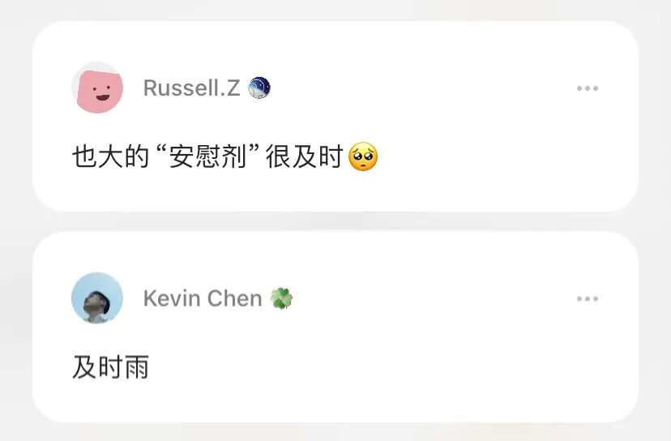

# 记录一下

**发布时间**: 2024-08-16 08:00:00

**原文链接**: [http://mp.weixin.qq.com/s?__biz=MzUzNjE3NzQ3Nw==&mid=2247493318&idx=1&sn=7f4335eb76f693b4da2bd36b2f3d569c&chksm=faf898eccd8f11fa2a6d36901a40eca0bdbf4a240ad4e66f0eeda15dc836404e20c9082f0ac4#rd](http://mp.weixin.qq.com/s?__biz=MzUzNjE3NzQ3Nw==&mid=2247493318&idx=1&sn=7f4335eb76f693b4da2bd36b2f3d569c&chksm=faf898eccd8f11fa2a6d36901a40eca0bdbf4a240ad4e66f0eeda15dc836404e20c9082f0ac4#rd)

---

读者里应该有不少也经历过 2018 年的熊市吧，当时大家想的是什么？

我当时的一个想法「哈哈哈，有了这次熊市的经验，下次再面对熊市，还不手到擒来

」。

而这次，我的想法是，「emm，想简单了……」。

最近在有知有行分享了一篇我在 2018 年写的文章——[几个方法对抗熊市时的消极情绪](https://mp.weixin.qq.com/s?__biz=MzUzNjE3NzQ3Nw==&mid=2247483947&idx=1&sn=b46f55c9b95d2b2ee9e1486cc92e92d4&scene=21#wechat_redirect)——可能不少伙伴都没发现这篇「及时」的文章其实来自 6 年前 😜 此处可以致敬一下 Housel 的新书，投资中很多道理《一如既往》

但文章开头这句话，却比当时争议大得多：

> 从投资的角度来讲，熊市是值得开心的好事；但是从人性和情绪的角度来看，则恰恰相反。

虽然文章是我自己写的，但不同时间背景下再看，感受却也不同——2018 年对比今天，很多方法依然适用，但情绪和当时又不太相同。**很多前提条件都变了** ：

  * 可能当时的我们现金更多，现如今大部分已投入；

  * 可能当时的我们现金流充沛，现如今感受到了生活各方面的逆风；

  * 可能当时的我们从熊市起步、预期很低，现如今经过牛市拉高预期，再跌落下来，很有落差……

投资在低点更便宜，这个道理没变。但「熊市值得开心」这个想法是否还适用，确实值得商榷，因为隐含的前提条件变了。

市场在变，我们也在变。果然，人没法两次踏入同一条河流。

……

想到最近从 @light 文章[读到的一个故事](https://mp.weixin.qq.com/s?__biz=MzAxNDE0MjA2OQ==&mid=2650423150&idx=1&sn=0766389679748ede6dd6653a2a700ba1&scene=21#wechat_redirect)。

我们从小到大应该没少听「少年立志」的故事吧。某牛人从小立志要做一件事儿，然后为此奋斗一生……

这则故事有点不一样——一个朋友从高中开始就立志成为医生。但真的成为医生以后，她发现哪哪都和最初想的不一样：

> A friend of mine who is a quite successful doctor complains constanly about her job. How did she get into this fix? In high school she already wanted to be a doctor. And she is so ambitious and determined that she overcame every obstacle along the way —— including, unfortunately, not liking it.
> 
> Now she has a life chosen for her by a high-school kid.

终于，**她过上了一个高中生（的认知水平）为她选择的生活** 。

一样的道理，这次却行不通了，前提条件变了。

少年立志的故事，隐含了一个容易被忽视的条件——少年的成长过程中，也在不断用新经历、新认知检验当初想法。始终没有改变目标，是结果，但不是原因。

这个故事虽然看起来一样，但背后的条件却是反的——故事主角可能从来没有认真想过，自己到底想要什么样的生活。

……

最近在省钱话题下，有小伙伴留言，「想存钱，但又担心有些钱 20 多岁没舍得花，以后可能也花不出一样的效果了。」

但这个问题可能没法直接回答。

我发现自己做出的很多省钱选择，背后都有这么一个前提条件——获得体验的方式有很多，错过这个还有大把别的体验等着我，非有不可的体验很少。但获得财富的方式相比要少很多。**所以对我而言，财富比体验更稀缺** 。用我们富裕的，交换我们稀缺的。

但这个前提条件，不同的时间、对不同的人，可能都不同。前提条件变了，结论也就变了。

……

网上流传过一段盖茨的采访，问「和你成就相当的人有很多，但为什么大部分人还是把你作为成功的榜样？」

盖茨回答「因为人们喜欢简单的答案」。

人性喜欢简单，但世界是复杂的。

**道理可能很简单，就一两句话，但决定这个道理能否适用的前提条件要复杂得多。****‍**

很多人说现在是历史的垃圾时间，行情的垃圾时间。最好的办法是忽略或者跳过么。

但换个角度重新看垃圾时间，我突然在想，对于我们真正在意的领域，也许垃圾时间也是一段有效经历。看历史、读道理总赶不上行动起来、亲身经历，因为起决定作用的，有时反而是亲身经历才能看到的复杂细节。

以上，一些由此想到的故事和感受，做个记录，谨供参考～

最后也一起记录下——这周前几天，A 股成交量不到 5000 亿，距离 2018 年的冰点程度已经很接近了。

还有一个细节，我关注的十来个雪球组合近几个星期一个调仓的都没有（以前常是每天看不过来）。印象里还是这轮熊市以来的第一次。

  * 财务自由：[我的财务自由实证之路](http://mp.weixin.qq.com/s?__biz=MzUzNjE3NzQ3Nw==&mid=2247493266&idx=1&sn=1acd27d739baf673e42108fd164d78c6&chksm=faf898b8cd8f11ae26e5406d7aa2ec0f7dff3a084812460e23ce4a791dec028dde0d393866d2&scene=21#wechat_redirect)

  * 投资笔记：[十年之约，躺赚不难](http://mp.weixin.qq.com/s?__biz=MzUzNjE3NzQ3Nw==&mid=2247493228&idx=1&sn=24e6c7ca6ed362c209691affa21653d5&chksm=faf89846cd8f1150d54ffe8369a6e5c085c949f7e0de1cdb73dea7edd4af0f80c85a38444bd0&scene=21#wechat_redirect)

  * 抵御风险：[8 月保险最推荐‍‍‍‍‍‍‍‍‍‍‍‍‍‍‍‍‍‍‍‍](http://mp.weixin.qq.com/s?__biz=MzUzNjE3NzQ3Nw==&mid=2247493300&idx=1&sn=966c3ac90f97bd9d6b7ca904d5141161&chksm=faf8989ecd8f118802ff02a91adb4823865a5ace5e3f1694e639632c2ad3cc53f2d9f96fde4f&scene=21#wechat_redirect)‍

  * 干货汇总：[财务自由路上应该了解的每一个问题](http://mp.weixin.qq.com/s?__biz=MzUzNjE3NzQ3Nw==&mid=2247491818&idx=1&sn=c4d5171acfab76ba65b56c47d6d384da&chksm=faf89ec0cd8f17d6aad08ad69e208c2b896678e1a51266702ca1eceeec768ad75d1bb6184d74&scene=21#wechat_redirect)