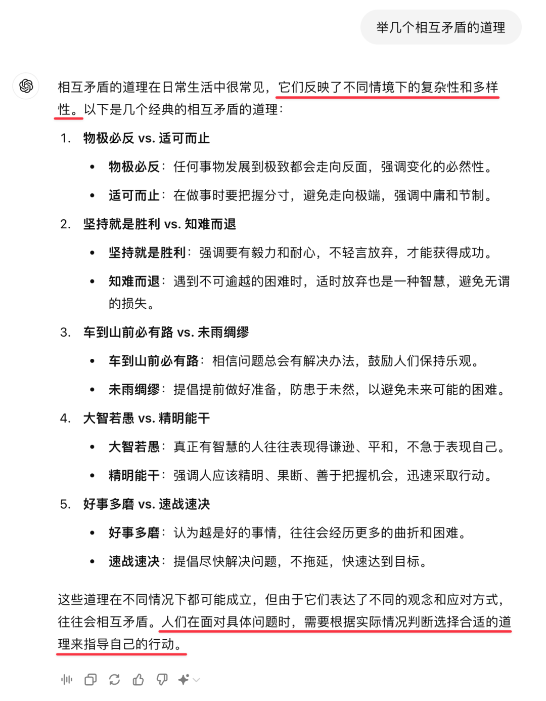

# 踏空 10 年

**发布时间**: 2024-09-04 08:00:00

**原文链接**: [http://mp.weixin.qq.com/s?__biz=MzUzNjE3NzQ3Nw==&mid=2247493360&idx=1&sn=2f7e37a80e0b1e2aa8cd303afa4101c9&chksm=faf898dacd8f11cc0dcd03fec5e27aa783bc0ad8ff3781247eef486d960a8200f611208afc08#rd](http://mp.weixin.qq.com/s?__biz=MzUzNjE3NzQ3Nw==&mid=2247493360&idx=1&sn=2f7e37a80e0b1e2aa8cd303afa4101c9&chksm=faf898dacd8f11cc0dcd03fec5e27aa783bc0ad8ff3781247eef486d960a8200f611208afc08#rd)

---

先给大伙讲一个乍看和标题没啥关系的故事。

前段时间朋友住院手术，把自己过度医疗了，遭了不少罪。和我分享经验教训。

起因是他平时很在意健康，还经常看各种健康节目。后来手术完好长时间都没上厕所，突然就想到电视上看过的一个并发症——术后排尿困难，长时间没上厕所导致膀胱破裂出现危险——然后就向护士申请插管。

结果，后老悔了……没想到插管这么疼「可给疼毁了」，最后发现根本不是排尿困难，就是没尿

‍

事后聊起他就一直说，这回学了个教训，下次可不能过度医疗了！

但我想了下，说你这个「教训」学得有点问题啊，万一下次情况是反过来，你坚持不要过度医疗，会不会反而耽误事儿？

要我说，我觉得最大的问题是出在，**你学到一个方法的同时，没有同时了解清楚这个方法的前提条件** ：

  * 你是知道一堆手术并发症，但你知不知道如何识别？什么情况下要干预？什么情况下不用？

  * 每个干预手段自身的副作用是什么，你了解清楚了么？如果事先知道插管这么疼，还会不会这么选。

**很多时候前提条件比方法本身还重要** ，相互矛盾的道理太多了。有「速战速决」就有「好事多磨」，有「未雨绸缪」就有「车到山前必有路」……一味学习道理，却忽视前提条件，下次还得踩坑。

我觉得一个比较有效的思考方式——每学到一个教训，同时也问自己一句，假如下次情况反过来，这个教训还有效吗？

……

前几天在有知有行读到一篇聊美股的思考，「掐指一算，美股崩盘论已经被打脸十年了…」。算下来到今天，踏空了 10 年。

美股风险如何，这个很有争议，难有结论。但我觉得有个话题却可以聊聊，**「避免高估资产」这个择时方法，本身的前提限制是什么？**

目前为止我看过最有启发的，也是有知有行做的两张对比图 👇 这是 A 股沪深 300 分别在低、中、高估区间买入，持有 5 年的预期收益

在 A 股高估入场真的非常糟糕。遇上太贵先等等，低估再重新入场，是可行的。

但一样的道理，换到美股却不那么适用了 👇

美股近百年的数据显示，**高估入场和正常估值入场结果是差不多的（前提条件：标普 500 + 持有 8 年）** 。美股被称为「相对有效的市场」是有道理的，高估时期往往也对应着未来更高的基本面增速。

避免高估其实隐含了一个条件，就是高估未来表现会更差。如果前提条件变了，结论很可能也会不同：

  * 在美股择时，预期收益有限，预期风险（踏空）却很高；

  * 在 A 股择时，预期收益不错，而预期风险却没那么大（倒车回来接人也是 A 股传统了 😂）

另外同样值得带走的，我觉得还有这两张图背后的分析思路——**如何用数据判断一个市场是否适合择时** ，用数据定量检验不同估值的历史结果，这个思路也很值得学。

……

但说到这里还没完，最后还要补充一下，**美股不适合择时 ≠ 美股可以闭眼买！** 对我来说，这更多是投资美股时的思路转变——就像[昨天文章](http://mp.weixin.qq.com/s?__biz=MzUzNjE3NzQ3Nw==&mid=2247493351&idx=1&sn=15c32f288e34f6dca7e4870f44e5f35e&chksm=faf898cdcd8f11db2a988edd4c29f3c5960af6bc4bcd0cbfd5cdbc840f0f113de052965e8189&scene=21#wechat_redirect)和大家聊的，从「现在高位还能不能买」，转为思考「如何投资更能平稳度过下跌？」

锁定一笔多年用不到的闲钱，分批买入、避免一笔买在最高点，做好资产配置、均衡分散，选择风险更低、更反脆弱的标的……这些都是可行思路（昨天聊的是如何应对，今天补上为什么要这么做）‍

而且，这个思考其实也有个前提——就是我们真的想要投资、需要投资。别忘了，很少有家庭仅仅因为不投资，而过得不幸。

以上一点想法，不一定对，谨供大家参考。

  * 财务自由：[我的财务自由实证之路](http://mp.weixin.qq.com/s?__biz=MzUzNjE3NzQ3Nw==&mid=2247493351&idx=1&sn=15c32f288e34f6dca7e4870f44e5f35e&chksm=faf898cdcd8f11db2a988edd4c29f3c5960af6bc4bcd0cbfd5cdbc840f0f113de052965e8189&scene=21#wechat_redirect)

  * 投资笔记：[十年之约，躺赚不难](http://mp.weixin.qq.com/s?__biz=MzUzNjE3NzQ3Nw==&mid=2247493228&idx=1&sn=24e6c7ca6ed362c209691affa21653d5&chksm=faf89846cd8f1150d54ffe8369a6e5c085c949f7e0de1cdb73dea7edd4af0f80c85a38444bd0&scene=21#wechat_redirect)

  * 抵御风险：[8 月保险最推荐‍‍‍‍‍‍‍‍‍‍‍‍‍‍‍‍‍‍‍‍](http://mp.weixin.qq.com/s?__biz=MzUzNjE3NzQ3Nw==&mid=2247493238&idx=1&sn=e3434aae1b2d30f6064b9728c12c119d&chksm=faf8985ccd8f114a2ad9fc62b4565e3387511b21138122aca5a07b8c0695eca7120aefeddea7&scene=21#wechat_redirect)‍

  * 干货汇总：[财务自由路上应该了解的每一个问题](http://mp.weixin.qq.com/s?__biz=MzUzNjE3NzQ3Nw==&mid=2247491818&idx=1&sn=c4d5171acfab76ba65b56c47d6d384da&chksm=faf89ec0cd8f17d6aad08ad69e208c2b896678e1a51266702ca1eceeec768ad75d1bb6184d74&scene=21#wechat_redirect)

PS：今天文章里有几个词是我让 AI 帮忙想的，虽然 ta 举得例子也不都合理，但我特别喜欢开头和结尾的两句话 👇 也分享给大家

