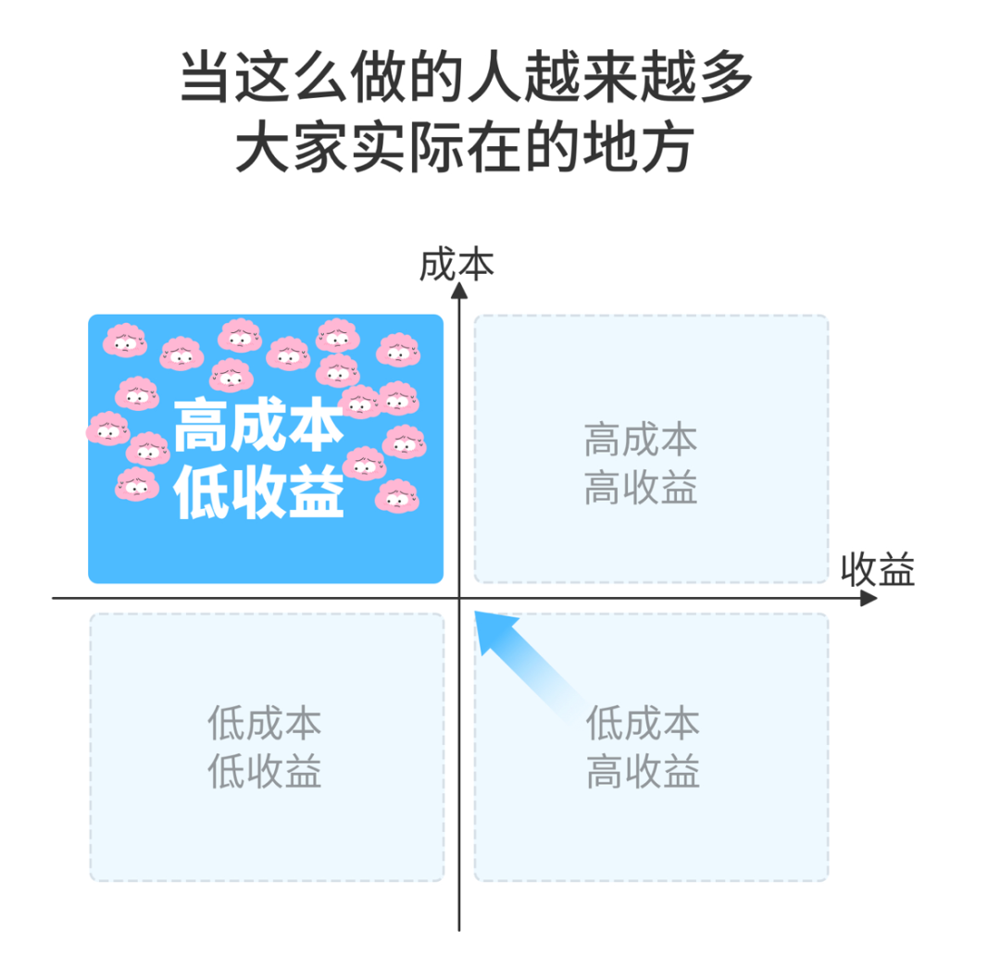
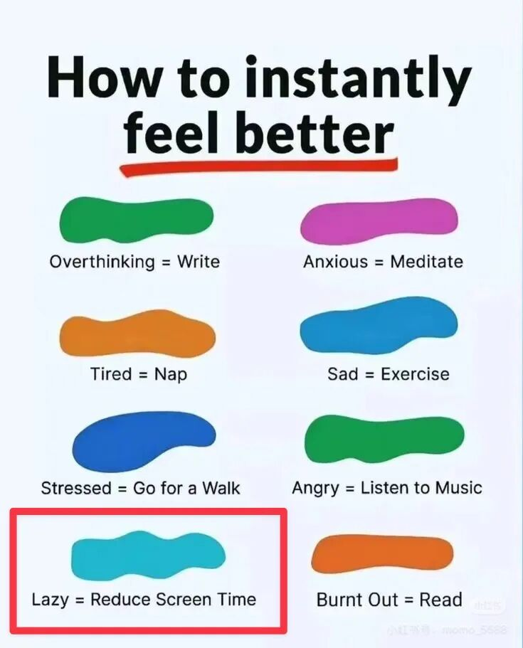

# 选择「难而正确」的路，更容易避开内卷

**发布时间**: 2024-10-28 06:48:49

**原文链接**: [http://mp.weixin.qq.com/s?__biz=MzUzNjE3NzQ3Nw==&mid=2247493560&idx=1&sn=f81d4428a6a17189f3e62750fbb7daf6&chksm=faf89992cd8f108472a771969ae223d767798e69e2be06ebe9eda69300ee0e3c3dabaeca2865#rd](http://mp.weixin.qq.com/s?__biz=MzUzNjE3NzQ3Nw==&mid=2247493560&idx=1&sn=f81d4428a6a17189f3e62750fbb7daf6&chksm=faf89992cd8f108472a771969ae223d767798e69e2be06ebe9eda69300ee0e3c3dabaeca2865#rd)

---

临近大学毕业那会儿，有次小聚同学们都在聊以后怎么找工作、哪家公司待遇好、搬去哪里。我是个异类，听了一会儿语出惊人「如果花几年时间实现财务自由，就不用纠结这些问题了」。当时没一个人赞同我的想法：

  * 投资会亏钱；

  * 感觉上班很好，如果不上班你干什么呢？（那时候我也觉得财务自由就是不上班，不想上班是我的一大动力）

  * 要计划 10 年啊，太久了……

一晃过去六七年了，最近突然有同学找我聊起了当时的计划——毕业以前觉得，一直上班也挺好的。但现在觉得，上班这几年磋磨得够呛，如今又延迟退休了……我当初选的这条路很好。

不过有一点可能和大家想的不一样。

在他们看来我是个不上班的人。

但实际上我依然每天 7 点开工，到 18 点下班。

最大的不同可能是：

1、我在用自己喜欢的方式、做自己想做的事儿，所以不容易觉得厌倦。

2、我判断“工作”的标准是对生活和成长是否有价值，不只看有没有收入。像去年研究[营养学](https://mp.weixin.qq.com/s?__biz=MzUzNjE3NzQ3Nw==&mid=2247491753&idx=1&sn=e1c8a71ed1084425b7540844908a24ea&scene=21#wechat_redirect)，今年研究[工位改造](https://mp.weixin.qq.com/s?__biz=MzUzNjE3NzQ3Nw==&mid=2247492963&idx=1&sn=695ee4eca33b83ee0951492a98d33f9e&scene=21#wechat_redirect)，都没有收入，但他们也是最重要的工作。

3、随时工作的另一面，是如有必要也可以随时休息。

4、我还是很在意主动收入，只是我们的生活不依赖它。我和也太选择生活方式的标准是，什么样的生活方式，即使失去全部主动收入也能一致保持下去？我们追求的不是不上班，而是安全感。有安全感才有做选择的自由。

这和我刚有财务自由计划时的区别挺大的。最初我对财务自由的理解，和现在很多人对躺平的理解差不多。现在我对财务自由的理解，更像是**主动选择一条「难而正确」的路** 。

……

有次听罗振宇聊什么是优势？

> 真正的优势是，别人知道你是怎么做的，但没人愿意学你。

当时就在想我的优势是什么，想了半天想出来一个——我愿意比别人更慢一点 😂 我愿意花 5～10 年去做成一件事儿。别人一看这事儿太慢，也就看不上了。

大家都知道，如果赚到的每一分钱都能**花一半、存一半** ，就能慢慢积累下本金。但现实中愿意这么做的人不多。

大家都知道，如果把花一半、存一半**坚持做 10 年、做更久** ，本金就能积少成多。但愿意这么做的人就更少了。

如果在此基础上，能**再实现合理的投资增值，财务自由就只是时间问题** 。但愿意同时做到这三条的，就少上加少。

最近有朋友规划未来时提到一句按 7% 复利估算，当时有留言说「去哪找 7% 的投资」。我一时感慨，回了一句「收益是认知的变现，要找的不是 7% 的投资，而是去学习 7% 的认知」。想要 7% 收益的人很多，但愿意付出时间去学习了解的人更少。

张磊的《价值》刚出版时带火了「长期主义」这个词，但现在这个词少有人提了。因为长期主义也是「难而正确」的事儿，大家都想正确，但后来发现这条路也很难，就没人愿意走了。

暂停实验室的《有效努力》中有张图，关于如何做选择 👇 **人人都想要「低成本、高收益」。但做的人太多了，这件事儿就会变成了「高成本、低收益」。**

避开这个现象的方法之一，就是主动选一条难而正确、「高成本、高收益」的路。回到了前面说的——大家都知道你是怎么做的，但少有人愿意学你，这样也就卷不起来了。

……‍

年初读到《时间贫困》给我的启发——[发现生活像是一场修行](https://mp.weixin.qq.com/s?__biz=MzUzNjE3NzQ3Nw==&mid=2247492780&idx=1&sn=ddd30251af0e53180c29e0a9d02d106b&scene=21#wechat_redirect)——当你犹豫的时候，选那个短期内更痛苦的选项，长期反而更容易幸福。走大路，大路人少。

当时有小伙伴问，那怎么知道自己走的是大路，还是小路呢？

这篇算是一个补充回答。「难而正确」或者说四象限法中的「高成本、高收益」，也许可以提供一个分析视角。

  * 财务自由：[我的财务自由实证之路](http://mp.weixin.qq.com/s?__biz=MzUzNjE3NzQ3Nw==&mid=2247493496&idx=1&sn=45fb81ad80491d29e5d7f32e9df04149&chksm=faf89952cd8f10445093240e2329e9ce88e0e75b26fae5a65d788992ff26758451c2de521772&scene=21#wechat_redirect)

  * 投资笔记：[十年之约，躺赚不难](http://mp.weixin.qq.com/s?__biz=MzUzNjE3NzQ3Nw==&mid=2247493228&idx=1&sn=24e6c7ca6ed362c209691affa21653d5&chksm=faf89846cd8f1150d54ffe8369a6e5c085c949f7e0de1cdb73dea7edd4af0f80c85a38444bd0&scene=21#wechat_redirect)

  * 抵御风险：[10 月保险最推荐‍‍‍‍‍‍‍‍‍‍‍‍‍‍‍‍‍‍‍‍](http://mp.weixin.qq.com/s?__biz=MzUzNjE3NzQ3Nw==&mid=2247493414&idx=1&sn=fe8291a62398948afc0ad89d180af53f&chksm=faf8990ccd8f101aeca594cfa7643a9f05994578bc92f4f945092153ec2de2ed4952e78d791a&scene=21#wechat_redirect)‍

  * 干货汇总：[财务自由路上应该了解的每一个问题](http://mp.weixin.qq.com/s?__biz=MzUzNjE3NzQ3Nw==&mid=2247491818&idx=1&sn=c4d5171acfab76ba65b56c47d6d384da&chksm=faf89ec0cd8f17d6aad08ad69e208c2b896678e1a51266702ca1eceeec768ad75d1bb6184d74&scene=21#wechat_redirect)

* * *

PS：难而正确的事儿还有一个特点，往往还能其他领域找到对应。

最近我又读到一本对现实生活很有改变的书《成瘾》，里面也有同个道理的另一个切面：

> 如何在充满多巴胺的世界里找到平衡：
> 
>   1. 对快乐的不懈追求（以及对痛苦的逃避）会导致痛苦。
> 
>   2. 康复始于戒断。
> 
>   3. 戒断成瘾物质能够重置大脑的奖赏回路，并使我们从简单的奖励中获得快乐。
> 
> 

> 
> ——节选自《成瘾》中 10 条建议的前 3 条

现代社会最普遍且合法的成瘾物质，我当时**先想到的是手机** 。很多人降低屏幕使用时间以后，精神状态都会有明显改善 👇

如何立刻改善情绪？8 种情绪的快速应对方式

写到这里我又想到了消费主义，如果我们把消费也看作一种成瘾物质，再重新看上面这篇，是不是也会有共鸣？

戒断，这个话题等我下个月有了更多实践再来展开聊～