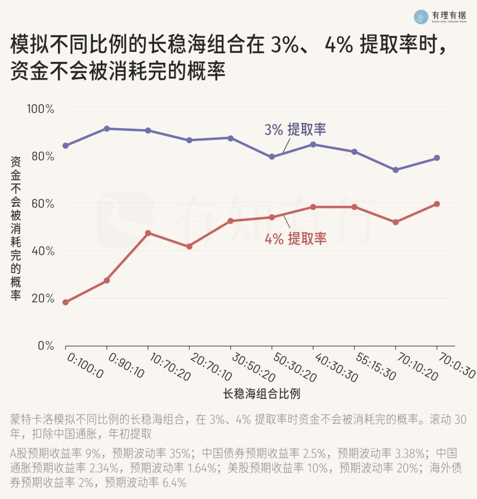

# 财务自由度

**发布时间**: 2024-12-18 06:30:00

**原文链接**: [http://mp.weixin.qq.com/s?__biz=MzUzNjE3NzQ3Nw==&mid=2247493692&idx=1&sn=3a8db553c3bef72cd200c5e96b1480fa&chksm=faf89616cd8f1f007c0a0d1856ec6eb7bcd5f3b426356722ea60e3b64968ed0dbb90884d7cb4#rd](http://mp.weixin.qq.com/s?__biz=MzUzNjE3NzQ3Nw==&mid=2247493692&idx=1&sn=3a8db553c3bef72cd200c5e96b1480fa&chksm=faf89616cd8f1f007c0a0d1856ec6eb7bcd5f3b426356722ea60e3b64968ed0dbb90884d7cb4#rd)

---

有知有行最近更新了一个很喜欢的功能，来给大家安利下——**财务晴雨表** ——尤其是里面的「财务自由度」和「躺平度」

我一直有个理念，人会选择工具，工具也会反过来影响人的思维方式。

想直接改变思维方式很难，我们可能读了很多书、下了好多决心，但下次遇到问题的第一反应还是走以前的路。通过选择工具、改变行动来影响自己的思维方式，有时候更有可行性。

财务晴雨表也会给我这种感觉。可能很多小伙伴都想过从财务自由的角度思考财务规划，但这和一个明晃晃的财务自由度数字摆在眼前，又是完全不同的感觉。

他们具体是这么定义的：

  * 财务自由度衡量的是我们被动收入覆盖**开支** 的能力

  * 躺平度则是衡量我们被动收入覆盖**收入** 的能力

这里**被动收入的衡量方法是「可投资本金 x 3%」**

在有知有行里完成家庭资产记账，就能看到相关数字了。

……

「3%」这个数字我觉得很有价值展开聊，很多小伙伴都问我过类似的问题，怎么预估自己未来可能的被动收入？

「可投资本金 x X%」就是一个方法。

**这里用到的 3% 不是预期收益，而是安全提取率** 。在这个提取率下，我们的本金能撑尽可能长的时间。

欧美财务自由运动（FIRE）的 4% 提取率的来源，原本是一篇目前人群为退休人士的论文——按照 4% 的比例提取本金，在遇上历史最糟糕的情况下，依然有较大概率可以撑过 30 年。

这个计算实际上考虑的并非「一辈子」的财务自由，而是能撑 30 年，过完退休生活就好。后来人们拿来放大了使用场景，再加上最近十几年美股都是牛市，很多人也忽视了这个前提限制。

有知有行的有理有据专栏写了一篇文章分享 3% 背后的计算方法，[财务自由度和躺平度中的安全提取率为什么是 3%](https://mp.weixin.qq.com/s?__biz=MzIwODQ3NjU5Ng==&mid=2247486795&idx=1&sn=a6232c9a79515824fede2b35eef073cf&scene=21#wechat_redirect)？非常推荐感兴趣财务自由计划的伙伴们参考。

他们模拟了不同股债比例和不同“长稳海”比例下，本金撑过 30 年的概率（注意**也是 30 年，不是一辈子** ）。最后选出了 3% 这个比较平衡的数字，预计有 80% 的概率可以实现目标 👇

以后再有小伙伴问如何预估被动收入咱也有理有据了 ✌️

……

我自己的财务计划定的数字比这个高一些。开始制定目标时用的是 10%，以攒到预期开支的十倍本金为目标。

后来也是应了一位小伙伴的观察 👇 越接近目标越发现过好生活可能不需要自己以为的那么多钱，所以开支后来并没有预料中的大幅增加，提取率被动降到了 5%。余下的部分变成了生活的安全边际。

在安全提取率这个问题上我考虑得没有这么细致，但我当时也知道个大方向——**未来不可预测，不存在绝对安全的提取率** 。

有知有行的数据也验证了这个想法，哪怕是取 3% 这样比较保守的数字，依然有 20% 概率在 30 年内用光本金。如果延长到一辈子，概率只高不低。

所以我的结论是[担心预期收益不如准备安全边际](https://mp.weixin.qq.com/s?__biz=MzUzNjE3NzQ3Nw==&mid=2247492535&idx=1&sn=e59820c2d8269cd09bcd3095fc227565&scene=21#wechat_redirect)，解决问题不能在一个维度上死磕，方法也要多元化。

想让自己的财务更稳健，一味追求更保守的提取率会边际效益递减。不如拓展更多维度，包括但不限于更保守的提取率+放低预期、应对熊市提款的备用金、多元化的收入来源、社保+保险、家庭成员的相互支持等等等等。

其实换个角度看，大部分家庭并没有财务自由（相当于实际提取率远大于安全提取率），但这并不妨碍很多家庭的平安喜乐。

而且先有一个目标，哪怕不是那么完善合理，能够开始行动就很好，我们往往是越实践才越知道自己想要什么。先有一个「明确」的目标，有时候比等一个「完备」的目标更重要。

……

当初看也太种菜了解到一个反直觉的现象，我还挺有感触的——原来新手种菜失败最常见的原因不是疏于照料，反而是频繁浇水涝死了。

一个原因是新手还不清楚植物的生长周期，容易觉得植物不长是自己照料不够，但实际上可能只是时间没到。再加上新手了解的工具比较少，没有施肥、疏苗、剪枝、除虫这一套工具箱，遇到问题总是先浇水。

两者一结合，最终导致了这个结果。

该说是人开始投资以后看啥都像投资么 😂 我发现这对投资和财务计划居然很有启发。

总而言之，我觉得最重要的不是财务自由度这个数字有多大，而是

  1. 增加一个「财务自由度」的视角，给自己的工具箱里加个工具；

  2. 知道这个数字背后的算法和理念，怎么适配到自己的生活上；

  3. 继续拓展更多的方法，让自己的财务计划更加稳健。

PS：还没听过我和小酒馆最近这期播客的小伙伴也可以一起听听，和财务晴雨表可能会有一些化学反应～

  * 财务自由：[我的财务自由实证之路](https://mp.weixin.qq.com/s?__biz=MzUzNjE3NzQ3Nw==&mid=2247493663&idx=1&sn=f2e804203467e19450aefd95bb389121&scene=21#wechat_redirect)

  * 投资笔记：[十年之约，躺赚不难](https://mp.weixin.qq.com/s?__biz=MzUzNjE3NzQ3Nw==&mid=2247493673&idx=1&sn=679fe9d7e8298453807f98ee4dacf3b7&scene=21#wechat_redirect)

  * 抵御风险：[10 月保险最推荐‍‍‍‍‍‍‍‍‍‍‍‍‍‍‍‍‍‍‍‍](http://mp.weixin.qq.com/s?__biz=MzUzNjE3NzQ3Nw==&mid=2247493414&idx=1&sn=fe8291a62398948afc0ad89d180af53f&chksm=faf8990ccd8f101aeca594cfa7643a9f05994578bc92f4f945092153ec2de2ed4952e78d791a&scene=21#wechat_redirect)‍

  * 干货汇总：[财务自由路上应该了解的每一个问题](http://mp.weixin.qq.com/s?__biz=MzUzNjE3NzQ3Nw==&mid=2247489926&idx=1&sn=eac357cebcbfd7250828cdda88d9f122&chksm=fafb67accd8ceebaa1e750f129714bb000be9720a990a70c6fba6fc52fd3712014a58d699d6e&scene=21#wechat_redirect)