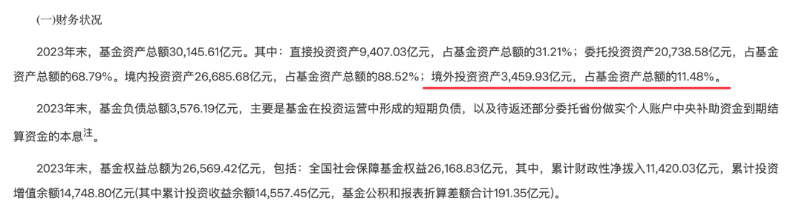
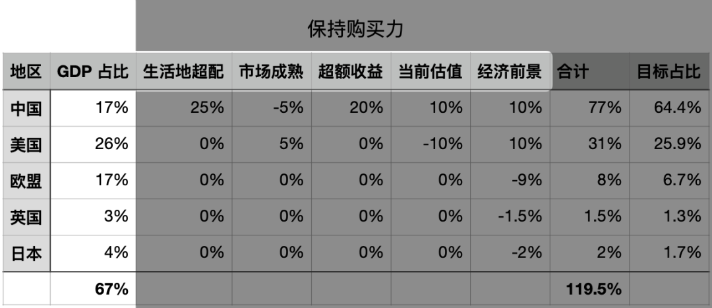
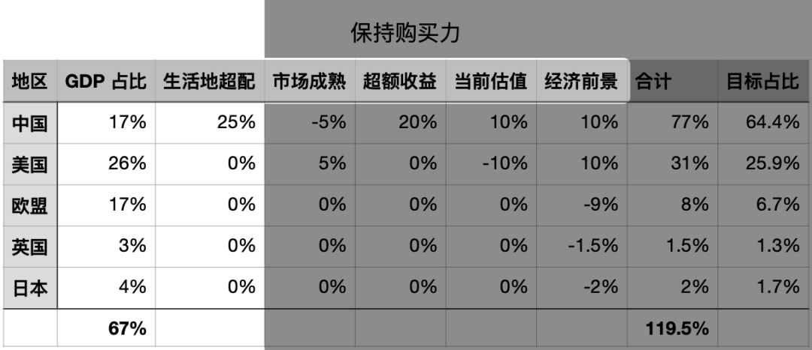

# 该配多少海外投资？

**发布时间**: 2025-01-08 06:30:00

**原文链接**: [http://mp.weixin.qq.com/s?__biz=MzUzNjE3NzQ3Nw==&mid=2247493741&idx=1&sn=d66d090de1211f8bd8ba5ecd194542e5&chksm=faf89647cd8f1f513696e05e52a70505e5366e2af59230db31318feb123b1417e018860e8a65#rd](http://mp.weixin.qq.com/s?__biz=MzUzNjE3NzQ3Nw==&mid=2247493741&idx=1&sn=d66d090de1211f8bd8ba5ecd194542e5&chksm=faf89647cd8f1f513696e05e52a70505e5366e2af59230db31318feb123b1417e018860e8a65#rd)

---

自从重新考虑海外资产配置，这几个问题从来没断过：

  * 美股估值这么高，现在入有没有风险？

  * 能买美股为啥还买 A 股？

  * 资产配置的合理比例是什么？

时间过了两年，我慢慢有个比较稳定的思路了，分享出来供大家讨论交流～

考虑海外投资大体有三种思路：

1、降低投资波动，改善风险收益比。以我们国家社保基金为例，社保基金的入水口、出水口都在国内，却持续配置了 10% 左右的海外投资 👇

来自《全国社会保障基金理事会全国社会保障基金2023年度报告》

2、追求更高的收益、更舒服的体验，最近几年很多观点认为海外投资收益高、糟心少。

3、按 GDP/市值分散，以**保持和增长购买力** 为目标。

**我的思路是以第 3 个为基础的** ，也最符合财务自由这个目标。如果投资是为了保持和增长购买力，配置海外投资就是把这个「购买力」从当地扩展到了全球。

……

所以第一步，我先找了全球 GDP 占比数据

我选择的市场覆盖了全球大约七成的 GDP，但没考虑新兴市场，也没有加拿大和澳洲，出于几个想法：

  * 中国本身就是最大的新兴市场了；

  * 博格在《共同基金常识》中写到，**基金的长期收益 ≈  股息率 + 利润增长率 + 估值变化**。而我发现中国之外的新兴市场利润增长率其实并不高，估值却和美股相似，加上规模也小，就排除了其他新兴市场；

  * 排除加拿大和澳洲，主要是他俩投起来没那么方便，占比也不大，就放弃了。

这样我就得到了一个基于 GDP 加权的基础配比。

……

但斯文森在《不落俗套的成功》中也建议我们，在投资时充分考虑自己的实际情况和个人偏好。所以我又基于自己在意的方面做了加减分 👇

对计划长期生活的地方，可以保留更多购买力，比如多配置大约五年的家庭开支 👇 

基于一个市场是否成熟、投资体验，酌情加分、减分 👇

想到近来大 A 的口碑，可能有小伙伴会想扣更多分 😂 我是这么想的。虽然 A 股对投资者不算友好，但根据有知有行的大类资产报告，长期还是能跟上人均 GDP 的 👇 

而且如果把国企、互联网头部企业单独拿出来，它们更在意投资者回报，所以我没有扣特别多。

市场不成熟有弊也有利。如果是个我们更了解的市场，有我们熟悉的投资工具、信任的主理人，不成熟的减分项，也可能变成超额收益的加分项 👇 就看不成熟的扣分，和超额收益的加分孰轻孰重了

这部分我算是比较乐观的，22 年找到了[战略平庸](https://mp.weixin.qq.com/s?__biz=MzUzNjE3NzQ3Nw==&mid=2247491248&idx=1&sn=f094bd6875b63d84dc979d9ee3449868&scene=21#wechat_redirect)这个理念，几个月前又开始尝试可转债，都有超额收益潜力。这部分留待 25 年检验，看看能否延续。

最后考虑当前估值和经济前景 👇 

美股估值高是公认的，但增长也强劲，应该没太大争议。A 股现在我觉得不算贵也不算便宜，但港股很便宜。最近我把恒生高股息率指数、恒生中国央企指数、中证中国海外互联网指数的成分股找了出来，一份财报一份财报地读，真有种「看行情愁眉不展，看财报喜笑颜开」的感觉。

最后，看各自总分占比 👇

我就得出了一个比较**能说服自己的** 资产配置目标——海外投资的大体范围是 30～40%。

不是「正确」，不是「科学」，而是「能说服自己」，这可能和一些小伙伴想得不太一样。我觉得资产配置很难有个绝对科学、正确的标准答案，一千个人能得出一千种配置。

我的这个配置中，除了客观的 GDP 占比数字，也充满了我的主观偏见。所以这个结论也注定不适合每个人，但这个思路也许是有参考性的：

  1. 先基于**客观** 世界确定一个数字基础，我这里用的是 GDP 占比；

  2. 然后思考哪些方面是自己**主观** 在意的，基于这些方面打分，体现自己的偏好和判断；

  3. 最后得到一个结合客观事实和主观判断的结果。

**说是资产配置，但更像是在量化我们对世界看法** 。

我突然在想，投资中很多焦虑、痛苦的瞬间，根本原因可能不是亏钱，而是我们的投资和对世界的看法出现了偏差，或者我们根本没想清楚自己的看法是什么。

对我来说，适合自己的资产配置，就是符合自己的价值观、未来规划和我们怎么看待这个世界。尽可能看清自己的真实想法，知道何时应该修正，来获得舒服和自洽。

以上一点想法，不一定对，谨供大家参考。

  * 财务自由：[我的财务自由实证之路](https://mp.weixin.qq.com/s?__biz=MzUzNjE3NzQ3Nw==&mid=2247493727&idx=1&sn=a983338da3c86e52821294ff7fa6f849&scene=21#wechat_redirect)

  * 投资笔记：[十年之约‍‍‍‍‍](https://mp.weixin.qq.com/s?__biz=MzUzNjE3NzQ3Nw==&mid=2247493673&idx=1&sn=679fe9d7e8298453807f98ee4dacf3b7&scene=21#wechat_redirect)

  * 抵御风险：[12 月保险最推荐‍‍‍‍‍‍‍‍‍‍‍‍‍‍‍‍‍‍‍‍](https://mp.weixin.qq.com/s?__biz=MzUzNjE3NzQ3Nw==&mid=2247493701&idx=1&sn=7c1e21f1ad049e9507498408f57c2c86&scene=21#wechat_redirect)‍

  * 干货汇总：[财务自由路上应该了解的每一个问题](http://mp.weixin.qq.com/s?__biz=MzUzNjE3NzQ3Nw==&mid=2247489926&idx=1&sn=eac357cebcbfd7250828cdda88d9f122&chksm=fafb67accd8ceebaa1e750f129714bb000be9720a990a70c6fba6fc52fd3712014a58d699d6e&scene=21#wechat_redirect)