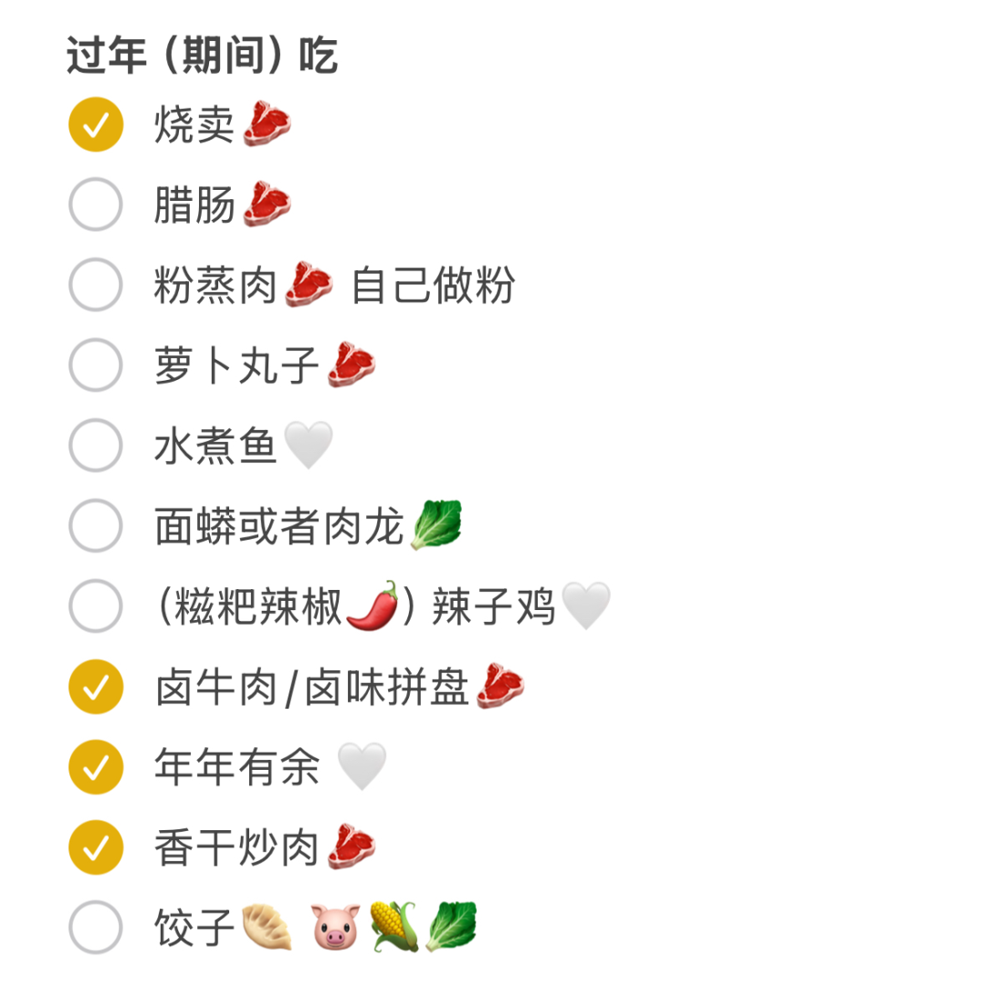

# 我们这个年过得好长尾｜财务自由实证 #70

**发布时间**: 2025-02-05 06:30:00

**原文链接**: [http://mp.weixin.qq.com/s?__biz=MzUzNjE3NzQ3Nw==&mid=2247493954&idx=1&sn=20d82e918eca9e08a6f6b98085d3a070&chksm=faf89768cd8f1e7ecdc3d01fb8d4a77b8012a7ed9f0a404668305604ef10d08de20cd789c161#rd](http://mp.weixin.qq.com/s?__biz=MzUzNjE3NzQ3Nw==&mid=2247493954&idx=1&sn=20d82e918eca9e08a6f6b98085d3a070&chksm=faf89768cd8f1e7ecdc3d01fb8d4a77b8012a7ed9f0a404668305604ef10d08de20cd789c161#rd)

---

大家新年快乐呀，我又回来了～

今天初八，我和也太还在吃“年夜饭”，目测至少能吃到十五  今年过年我们换了个思路——按照年夜饭定菜单，但一天只做一道，做一道吃一道。这样就没有一次做太多、后面天天吃剩菜的困扰了

也太列的菜单。有意标记了红肉/白肉，结果发现都是红肉，又赶紧加几个白肉的菜

本意是方便省心，结果没想到把年过出了长尾的感觉，好像天天都是年夜饭，颇有[快乐凭空产生的感觉](https://mp.weixin.qq.com/s?__biz=MzUzNjE3NzQ3Nw==&mid=2247487572&idx=1&sn=12096b40525018dae60e4cb48447e1cf&scene=21#wechat_redirect)。

  

后来和家里视频聊起年夜饭吃什么，我把这个思路一讲，本来还想他们会不会觉得这样太没年味、有悖传统，结果他们也觉得很好，说**明年也这么办  **

我妈说，从我科普了各种饮食、运动常识，尤其是我爸有氧适能上来了，我妈体检胆固醇也下来了以后，再看年夜饭一大桌子菜也没以前那么馋了。现在觉得吃得健康、适量，身体轻盈的感觉，更幸福。

我一想还真是。

以前不了解相关知识，一说健康饮食、健康生活总觉得会很痛苦，会失去很多生活原本的乐趣。那时候我们做菜喜欢极致堆料，遇到好吃的撑到扶墙。

到后来了解了各种食物不同重量对应的热量和营养素，记录一段时间饮食，看到自己应该吃多少，也感受到[精力状态因此的变化](https://mp.weixin.qq.com/s?__biz=MzUzNjE3NzQ3Nw==&mid=2247491753&idx=1&sn=e1c8a71ed1084425b7540844908a24ea&scene=21#wechat_redirect)，再回头看这些，真就没那么馋了。**还是好吃，但容易放下筷子** ，够量就停了。

健康饮食不需要自律。网上很多“健康餐”难坚持，也是因为它并不健康。主要营养素吃不全，（尤其优质碳水，很多“健康餐”里都严重不足）才更容易馋这馋那，难以执行。吃够就不馋了。

……

想到这又想给大伙推荐下这期 1 年前的播客，常听常新 👇

我们总说「知易行难」，但「知」比我们以为的更不易，「行」困难很可能说明没有真的「知」。**当我们觉得一个目标需要强大的自律时，只是说明我们对它实际上没有自己以为的那么了解** 。自律在提醒我们，道理我都懂 = 没懂。

饮食、运动如此，投资、财务（自由）计划也是，长期践行靠的不是自律，是了解。

* * *

### 实证账户更新 2025-01-31

年初开门就被暴击，但没想到最终 1 月还可以。

大致估算下差距，实证账户的年化要回到 10%，需要从现在这个位置涨 30%👇 

记账工具来自[有知有行](http://mp.weixin.qq.com/s?__biz=MzUzNjE3NzQ3Nw==&mid=2247487794&idx=1&sn=b9db83140ef56b777315a5e415954736&chksm=fafb6f18cd8ce60eeebe855dcd793f173a5589e51657877fb9e8a2fff629eeb17688a40e2766&scene=21#wechat_redirect)

> 2025：实证完成了本金目标，但距离「可持续的」「10% 年化收益」的目标还差不少。所以从今年开始，我会把「收益率」和「收益比开支」放在更明显的位置上，来观察财务自由的长期可行性。

收益比开支 👇 从投资中获得的「累计收益」目前还不足覆盖「累计日常开销」，但曙光已现。

注：这张图的思路来自[第 30 期实证](http://mp.weixin.qq.com/s?__biz=MzUzNjE3NzQ3Nw==&mid=2247489372&idx=1&sn=2118934ef05d930f50d2510ff6642cb1&chksm=fafb6976cd8ce06042f2bb8d1ed950a95262d11451fe116440e1ff84ca49c6fdae8a5d664a6d&scene=21#wechat_redirect)，长期跟踪财务自由的可行性。家庭开支曲线里，我没有算买房首付、一次性税费和部分硬装的钱。剩下大家能想到、想不到的，房贷月供、家具、家电、旅行、保险、医疗什么的，每一笔都算进去了。

……

最后例行提醒大伙，财务自由的投资和被动收入虽然看起来性感，但「因上努力，果上随缘」。本金和收益只是自由路上的「果」，**主业努力多赚钱、理性消费少挥霍，以此积累本金，再加上不被短期涨跌干扰、坚持投资才是背后的「因」** 。

投资复利只是我们获得被动收入的方式，而不是致富的秘密。

在财务自由实证的最初两年，我写得最多的也不是如何投资，而是如何**少在投资上花时间，好能多花时间关注主业** ，同时理性控制开销，尽快攒钱。

假如有 10 万本金，就算投资翻倍也才赚了 10 万。而投资翻倍极其困难，巴菲特的年化收益也才 20%。相比之下，在职场上努力提升，让收入再增加 10 万则要靠谱得多。

对财务自由而言，“钱生钱”做到 80 分足矣，剩下的精力还是应该关注赚钱和省钱这些“人生钱"。

### 关于这份实证

**普通人通过工资理财也能实现财务自由** ，这是这些年我一直在践行的理念。从最初懵懵懂懂到 2017 年制定具体的财务计划，再到今天，已经走了 5、6、7  8 年。

为了能够更加透明、中立地实证普通人财务自由的可能性，从 2019 年开始我决定公开自己的财务进度，成为这个系列内容「财务自由实证」。

不追求大富大贵，但求能够不再纠结生计这些琐碎问题，在重大选择面前获得更多的人生选项，不再瞻前顾后。

有兴趣参考这个实证的朋友建议先看看之前的引导篇，[制定自己的财务自由计划](https://mp.weixin.qq.com/s?__biz=MzUzNjE3NzQ3Nw==&mid=2247484500&idx=1&sn=c04c3de1a1231bef25bb4cda773c00ff&scene=21#wechat_redirect)、[一起财务自由](https://mp.weixin.qq.com/s?__biz=MzUzNjE3NzQ3Nw==&mid=2247484480&idx=1&sn=258e8dd4976c7d3c324ed89b90904d14&scene=21#wechat_redirect)。以往的干货精华也都有汇总 👇

  * [全都安排好了，自由路上我们会遇到的每一个问题](http://mp.weixin.qq.com/s?__biz=MzUzNjE3NzQ3Nw==&mid=2247489926&idx=1&sn=eac357cebcbfd7250828cdda88d9f122&chksm=fafb67accd8ceebaa1e750f129714bb000be9720a990a70c6fba6fc52fd3712014a58d699d6e&scene=21#wechat_redirect)

  * [我的第一本书，整理财务自由方法论](https://mp.weixin.qq.com/s?__biz=MzUzNjE3NzQ3Nw==&mid=2247486809&idx=1&sn=8a80c493837ee044c5d55e0a423507d2&scene=21#wechat_redirect)

  * [一期访谈](http://mp.weixin.qq.com/s?__biz=MzUzNjE3NzQ3Nw==&mid=2247487473&idx=1&sn=10a891429291e78dea82b4df34e773f3&chksm=fafb71dbcd8cf8cdb15f114d6637bc6476a2803f9f0803dcbb4d91c1e68b5cc706c3dc55358b&scene=21#wechat_redirect)和[一期播客](http://mp.weixin.qq.com/s?__biz=MzUzNjE3NzQ3Nw==&mid=2247489401&idx=1&sn=a613497a5d6fdc3325d0424b9a78063e&chksm=fafb6953cd8ce045481121812b61b04f62dfe09a07b785991fc4cdd679bc9af13665d4c0ce62&scene=21#wechat_redirect)聊聊我的经历和观念

我给自己定下的目标是 30 岁前积累到**  预计家庭年度开支的 10 倍**（但后来发现钱不需要那么多，开销变少，本金变成了 20 倍），作为创造被动收入的本金。依靠这些本金实现长期 10+% 的年化投资收益就可以实现财务自由，不再依赖上班工资生活，有底气去选择自己真正想做的事儿。

财务自由路上一些重要节点：

  * 2017 年，计划正式开始，同年获得家人的认可和支持；

  * 2018 年，A 股熊市大跌，出现“钻石坑”机会；

  * 2019 年，开始财务自由公开实证（就是现在大家看到的这个系列）；

  * 2020 年，新冠股灾，自由之路上的又一个关键机会；

  * 2021 年，[自由目标基本达成](http://mp.weixin.qq.com/s?__biz=MzUzNjE3NzQ3Nw==&mid=2247489120&idx=1&sn=e5c5bf6d51914c212c228bc6f42346dc&chksm=fafb684acd8ce15c27cd508a67d57573f4acbeced75f805ef271b4efcf42cf54b363e5f93fcf&scene=21#wechat_redirect)，开始向新的节奏过渡；

  * 2022 年，遭遇自由后的第一次账户大幅回撤，但也是港股 6 年后、A 股 3.5 年后的又一次钻石坑，期待后续……

  * 也是同年，[我搬去二线过想要的生活了](https://mp.weixin.qq.com/s?__biz=MzUzNjE3NzQ3Nw==&mid=2247490915&idx=1&sn=313fba2e0a82a878f0188795ffe1900f&chksm=fafb6349cd8cea5fdfb9a63648453317d1970941f8c470f7bf697d07cca4054fca66f1dc5fac&scene=21#wechat_redirect)，[买房钱从计划中扣除](https://mp.weixin.qq.com/s?__biz=MzUzNjE3NzQ3Nw==&mid=2247490995&idx=1&sn=5b90cca481c8f33b2a7a19f6ef555791&scene=21#wechat_redirect)（自住房我会看作消费而不是资产）；

  * 2023 年，被市场教育，终于开始重视资产配置。[不要收益最大化，要痛苦最小化](https://mp.weixin.qq.com/s?__biz=MzUzNjE3NzQ3Nw==&mid=2247492697&idx=1&sn=f5be62d9593c8c448b94caeca498cad7&scene=21#wechat_redirect)；

  * 2024 年，第一次，500 了；

2025 年，继续观察～