# 财务自由推荐书单

**发布时间**: 2025-03-12 06:30:00

**原文链接**: [http://mp.weixin.qq.com/s?__biz=MzUzNjE3NzQ3Nw==&mid=2247494065&idx=1&sn=8979489d838deb61f8e20ffd6f803007&chksm=faf8979bcd8f1e8dc45b49bc7a424536dc5dc935d8b73ddb37a43ba6cb52d107dbcab9817be2#rd](http://mp.weixin.qq.com/s?__biz=MzUzNjE3NzQ3Nw==&mid=2247494065&idx=1&sn=8979489d838deb61f8e20ffd6f803007&chksm=faf8979bcd8f1e8dc45b49bc7a424536dc5dc935d8b73ddb37a43ba6cb52d107dbcab9817be2#rd)

---

距上次更新已经过了 4 年，近两年读到不少好书，把这篇从零到一的财务自由推荐书单也更新下～

相比经典，我更愿意给大家推荐那些让我在新手时期**读完行动起来、从 0 到 1 的书** 。知识来自阅读，但智慧来自行动，能动起来、给现实生活带来改变才是属于自己的好书。

书单分成三个部分：

  1. 如何积累财富；
  2. 如何打理财富；
  3. 如何更好地生活。

## 如何积累财富

**《邻家的百万富翁》** 对我影响非常大。作者 Thomas Stanley 调查大量银行高净值客户（上世纪 80、90 年代，拥有至少 100 万美元净资产），发现真实的有钱人和我们想象中的有钱人很不一样，他们大多低调勤俭，看起来很普通，完全不是想象中的闪闪发光。他们相信积累财富是为了独立自由，而非展现社会地位。

当时还有一句话让我印象深刻，被调查的高净值家庭中超过一半都会每年制定家庭预算，这后来也成了我的习惯。分享理财、储蓄的文章下，经常有人说「有钱人才不需要考虑这些」，但事实相反，大部分人是考虑清楚了才变有钱。

正如 Morgan Housel 后来在**《金钱心理学》** 中所写，真正的财富不容易被看到，房子、车子、名表、名包大多是财富的反义词，它们都是消耗财富换来的。

《邻家的百万富翁》出版较早，后来的互联网时代有没有改变这些致富逻辑呢？本来作者整理了最新数据计划再版，却因交通意外去世了。后来由他儿子整理发表成了新书**《财富自由》** 。

这几本书好像都在提倡少花钱，但如果赚钱不花，赚钱还有什么意义呢？接下来的几本书里刚好有答案。

### 积累财富是为了独立和自由

在**《纳瓦尔宝典》** 正式出版前，语录中「不靠运气致富」这部分就已经广为流传。里面有段话我特别喜欢：

> 我们应该优先升级自己的自由，而不是生活方式。
> 
> 生活水平低于其收入水平的人们享受着一种自由，这种自由是那些忙于改善生活方式的人们无法理解的。
> 
> 我们创造财富就是为了自由，仅此而已。财富是关于你如何成为你自己。

自由 = 资源 - 欲望。相比于消费，财富更大的意义是让我们不必再仅仅为了钱，去做对人生没有意义的事儿。

赚钱当然可以花、应该花，但积累财富先是为了自由。生命中重要的东西，「买」未必是最好的获得方式。如何平衡消费和攒钱，我也分享了[一些自己的观察](https://mp.weixin.qq.com/s?__biz=MzUzNjE3NzQ3Nw==&mid=2247494024&idx=1&sn=06de6066733b7ab929db508dc11649a6&token=1943018034&lang=zh_CN&scene=21#wechat_redirect)。

**《富爸爸穷爸爸》** 是很多小伙伴的理财启蒙读物，普及财商、为大家种草财务自由。但这本书也常常会让大伙先兴奋、再失落，兴奋一种理想生活在眼前展开，失落没有具体的抓手，不知道接下来应该做什么。

所以接下来，这里还有两个更具体的例子。

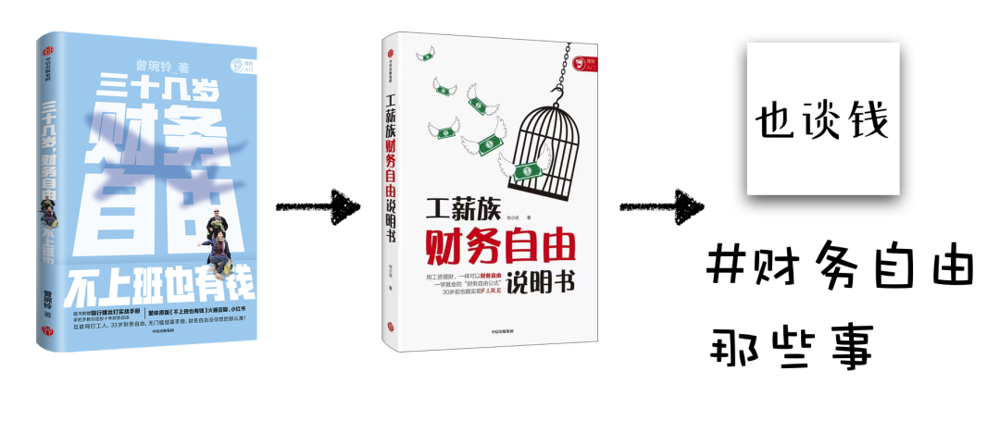

**《不上班也有钱》** 来自台湾作者曾婉玲，记录他们财务自由前后的生活感悟，算是工薪族理财财务自由的典范。没有超人的智商，也没有惊人的运气，中间还完整经历了 08 年金融危机，最终也达成自由。

**《工薪族财务自由说明书》** 是我还没达成财务自由目标时出版的。我有意在还没实现目标、容易打脸时出版了这本书，并在前言里写下了这段话：

> 这里我想引用一段薛兆丰老师的话：
> 
> 事实上，人们只是在成功以后，才去编造那些他们成功的理由，从而给人一个印象，仿佛他们的成功是必然的。而事实上，是他们成功了，才有意无意地去剪裁、定制他们当初的理由，去强调过去某些想法，去忽略甚至去隐瞒过去的另外一些想法。
> 
> 所以我决定把这件事反过来。

先画靶，再射箭，以此区分方法和运气，也看到过程的不易。希望可以给大家呈现一个更现实、更量化、也更加理性的财务自由之路。

读完这两本书可以再看看我整理的公众号内容汇总 👉 [全都安排好了，财务自由路上我们需要了解的每一个问题](http://mp.weixin.qq.com/s?__biz=MzUzNjE3NzQ3Nw==&mid=2247489926&idx=1&sn=eac357cebcbfd7250828cdda88d9f122&chksm=fafb67accd8ceebaa1e750f129714bb000be9720a990a70c6fba6fc52fd3712014a58d699d6e&scene=21#wechat_redirect "全都安排好了，财务自由路上我们需要了解的每一个问题 原创")

财务自由 = 财务 + 自由，前面我们主要说了最重要的「自由」，现在来说说具体的「财务」。

## 如何打理财富：先理财，再投资

这部分我放在第一位的不是一本书，而是一个 App。刚好也能说明理财和投资的区别。

有次也太问我，有没有这样的内容，可以「就算完全没有你帮忙，我从零开始也能知道应该买什么？做什么？」。我想了一会儿，还是下载**「有知有行」** 吧，我还专门给她写了一篇[使用说明](https://mp.weixin.qq.com/s?__biz=MzUzNjE3NzQ3Nw==&mid=2247492124&idx=1&sn=f3b2ebcdf5a0f0d9deb0ec16831c0d87&scene=21#wechat_redirect)。这是孟岩和伙伴们开发的 App，为了帮大家打理好自己的财富。

这里有个我很认同的细节设计。在有知有行首页的「理财第一步」点进去 👇

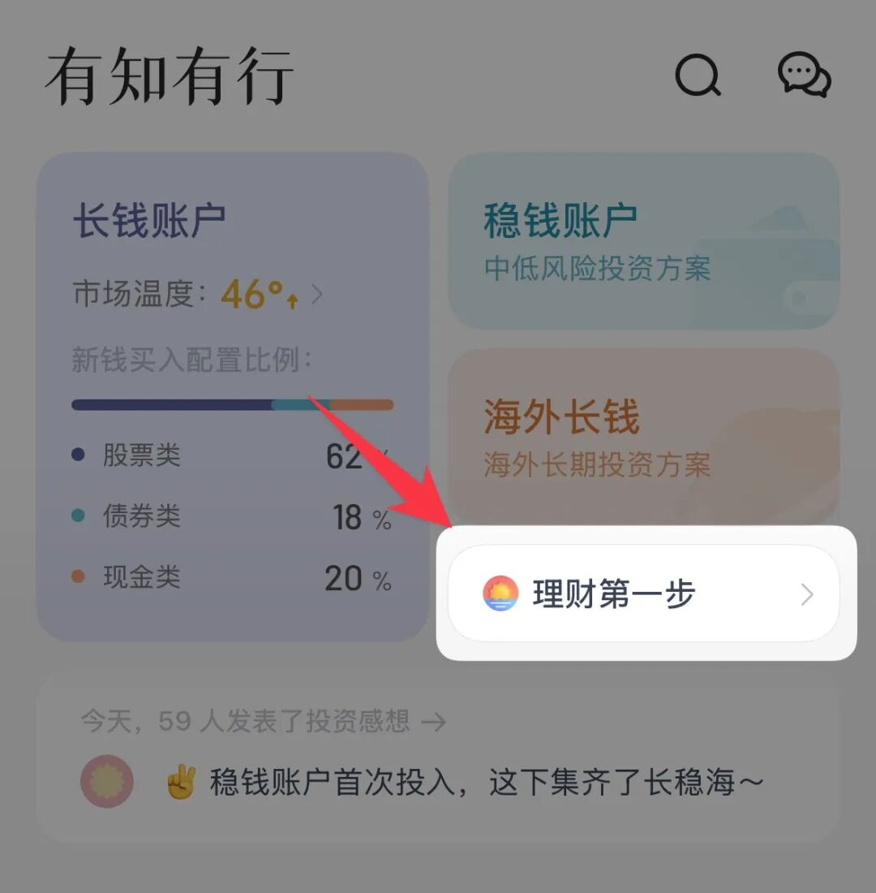

看到的不是选择各种投资和理财产品 👇 而是你知道自己有多少钱么？你有没有预留足够的生活备用金？

完成这些，我们能在[家庭资产记账](https://mp.weixin.qq.com/s?__biz=MzUzNjE3NzQ3Nw==&mid=2247492592&idx=1&sn=b3d3ae21b4fcdb50e08223c4e0743095&scene=21#wechat_redirect)中看到自己的资产分布，更清楚自己的钱在哪 👇

在心理账户中看到自己的生活目标和进度 👇

正如前面《纳瓦尔宝典》所说的，财富的意义是成为你自己，一切从了解自己开始。理财与投资的区别莫过于此，投资是理财，但理财更是理生活，收益只是其中一小部分。

……

有知有行里有一本书，也在今天的推荐书单里 👇

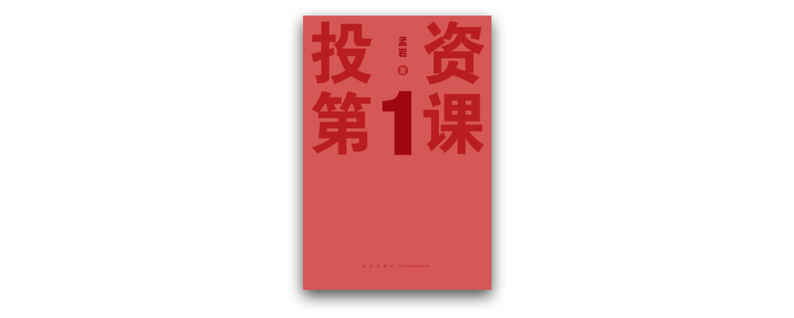

上次写推荐书单时**《投资第一课》** 还是一本「不是书的“书”」，只能在有知有行 App 里读电子版（现在依然可以 👇 免费）。如今《投资第一课》已经是一本真真正正的书了。

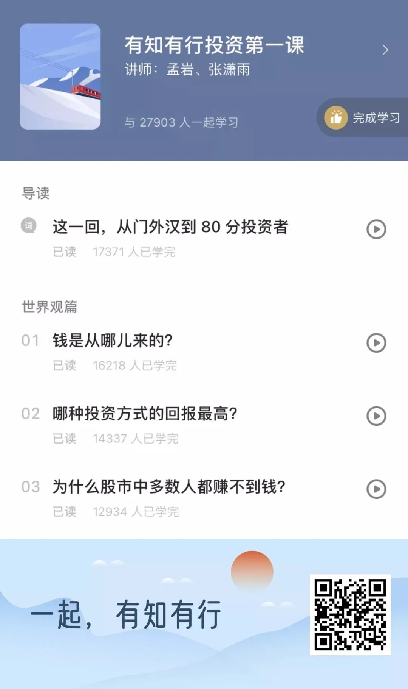

我很喜欢《投资第一课》开篇关于财富的故事。如果流落到荒岛，一箱黄金的价值远不如一把工具、一箱罐头，哪怕黄金要贵重得多。财富的意义不是它本身，而是它能兑换到的资源。理财投资不是数字游戏，是为了更好地生活。

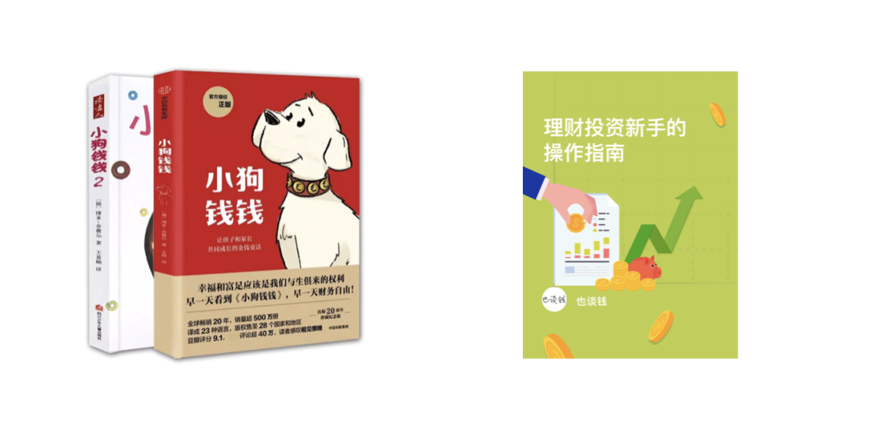

**《小狗钱钱》** 的目标读者原本是小朋友，后来却成了广受欢迎的成人理财入门书。写给成人的书容易忽略一些觉得每个成年人都应该知道、但其实大部分人不知道的“常识”，倒是儿童读物补上了这部分细节，它也因此很适合从 0 到 1。

读完《小狗钱钱》我就决定，以后如果养狗就叫钱钱，后来兑现了：

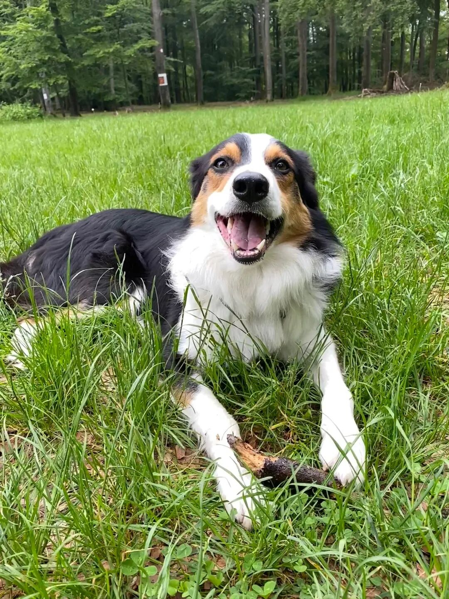

**《理财投资新手的操作指南》** 是我写的在线内容，目前还没有实体书，大家可以后台回复「操作指南」获取链接。因为时间已久，经常有伙伴问我里面内容现在还适不适合。确实一些时效性的数字，比如余额宝、债券基金的预期收益，现在发生变化了。但从零开始应该做的那事儿，如今依然适用（所以价格也是半价了）。

正如它的名字，新手的操作指南，如果你也是新手，希望知道自己可以「做」些什么，而不仅仅是「知道」些什么，ta 会非常合适。当时的我也还是新手，所以更知道新手会遇到哪些困难，关注什么。

**《傻瓜式投资》** ：作为一个业余投资的普通人，哪些事我们该做，哪些不该做的？这里有答案。我后来经常和大伙说的普通人少操作投资，多专注主业和生活，也是这本书里首次读到。

**《解读基金》** 是极好的基金科普及避坑指南（避坑是重点，管理风险比收益重要）。而**《投资要义》** 可以回答我们，一个完整的投资策略应该长什么样？从底层识别系统性机会和风险的内功，到具体操作的招式，这本书的知识框架非常赞。

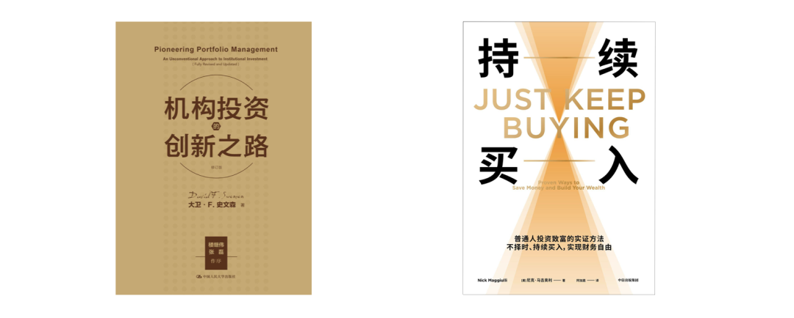

**《机构投资的创新之路》** ，看书名很吓人，写给机构而不是普通人的。但这本书比很多书都更契合财务自由这个目标。这本书讲的是斯文森如何管理耶鲁捐赠基金，如何让高校获得财务自由。

> 捐赠基金可以帮助教育机构实现许多目标：保持独立性、增强稳定性与创造优越的教学环境。

这不也是我们财务自由的目标嘛。所以我愿称之为财务自由路上[最专业的榜样](https://mp.weixin.qq.com/s?__biz=MzUzNjE3NzQ3Nw==&mid=2247492191&idx=1&sn=85fbc52c716c8e3ee08b2c389442646a&scene=21#wechat_redirect)，从如何投资到如何花钱，都非常有借鉴意义。

最后我用**《持续买入》** 作为财务部分的结尾。这本书影响了我对资产配置、尤其是对持有现金的看法。书中很多话题都是从投资开始，在生活结束。作者不仅仅想告诉我们如何做好投资，更想告诉我们如何更好生活。很契合接下来的部分。

## 如何更好地生活

[完成财务自由目标本金后](https://mp.weixin.qq.com/s?__biz=MzUzNjE3NzQ3Nw==&mid=2247493663&idx=1&sn=f2e804203467e19450aefd95bb389121&scene=21#wechat_redirect)，有读者问我下一步是不是换个更大的目标了？我说不，钱是通往目标的桥梁，但人不能住在桥上。

财富不只有金钱，也是健康、家庭、时间、幸福。而且最重要的，我们不是先有很多钱才能开始关注它们，生活不需要「等……以后」。

### 赢得更多时间

积累财富是为了自由，但拥有财富不会自动获得自由。很多人金钱富有，却陷入了时间贫困，有很多钱和能像百万富翁一样生活是两码事。

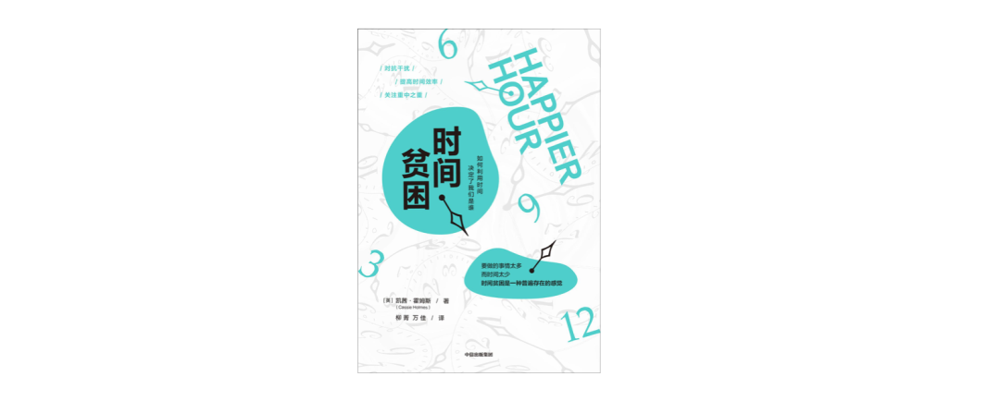

**《时间贫困》** 始于作者压力太大想要辞职，因此开始一系列关于时间和幸福的探索，最终却意外发现也许不要辞职更幸福。能感受到作者真的很用心地、用这些的知识和研究，过好自己的生活。

虽然时间富裕比金钱富裕更让人幸福，但我第一次知道，原来可支配时间太多也会让人不幸，怎么渡过自由时间比有多少时间更重要。不管对金钱，还是对时间、健康和幸福，我们都不是无休止地追求。[知道何时「足够」](https://mp.weixin.qq.com/s?__biz=MzUzNjE3NzQ3Nw==&mid=2247493286&idx=1&sn=4c5dd2fef801c302b5b242250133c414&scene=21#wechat_redirect)，知足才能常乐。

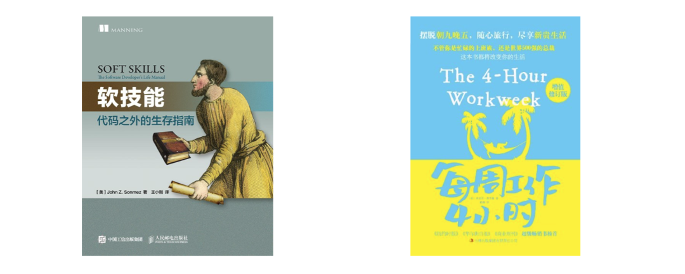

赢得更多时间的一种方式，是改变自己的工作。

**《软技能》** 从副业切入，讲的是如何打造一份与主业匹配的副业、如何快速学习和成长，是我 [2018 年最启发的书](https://mp.weixin.qq.com/s?__biz=MzUzNjE3NzQ3Nw==&mid=2247483900&idx=1&sn=70687e58c0dc70ba2664f0f8b31a0f5a&scene=21#wechat_redirect)。**《每周工作 4 小时》** 从主业切入，讲述一套把主业变成“自由职业”的策略，是我 [2020 年最有启发的书](https://mp.weixin.qq.com/s?__biz=MzUzNjE3NzQ3Nw==&mid=2247486361&idx=1&sn=79a5198da5f0fb4b8dd48dcdee737750&scene=21#wechat_redirect)，也是前面那句「有很多钱和能像百万富翁一样生活是两码事」的出处。

赢得时间的另一种方式，是提高使用时间的效率。

**《搞定I：无压工作的艺术》** （只推荐 1），很出名的 GTD 任务管理法就是来自这本书的英文名 Getting Things Done，把事儿做完。这是我重读次数最多的书，读了五六遍，终于有种尽数搬空干货的成就感。如果觉得这本读着费劲，**《小强升职记》** 也是个不错的上手工具书，一本被名字耽误的任务管理经典。

**《卡片笔记写作法》** 讲的是如何学习、如何记笔记。阅读时也可以选择性忽略「写作」二字，重点关注「卡片笔记」这个笔记方法。ta 解决了我关于笔记多年的困惑：

  * 笔记为什么记得越久越复杂，东西越难找到？为什么不是记得越久越有价值？
  * 当记过一条笔记，而我自己都不记得自己写过的时候，该如何找到它？

ta 也改变了我对笔记的一个看法——笔记，应该是帮助我们发现新想法，不仅仅是查找旧想法。这本书可以和 [flomo 笔记](https://mp.weixin.qq.com/s?__biz=MzUzNjE3NzQ3Nw==&mid=2247488810&idx=1&sn=124adddc525cb95ceccbab24cb6c70a1&chksm=fafb6b00cd8ce216dbef53934ca5a7bd536eb70bb83a7e37358387c1c876e3e569790008612c&token=9795746&lang=zh_CN&scene=21#wechat_redirect)搭配使用，理念 + 工具齐活了～

### 赢得更多健康

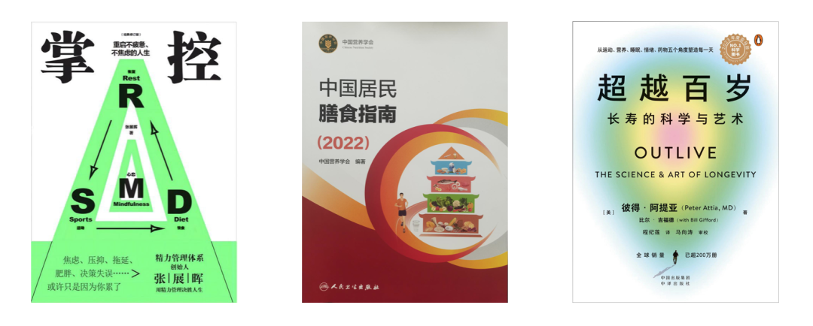

**《掌控》** 改变了我对运动的看法，不是上气不接下气才叫运动，原来最有效的运动强度（二区心率）一点也不累，可以用鼻子呼吸，甚至一边聊天说话。也给我科普了有氧适能这个指标，看到运动对健康的直接影响。就在我读完这本书不久，苹果官方的健康 App 里也出现了有氧适能的介绍和参考。这是我读完一年后的分享：[看到有氧适能的变化](http://mp.weixin.qq.com/s?__biz=MzUzNjE3NzQ3Nw==&mid=2247489581&idx=1&sn=ea83dd79f8085d8dfa0d3d60bcc1cd8c&chksm=fafb6607cd8cef1108704da22bbce80f6f47c554e00b5525c3babb2f41a608f9dac2fc197146&scene=21#wechat_redirect)，我爸一辈子不戴表，看完这篇文章买了 Apple Watch。

**《中国居民膳食指南》** 是我的 2023 年度好书。我太骄傲了！从因为高血脂被医生建议「终身服药」，到可以停药了，我只用了一个月 😎：[改善饮食一个月，我真把胆固醇降下来了！](https://mp.weixin.qq.com/s?__biz=MzUzNjE3NzQ3Nw==&mid=2247491753&idx=1&sn=e1c8a71ed1084425b7540844908a24ea&scene=21#wechat_redirect "改善饮食一个月，我真把胆固醇降下来了！ 原创")三高大多是吃出来的。

**《超越百岁》** 是我的 2024 年度好书，是健康话题目前我读到最严谨、最体系的一本。读完我又有动力增加二区运动了，有氧适能也到了 55 的新高 👇

想改善健康，有数据和凭感觉会差很多。去年回国，我回家吃了几天饭，后来我妈的胆固醇指标就又有明显下降。经验：要么亲自记录，要么有个喜欢记录的朋友～ 强烈建议《超越百岁》《中国居民膳食指南》和《掌控》一起读，会有奇妙的化学反应。

### 赢得更多幸福

**《洞见》** ：带来满足感的不是生活水平的绝对高低，而是生活水平不断改善的这个过程。手里[一把牌不要急于全打出去](http://mp.weixin.qq.com/s?__biz=MzUzNjE3NzQ3Nw==&mid=2247487572&idx=1&sn=12096b40525018dae60e4cb48447e1cf&chksm=fafb6e7ecd8ce768c586c16493600768a9ed1c5d5f49f5f0c2257db3a291fe9ccd20dcba9f5d&scene=21#wechat_redirect)，细水长流每天改善一点，幸福感更能凭空产生。

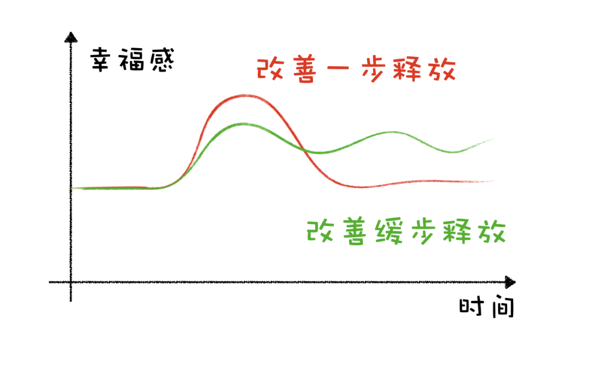

**《幸福的方法》** 告诉我影响幸福的不仅是当下工作、生活的状态，也是我们的长期目标、生活的“奔头”。和《洞见》刚好相互印证，一个着眼现在，一个着眼未来，未来可预期的改善，也能改变当下的幸福。[我的读后心得](http://mp.weixin.qq.com/s?__biz=MzUzNjE3NzQ3Nw==&mid=2247487004&idx=1&sn=3cf7f84bc115fae3bb301a0a24927169&chksm=fafb7036cd8cf920a89bbd8912c0c31ad1cb988d6bb3bc0d922e8466eb3714da32e7ae261410&scene=21#wechat_redirect)

**《象与骑象人》** ：[最幸福的消费](http://mp.weixin.qq.com/s?__biz=MzUzNjE3NzQ3Nw==&mid=2247487018&idx=1&sn=f60796528ceb09ffad86373d462ed7ba&chksm=fafb7000cd8cf916acc2c9696ab25efa1492ceb613816d9628a250218acc089171f8c316cb37&scene=21#wechat_redirect)往往是“攀比”的反义词，是那些我们买完即使不能告诉任何人、也能心里默默幸福的东西。

这三本都是心理学的书，心理学最大的帮助是了解自己，知道幸福通向何处。

读完这几本书我还觉得自己更会花钱了。花钱和运动、学习、说话一样，我们天生就会，但也有巨大改善空间。

花钱不是为了把钱“撒”出去，为的是交换资源、获得幸福感。但同一笔钱，不同消费带来的幸福感可能完全不同，所以怎么花钱更幸福也是一种可以学习的能力。

把整理和混乱放在一块，哈哈哈，不知道大家有没有点混乱 😜

相比《断舍离》我更喜欢近藤麻理惠的**《怦然心动的人生整理魔法》** ，给了我们一套完整可行的整理流程和体系，更容易动起来。其实这本书在我心中也属于理财入门书，[经过一次系统的收纳、整理](https://mp.weixin.qq.com/s?__biz=MzUzNjE3NzQ3Nw==&mid=2247484390&idx=1&sn=97704ec167a1301bf723dc6573ae02d5&scene=21#wechat_redirect)，才看到自己有多少无效开支。

**《混乱》** ：给生活一些适当的混乱和随机性，容易获得灵感、提高效率。读完我的两个改变：1、打破凡事都要分类整理的思维，放在一起然后直接搜索效率更高，更容易发现惊喜；2、给工作留点随机性，有时候丟骰子比做计划还高效。[我的阅读心得，意外收获两个生产力技巧](http://mp.weixin.qq.com/s?__biz=MzUzNjE3NzQ3Nw==&mid=2247487029&idx=1&sn=f7b61604777f80dd3fe8053419924d53&chksm=fafb701fcd8cf909e6c8661db8a161ae46e48c449aa29fa0f9e4292601a7a9a1590fa297efc5&scene=21#wechat_redirect)。

那这两本书应该如何兼容呢？我有的想法：

  * 可以通过搜索快速查找的，比如电脑文件、邮箱、笔记，整理低效，搜索更好；
  * 如果是实物，不能电子化搜索，那先精简数量，然后整理分类比较好。

以上就是我的财务自由推荐书单，它们都是对我的生活有过巨大帮助的书，大部分书我都读过至少两遍。希望它们也能真正地帮到大家。